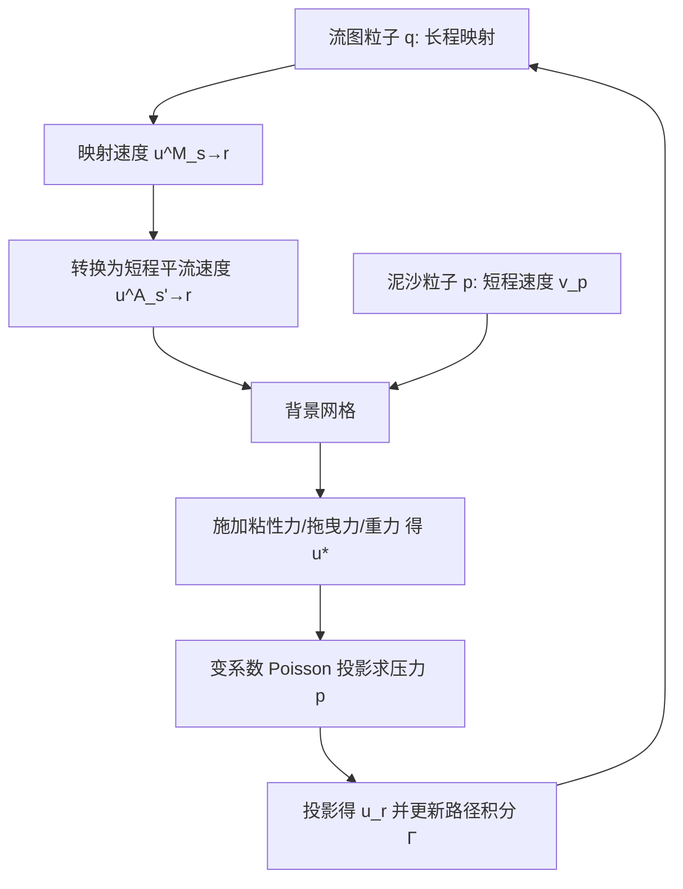

## 一句话总结

本文提出一种基于粒子流图（particle flow map）的颗粒负载流（particle-laden flow）模拟框架，通过耦合"物理泥沙粒子"与"虚拟流图粒子"两套粒子系统，并引入新的力路径积分公式，把此前只能求解无粘 Euler 方程的流图方法扩展到带粘性与拖曳力的完整 Navier-Stokes 方程，从而高保真地再现墨水在水中扩散时的涡泡、粘性尾迹、分形分支与层级结构。

## 研究背景

墨水在水中的扩散是典型的颗粒负载流现象：高浓度墨滴进入流体后会形成初生团块、丝状尾迹、分形分支和吊灯状结构，其背后物理其实很简单——墨水颗粒分散在流体介质中，通过颗粒表面产生的拖曳力与流体相互作用，团块、尾迹和分支的形成源于涡量、粘性与颗粒拖曳之间的流动失稳。

已有工作存在明显缺口：

- 图形学中常把标准网格烟雾模拟器加涡量约束（vorticity confinement）改造用于墨水扩散，或用涡丝方法模拟吊灯结构，但缺乏一个能在任意不可压流环境中"直接求解"颗粒负载流、自然演化涡结构的通用框架。
- 近年的流图方法在保持精确涡结构方面能力突出（对墨水扩散尤其有利），但天生难以处理粘性、拖曳这类耗散力——数学上缺少沿每条粒子轨迹计算粘性力（乃至压力之外任意力）的理论基础。

本文正是要补上"沿流图轨迹处理耗散力"这块缺失，把流图方法的保涡能力释放到涡量-粘性强相互作用的更广场景。

## 方法

### 整体框架

核心思想是设立两套粒子系统，并让它们通过背景网格在 Poisson 求解中交换信息：

- **物理泥沙粒子**（有质量、动量，下标 $$p$$）：追踪质量输运，逐步更新短程速度 $$v_p$$，遵循牛顿定律。
- **虚拟流图粒子**（无质量，下标 $$q$$）：追踪流图、演化涡结构，携带初始速度、前向/后向流图 Jacobian 以及力路径积分。

流体动量方程（假设常密度 $$\rho^f$$）为：

$$
\frac{\partial u}{\partial t}+(u\cdot\nabla)u=-\frac{1}{\rho^f}\nabla p^f+g+\frac{\mu}{\rho^f}\Delta u+\frac{1}{\rho^f\epsilon^f}f^f_{drag}
$$

结合泥沙质量守恒与体积分数关系 $$\epsilon^f+\epsilon^s=1$$，不可压条件写成带体积分数的形式：

$$
\nabla\cdot(\epsilon^f u+\epsilon^s v)=0
$$

### 关键设计一：处理压力之外任意力的力路径积分

把压力以外的所有力记为 $$\gamma$$，将动量方程改写为 $$\frac{\partial u}{\partial t}+(u\cdot\nabla)u=\gamma-\frac{1}{\rho^f}\nabla p$$。借助 covector 形式推导出带力项的积分形式：

$$
u(x,r)=T^T_{r\to s}(x)\,u_s(\Psi_{r\to s}(x),s)+T^T_{r\to s}(x)\,\Gamma_{s\to r}(x)
$$

其中力路径积分沿 Lagrangian 轨迹定义为：

$$
\Gamma_{s\to r,q}=\int_s^r F^T_{s\to\tau,q}\left(\gamma-\frac{1}{\rho^f}\nabla\lambda\right)(x_q(\tau),\tau)\,d\tau
$$

$$\lambda=p-\tfrac{1}{2}\rho^f|u|^2$$ 为 Lagrangian 压力。这一项可携带在粒子上逐步累积，从而把粘性、拖曳、重力等力"沿流图轨迹"纳入原本纯几何的映射过程。

### 关键设计二：映射速度到平流速度的转换（LMCP 思想）

流图方法作用于长程映射速度 $$u^M_{s\to r}$$，而泥沙粒子速度 $$v_p$$ 是短程逐步更新的，二者无法直接交互；且长程压力积分难以利用短程的体积分数信息强制不可压。为此借鉴 Li et al. [2024] 的 Long-Range Mapping Classical Projection（LMCP），把长程映射速度转换为经典单步平流速度 $$u^A_{s'\to r}$$：

$$
u^A_{s'\to r,q}=u^M_{s\to r,q}+T^T_{r\to s}\Gamma_{s\to s',q}+\frac{1}{2}(\nabla|u_{s'}|^2)(x_q(r))\Delta t
$$

由于 $$u^A_{s'\to r}$$ 是短程量，可与泥沙粒子交互，并通过对其投影来施加带体积分数的不可压约束。

### 关键设计三：力的施加与路径积分累积

在 $$u^A_{s'\to r}$$ 上以常规方式施加各力得到 $$u^*$$：

$$
u^*=u^A_{s'\to r}+\left(g+\frac{\mu}{\rho^f}\Delta u^A_{s'\to r}+\frac{1}{\rho^f\epsilon^f}f^f_{drag}\right)\Delta t
$$

拖曳力用 Stokes 定律 $$f_{drag,p}=6\pi\mu r_p(u(x_p,t)-v_p)$$，泥沙粒子用隐式 Euler 更新以提升稳定性。随后求解由不可压条件导出的变系数 Poisson 方程（多重网格预条件）：

$$
-\frac{\Delta t}{\rho^f}\nabla\cdot(\epsilon^f\nabla p)=-\nabla\cdot(\epsilon^s v)-\nabla\cdot(\epsilon^f u^*)
$$

投影得 $$u_r=u^*-\frac{1}{\rho^f}\nabla p$$，并把 $$\gamma$$ 与 $$-\frac{1}{\rho^f}\nabla p$$ 累积回路径积分 $$\Gamma_{s\to r,q}$$ 供下一步转换使用。

### 关键设计四：混合网格-粒子实现与粒子簇

采用 APIC 完成粒子↔网格传输，用二次核函数；流图粒子位置与 Jacobian 用 RK4 演化。面对海量泥沙粒子时引入**粒子簇**（particle cluster），每个簇代表 $$N$$ 个运动一致的泥沙粒子，只需在拖曳力与体积分数计算中乘以 $$N$$，显著降低计算量。固体障碍用 level set $$L(x)$$ 表示并做边界投影。

## 实验结果

作者用物理实验对方法做了验证，并与四种颗粒负载流求解器（分别用 Semi-Lagrangian、APIC、Bimocq、基础 flow-map 求解流体部分）做对比。主要模拟案例配置如下（数据来自论文表 2）：

| 案例 | 分辨率 | 每格流体粒子数 | 泥沙粒子簇总数 | 单子步耗时(s) | 显存(GB) |
|------|--------|----------------|----------------|----------------|----------|
| Kármán 涡街 | 512 × 256 | 16 | N/A | 0.91 | 0.43 |
| 墨水环破裂 | 128 × 256 × 128 | 8 | 1.0 × 10⁶ | 1.84 | 11.49 |
| 两滴竖直对齐穿越 | 128 × 256 × 128 | 8 | 1.0 × 10⁶ | 1.83 | 11.49 |
| 两滴水平偏移穿越 | 128 × 256 × 128 | 8 | 1.0 × 10⁶ | 1.81 | 11.49 |
| 三滴斜向碰撞对比 | 128 × 256 × 128 | 8 | 1.5 × 10⁶ | 1.83 | 11.52 |
| 滴落 (Dripping) | 128 × 256 × 128 | 8 | 2.0 × 10⁶ | 1.85 | 11.55 |

验证要点：

- **Kármán 涡街**：在 $$Re=25,250,2500$$ 下分别得到无涡街的层流尾迹、周期性涡街、湍流混合三种模式，与物理实验一致。
- **液滴穿越（pass-through）**：竖直对齐两滴在低雷诺数 $$Re=3$$ 下出现上滴追上并穿过下滴再混合的现象；水平偏移两滴先对齐再穿越；均与真实实验一致。
- **墨水环破裂随雷诺数变化**：$$Re=16.5,18,19.5,21.0,30.0$$ 时，环破裂产生的团块数量从 4 逐步增至 8，与文献结论（团块数随雷诺数增加）吻合。

## 亮点与局限

亮点：

- 提出压力之外任意力的 Navier-Stokes 路径积分形式，首次让流图方法能沿粒子轨迹精确处理粘性与拖曳等耗散力。
- 用"长程流图 + 短程力 + 短程投影（变系数 Poisson）"的耦合机制，把两套粒子系统在网格上优雅地联结起来。
- 统一的 Eulerian-Lagrangian 颗粒负载流求解器，能自发涌现涡泡、粘性尾迹、分形分支等复杂涡量-粘性相互作用细节，达到 SOTA 的墨水扩散模拟效果。

局限（结合方法推断）：

- 显存开销较大（3D 场景约 11.5 GB），大量泥沙粒子依赖粒子簇近似——簇内运动被假设完全一致，可能损失亚簇尺度细节。
- 力的累积采用 Euler 时间格式近似，路径积分与投影的多步耦合对时间步长与 CFL 数较敏感。
- 泥沙-流体耦合基于 Stokes 拖曳与球形颗粒假设，对非球形、高浓度或强惯性颗粒的适用性未充分展开。

## 延伸思考

- 该框架把"几何流图"扩展为"带力路径积分的流图"，思路上可推广到其他耗散或外力主导的场景（如带热扩散、表面张力或磁力的多物理耦合），值得探索路径积分形式对更一般 $$\gamma$$ 的稳定性与精度。
- 两套粒子系统 + 背景网格 Poisson 耦合的模式，与 MPM/APIC 等混合方法思想相通，是否能反向借鉴 MPM 在固-流耦合、相变上的成果，构建统一的多相颗粒流图求解器是一个自然方向。
- 粒子簇是性能与精度的折中，若能引入自适应簇尺寸或多分辨率簇结构，或可在保持墨水分形细节的同时进一步压低显存与计算成本。
