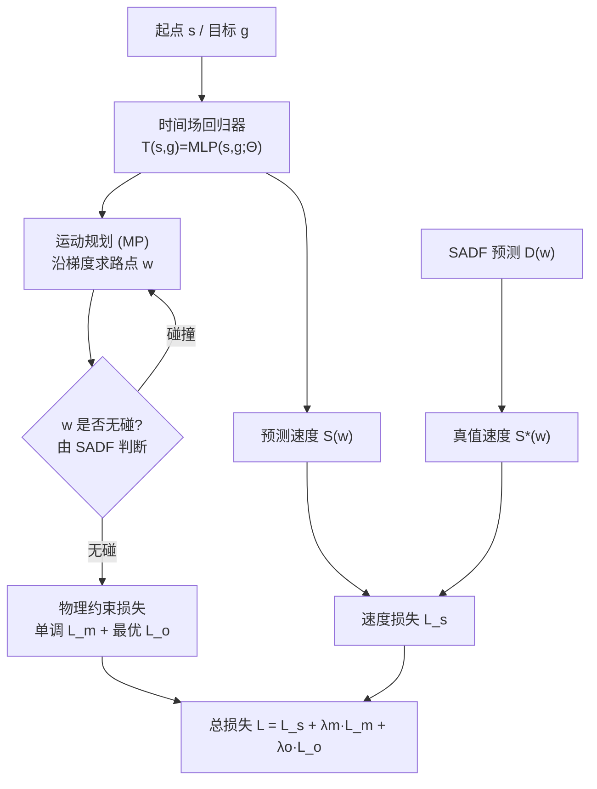

## 一句话总结

针对基于 Eikonal 方程的物理信息神经运动规划器在复杂场景中易陷入"局部极小、生成不可行路径"的顽疾，本文用两条物理约束（单调约束 + 最优约束）自监督地把网络逼向唯一的粘性解，并配上一套形状感知距离场（SADF）加速碰撞检测与真值速度计算，让任意形状机器人在复杂环境中都能又快又稳地规划路径。

## 研究背景

运动规划（MP）要为机器人找到从起点到终点、满足避障等约束的可行轨迹。传统采样法（RRT*、LazyPRM* 等）在高维空间里计算量爆炸、效率低；数据驱动的神经规划器又高度依赖传统方法生成的专家轨迹，数据制备昂贵，且常用恒速假设脱离实际。

近来的物理信息方法（如 NTFields、P-NTFields）另辟蹊径：先根据障碍几何预定义一个速度场，再让神经网络直接求解 Eikonal 方程

$$S(\mathbf{g})^{-1} = \lVert \nabla_{\mathbf{g}} T(\mathbf{s}, \mathbf{g}) \rVert,$$

其中 $$T(\mathbf{s}, \mathbf{g})$$ 是从起点 $$\mathbf{s}$$ 到目标 $$\mathbf{g}$$ 的到达时间。训练数据可在速度场里采样得到，无需专家轨迹，速度也不再恒定。但问题在于：Eikonal 方程存在多解，网络学到的时间场常带有局部极小，尤其对复杂环境里的"有形状"机器人更明显。这里的局部极小不同于优化方法中"可行但次优"的含义，而是直接导致轨迹不可行、成功率下降。

理论上 Eikonal 方程存在唯一的粘性解（viscosity solution），传统 FMM 通过离散化逼近它，但离散尺度无法真正趋零、且高维下网格数量爆炸。本文的核心思路正是：用神经网络求解以摆脱维数灾，同时引入源自粘性解性质的物理约束来抑制局部极小。

## 方法

### 整体框架

PC-Planner 由三部分协同：时间场回归器、物理约束自监督训练、以及形状感知距离场（SADF）。训练时用网络自身规划出的路径片段作为"路点"施加物理约束以自我纠错；SADF 则在数据预处理（生成真值速度）、训练（高效碰撞检测）、测试（自适应规划中的快速碰撞检测）三个环节全程发挥作用。

### 关键设计一：单调约束（Monotonic Constraint）

由 FMM 的粘性解性质可知——到达时间沿远离起点的方向单调增加，途经任何路点都不会"抄近道"缩短总时间。据此对路点 $$\mathbf{w}$$ 要求：

$$T(\mathbf{s}, \mathbf{g}) > T(\mathbf{s}, \mathbf{w}), \qquad T(\mathbf{s}, \mathbf{g}) > T(\mathbf{w}, \mathbf{g}).$$

论文进一步证明：若解 $$T$$ 违背单调约束，则它必不是粘性解。因此把违背量做成损失，就能隐式地把网络推向粘性解：

$$L_m = \sum \max\big(T(\mathbf{s}, \mathbf{w}) - T(\mathbf{s}, \mathbf{g}),\, 0\big) + \sum \max\big(T(\mathbf{w}, \mathbf{g}) - T(\mathbf{s}, \mathbf{g}),\, 0\big).$$

由于最优路点在求解前不可知，作者设计了自监督的"自我纠错"机制：直接用当前网络规划出的路径片段当路点，网络会在每个批次里意识到"当前路径违背了单调约束"并逐步修正，路点选择也随训练动态演化，从而摆脱局部极小。

### 关键设计二：最优约束（Optimal Constraint）

为进一步保证解的最优性，施加三角不等式式的约束：

$$T(\mathbf{s}, \mathbf{g}) \le T(\mathbf{s}, \mathbf{w}) + T(\mathbf{w}, \mathbf{g}),$$

对应损失

$$L_o = \sum \max\big(T(\mathbf{s}, \mathbf{g}) - (T(\mathbf{s}, \mathbf{w}) + T(\mathbf{w}, \mathbf{g})),\, 0\big).$$

配合沿用自 NTFields 的各向同性速度损失 $$L_s$$，总损失为

$$L = L_s + \lambda_m L_m + \lambda_o L_o.$$

### 关键设计三：形状感知距离场 SADF

真实机器人不能当质点，需要知道其表面到环境的最小距离。SADF 定义为

$$f_{[r,e]}(H) = \min_{\mathbf{x}\in r,\, \mathbf{y}\in e} d(H(\mathbf{x}), \mathbf{y}), \qquad H(\mathbf{x}) = R\mathbf{x} + \mathbf{t}.$$

直接对稠密点云逐点算距离代价高昂。作者用稀疏点云（32 点）加上从稠密点云（1024 点）提取的局部形状特征来刻画机器人：稀疏点经变换后过小 MLP 得到距离特征 $$F_d$$，与由预训练形状编码器提取、经双线性插值聚合的形状特征 $$F_s$$ 拼接后送入解码器预测最终距离。形状特征对一个机器人只需算一次，大幅省算力。对铰接机器人，则把每个连杆的 SADF 取并集（取最小）来表示：

$$f_{[r,e]}(H_b) = \min\{ f_{[l_i,e]}(H^b_i H_b) \}, \quad i = 0,1,\dots,m-1.$$

### 关键设计四：自适应运动规划

由于物理约束只是粘性解的必要非充分条件，无法完全杜绝局部极小。测试时先做双向梯度下降生成路径；一旦 SADF 检测到碰撞，就在碰撞点附近找一个无碰路点 $$\mathbf{u}$$，在其邻域超球内随机采样候选点，用学到的时间场按 $$T(\mathbf{s}, \mathbf{c}) + T(\mathbf{c}, \mathbf{g})$$ 最短来挑选路点重规划，必要时自适应扩大搜索半径。因为该策略只在极少发生的碰撞路径上触发，代价可控。

## 实验结果

在两个复杂 3D Gibson 环境中对不同形状刚体机器人（钢琴、玩具车、无人机等，SE(2)/SE(3)）做规划，评价指标为路径长度、规划时间、成功率 SR 与困难场景成功率 CSR。下表摘录 Eastville 环境（钢琴 SE(2) / 无人机 SE(3)）的对比：

| 方法 | Piano SR(%) | Piano CSR(%) | Piano 时间(ms) | Drone SR(%) | Drone CSR(%) |
| --- | --- | --- | --- | --- | --- |
| RRT* | 80.4 | 60.5 | 10215.2 | 83.7 | 29.2 |
| RRT-Connect | 85.5 | 72.8 | 2008.1 | 89.7 | 68.6 |
| NTFields | 86.1 | 72.4 | 5.7 | 86.4 | 42.0 |
| P-NTFields | 80.4 | 61.5 | 6.5 | 85.4 | 35.4 |
| Ours w/o 自适应 | 91.3 | 83.0 | 1.9 | 92.7 | 67.7 |
| Ours | 92.6 | 85.6 | 49.0 | 93.2 | 70.0 |

结论要点：本方法在 SR、CSR 和路径长度上普遍最优，且比传统方法快 40～200 倍。在机械臂实验（自制臂、单/双柜 UR5）中同样领先，困难场景 CSR 大幅超越 NTFields/P-NTFields。消融显示：加入物理约束的所有变体 SR 都高于 NTFields；SADF（32 点）成功率优于同样 32 点的 BVH 查询、接近 1024 点真值；碰撞检测上 SADF 比 FCL 与 BVH 快近 30 倍（10000 次变换查询仅 13.4ms）。训练时间与 NTFields 相当，远低于 P-NTFields（6-DoF：14.1h vs 31.6h）。

## 亮点与局限

亮点：
- 从 Eikonal 方程"多解导致局部极小"的本质出发，用可证明的单调约束把网络逼向唯一粘性解，思路干净且有理论支撑（违背单调约束即非粘性解）。
- 自监督自我纠错免去专家轨迹与传统规划器引导，训练高效。
- SADF 把有形状机器人的碰撞检测/速度计算变成轻量神经查询，兼顾精度与速度，并可扩展到铰接机器人。
- 自适应规划只在罕见碰撞路径触发，用极小代价兜底鲁棒性。

局限：
- SADF 与时间场都是环境专属的，换新环境需重新训练；作者指出让其"环境无关"是未来方向。
- 物理约束只是粘性解的必要非充分条件，不能完全杜绝局部极小，仍需自适应规划兜底。
- 在动态环境中，秒级出解的免训练方法（RRT* 等）仍具竞争力。

## 延伸思考

- 单调/最优约束本质上是把 FMM 粘性解的全局性质"蒸馏"成可微损失，这类"用 PDE 唯一解性质来正则化神经解"的范式或可推广到其他被多解困扰的物理信息网络任务（如测地距离、辐射传输）。
- SADF 的"稀疏点 + 冻结形状特征"设计与神经 SDF、机器人配置空间距离场（CDF）思路相通，若能做成跨环境泛化，就有望成为通用的可微碰撞检测原语。
- 自适应规划里"梯度下降 + 局部随机采样重规划"实际是神经场与采样式规划的混合体，提示纯学习方法在鲁棒性关键场景仍需与经典方法互补。
