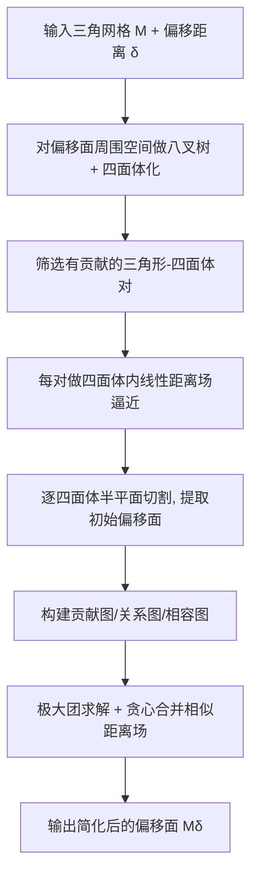

## 一句话总结

把整张曲面的距离场拆解为每个三角形单独贡献的、除三角形本身外处处光滑的子距离场，在四面体单元内对每个子场做线性逼近并用半平面切割求交，从而在低分辨率下也能精确保留偏移面上的尖锐特征。

## 研究背景

偏移面（offset surface）是几何处理与 CAD 中的基础操作，广泛用于抽壳、碰撞检测、路径规划等。给定距离 $$\delta$$，偏移面就是距离场的一条等值面，等价于把输入形状与半径 $$\delta$$ 的球做 Minkowski 运算（膨胀/腐蚀）。

问题的核心难点在于：即便输入曲面本身光滑，其偏移面也会因底层距离场的**不可微性**而产生尖锐特征。现有方法主要分两类：

- **显式法**：对每个几何图元单独偏移再拼接，需要复杂的求交与去除多余部分的后处理。
- **隐式（体素）法**：先在网格上离散距离场，再用等值面提取（如 Marching Cubes、Dual Contouring）得到偏移面。

隐式法的痛点在于：距离场的间断处在离散化时会被抹平，即使用能感知尖锐特征的 Dual Contouring（DC），在高分辨率（如 1024）下仍难以完整恢复尖锐点/线，且提取结果常伴随自交。当输入是分片线性的三角网格时这一问题更严重。

作者的关键观察是：**单个三角形贡献的距离场，在除该三角形本身以外的整个三维空间中都是光滑的**；整张曲面距离场的不可微性只来自对所有三角形子场取最小值这一操作。因此可以先分别离散每个三角形的光滑子场，再精确合并，从而绕开"直接离散不可微整体场"带来的特征退化。

## 方法

### 整体框架

给定三角网格 $$\mathcal{M}$$ 与偏移距离 $$\delta$$，目标是生成一张**水密、可定向、流形且无自交**的偏移面网格 $$\mathcal{M}_\delta$$。整个流程可概括为"离散空间 → 逐图元线性逼近 → 半平面切割求偏移 → 合并简化"。

### 关键设计一：三角形子距离场的分解与最小化

整体距离场由所有三角形子场取最小值得到，且非可微点全部来自这个 min 操作。因此偏移面的提取被转化为：对每个三角形的光滑子场分别离散，再合并。由于每个子场光滑，只要离散单元足够小，用线性函数逼近就足够精确——这正是尖锐特征在低分辨率下仍能保留的根本原因。

### 关键设计二：四面体化与线性场逼近

先用足够大的立方体包住目标偏移面，递归八分（默认最大深度 8）。对边长为 $$\tau$$、中心到基面距离为 $$d_c$$ 的立方体，若满足

$$d_c - \frac{\sqrt{3}}{2}\tau > \delta \quad \text{或} \quad d_c + \frac{\sqrt{3}}{2}\tau < \delta$$

则该立方体与偏移面不相交，停止细分（用 P2M 方法快速查询点到基面距离）。有贡献的立方体进一步剖分为 5 个四面体。

在四面体 $$T_i$$ 内，三角形 $$t_j$$ 贡献的线性场写作 $$d = ax + by + cz + w$$。由四个顶点的距离值唯一确定，通过顶点坐标矩阵求逆即可解出系数：

$$\begin{pmatrix} a \\ b \\ c \\ w \end{pmatrix} = A^{-1} \begin{pmatrix} d^{(1)}(t_j;T_i) \\ d^{(2)}(t_j;T_i) \\ d^{(3)}(t_j;T_i) \\ d^{(4)}(t_j;T_i) \end{pmatrix}$$

其中 $$A$$ 为四面体四个顶点的齐次坐标矩阵，当四面体非退化（体积非零）时可逆。

为加速，作者给出筛选定理：设 $$T_i$$ 外接球半径为 $$R_i$$，三角形-四面体对 $$(t_j, T_i)$$ 可能对 $$\delta$$ 偏移有贡献，仅当

$$\max_k\{d^{(k)}(t_j;T_i)\} \le \delta + 2R_i \quad \text{且} \quad \min_k\{d^{(k)}(t_j;T_i)\} \ge \delta - 2R_i$$

直观理解为：把 $$T_i$$ 向外扩张 $$|\delta|$$ 得到包络体，若其包住或碰到 $$t_j$$ 则该对有贡献。

### 关键设计三：四面体内半平面切割

在 $$T_i$$ 内，每个贡献三角形的等值条件 $$D(t;T_i) = \delta$$ 定义一个平面，$$D > \delta$$ 为正侧。以外偏移为例，点位于偏移面外部当且仅当它落在所有相关平面的正侧。于是通过增量式半平面切割逐步求交：

$$T_i \rightarrow T_i \cap \pi_1^+ \rightarrow T_i \cap \pi_1^+ \cap \pi_2^+$$

四面体被平面切割后要么变成凸多面体、要么被完全消去（表示该四面体不贡献偏移面），因此结果天然无自交。为保证数值鲁棒，使用重心坐标谓词判定点在平面哪一侧，判据为两个行列式符号之积：

$$\mathrm{sign}(\det(A')) \times \mathrm{sign}(\det(A))$$

### 关键设计四：合并简化（极大团问题）

初始偏移面往往过于复杂，带有大量弱特征（细碎起伏），源于基面本身高复杂度或线性逼近的方向依赖误差。作者引入用户参数 $$\alpha (<1)$$，当两个子场在四面体内满足

$$\nabla D_1 \cdot \nabla D_2 \ge \alpha$$

时视为 $$\alpha$$-相似，可合并（合并场为 $$D_{12} = S \odot \min(|D_1|, |D_2|)$$，$$S$$ 记录顶点内外符号）。

跨四面体合并需保证一致性（避免缝隙与离群），据此构建贡献图 $$G_1$$、关系图 $$G_2$$ 与带权相容图 $$G_3$$。两三角形合并代价定义为

$$W_{t_i, t_j} = \sum_{T \in V_2(t_i) \cup V_2(t_j)} \left[1 - \nabla D(t_i;T) \cdot \nabla D(t_j;T)\right]$$

相容三角形集对应图中的**团**。整体简化被表述为**极大团问题**（NP-完全），采用 Eppstein 等人的算法枚举所有极大团，再贪心地优先选取节点最多、权重之和最大的团进行增量合并。角度参数 $$\theta = \arccos(\alpha)$$ 越大，弱特征去除越多、表面越光滑，但合并次数与耗时也随之增加；该过程优先移除弱特征而保留尖锐特征。

## 实验结果

在 C++ 中用 Eigen / CGAL / libigl 实现，测试于 32 核 i9-13900K + 64GB。偏移距离以包围盒对角线长度 $$L_b$$ 的百分比表示，八叉树默认深度 8。在 Thingi10K（10K 模型）与 ABC 子集（7482 模型）上大规模验证：$$d_C$$、$$d_H$$ 平均普遍低于 $$10^{-1}$$，NMAE 主要落在 $$[0°, 5°]$$，N-Score（法向偏差小于 5° 的比例）大多接近 100%、全部超过 60%。

下表为在真实扫描重建模型 Dragon（238 万面）上、偏移 $$\delta_2 = -2\%$$ 时与 SOTA 方法的对比（数字忠于原文 Table 2；$$d_C, d_H$$ 单位 $$\times 10^{-3}$$，↓ 越小越好，↑ 越大越好）：

| 方法 | Time/s | $$d_C \downarrow$$ | $$d_H \downarrow$$ | NMAE ↓ | N-Score/% ↑ |
|------|--------|------|------|--------|-----------|
| AW (Alpha Wrapping) | 159.88 | 1.098 | 22.782 | 4.381 | 77.63 |
| DC (Dual Contouring) | 1230.44 | 2.150 | 24.576 | 7.431 | 62.00 |
| FPO | 5350.55 | 12.742 | 350.560 | 8.581 | 43.31 |
| HSP | — | 6.206 | 66.947 | 4.541 | 72.46 |
| **Ours (PCO)** | 620.47 | **1.114** | **13.688** | **3.902** | 70.65 |

PCO 在 Hausdorff 距离与法向误差 NMAE 上最优，Chamfer 距离与最佳者相当，体现了更强的几何保真与法向一致性。对比中：DC 即便分辨率设到 1024 仍难以捕捉细节、特征退化；FPO（基于自适应八叉树 + DC）在密集特征区难恢复尖锐特征，且有时无法计算内偏移；HSP（基于 dexel/射线表示）精度较差、难恢复尖锐特征，但运行时间最快；AW 仅能近似外偏移、无法处理内偏移且难保尖锐特征。作者坦承 PCO 在运行时间上不敌 HSP。

## 亮点与局限

亮点：

- **精度可控且特征保真**：通过四面体尺寸与合并角度 $$\theta$$ 两个参数调节精度，尖锐点/线的保留能力**与分辨率无关**，低分辨率下也稳健。
- **理论清晰**：把偏移问题奠基于"三角形子距离场处处光滑"这一观察，把复杂度简化重新表述为极大团问题。
- **鲁棒性强**：可处理非流形、自交、薄板等缺陷模型，输出保证水密、可定向、无自交。
- **可扩展**：自然支持开运算（opening）与闭运算（closing）等形态学操作。

局限：

- **运行时间不理想**：当偏移距离很大或离散单元很小时，线性场数量激增导致计算慢；作者计划开发 GPU 版本加速。
- **三角化质量不高**：输出网格常需借助第三方重网格化（如 TetWild）在不破坏特征线的前提下改善质量。

## 延伸思考

- 把"整体不可微场 = 光滑子场取 min"的分解思想，本质上是把离散化误差从"特征处"转移到"远离图元的光滑区域"，这也是为什么线性逼近在远离源三角形处反而更准、大偏移距离下结果更精确。这一思路或许可推广到其他基于距离场的操作（如中轴、扫掠体、SDF 融合），凡是"多源取 min/max 产生不可微"的场景都可能受益。
- 将网格简化建模为极大团选择是个有趣的组合优化视角，但极大团是 NP-完全的，实际依赖 $$\alpha$$ 变小时图变稀疏来保证效率；若基面特征密集、$$\alpha$$ 需较大，团求解与合并开销可能成为瓶颈。
- 该方法与 GPU 并行天然契合（四面体之间独立、图元筛选局部化），若能落地并行版本，精度可控 + 特征保真的组合在 CAD、3D 打印预处理、碰撞代理生成等工程流程中会有很强的实用价值。
