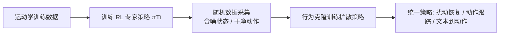

## 一句话总结

PDP 用强化学习专家策略生成"含噪状态-干净动作"的数据集，再通过行为克隆蒸馏出一个扩散策略，从而在物理仿真下同时实现鲁棒的扰动恢复、通用动作跟踪与文本驱动动作生成。

## 研究背景

在物理仿真角色动画中，核心目标是让角色生成多样且真实的人体动作，并能与环境发生物理交互。已有方法通常把控制问题建模为马尔可夫决策过程用强化学习（RL）求解，或建模为回归问题用行为克隆（BC）等监督学习求解。然而无论 RL 还是 BC，都难以捕捉人体动作固有的多样性与多模态特性。

生成式模型是自然的应对思路，但各有短板：条件变分自编码器（C-VAE）在多样性与鲁棒性之间存在敏感的权衡，生成对抗网络（GAN）在缺少额外目标时容易模式坍塌。扩散模型虽然在运动学动作生成上表现出色，且机器人领域已证明"扩散模型 + BC"能学到多样多模态技能，但把扩散策略直接用于物理角色动画会遇到严重问题：在高频、欠驱动的控制任务（如双足运动）中，误差会快速累积，把智能体推离训练轨迹，导致摔倒。

本文提出的关键问题是：能否结合 RL 与扩散式 BC 策略的优势，让物理仿真角色在面对环境扰动、模型预测误差、仿真数值误差等分布漂移时，仍能鲁棒地完成多样任务？

## 方法

PDP 分为三个阶段：先训练一组各自专精小任务的 RL 专家策略，再用这些专家以随机方式采集"含噪状态-干净动作"的轨迹数据集，最后用行为克隆训练一个扩散模型，得到能完成所有任务的单一策略。

**关键设计一：专家分治采集数据。** 目标是学到控制策略 $$\pi_{PDP}: O \times T \to A$$，其中 $$O$$ 是观测集合、$$T$$ 是任务集合、$$A$$ 是动作集合。当任务集 $$T$$ 很大时，单个策略难以掌握全部任务，但训练专精子集的策略相对容易。于是把 $$T$$ 划分为子集 $$\{T_1, T_2, \dots, T_k\}$$（满足 $$\bigcup_i T_i = T$$），为每个 $$T_i$$ 训练专家 $$\pi_{T_i}$$。划分方式并不关键，只要能生成期望的状态-动作轨迹即可。

**关键设计二：含噪状态-干净动作采样（核心洞见）。** 作者的核心洞见是：RL 策略提供的不仅是最优轨迹，更重要的是"在次优状态下的纠正动作"。采集时用带噪动作 $$a_t = \pi_{T_i}(o_t, \tau) + \epsilon$$ 去驱动仿真、访问更广的状态空间，但存入数据集的是干净的最优动作 $$\pi_{T_i}(o_t, \tau)$$，即一个"从含噪观测出发的纠正动作"。这在干净轨迹周围形成了一条"噪声带"，使策略在偏离轨迹时能学会纠错。该策略受 DASS 启发，并进一步扩展：额外生成短恢复片段——用随机的根位置与朝向偏移初始化角色，让它在若干时间步内恢复到原动作，从而把噪声带从关节层面扩展到整体姿态层面，缓解长期漂移。相比之下，"含噪状态-含噪动作"（机器人常用的域随机化）在角色动画中产生的策略反而更不鲁棒。

**关键设计三：扩散策略与去噪目标。** 策略参数化为扩散模型，采用 Diffusion Policy 的 DDPM 框架，用噪声预测网络 $$\epsilon_\theta(A_t^k, O_t, \tau_t, k)$$ 建模以观测为条件的动作分布。采样通过随机 Langevin 动力学从纯噪声逐步去噪：

$$
A_t^{k-1} = \alpha\left(A_t^k - \gamma \epsilon_\theta(A_t^k, O_t, \tau_t, k) + \mathcal{N}(0, \sigma^2 I)\right)
$$

其中 $$\alpha, \gamma, \sigma$$ 是去噪过程的超参数。网络以均方误差自监督学习：

$$
L = MSE\left(\epsilon_k, \epsilon_\theta(A_t^0 + \epsilon_k, O_t, \tau_t, k)\right)
$$

$$A_t^0$$ 是干净动作序列，$$\epsilon_k$$ 是第 $$k$$ 步施加的噪声。

**关键设计四：Transformer 编码-解码架构与条件化。** 模型采用时序扩散 Transformer。对运动跟踪与扰动恢复任务，任务信息直接并入观测（Block A）。对文本到动作任务（Block B），文本用 CLIP ViT-B/32 编码后过 MLP，观测也经 MLP 编码，扩散步 $$k$$ 嵌入同一空间并加到文本嵌入上，再经 FiLM 层对观测嵌入做逐元素缩放与平移，最后与扩散步嵌入拼接作为条件输入编码器；解码器结合噪声动作序列 $$A_t^k$$ 的嵌入预测所加噪声 $$\epsilon_k$$。

## 实验结果

PDP 在三个数据集上验证：扰动恢复用 Bump'em（Addbiomechanics 子集），通用动作跟踪用 AMASS，文本到动作用 KIT + HumanML3D 文本标注。

采样策略对比（跟踪任务在 KIT 训练、AMASS-Test 评测；扰动任务在 Bump'em）最能体现核心贡献：

| 采样策略（状态 / 动作） | 跟踪成功率 (%) ↑ | $$E_{\text{g-mpjpe}}$$ ↓ | 扰动 ID 成功率 (%) ↑ | FPC ↓ |
| --- | --- | --- | --- | --- |
| 干净 / 干净 | 68.8 | 57.1 | 3.36 | - |
| 含噪 / 含噪 | 64.5 | 61.7 | 59.5 | 7.94 |
| 含噪 / 干净（本文） | 93.5 | 49.9 | 100.0 | 2.77 |

含噪状态-干净动作策略在两项任务上都显著领先。此外在 AMASS 通用跟踪上 PDP 成功率达 98.9%（训练集）/ 97.1%（测试集），与 SOTA 的 PHC、MLP 基线相当且部分误差指标更优；在 Bump'em 扰动恢复上，面对分布外扰动 PDP 成功率 96.3%、FPC 2.79，均优于 C-VAE（最佳 91.3% / 4.97）和 MLP（81.0%），说明 PDP 能更好地捕捉人类恢复动作的多模态性。

## 亮点与局限

亮点：
- 核心洞见简洁有力——把 RL 专家当作"纠正动作提供者"而非仅"最优轨迹提供者"，通过含噪状态-干净动作采样构建噪声带，无需复杂训练架构（如 DAgger 的迭代学生训练）即可获得鲁棒的 BC 扩散策略。
- 方法与训练数据、RL 策略解耦，可直接复用 PHC 等现成跟踪控制器，并把小任务专家的数据汇聚起来，把"学多样任务"的负担交给监督学习。
- 单一框架覆盖扰动恢复、通用跟踪、文本到动作三类差异很大的应用。

局限：
- 动作预测视野（horizon）越大性能反而急剧下降，horizon=1 最佳；作者推测因损失函数未对"离当前时刻更近的动作"加权，说明训练目标仍有改进空间。
- 扰动恢复实验仅用单个受试者、有限方向与力度的数据，泛化到更广人群与更复杂场景尚待验证。
- 依赖高质量 RL 专家策略与仿真环境，对 RL 难以攻克的动作仍需单独训练专门策略。

## 延伸思考

- "含噪状态-干净动作"本质上是一种在专家可查询前提下的低成本 DAgger 变体：用噪声主动探索状态分布，用专家给出纠正标签。它把在线纠错离线化，是否可推广到其他高频欠驱动控制（如四足、灵巧手操作）值得探索。
- 视野越长越差的现象提示：在需要稳定性的控制任务里，扩散策略的序列预测未必越长越好，或许需要对时间步做加权损失、或结合滚动重规划来平衡长期规划与短期稳定。
- 该框架把"技能获取（RL）"与"技能融合与多模态建模（扩散 BC）"清晰分层，这种解耦范式对构建可扩展、可增量添加新技能的通用角色控制器颇具启发。
