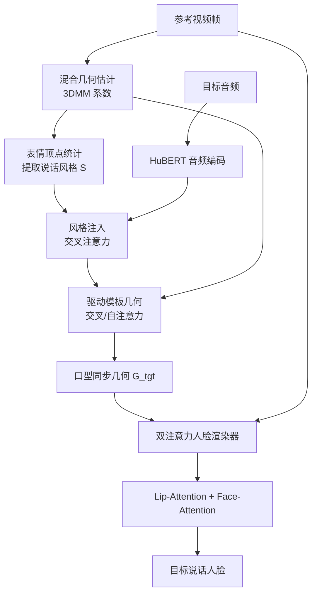

## 一句话总结

PersonaTalk 用"先几何、后渲染"的两阶段注意力框架做音频驱动的人脸配音，既能对齐口型，又能保留说话人独特的说话风格和面部细节，且无需针对特定人做微调。

## 研究背景

音频驱动的视觉配音（visual dubbing）广泛用于数字人口播、视频跨语种翻译、改动已录制视频内容等场景。现有方法大致分两类：

- **特定人方法**（person-specific）：通过对目标说话人做专门训练或微调（如基于 NeRF 的方案）可得到高保真结果，但需要大量目标人视频，定制训练过程也限制了推广。
- **通用人方法**（person-generic）：训练一个可泛化到任意说话人的统一模型，但往往难以保留说话人的"人设（persona）"，即说话风格和面部细节。

作者指出两类典型缺陷：一些方法通过 AdaIN 层把音频特征直接注入渲染器、隐式地编辑嘴唇，导致口型不精确且趋于同质化；另一些方法（如 IP\_LAP）用音频预测 2D 关键点再显式扭曲人脸，却忽略了说话风格，且对扭曲特征/图像做平均会造成模糊和面部细节丢失。

针对这些问题，本文把"注意力"引向说话人的人设，提出两阶段的注意力框架，目标是在口型同步的同时，同时保住独特说话风格与细腻面部纹理（牙齿、脸部轮廓、肤色、妆容、光照等）。

## 方法

整体框架分两个阶段：

- **阶段一：风格感知的几何构建**。从参考视频估计说话人的 3D 面部几何与说话风格，并用目标音频驱动模板几何，得到与音频同步、又保留个性化说话风格的目标几何。
- **阶段二：双注意力人脸渲染**。以第一阶段生成的口型同步几何为先验，从参考视频采样纹理，渲染出目标说话人脸。

**关键设计一：3D 几何作为中间表征。** 作者假设引入 3D 几何作为中间表征是关键的，因为：a) 学习"音频到几何"比"音频到图像"更容易——前者不涉及头部姿态和纹理，可产生更精确的口型；b) 说话风格可以从几何统计特征中学到。几何估计采用"学习式初始化 + 优化式微调"的混合范式，先用现成网络预测初始 3DMM 系数（形状 $$\alpha$$、表情 $$\beta$$、姿态 $$p$$），再迭代优化。作者引入时序平滑损失保证时间稳定性：

$$
L_{tempo}=\sum_{k=1}^{K}\sum_{t=1}^{T-1}\lVert(kp_{k,t+1}-kp_{k,t})-(\widehat{kp}_{k,t+1}-\widehat{kp}_{k,t})\rVert^{2}+\lambda(\lVert\nabla p_t\rVert^{2}+\lVert\nabla\beta_t\rVert^{2})
$$

以及正则化损失 $$L_{reg}$$ 防止系数纠缠，其中 $$\lambda=0.2$$。

**关键设计二：风格感知的音频编码。** 音频编码器 $$\mathcal{E}_{aud}$$ 沿用 HuBERT 结构（TCN + Transformer 编码器）并用预训练权重初始化。说话风格从参考视频的几何统计特征中学习：先用仅含表情的系数构造表情网格顶点，经顶点编码器投影到低维，再沿时间维计算统计均值 $$\mu$$ 与标准差 $$\sigma$$，拼接后经全连接层得到风格嵌入 $$S$$。随后用一层交叉注意力把风格注入音频特征，其中风格嵌入 $$S$$ 作为查询 $$Q$$，音频特征作为键 $$K$$ 和值 $$V$$：

$$
\text{Attention}(Q,K,V)=\text{Softmax}\left(\frac{Q\times K^{\top}}{\sqrt{D}}\right)\times V
$$

该风格表征是通用的，训练完成后可泛化到任意说话人，无需针对特定人微调。之后用风格化音频特征作为 $$Q$$、模板网格顶点作为 $$K,V$$，经交叉注意力与多层自注意力驱动几何。注意只生成与音频高度相关的下半脸顶点，上半脸保留真实值（提供眨眼、皱眉等与音频无关的表情）。

**关键设计三：双注意力人脸渲染。** 为节省算力，注意力在潜空间进行。渲染器包含两个并行交叉注意力层：**Lip-Attention** 只用嘴唇相关几何与纹理渲染嘴部，**Face-Attention** 负责渲染其余面部，两者用嘴唇掩码 $$M_l$$ 融合：

$$
\text{Dual-Attention}=\text{Lip-Attention}(Q_l,K_l,V_l)\times M_l+\text{Face-Attention}(Q_f,K_f,V_f)\times(1-M_l)
$$

其中 $$Q\times K^{\top}$$ 经 softmax 后可视为目标几何与参考几何之间的对应关系，再与参考纹理相乘完成纹理采样。

**关键设计四：参考帧选择策略。** 嘴唇与面部分开采样，因此选取不同参考帧。面部参考从 $$i$$ 帧邻近窗口选取（头姿变化小、背景静止，利于稳定性）；嘴唇参考在训练时从整段视频随机选，推理时用规范几何对开口大小做全局排序后均匀采样。由于注意力天然支持任意长度的 $$K,V$$，推理时嘴唇参考数量可远大于训练（如 5 倍以上），从而兼顾多样性与全局一致性，消除常见的牙齿闪烁与粘连伪影。训练时 $$N_f=N_l=5$$，推理时 $$N_f=5,\ N_l=25$$。

## 实验结果

训练数据混合了 VoxCeleb2、CelebV-HQ、VFHQ，并用 IQA 方法过滤低质视频；评测采用域外数据集 HDTF，随机选 30 段视频做定量比较。视频统一转为 25 fps、裁剪到 256×256，音频重采样到 16kHz。评估分视觉质量（SSIM、PSNR、FID）、口型同步（LMD、SyncScore）与人设保留（LPIPS、CSIM，以及作者新提出的说话风格相似度 StyleSim）三个方面。

与通用人方法的定量比较（HDTF）：

| 方法 | SSIM ↑ | PSNR ↑ | FID ↓ | LMD ↓ | SyncScore ↑ | LPIPS ↓ | CSIM ↑ | StyleSim ↑ |
|------|--------|--------|-------|-------|-------------|---------|--------|------------|
| Wav2Lip | 0.934 | 28.347 | 31.561 | 0.376 | 7.147 | 0.092 | 0.948 | 0.896 |
| VideoReTalking | 0.911 | 26.963 | 35.025 | 0.573 | 6.615 | 0.053 | 0.931 | 0.846 |
| DINet | 0.914 | 26.506 | 30.355 | 0.657 | 5.771 | 0.057 | 0.896 | 0.865 |
| IP\_LAP | 0.951 | 30.717 | 20.549 | 0.405 | 4.409 | 0.044 | 0.947 | 0.892 |
| **Ours** | **0.956** | **31.451** | **10.701** | **0.313** | 6.610 | **0.018** | **0.983** | **0.939** |
| GT | 1.000 | N/A | 0.000 | 0.000 | 6.134 | 0.000 | 0.988 | 0.941 |

本方法在视觉质量（SSIM/PSNR/FID）与 LMD、人设保留指标上全面领先，SyncScore 也具竞争力。与 SOTA 特定人方法 SyncTalk 的自配音比较中，本方法在无任何微调下取得可比表现（CSIM 0.971、StyleSim 0.927，SyncTalk 分别为 0.970、0.916）。用户研究（MOS，1–5 分）中本方法在视觉（4.739）、口型（4.303）、人设（4.870）三项均大幅领先其余四个方法。

消融实验（人设保留）验证了各模块作用：去掉风格嵌入使 StyleSim 从 0.939 降到 0.899；将双注意力换成单交叉注意力（去掉 face-/lip-attention）使 LPIPS 上升、CSIM 下降；去掉帧选择策略使 LPIPS 升至 0.038、生成能力显著退化。t-SNE 可视化显示不同说话人的风格嵌入聚类清晰，且生成视频的风格嵌入与原视频紧密贴合，佐证了风格保留能力。

## 亮点与局限

**亮点：**
- 将 3D 几何作为中间表征，把难学的"音频到图像"拆成"音频到几何"再"几何到纹理"，口型更精确。
- 从几何统计特征中显式提取说话风格并经交叉注意力注入音频，用通用模型即可保留个性化说话风格，无需针对特定人微调。
- 双注意力渲染器分离嘴唇与面部纹理采样，配合精心设计的参考帧选择，很好地保留牙齿、脸部轮廓等细节，消除牙齿闪烁与粘连伪影。
- 提出 StyleSim 指标以量化说话风格保留，填补了该方向缺乏评估指标的空白。

**局限：**
- 受训练数据多样性限制，驱动非人类形象（如卡通）效果略弱。
- 大幅度头部姿态下面部生成可能出现伪影。
- 作者出于伦理考量，将核心模型的访问限制在研究机构。

## 延伸思考

- 把中间表征从 3DMM 几何换成更强的表征（如高斯或神经隐式表征），是否能在大姿态下减少伪影，同时保持"音频到几何易学"的优势？
- StyleSim 依赖预训练风格编码器提取的表情顶点分布，作为新指标其与人类主观风格感知的相关性还有待更多验证。
- 参考帧选择策略是显式的规则（开口排序 + 邻域窗口），能否让模型端到端地学习"选哪些参考帧"，进一步提升泛化与一致性？
- 该方法保留人设的能力越强，被滥用于伪造他人讲话的风险也越大，配套的伪造检测与来源标记机制值得同步推进。
