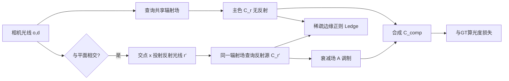

## 一句话总结

针对 NeRF 面对玻璃窗等平面反射时会把反射误当成"假几何"复制到主光线上的问题，本文让 NeRF 显式地在平面处投射一条反射光线、共用同一个辐射场去查询反射源，从而得到干净的无反射视图与清晰的高频反射。

## 研究背景

NeRF 只沿单条光线积分，靠视角依赖来解释外观。对于高光这类低频反射它勉强能处理，但面对窗玻璃等复杂高频平面反射时，它无法区分"反射像"和"真实复制物"，往往会在主光线上、与反射源对称的深度处凭空造出一团假几何来解释反射。

这带来两个后果：一是几何被污染，网格提取等下游任务受损；二是当我们想渲染反射器背后的空间（而不是透过反射器看）时，会得到错误的新视角。

已有方法各有局限：NeRFReN、MS-NeRF 用自监督方式把场景拆成透射/反射多个分量，但分解常常次优，假几何仍残留在主分量里；Ref-NeRF 把出射辐射参数化为视角关于法线的反射方向，擅长镜面高光但无法真正分离反射；Mirror-NeRF、TraM-NeRF 有类似投射反射光线的思路，但只针对镜面、不考虑透射，无法处理透明反射器。

## 方法

整体框架：输入多视角拍摄，先检测潜在的平面反射器（如窗户平面）。对每条相机光线 $$(\mathbf{o},\mathbf{d})$$ 采样点查询共享辐射场得到密度与颜色；当光线与平面相交时，从交点 $$\mathbf{x}$$ 射出一条反射光线 $$\mathbf{r}'$$，用同一个辐射场查询反射源颜色。主光线得到干净的主色，反射光线得到反射源，再经衰减场合成为最终颜色。核心原则是：**只维护一份几何与外观**——若反射源在反射光线上真实存在，就绝不在主光线同深度处复制一个假物体。

关键设计一：反射光线投射。采用简化反射模型（玻璃无杂质、无限薄、忽略折射）。先求主光线与无限平面的交点：

$$\mathbf{x}=\mathbf{o}+t\cdot\mathbf{d},\quad t=\frac{(\mathbf{p}-\mathbf{o})\cdot\mathbf{n}}{\mathbf{d}\cdot\mathbf{n}}$$

丢弃平面在光线原点之后（$$t<0$$）或交点落在有限平面外的光线，多平面相交时取最近平面。反射方向按反射定律计算：

$$\mathbf{d}'=\mathbf{d}-2(\mathbf{d}\cdot\mathbf{n})\cdot\mathbf{n}$$

平面用 $$\mathbf{s}=(\mathbf{p},\mathbf{n},\mathbf{u},w,h)$$ 参数化（中心、法线、上向量、宽高），初始用 SAM 分割窗户 + 深度反投影 + 最小二乘拟合得到，训练中联合精修，不要求精确标注。

关键设计二：双功能衰减场。传统 Fresnel 方程假设线性颜色空间，但经 tone mapping 后 RGB 不再线性。本文改为用一个衰减场，输入反射光线上的 3D 位置和反射方向 $$\mathbf{d}'$$ 预测衰减 $$a$$，既建模 Fresnel 效应，又补偿 HDR tone mapping 的非线性并吸收强度截断误差：

$$a=\text{MLP}_a(x,y,z,\mathbf{d}')$$

最终颜色用交点处透射率 $$T$$ 合成：

$$\mathbf{C}_{comp}(\mathbf{r})=\mathbf{C}(\mathbf{r})+T\cdot\mathbf{C}_A(\mathbf{r}')$$

其中衰减后的反射为：

$$\mathbf{C}_A(\mathbf{r}')=\sum_{k=1}^{K}T_k\left(1-e^{-\sigma_k\delta_k}\right)(a_k\cdot c_k)$$

关键设计三：稀疏边缘正则。即使有反射模型，网络仍倾向于用一个很小的衰减值"拒绝"反射模型，转而在主光线上造假几何。为此用 Sobel 算子求梯度，最小化主色梯度与反射色梯度的逐元素乘积：

$$L_{edge}=\left\|\nabla(\mathbf{C}(\mathbf{r}))*\nabla(\mathbf{C}(\mathbf{r}'))\right\|_1$$

并切断到 $$\mathbf{C}(\mathbf{r}')$$ 的梯度流。原理是：若某条边出现在反射源图中，它就不应同时出现在主色图中，从而阻止主色复制物体。

关键设计四：训练调度。先用标注初始化平面 $$\mathbf{s}$$，联合优化平面、辐射场、衰减场（仅光度损失）；50K 迭代后固定 $$\mathbf{s}$$，再用 $$L=L_{photo}+0.5L_{edge}$$ 训练 50K 迭代消除假几何；由于正则会削弱锐度，最后固定衰减场并逐步衰减 $$L_{edge}$$ 权重再训 100K 迭代恢复细节。基于 InstantNGP 实现，单张 V100，比原版多约 2 小时。

## 实验结果

作者自建 Office 数据集（6 个办公室 360 度场景，窗玻璃反射显著，分 inside-train / inside-val / outside 三个划分）。在 inside-val 划分上评估重建质量：

| 方法 | PSNR ↑ | SSIM ↑ | LPIPS ↓ |
|------|--------|--------|---------|
| NeRFReN | 20.43 | 0.6924 | 0.343 |
| MS-NeRF | 23.20 | 0.8010 | 0.269 |
| Ref-NeRF | 22.39 | 0.7177 | 0.408 |
| Ours | 22.58 | **0.8962** | **0.133** |

本文在 SSIM 和 LPIPS 上明显领先，反射更锐利、伪影更少；PSNR 略低是因为衰减导致结果偏暗，对逐像素指标影响大。在 outside 划分的去反射对比中（held-out 无反射视图），本文 PSNR 15.04 / SSIM 0.5885 / LPIPS 0.446，全面优于 NeRFReN（12.27 / 0.3786 / 0.760）和 MS-NeRF（13.28 / 0.4580 / 0.657）。消融显示联合平面精修、训练调度、稀疏边缘正则均有贡献，其中平面精修与边缘正则对防止物体复制最关键。方法也能处理不透明平面（如台面）。

## 亮点与局限

亮点：用"共享单一辐射场 + 显式反射光线"这一简洁物理化思路，从根源上避免了假几何，同时天然实现了反射与场景的可分离编辑；衰减场绕开了 Fresnel 对线性颜色空间的依赖，更适配真实 HDR/tone mapping 数据；稀疏边缘正则巧妙地用"主色与反射色的边缘不应共存"来抑制复制。

局限：假设完美平面反射，不建模非线性畸变，高曲率或不完美表面会失效；在无纹理、边缘模糊区域效果变差；高光处衰减预测不准会造成错误光照。

## 延伸思考

该方法的核心假设是"平面 + 反射定律"，把复杂反射问题降维成一次显式光线弹射，这与光线追踪的思路相通，但代价是需要检测并参数化平面。一个自然的延伸是把它扩展到 3D Gaussian Splatting 框架，或支持曲面反射器（用局部平面近似或可微网格）。此外衰减场把 Fresnel、tone mapping 非线性、截断误差全部混在一起学习，虽然实用但缺乏可解释性——若能解耦这些因素，可能在跨场景泛化和光照编辑上更进一步。
