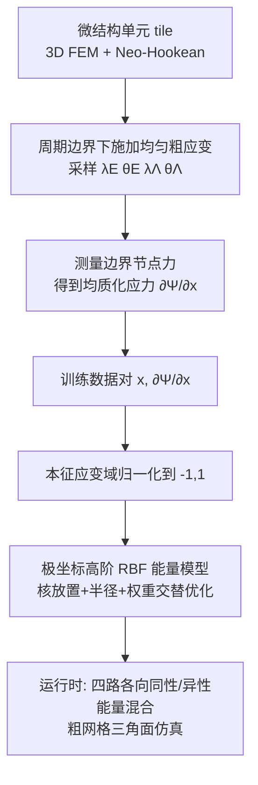

## 一句话总结

针对薄壳微结构的材料均质化，作者提出一种在极坐标（含周期性方向角）上工作的高阶 RBF 插值子，用它拟合一个"由构造即保守、直接优化应力响应、且在高维膜-弯耦合域上表达"的材料能量函数，从而在质量与保守性上同时超越前人方法。

## 研究背景

真实世界的薄壳微结构（如 3D 打印的周期性微纹理、织物）表现出强非线性和各向异性行为，标准的少参数本构模型无法刻画。均质化的目标是：设计一个粗尺度本构模型，使其能匹配微结构在膜（面内拉伸）与弯曲（面外）两方面的宏观力学响应，从而用极少的网格节点复现细尺度仿真的形变。

薄壳微结构给均质化带来三重挑战：连续体形变空间是六维的、各向异性沿任意方向出现、膜与弯曲形变之间存在复杂耦合。作者列出理想材料模型应同时满足的三条准则，而已有方法无一全部满足：

- **拟合能量值的方法**（如 Sperl 等）保守（能量函数天然保守，可用能量线搜索保证仿真稳定），但忽视视觉影响。作者观察到薄壳中能量与可见形变几乎不相关：同一微结构拉伸 10% 的能量比弯曲高约 $$100\times$$，最小二乘拟合能量会严重模糊弯曲响应。
- **拟合应力值的方法**（如 Wang 等对刚度张量插值）能分别刻画各形变模式、与视觉相关性好，但不保守，只能用应力范数线搜索，作者实验表明这对微结构仿真不鲁棒、无法收敛。
- **所有方法**都只能处理形变模式间的低维耦合。

核心难点在于：想"用参数化能量函数去拟合应力值"以兼得保守性与视觉相关性，但薄壳应力是能量的六维导数，一个由能量样条/RBF 出发的朴素拟合缺乏足够的自由度。

## 方法

方法由三个部分组成：本征应变表示、极坐标高阶 RBF 插值子、均质化工作流。

**关键设计 1：本征应变（eigen-strain）表示。** 膜形变用二次 Green 应变 $$E=\tfrac{1}{2}(F^TF-I)$$，弯曲用三角形平均形状算子 $$\Lambda=\sum_i \tfrac{\xi_i}{2Al_i}\,t_i\otimes t_i$$。对任一应变 $$S\in\{E,\Lambda\}$$ 做特征分解，用三元组 $$(\lambda,\mu,\theta)$$ 表示，其中 $$\lambda,\mu$$ 是主应变（$$\|\lambda\|>\|\mu\|$$），$$\theta$$ 是主方向角。好处是天然适合各向异性、且训练数据在本征域中分布更规整、曲率更低，拟合精度更高。代价是引入了主方向 $$\theta$$ 的周期性，无法用欧氏视角设计插值材料。

**关键设计 2：极坐标高阶 RBF 插值子（核心创新）。** 从矩阵值 RBF 插值子 $$\psi=w^T\nabla\Phi(r)$$ 出发，作者定义"极坐标差向量"来处理周期性：

$$u=\begin{cases}\Delta x,&\text{线性坐标}\\\sin(\Delta x),&\text{角度坐标}\end{cases}$$

角度差函数在 $$0$$ 和 $$\pi$$ 处均为 $$0$$，保证周期连续光滑。沿用 Chan-Lock 等 2022 的重定义 $$\phi(r)=\Phi'(r)/r$$，得到极坐标高阶插值子

$$\psi=w^T\,\nabla u\,u\,\phi(r),\quad \mathrm{diag}(\nabla u)=\begin{cases}1,&\text{线性}\\\cos(\Delta x),&\text{角度}\end{cases}$$

它与笛卡尔版本仅差角度坐标上的 $$\sin(\Delta x)$$ 差函数和 $$\cos(\Delta x)$$ 权重。向量值权重提供了拟合矢量场（应力）所需自由度，同时因源自标量插值而"由构造即保守"。

**关键设计 3：RBF 能量模型与各向同性混合。** 训练数据受限于 5D 子空间（只能施加单轴弯曲 $$\mu_\Lambda=0$$），运行时却是 6D 应变。作者对每个插值子用两个主曲率各评估一次并相加得到拟合能量 $$\Psi$$。得益于极坐标插值，可直接设计 6D 能量而无需像前人那样叠加多个低维能量项。在各向同性情形 $$\lambda=\mu$$ 下 $$\theta$$ 未定义、能量不可微，运行时用权重函数 $$\omega(\lambda,\mu)=e^{-(\lambda-\mu)\gamma}$$ 对四路评估（各向异性、各向同性拉伸、各向同性弯曲、二者皆各向同性）做局部混合，得到完整模型 $$\Psi_{\text{full}}$$。

**关键设计 4：均质化工作流。** 训练数据由周期边界下的单个微结构 tile 仿真生成（3D FEM + 近不可压 Neo-Hookean，TangoGray 材料），测量边界节点力得到粗应力 $$\tfrac{\partial\Psi}{\partial x}=\sum_k f_k^T \tfrac{\partial X_k}{\partial x}$$。采样范围面内取 50% 压缩到 100% 拉伸，方向取 $$[0,\pi)$$（作者发现并非所有微结构都有 90° 对称）。拟合时按主拉伸 $$\lambda_E$$ 分批并将各应力分量归一化到 $$[-1,1]$$（弯曲精度大幅提升）；通过交替进行核放置（最远点采样）、半径优化（COBYLA）、权重估计（凸二次问题最小化 $$L_2$$ 应力误差）来求解，直至应力 RMSE 低于 10% 或停滞。

## 实验结果

在 10 个微结构上测试（其中 4 个用 3D 打印做实物验证）。核心的消融实验对比在相同参数量（300）下，能量拟合 vs 应力拟合、以及方向角用线性插值（等价于 Sperl 等 2020）vs 用 RBF 的效果：

| 配置 | 能量误差 | 应力误差 |
|------|---------|---------|
| 线性 $$\theta_\Lambda$$ + 能量拟合（≈Sperl 2020） | 9.19% | 95.21% |
| 线性 $$\theta_\Lambda$$ + 应力拟合 | 11.28% | 31.04% |
| RBF $$\theta_\Lambda$$ + 能量拟合 | 4.11% | 35.04% |
| RBF $$\theta_\Lambda$$ + 应力拟合（本文） | 8.61% | **25.17%** |

前人配置的应力误差高达 95%，本文方法降至 25%。10 个微结构中 7 个能达到 10% 应力 RMSE 阈值，其余 3 个（均有拉胀+屈曲行为，应力出现不连续）也都在 16% 以内，所用 RBF 数量为 130~500。粗仿真节点数远少于细仿真（拉伸 400、扭转 900 节点，细/粗比 6~142 倍）。在 pear-loop 弯曲实验中本文平均误差 15%（最大 28.5%），显著优于能量拟合模型的 21.5%（最大 106%）。拉伸实验匹配极佳，能复现拉胀响应与纵向折痕；扭转实验能匹配主要折痕形状但会遗漏微尺度细褶。

## 亮点与局限

**亮点：**
- 核心创新"极坐标高阶 RBF 插值子"用 $$\sin/\cos$$ 差函数优雅地处理主方向角的周期性，让"保守性 + 直接拟合应力 + 高维膜-弯耦合"三者首次同时成立。
- 用向量值权重从标量插值出发，保证能量函数由构造即保守，可用稳定的能量线搜索仿真，回避了应力范数线搜索的不收敛问题。
- 本征应变表示使训练数据分布更规整，配合按主拉伸分批的应力归一化，明显提升弯曲方向的拟合精度。
- 即便训练只用单轴弯曲，双轴弯曲的扭转验证质量仍很高，并与 3D 打印实物形变定性吻合。

**局限：**
- 训练只探索单轴弯曲数据（周期边界无法产生双轴弯曲），双轴场景无精度保证，作者建议以此模型作为非均匀形变再训练的热启动。
- RBF 数量偏多（130~500），源于函数空间的高维度；可考虑低维加性能量项 + 局部高维 RBF 修正、并按半径剪枝远处核。
- 模型不建模不连续性与多稳态，而微结构屈曲会真实产生这些现象，是部分材料拟合精度受限的根因；神经网络的非线性激活或是建模不连续的方向。
- 各向同性可微性靠四路混合处理，作者坦言更高效的方案尚不可知。

## 延伸思考

- 该极坐标高阶插值子可作为神经材料设计的构建块，把"可解释的保守插值"与"神经网络的灵活性"结合，同时缓解神经方法的参数爆炸与不可解释问题。
- "能量与视觉形变弱相关"这一观察对图形学中一切以能量最小二乘为拟合目标的均质化/材料估计工作都有警示意义：应针对视觉敏感的应力/模式分别加权。
- 屈曲导致的应力不连续本质是多稳态问题，若能与接触/摩擦的均质化模型联合（在纯保守模型之上叠加均质化摩擦），有望覆盖内部摩擦等非保守效应。
- 均质化仿真的渲染目前用粗三角面内的重心插值，可换用应变相关的微尺度渲染方案进一步提升视觉真实感。
