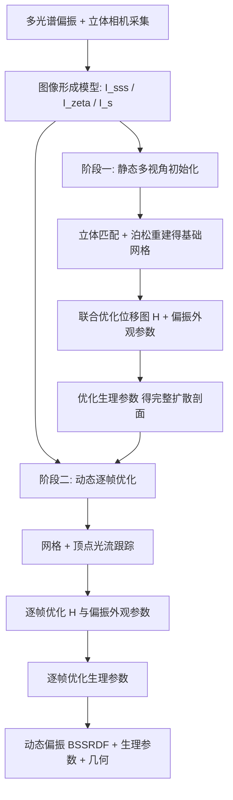

## 一句话总结

本文提出首个能同时采集**动态人脸**的偏振反射(polarimetric BSSRDF)、多光谱次表面散射与精确几何的方法，并把外观参数化为一套基于生理成分(血红蛋白、黑色素)的可解释皮肤模型，可无缝接入现有渲染管线。

## 研究背景

偏振信息能揭示物体的形状、结构与物理特性，因此偏振成像在图形学中日益重要。但现有偏振采集系统受限于两点强假设：只能处理**静态**且**不透明**的物体。人脸恰恰是最难的情形——它既会形变(动态)，又高度半透明(强烈的空间变化次表面散射)，且皮肤反射结构复杂。

已有工作各有短板：静态偏振方法(如 Hwang et al. 2022)不显式建模次表面散射；被动动态人脸捕获方法多假设简化反射模型(仅漫反射或忽略次表面散射)；学习类方法受限于训练数据、缺乏物理可解释性；生理参数估计方法则常依赖漫反射假设、预计算纹理或需要受试者重复相同动作。本文要在动态、可形变、半透明这三重约束下同时拿到偏振反射、光谱反射与生理皮肤参数。

## 方法

### 整体框架

方法把皮肤反射建模为三项之和，并在此基础上做两阶段逆向渲染重建。偏振反射用 Mueller 矩阵描述，入射/出射光都是 Stokes 向量：

$$
\mathbf{s}_o = S\, \mathbf{P}(\boldsymbol{\omega}_i,\boldsymbol{\omega}_o)\, \mathbf{s}_i,\qquad \mathbf{P}=\mathbf{P}_{s}+\mathbf{P}_{ss}+\mathbf{P}_{sss}
$$

其中 $$\mathbf{P}_{s}$$、$$\mathbf{P}_{ss}$$、$$\mathbf{P}_{sss}$$ 分别是镜面、单次散射与次表面散射项。前两项沿用 Hwang et al. [2022]，本文的核心新增是显式的偏振次表面散射项 $$\mathbf{P}_{sss}$$——因为光在多次散射中会退偏，但从皮肤透射返回时会再次被偏振，从而成为额外的反射信息来源。

### 关键设计 1：偏振次表面散射项

把次表面散射写成对扩散剖面 $$\rho_{sss}(\lVert \mathbf{x}_i-\mathbf{x}_o\rVert)$$ 的求和，并用坐标转换矩阵、退偏矩阵与 Fresnel 透射系数的 Mueller 形式组装出 $$4\times4$$ 结构：

$$
\mathbf{P}_{sss}=\sum_{\mathbf{x}_i\in S}\rho_{sss}(\lVert \mathbf{x}_i-\mathbf{x}_o\rVert)\,\mathbf{C}_{n\to o}(-\tilde{\phi}_o)\,\mathbf{F}_T(\mathbf{x}_o,\theta_o;\eta_o)\,\mathbf{D}\,\mathbf{F}_T(\mathbf{x}_i,\theta_i;\eta_i)\,\mathbf{C}_{i\to n}(\tilde{\phi}_i)
$$

Fresnel 系数区分入射面平行(∥)与垂直(⊥)分量，记 $$\mathbf{T}^{+}=(\mathbf{T}^{\perp}+\mathbf{T}^{\parallel})/2$$、$$\mathbf{T}^{-}=(\mathbf{T}^{\perp}-\mathbf{T}^{\parallel})/2$$。扩散剖面由两层皮肤的吸收/散射系数经多极近似得到，并用九个可分离高斯之和近似以提高效率。

### 关键设计 2：基于生理成分的两层皮肤模型

外层吸收主要来自表皮黑色素，兼有少量真皮血红蛋白：

$$
\sigma^{\text{out}}_{a}=C_m\big(\beta_m\sigma^{em}_{a}+(1-\beta_m)\sigma^{pm}_{a}\big)+C_{h,\text{out}}\big(\gamma_{\text{out}}\sigma^{oxy}_{a}+(1-\gamma_{\text{out}})\sigma^{deoxy}_{a}\big)+(1-C_m-C_{h,\text{out}})\sigma^{b}_{a}
$$

内层(真皮毛细血管网)吸收主要由血红蛋白解释：

$$
\sigma^{\text{in}}_{a}=C_{h,\text{in}}\big(\gamma_{\text{in}}\sigma^{oxy}_{a}+(1-\gamma_{\text{in}})\sigma^{deoxy}_{a}\big)+(1-C_{h,\text{in}})\sigma^{b}_{a}
$$

其中氧合血红蛋白比例固定为 $$\gamma=\gamma_{\text{in}}=\gamma_{\text{out}}=0.75$$，待估参数为黑色素分数 $$C_m$$、真黑色素占比 $$\beta_m$$、内外层血红蛋白分数 $$C_{h,\text{in}},C_{h,\text{out}}$$。各成分的光谱吸收剖面差异明显，正是靠这一点从多光谱观测中把各成分浓度解耦出来。

### 关键设计 3：多光谱偏振硬件 + 稀疏椭偏简化

硬件用两台偏振相机(各拍 0°/45°/90°/135° 四种线偏振)，前面分别贴 Dolby 3D 眼镜左右镜片作为带通滤片，把 RGB 每个通道再二分，合成覆盖全谱的**六个多光谱通道**；周围 40 个线偏振 LED 与相机近同轴(约 5.72°)，20 fps 同步。近同轴几何允许套用稀疏椭偏的代数简化，从四张线偏振图直接算出三种观测：

$$
I_{sss}=2I_{90},\qquad I_{\zeta}=I_{135}-I_{45},\qquad I_{s}=I_{0}-I_{90}
$$

### 关键设计 4：两阶段逆向渲染与偏振外观损失

阶段一用旋转椅采集静态人脸多视角、优化时不变参数($$\eta,\alpha_s,\alpha_{ss}$$);阶段二对每帧从单视角继续优化随时间变化的量。几何上直接优化**位移图 $$H$$**(而非顶点+法线),避免每次迭代重做泊松重建导致的模糊。外观优化最小化：

$$
\min_{\eta,\alpha_s,\alpha_{ss},\rho_s,\rho_{ss},\bar{\rho}_{sss},H}\; \lambda_{\psi}\mathcal{L}_{\psi}+\lambda_{sss}\mathcal{L}_{sss}+\lambda_{s}\mathcal{L}_{s}+\lambda_{\phi}\mathcal{L}_{\phi}+\mathcal{L}_{\text{reg}}
$$

其中权重 $$\lambda_{\psi}=0.002,\ \lambda_{sss}=\lambda_{s}=\lambda_{\phi}=1$$。与前人交替式序列二次规划不同，本文用反向梯度下降同时最小化所有损失。生理参数则用交替最小二乘的坐标下降法求解，先解高斯权重、再估生理参数，规避扩散剖面对生理参数难以端到端求导的问题。

## 实验结果

在 11 位不同肤色、性别、族裔的受试者上验证。折射率验证用已知折射率的十个真实物体作参照(经 Brewster 角测得),平均重建误差 0.028。下表为特写观测项(specular-dominant polarization observation)的消融，逐步加入各参数后在 11 位受试者、200 个新视角上的平均 RMSE：

| 折射率+方位损失 | 单次散射参数 | 折射率参数 | 平均 RMSE |
|:---:|:---:|:---:|:---:|
| ✔ | - | - | $$4.44\times10^{-2}$$ |
| ✔ | ✔ | - | $$4.13\times10^{-2}$$ |
| ✔ | ✔ | ✔ | $$3.94\times10^{-2}$$ |

结果表明加入空间变化的单次散射与折射率参数后 RMSE 最低。与 Riviere et al. [2020]（本文复现）和 Hwang et al. [2022] 的对比中，本文在镜面渲染与全渲染两项上都取得最小 RMSE：前者因假设全脸统一折射率而高估高光，后者因聚类式交替优化而漏掉额鼻高光并把脸颊高光"烤"进纹理。多光谱验证显示重建光谱反射与高光谱相机测得的真值高度吻合，且能捕捉按压后血红蛋白回流(约两秒)、额头皱纹引起的生理参数动态变化。

## 亮点与局限

亮点：
- 首个在动态、可形变、半透明三重约束下同时采集偏振反射($$3\times3$$ Mueller 矩阵)、多光谱次表面散射与几何的方法；反射函数规模是常规 BSSRDF 的九倍。
- 外观参数化为可解释的生理成分(内外层血红蛋白、真/褐黑色素),支持外观编辑(增大血红蛋白偏红、增大黑色素偏黝黑),且能接入现有渲染管线。
- 空间变化的折射率与位移图优化，使高光与几何细节(毛孔级)重建更准确。

局限：
- 偏振相机空间分辨率仅为常规机器视觉相机的一半(2K vs 4K),BSSRDF 分辨率受限于硬件。
- 现成 Dolby 滤片在 570–620nm 有光谱重叠，六通道转 sRGB 可能有细微误差。
- 未显式建模环境光遮蔽，高频几何处的遮蔽阴影可能被误当作反射，导致局部黑色素微小偏差。
- 对极深肤色，内层血红蛋白易被低估(大量入射光被外层黑色素吸收,返回能量过低)——这是非侵入式在体估计的共性难题。
- 单个生理参数的绝对准确性无法保证，只能说全局偏振外观与输入匹配良好、各成分行为合理。

## 延伸思考

- 该方法把"偏振退偏—再偏振"这一物理现象转化为信息来源，本质是用偏振通道额外约束了本来欠定的次表面散射逆问题；类似思路(多物理量联合观测提升逆向渲染的可辨识性)或可推广到其他半透明材质(蜡、玉、食物)。
- 生理参数化让外观既可解释又可编辑，这对数字人、医美预览、乃至皮肤健康(血流/黑色素变化)监测都有潜在价值，但绝对精度不足意味着目前更适合视觉合理性而非定量诊断。
- 硬件依赖近同轴布置与旋转椅初始化，仍是受控实验室设置；如何走向单视角、便携化采集，是把该技术从实验室推向实际应用的关键瓶颈。
- 极深肤色下的系统性低估提醒我们，物理逆向方法同样存在"数据/信号不足导致的公平性问题"，未来多层模型与不同光谱照明方案的探索值得关注。
