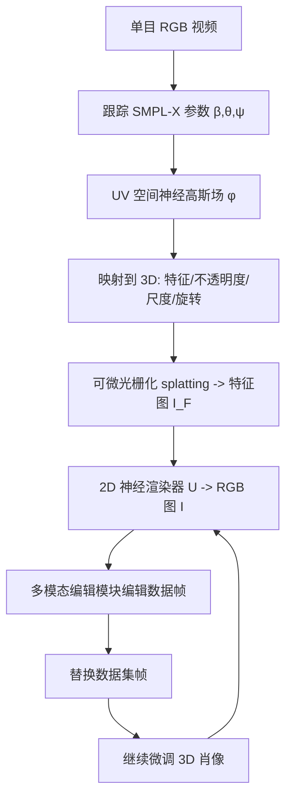

## 一句话总结

PortraitGen 把单目肖像视频提升为统一的动态 3D 高斯场，并用"神经高斯纹理"承载可编辑特征，再从大规模 2D 生成模型中蒸馏多模态编辑知识，实现 3D 与时序一致、超过 100FPS 渲染的文本/图像驱动编辑与重光照。

## 研究背景

肖像视频编辑在影视、艺术、AR/VR 中应用广泛，核心难点是在整段序列上同时保持结构相似性与时序一致性，还要支持多种模态与高质量风格化。

传统方法主要有两条路线，都存在明显短板：

- **2D 路线**：早期用 GAN 做风格化动画或基于 CLIP 的文本编辑，受限于 GAN 表达能力；近来扩散模型质量更高，但逐帧编辑难以保持帧间一致。基于预训练图像扩散的免训练视频编辑（借助稠密对应、DDIM 反演、ControlNet、跨帧注意力）缺乏 3D 理解与人脸/身体先验，质量与一致性难两全，且生成 1 秒片段常需数分钟。
- **3D 路线**：AvatarStudio、Control4D 等借助 NeRF/生成对抗做 3D 化身编辑，但往往需要多视角动态序列作为输入，实际难以获取，且效率不足。

作者主张把编辑问题"抬升到 3D"以获得 3D 感知，同时从现有 2D 生成模型蒸馏多模态编辑能力，兼顾一致性、效率与多模态需求。

## 方法

### 整体框架

系统先对给定单目视频跟踪 SMPL-X 参数，把 3D 高斯场嵌在人体网格表面以获得结构与时序一致性；用神经高斯纹理机制得到 3D 高斯特征场，经可微光栅化 splatting 得到特征图，再由 2D 神经渲染器转成 RGB。编辑阶段采用"迭代数据集更新"策略，配合多模态人脸感知编辑模块抑制表情与面部结构退化。

### 关键设计 1：神经高斯纹理（Neural Gaussian Texture）

传统 3DGS 肖像为每个高斯存球谐系数（SH）直接渲染，重建保真但不适合编辑：许多风格（笔触、轮廓线、像素风）本身并非 3D 一致，直接用纯 3D 表示拟合会导致模糊或伪影。作者转而为每个高斯存储**可学习特征**而非 SH，在 SMPL-X 的 UV 空间维护神经高斯场（含神经特征、不透明度、尺度、旋转四类属性），经 UV 映射转到 3D：

$$ (X_0, Q, S, O, F) = \mathcal{F}(\hat{M}(\beta,\theta,\psi), \mathcal{G}, \phi) $$

随后光栅化得到特征图，再由 2D 神经渲染器融合 splatted 特征转为 RGB：

$$ I_F = \mathcal{R}((X_0, Q, S, O, F), K, P), \quad I = \mathcal{U}(I_F) $$

特征图与输出图同为 $$ 512 \times 512 $$。为长发、宽松衣物建模，网格额外加入可学习顶点位移 $$ \hat{M}(\beta,\theta,\psi) = M(\beta,\theta,\psi) + \Delta M $$。该机制既提供比 SH 更丰富的信息，又能支持非完全 3D 一致的复杂风格，渲染速度超过 100FPS。

重建阶段使用重建损失、掩码损失、感知损失（LPIPS/VGG）以及一个直接监督前 3 通道特征的稳定损失 $$ L_{stable}(I_F, I_{src}) = \| I_F[:3] - I_{src} \|_1 $$，总损失为四项加权。

### 关键设计 2：迭代数据集更新

借鉴 Instruct-NeRF2NeRF，编辑时在"编辑数据帧"与"更新 3D 肖像"之间交替：(1) 从训练视角渲染肖像图；(2) 编辑模块编辑该图；(3) 用编辑结果替换训练集对应帧；(4) 用更新后的数据集继续训练。肖像模型逐步收敛到目标提示，从而天然获得 3D 与时序一致性。

### 关键设计 3：表情相似性引导 + 人脸感知编辑

朴素迭代更新会累积误差，导致表情漂移与面部模糊。为此提出两项对策：

- **表情相似性引导**：把渲染图与源图映射到 EMOCA 的隐表情空间并约束一致：

$$ L_{exp}(I, I_{src}) = \| \mathcal{E}_{exp}(I) - \mathcal{E}_{exp}(I_{src}) \|_2^2 $$

- **人脸感知编辑**：当上半身图中面部占比小时，先把人脸区域裁剪缩放到 $$ 512 \times 512 $$，对整体与人脸分别编辑，再用头-躯干掩码合成，提升面部结构鲁棒性。

编辑阶段的损失在重建损失基础上加入表情项 $$ L_{exp} $$。应用层面：文本驱动用 InstructPix2Pix，图像驱动用风格迁移与 AnyDoor（虚拟试衣），重光照用 IC-Light。

## 实验结果

在 NeRFBlendshape、Neural Head Avatar、INSTA、PointAvatar 的视频及自采上半身单目视频上验证，单卡 RTX 3090，重建约 10 分钟、编辑约 20 分钟。用户研究收集 96 名参与者、23 组编辑结果，报告各方法被评为"最佳"的百分比（越高越好）：

| 问题 | TokenFlow | CoDeF | AnyV2V | RAV | Ours |
|------|-----------|-------|--------|-----|------|
| Q1 提示保真 | 8.0 | 19.1 | 3.3 | 3.4 | **66.2** |
| Q2 身份保持 | 6.8 | 7.1 | 2.6 | 6.9 | **76.6** |
| Q3 时序一致 | 3.9 | 6.1 | 1.2 | 3.5 | **85.3** |
| Q4 表情/动作保持 | 3.8 | 5.1 | 1.4 | 4.3 | **85.4** |
| Q5 综合最佳 | 4.5 | 6.7 | 1.4 | 2.2 | **85.2** |

在编辑效率（每分钟编辑帧数，含重建+编辑均摊）上：TokenFlow 1.6、CoDeF 5.0、AnyV2V 1.6、RAV 10.0、Ours 60.0，本方法显著领先。消融显示：去掉神经高斯纹理无法表现乐高变形与像素轮廓线；去掉表情相似性引导会出现表情退化；去掉人脸感知编辑会造成头部姿态错位与面部模糊。

## 亮点与局限

**亮点**

- 将 2D 肖像视频编辑问题抬升到嵌在 SMPL-X 表面的动态 3D 高斯场，天然获得 3D 与时序一致性，且引入人体先验。
- 神经高斯纹理用可学习特征替代 SH 系数，既支持笔触/轮廓线/像素风等非 3D 一致风格，又保持 100FPS+ 渲染。
- 统一框架可接入任意结构保持型图像编辑模型，覆盖文本驱动、图像驱动（风格迁移、虚拟试衣）、重光照多种模态。
- 针对迭代更新退化问题，用表情相似性引导与人脸感知编辑两项针对性设计有效缓解。

**局限**

- 依赖 SMPL-X 跟踪精度，对夸张姿态或跟踪失败场景的鲁棒性受制于此。
- 编辑质量最终受限于所用 2D 编辑模型（如 InstructPix2Pix）的能力上界。
- 定量评估以用户研究为主，缺少客观一致性/保真度指标；评测片段限制在 2 秒 60 帧以便公平对比。
- 每个视频需分别重建与编辑（约 30 分钟），并非实时或零训练。

## 延伸思考

- "非完全 3D 一致的风格用 2D 神经渲染器承载"这一取舍值得推广：把哪些信号交给 3D 表示、哪些交给屏幕空间后处理，可能是可编辑 3D 表示的通用设计原则。
- 迭代数据集更新本质是把 2D 生成先验"蒸馏"进 3D 表示，其收敛性与误差累积仍靠额外正则（表情/人脸）约束，是否能用更原则化的分布匹配（如 SDS 类目标）替代值得探索。
- 框架对编辑模块解耦，随着更强的图像编辑/重光照模型出现可即插即用，长期潜力取决于 2D 生成模型的演进。
- 若能引入客观时序一致性与身份保持指标，并扩展到更长序列与多人物场景，实用价值会进一步提升。
