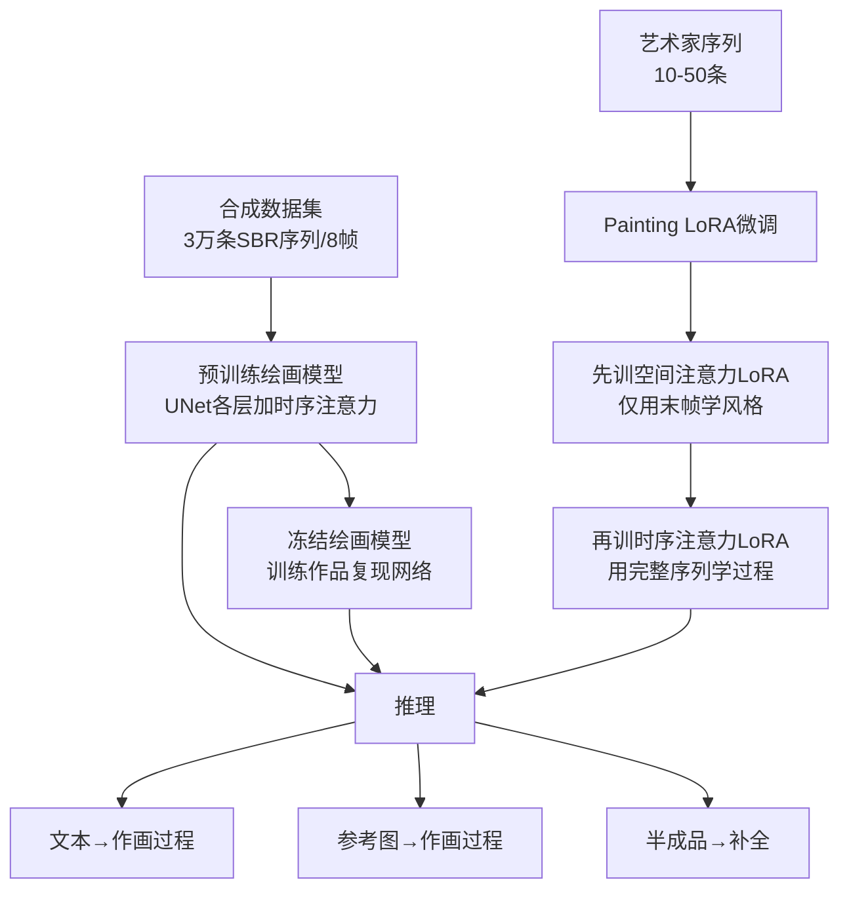

## 一句话总结

把"生成绘画过程"重新定义为一个文本到视频的生成问题：先用笔画渲染（SBR）合成的绘画序列预训练一个带时序注意力的扩散模型，再用少量艺术家真实作画序列的 LoRA 微调，从而首次实现从文本、参考图、半成品出发，生成像人类画家一样"由抽象到具体"的分步作画过程。

## 研究背景

分步作画过程在美术教育、娱乐与专业创作中有广泛价值，但一直难以自动生成。已有两类方法都不契合真实作画：

- **笔画渲染（Stroke-based Rendering, SBR）**：用贪心搜索、RNN、强化学习或参数搜索把图像分解成笔画序列。它们的优化目标本质是最小化当前画布与目标图之间的差异，因此只能做基础的笔画堆叠，无法复现不同画家、题材、画种千差万别的作画策略，也没有真正从人类作画关键帧中学习。
- **文本到图像扩散模型**：通过迭代去噪生成图像，但去噪轨迹与人类作画完全不同，用 VAE 解码中间 latent 只能得到模糊图像，而非有意义的作画步骤。

同时，训练视频模型需要海量数据，而高质量、连续的作画视频稀缺——网上的作画视频常有手部遮挡、镜头切换和缩放，不适合直接作训练数据。ProcessPainter 针对"数据稀缺"和"过程不拟人"这两个痛点提出解法。

## 方法

### 整体框架

模型由两大部分组成：一个参数冻结的 Stable Diffusion（VAE + UNet）叠加**时序注意力模块**构成的绘画模型，以及一个可选的 **Artwork Replication Network（作品复现网络）**。训练与推理分三阶段组织。

核心思想是把作画序列看成"同一幅画由抽象到具体的演变"，帧间需保持内容与构图的一致性和相关性。

### 关键设计一：时序注意力绘画模型

借鉴 AnimateDiff，在 UNet 每个扩散层后插入帧间自注意力模块。把特征图沿时间轴切成长度为 $$f$$ 的向量序列 $$\{z_1,\dots,z_f;\ z_i\in\mathbb{R}^{(b\times h\times w)\times c}\}$$，再送入自注意力：

$$\text{Temporal-Attention}(Q,K,V)=\text{Softmax}\!\left(\frac{QK^{T}}{\sqrt{c}}\right)\cdot V$$

其中 $$Q=W_Q z,\ K=W_K z,\ V=W_V z$$。这让当前帧的生成能利用其它帧的信息，保证过渡平滑连贯。基础去噪损失沿用扩散模型的形式：

$$L_{\text{simple}}(\theta):=\mathbb{E}_{x_0,t,\epsilon}\big[\lVert \epsilon-\epsilon_{\theta}(x_t,t)\rVert_2^2\big]$$

### 关键设计二：分阶段 Painting LoRA

作画过程从头到尾变化远比普通视频剧烈——首帧可能只是低完成度的色块或草稿，末帧才是成品，这给训练带来困难。为了把"静态成品的艺术风格"与"作画过程策略"解耦，LoRA 采用分阶段训练：先只用序列的末帧训练 UNet 的**空间注意力 LoRA**（学最终风格，避免未完成画面损害画质），冻结后再用完整序列训练**时序注意力 LoRA**（学过程策略）。LoRA 以低秩残差方式更新权重：

$$W'=W+\Delta W=W+AB^{T}$$

其中 $$A\in\mathbb{R}^{m\times r},\ B\in\mathbb{R}^{n\times r}$$，$$r$$ 是秩超参。只训练注意力层的新增权重、冻结原权重，既降低成本，也避免灾难性遗忘。每位艺术家单独训一个 LoRA，字幕中加触发词 "sks"。

### 关键设计三：作品复现网络 + 噪声替换

这是一个 ControlNet 变体，用于让生成序列中的**指定帧 $$\tau$$** 匹配参考图。参考图先经 VAE 编码得到 latent $$l_i$$，把作品复现网络输入的高斯噪声在第 $$\tau$$ 帧位置替换为 $$l_i$$；ControlNet 每个空间注意力层后也加时序注意力，学习参考图如何影响整段序列。去噪 UNet 第 $$n$$ 层的输出以加法方式融合：

$$\hat{S}u_n=Su_n+\lambda\,ARN_n$$

其中 $$\lambda$$ 控制作品复现网络的影响强度。通过设置 $$\tau$$ 实现不同功能：$$\tau$$ 设为末帧即"参考图→作画过程"；$$\tau$$ 设为前段帧并输入半成品，即"补全半成品"，$$\tau$$ 越靠前补全程度越高。推理时还用 **DDIM Inversion** 求参考图的初始噪声并替换对应帧的噪声，进一步提升重建一致性。

### 数据构建

- **合成数据**：从 DiffusionDB 按美学评分选 1 万张图，用 Learn-to-Paint、Stylized Neural Painting、Paint Transformer 三种 SBR 方法转成作画序列；由于 SBR 后期数百步主要微调细节，采用非均匀采样每条取 8 帧。此外用 Segment Anything + Depth Anything 分割物体，按由近及远深度顺序贴到空白画布上，模拟"由前景到背景分区作画"。
- **艺术家数据**：收集 3 位艺术家共 95 条作画序列，涵盖厚涂肖像、风景速写、线稿上色。

## 实验结果

作者指出这是首个实现文本到作画过程生成和分步补全的方法，无直接可比者，故在 Image-to-Painting-Process 任务上与 4 种 SBR 方法比较末帧与参考图的重建一致性（MSE / LPIPS / L1，均越低越好）：

| 方法 | Mean MSE ↓ | Mean LPIPS ↓ | Mean L1 ↓ |
| --- | --- | --- | --- |
| LearnToPaint | 0.016181 | 0.033240 | 0.087082 |
| Paint Transformer | 0.087695 | 0.153372 | 0.187685 |
| Intelli-Paint | 0.247486 | 0.397536 | 0.350746 |
| Stylized Neural Painting | 0.084447 | 0.141126 | 0.185832 |
| **Ours** | **0.014820** | **0.024517** | **0.082165** |

本方法在三项指标上均取得最佳重建一致性。消融实验表明：作品复现网络与噪声替换策略两者同时使用时与参考图一致性最高；只用其中之一都会明显下降，只用噪声替换时一致性最差。用户研究（44 名参与者、每人 28 组配对、每段以 5 秒 GIF 呈现）显示，本方法在"更像人类作画"和"更受偏好"两项上相对四个基线均以约 65%–84% 的比例胜出。

## 亮点与局限

**亮点**
- 首次把"作画过程生成"表述为文本到视频问题，绕开真实作画视频稀缺的难题——用 SBR 合成数据预训练打底，再用极少量（10–50 条）艺术家序列的 LoRA 学到个性化过程与风格。
- 分阶段 LoRA 巧妙地把"最终风格"与"过程策略"解耦，避免半成品帧污染画质。
- 作品复现网络 + 噪声替换 + DDIM Inversion 的组合，用一个统一框架同时支持文本生成、图像转过程、半成品补全三种应用，且可即插即用地切换风格 UNet 或 LoRA。

**局限**
- 受显存限制，序列固定为 8 帧、512×512 分辨率，难以生成更多帧或更高分辨率。
- 尽管部分数字绘画工具能导出创作过程，但相比静态图，获取人类艺术家真实作画序列仍然困难，限制了个性化数据规模。

## 延伸思考

- 帧数与分辨率的硬约束提示未来可结合更高效的视频扩散骨干或分层/超分策略，把 8 帧扩展为更细的时间轴，让教学演示更连贯。
- 用 SBR 合成数据作预训练是一种"用可批量生成的弱监督替代稀缺强监督"的通用思路，可迁移到其它"过程/轨迹"生成任务（如书法、雕刻、装配演示）。
- 方法对"过程真实性"的评估目前依赖重建指标与主观用户研究，缺乏对"作画策略"本身的定量度量；如何客观刻画"是否像人类的作画顺序"是值得深入的问题。
- 触发词 + 单艺术家单 LoRA 的设计便于扩展个人风格库，但也带来风格版权与数据授权的现实考量。
