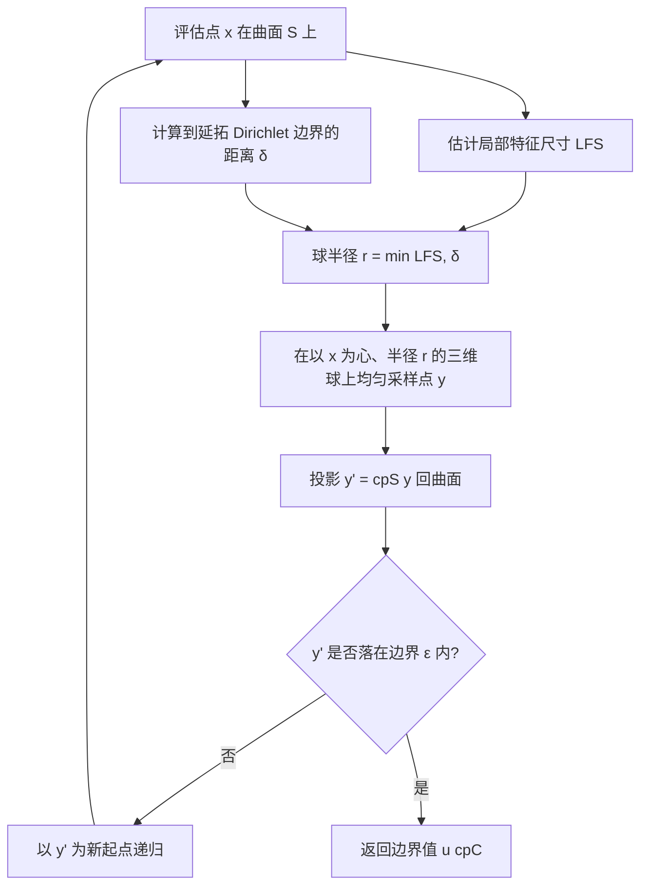

## 一句话总结

把体积域上的蒙特卡洛 PDE 求解器 Walk on Spheres（WoS）推广到曲面 PDE：在曲面周围的三维邻域里走球、每步再把采样点投影回曲面，从而无需网格、无需解全局线性方程组，就能逐点求解曲面上的 Dirichlet 边值问题。

## 研究背景

曲面上的偏微分方程（PDE）在图形学里无处不在——曲面编辑、纹理合成、曲面流体、测地距离、曲面扩散曲线都要用到。传统做法是把曲面离散化，构造离散微分算子（如三角网格上的 cotangent Laplacian），再求解一个全局耦合的稀疏线性系统。这类方法依赖高质量网格，会引入离散化伪影，且处理不同曲面表示（点云、隐式函数）时需要各自定义离散算子。

体积域一侧，蒙特卡洛方法（尤其是 WoS）近年受到关注：它逐点估计解、无需空间离散、天然可并行。WoS 的核心是对一个完全落在域内的球写出积分方程，然后递归地"走"到边界。但 WoS 面向的是体积域内的 PDE。已有工作把 WoS 扩展到曲面 Laplace 方程，却要求预先有曲面的共形参数化，适用面很窄。

本文的想法：不做参数化，只借助两个通用查询——曲面最近点查询 $$\mathrm{cp}_S(x)$$ 与（无定向的）法向/切向查询——就把 WoS 推广到曲面。理论支撑来自 Closest Point Method（CPM）的最近点延拓（closest point extension）。

## 方法

### 整体框架

关键理论工具是最近点延拓算子 $$E$$：它把曲面函数沿法向常数延拓到邻域，$$E u_S(x) = u_S(\mathrm{cp}_S(x))$$。在最近点唯一的邻域 $$\mathcal{N}(S)$$ 内，曲面上的 Laplace-Beltrami 算子可以用笛卡尔 Laplacian 加延拓表示：$$\Delta_S u_S(y) = \Delta[E u_S](y)$$。于是曲面 PDE 被改写成一个定义在曲面周围三维邻域上的"嵌入 PDE"

$$\Delta[E u_S](x) = f(x) + g(x), \quad x \in \mathcal{N}(S),$$

其中 $$g(x)$$ 是补偿项，在曲面上为 0。作者证明真正的解满足 $$u(x) = E u(x) = u(\mathrm{cp}_S(x))$$，也就是解在法向上是常数——这正是"投影回曲面"这一步的合法性来源。

实践中作者直接令 $$g(x)=0$$，多数场景下结果收敛且定性正确；只有源项较复杂时会残留偏差。

递归关系相比原始 WoS 只多了"投影"一步：

$$\hat{u}(x) = \hat{u}(\mathrm{cp}_S(y)) + \frac{1}{N_V}\sum_{i=1}^{N_V}\frac{G(x, z_i)\, f(\mathrm{cp}_S(z_i))}{p(z_i)}.$$

当 $$\dim(S)=d$$（余维为零）时投影无效果，算法退化为标准 WoS——因此 PWoS 是 WoS 的严格推广。

### 关键设计一：局部特征尺寸估计

每步球必须完全落在最近点唯一的邻域 $$\mathcal{N}(S)$$ 内，球半径受"局部特征尺寸"（到中轴的最短距离）约束。用固定小常数虽然合法但效率极低——作者给出的例子显示，在单位球上把 LFS 从 0.99 降到 0.0625，平均步数从约 31 步暴涨到约 1819 步。

因此作者用点云近似中轴：在包围盒里密集撒点，用最近点查询得到两侧法向，再借 Ma 等人的收缩球法提取中轴球。为抵抗离散化带来的噪声/尖角，作者借鉴 scale axis transform 做剪枝（把每个球放大因子 $$s>1$$，被包含的小球删除，默认 $$s=1.15$$），并对同一表面点生成的一对切球做半径对齐以避免误删稳定分支。最后乘 0.9 保证保守估计，并用阈值 $$\lambda$$ 对尖角做"圆角"处理防止走步卡死。

### 关键设计二：延拓 Dirichlet 边界的距离

Dirichlet 边界 $$C$$ 沿法向延拓成"边界墙"（$$\dim S=2$$ 时是线段、$$\dim S=1$$ 时是圆盘）。作者不显式构造延拓几何，只用最近点 $$\mathrm{cp}_C(x)$$ 加一个 clamp 公式就能算出到延拓边界的距离，例如 $$\dim(S)=2$$ 时

$$\mathbf{r} = \mathrm{cp}_C(x) - x, \quad \delta = \lVert \mathbf{r} - \mathrm{clamp}(\mathbf{r}\cdot n, -l, l)\, n \rVert_2.$$

### 关键设计三：离散基的均值滤波与其他推广

为在大量评估点（网格顶点）上提速，作者设计了基于离散基（如三角形重心坐标）的均值滤波：先用极低采样数得到初始解，再把递归中遇到的 $$\hat{u}(\mathrm{cp}_S(y))$$ 用邻近已算点插值替代，从而免去继续递归。这引入插值偏差但在给定时间预算内能显著降误差。此外，通过 Russian Roulette 处理 screened Poisson 方程、通过分部积分处理散度源项与梯度估计，使方法能覆盖测地距离（heat method）与波动方程等应用。

## 实验结果

作者在 Houdini 中实现（无 GPU 加速），用一系列解析可比的场景做收敛研究：涵盖 Laplace / Poisson / screened Poisson 方程，光滑曲面与带尖角曲面，闭合、开放、双边、无边界等多种配置。核心结论是绝大多数场景达到蒙特卡洛期望的 $$O(1/\sqrt{N_W})$$ 收敛率；只有在剪枝参数过激或源项较复杂时偏差偏大。

局部特征尺寸对效率的影响也被单独验证：把一条矩形带沿高/中/低频正弦弯曲后解 Laplace 方程，局部特征尺寸越大收敛越快、偏差越低。

| 局部特征尺寸估计（单位球，解析值=1） | 平均步数 |
| --- | --- |
| 0.99 | 约 31.1 |
| 0.5 | 约 47.8 |
| 0.25 | 约 129.0 |
| 0.125 | 约 462.8 |
| 0.0625 | 约 1818.7 |

该表说明：保守但尽量大的 LFS 估计是效率关键，低估会让走步数量级式增长。

## 亮点与局限

亮点：

- 用一个极简改动（每步投影回曲面）就把 WoS 迁移到曲面 PDE，且是 WoS 的严格推广，理论上由最近点延拓背书。
- 完全无网格、无全局线性系统、逐点可并行；只需最近点与法向/切向查询，因此三角网格、四边形网格、有向点云、隐式函数、甚至混合余维几何都能直接用。
- 逐点特性支持视相关求解：只在相机可见点上算颜色，配合像素级随机滤波得到无离散化伪影的扩散曲线结果。
- 演示了扩散曲线、测地距离（heat method）、曲面波动动画三类应用。

局限：

- 目前只支持 Dirichlet 边界；Neumann/Robin 需要额外的射线求交等查询。
- 令 $$g(x)=0$$ 是近似，源项复杂时会残留偏差，作者尚无该假设严格成立的完整判据；只能靠缩小球半径压偏差，但代价是更慢。
- 局部特征尺寸估计对曲面附加了平滑性假设，小尺度特征会让走步数量激增；这源于 WoS 依赖只在局部球内成立的积分方程。

## 延伸思考

这篇工作把"最近点延拓"这一 CPM 里的核心几何观念，和 WoS 的随机游走结合得非常干净——本质上是用"投影"把体积随机游走束缚在曲面法向常数流形上。它最吸引人的地方在于对曲面表示的无差别兼容：因为只依赖最近点查询，隐式表示、点云、混合余维都能统一处理，这在需要即时、局部、视相关求解的渲染管线里很有价值。

未来最值得攻的两点：一是构造非零的补偿项 $$g(x)$$，把当前"忽略即偏差"变成可控甚至无偏，这决定了方法能否用于复杂源项；二是换用全局积分方程（如 walk on boundary 思路）替代仅局部成立的球内积分，以缓解小特征处走步爆炸的问题。若再补上 Neumann/Robin 边界与 GPU 实现，PWoS 有望成为曲面 PDE 的通用蒙特卡洛后端。
