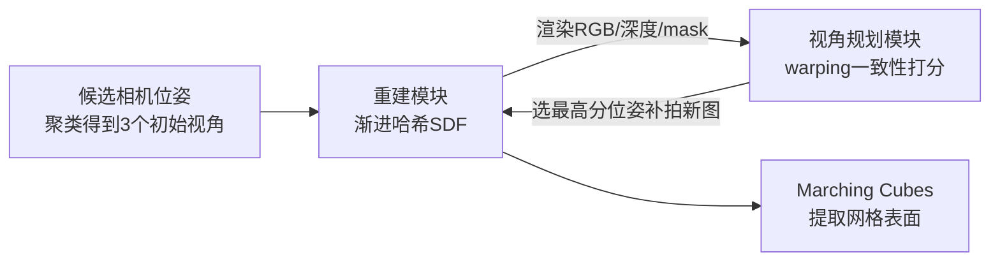

## 一句话总结

PVP-Recon 把"该拍哪几张图"变成了重建流程内部的主动决策：它从最少 3 张视角起步，用一种基于图像 warping 一致性的打分策略逐步选择"最有信息量"的下一个视角进行补拍，配合多分辨率哈希编码 SDF、渐进式训练方案与方向性 Hessian 损失，用不超过 8 张图就能重建出高质量物体表面。

## 研究背景

神经隐式表面重建（如 NeuS、Neuralangelo）在稠密多视角输入下能得到高保真网格，但依赖大量图像，采集成本高。当视角变稀疏时，性能会因"形状-辐射歧义"急剧下降。已有的稀疏视角方法主要分两类：

- **正则化类**：引入语义、几何、频率或 MVS 先验作为额外约束（如 MonoSDF）。
- **泛化类**：在多场景上训练以泛化到新场景（如 SparseNeuS、VolRecon）。

作者指出这些方法都忽视了一个关键问题：**输入视角本身的选择**。正则化类方法通常在训练前就固定几张图，泛化类方法只在精心挑选、重叠度大的视角下才好用。但对给定物体，"到底该用哪几张稀疏视角"始终没有答案。

论文的核心观察是：好的稀疏重建取决于两点——(1) 一个能提供最有信息量输入图像的视角规划策略；(2) 一个带良好正则化的神经表示。由此作者把问题建模为图像重建场景下的 **next-best-view（NBV）问题**，提出边重建边规划的 PVP-Recon 系统。

## 方法

### 整体框架

系统由两个相互增强的模块交替运行组成：

- **视角规划模块**：在候选相机位姿中，用 warping 打分选出信息增益最大的下一个视角，补拍一张新图加入训练集。
- **重建模块**：用多分辨率哈希编码表示 SDF，在渐进式训练与方向性 Hessian 损失下优化表面，并把当前渲染结果反馈给规划模块指导决策。

二者交替进行：新拍的图帮助重建优化，重建的当前状态又指导下一次视角规划。系统从 3 个聚类中心视角初始化，每隔固定迭代补一张图，直到视角数达到阈值（通常不超过 8 张）。

### 关键设计 1：基于 warping 一致性的视角打分

核心难点是给每个候选位姿一个合理分数，反映它对未来重建的潜在贡献。作者的关键洞察是：渲染图像与深度的多视角一致性能有效反映"某个区域是否需要更多信息"。

给定两相机位姿的相对变换 $$T$$、内参 $$K$$、深度图 $$d$$，warping 过程为：

$$p' = K \mathcal{F}^{-1}\{T \mathcal{F}\{d(p) K^{-1} p\}\}$$

其中 $$p$$、$$p'$$ 是源图与 warp 后图的齐次坐标，$$\mathcal{F}$$ 是 3×1 到 4×1 的齐次转换。对每个候选位姿，先从重建模块渲染出图像、深度和轮廓 mask，把渲染图 warp 到最近的训练视角，轮廓 mask 也一并 warp 作为可见性 mask $$M$$。warping 分数定义为可见性 mask 内 warp 图 $$I'$$ 与训练图 $$I$$ 的光度差异：

$$\boldsymbol{s} = \left\| M \odot (I' - I) \right\|_1$$

高分来自两个因素：一是当前几何重建仍有误差（训练不充分）；二是遮挡带来的多视角不一致——即候选视角能看到、但现有训练图看不到的新区域。作者观察到后者贡献更大，因此高分视角往往能覆盖尚未被覆盖的新区域，带来最大信息增益。

### 关键设计 2：渐进式哈希编码训练方案

多分辨率哈希特征表达力强、收敛快，但在稀疏视角下若一开始就启用全部分辨率，会过拟合到少数视角、陷入局部极小，产生噪声和漂浮伪影。

作者受 FreeNeRF 启发，假设低分辨率哈希特征编码粗几何、高分辨率编码高频细节，因此设计渐进激活掩码，训练早期只用低分辨率（生成过度平滑的几何），后期逐步启用更高分辨率补充细节：

$$\tilde{\gamma}(\boldsymbol{x}, \psi) = m(\psi) \odot \gamma(\boldsymbol{x}), \quad m_i(\psi) = \boldsymbol{I}[i \le \psi]$$

其中 $$\psi = \frac{i}{\Theta} L$$，$$i$$ 是当前迭代数，$$\Theta$$ 是预定阈值，$$L$$ 是哈希层数。这一方案有效防止优化过快陷入局部极小。

### 关键设计 3：方向性 Hessian 损失

常用的 Eikonal 损失只约束一阶梯度，在稀疏视角下正则不足；而直接把二阶 Hessian 矩阵范数压到零也不合理，因为 SDF 的二阶梯度并非处处为零。作者指出：在表面附近，SDF 梯度沿其法向的方向导数才应为零（相邻等值面平行）。据此提出方向性 Hessian 损失：

$$\mathcal{L}_{dir} = \exp(-\delta \cdot \vert f_g(\boldsymbol{x})\vert ) \cdot \frac{\vert \nabla f_g(\boldsymbol{x})\vert  - \vert \nabla f_g(\boldsymbol{x} + \epsilon \cdot \frac{\nabla f_g(\boldsymbol{x})}{\|\nabla f_g(\boldsymbol{x})\|})\vert }{\epsilon}$$

步长 $$\epsilon$$ 取哈希编码的最小网格尺寸，$$\exp(-\delta \cdot \vert f_g(\boldsymbol{x})\vert )$$ 是 RBF 权重，让损失聚焦表面附近区域。它作为平滑先验约束 SDF 梯度的不一致性，缓解稀疏视角下的病态优化。

### 总损失

$$\mathcal{L} = \mathcal{L}_{rgb} + w_{norm} \mathcal{L}_{norm} + w_{eik} \mathcal{L}_{eik} + w_{dir} \mathcal{L}_{dir}$$

其中 RGB 损失为渲染像素与真值的 L1 差异；法向损失用 Omnidata 预测的伪真值法向约束渲染法向。权重设为 $$w_{norm} = w_{dir} = 0.05$$，$$w_{eik} = 0.1$$。

## 实验结果

在 DTU（10 场景）、BlendedMVS（5 场景）、Blender（5 场景）三个数据集上评估，每个场景只用约 10% 的稠密视角（DTU/Blender 用 6/8 张，BlendedMVS 用 8-12 张）。DTU 上的 Chamfer distance（mm，越低越好）主实验如下：

| 方法 | 训练时间 | 平均 Chamfer distance (mm) ↓ |
| --- | --- | --- |
| NeuS (cluster) | 83min | 1.27 |
| Neuralangelo (cluster) | 512min | 1.15 |
| MonoSDF (cluster) | 435min | 1.32 |
| SparseNeuS | — | 1.28 |
| VolRecon | — | 1.18 |
| Ours (random) | 9min | 0.97 |
| Ours (cluster) | 9min | 0.90 |
| **Ours (planning)** | 9min | **0.81** |

PVP-Recon 在显著更短的训练时间（约 9-10 分钟 vs 基线数百分钟）下取得最低 Chamfer distance；即便替换成随机/聚类/最远采样，重建模块本身也优于基线，加上视角规划后进一步提升。

视角规划策略对比（DTU 平均 Chamfer distance）：Ours 在 4/5/6 视角下分别为 0.99/0.92/0.81，均优于 Entropy（1.20/1.07/0.93）、NeurAR（1.51/1.36/1.23）、NeU-NBV（1.35/1.25/1.12），且单轮规划耗时约 7.8s，与最快策略相当。

消融实验（DTU 平均 Chamfer distance）：在 view planning 设置下，完整方法 0.81，去掉渐进方案（w/o prog）升到 1.45，去掉方向性 Hessian 损失（w/o $$\mathcal{L}_{dir}$$）升到 0.91，说明两个组件都不可或缺。此外，把视角规划模块接入 NeuS（1.27→1.15）和 MonoSDF（1.44→1.36），也都比固定视角更好，证明模块的即插即用能力。

Blender 上的新视角合成也取得最高平均 PSNR（25.15）与 SSIM（0.910）。

## 亮点与局限

**亮点**

- 把 next-best-view 主动规划引入图像表面重建，输入视角在优化过程中渐进补充，而非事先固定——这是与既有稀疏重建方法的本质区别。
- warping 打分策略简单有效，直接用多视角一致性验证信息增益，无需复杂的不确定性建模，且计算开销小。
- 两个模块均可即插即用，能替换进 NeuS、MonoSDF 等框架带来提升。
- 方向性 Hessian 损失从"相邻等值面平行"的几何直觉出发，比直接压 Hessian 范数更合理。
- 天然适配机器人主动重建场景，论文展示了机械臂逐步采图的真实应用。

**局限**

- 单次视角规划约 8 秒、整体重建约 10 分钟，实时性不足，作者提出未来用 CUDA 加速。
- 目前只针对物体级场景，尚未扩展到大规模、无界、非物体中心的场景。
- 候选视角被限制在数据集已有图像的视点上，真实自由视角采集下的表现有待进一步验证。

## 延伸思考

- 打分依赖当前重建的渲染质量，早期几何很粗糙时的打分可靠性如何保证？论文用渐进训练缓解过拟合，但规划与重建之间的"鸡生蛋"耦合仍是这类主动方法的共性挑战，值得关注初始 3 视角选择对最终结果的敏感度。
- warping 分数把"重建误差"和"遮挡/覆盖不足"两个因素混在一起，作者观察后者贡献更大。如果能显式解耦二者，或许能设计出更有针对性的规划策略（例如优先补几何误差大 vs 优先补未覆盖区域）。
- 该框架把"主动感知"与"神经重建"闭环起来，思路可迁移到动态场景、大场景 SLAM，乃至无人机航拍路径规划——即在采集端就用重建反馈驱动"下一步去哪拍"，这比先采后重建的范式更省资源。
- 方向性 Hessian 损失作为一种更精确的二阶几何正则，可能对稠密视角或其他隐式表示（如 3DGS 表面化方法）同样有益，是一个可独立复用的组件。
