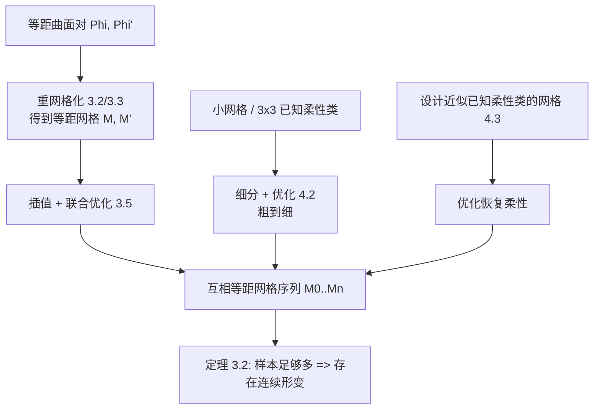

## 一句话总结

本文把"计算能够连续弯折的四边形网格机构（面刚性、边为铰链）"这一长期未解的难题，转化为"求解有限个互相等距的网格样本"问题，并给出可证明的样本数量上界，配合合理初始化与优化，实现了对自由曲面机构的计算设计。

## 研究背景

刚性与柔性（rigidity / flexibility）是一个历史悠久、结论优美却极难系统化建模的领域。本文关注的对象是四边形网格机构：网格的每个面视为刚体、每条边作为相邻面之间的铰链，整体在这种约束下仍能发生非平凡的连续形变（flexion）。这类结构在机械工程、折纸（origami）以及近年艺术与建筑中的"可变形设计"（transformable design）里都有应用，但设计极其困难，很多方案不得不引入可弯曲构件来凑出柔性。

已有研究大多局限于特例：平面四边形面的柔性网格由 Kokotsakis 开创，Schief 等指出正则平面四边形网格只需考察 $$3 \times 3$$ 子网格，Izmestiev 给出了平面情形的完整分类；非平面面的柔性网格几乎无人问津。另一条线索来自曲面的等距弯曲（isometric bending），但离散曲面的柔性通常并不逼近其对应光滑曲面的弯曲，只有 Voss 网、T 网等特殊类才成立。

本文的核心洞察是把代数几何与数值优化结合起来：用一个代数次数上界，把"是否存在连续形变"这一问题，归约为"计算有限个互相等距网格"这一可行的数值任务，从而在更一般的情形下突破了以往只能处理特例的局限。

## 方法

### 整体框架

本文先在第 2 节梳理光滑曲面与离散网格的等距、柔性与无穷小柔性等基本概念，第 3 节给出一系列基础算法模块，第 4 节把这些模块拼装成三条设计流水线。所有流水线的终点都是一次优化：让网格序列中每个网格自身"无穷小柔性"、且彼此"刚性面等距"，再由定理 3.2 推断得到一个真正的机构。

### 关键设计 1：从连续形变到时间离散的代数归约

一个四边形网格机构的形变只有 1 个自由度，它在构型空间中对应一条代数曲线。由于"面内对应顶点间距离不变"是二次约束，判断能否连续形变本质上是代数问题。结合命题 2.2（正则四边形网格柔性 $$\Longleftrightarrow$$ 其所有 $$3 \times 3$$ 子网格柔性），本文证明了核心定理 3.2：若给定网格的 $$N$$ 个互相等距位置满足某个通用性条件，只要 $$N$$ 足够大，就能断定该网格是柔性的。对于通用尺寸与通用位置 $$N = 33$$ 足够；平面面情形降到 $$N = 17$$；若这些位置本身是一阶/二阶无穷小柔性，则进一步降到 $$N = 9$$ 甚至 $$N = 6$$。实践中通常取 $$N = 20$$。这一"次数上界"正是把连续问题时间离散化的理论依据。

### 关键设计 2：无穷小柔性 + 等距的联合优化

优化的核心是把各类几何条件写成平方和能量。刚性面等距要求面内对应顶点距离相等，并保持定向（体积行列式一致）：

$$
c^{ij}_{\text{len}} = \|v_i - v_j\|^2 - \|v'_i - v'_j\|^2 = 0
$$

无穷小柔性通过对距离平方的时间导数逐阶置零来刻画（本文只用到二阶）：

$$
c_{\text{fl},1,ij} = \langle v_i - v_j,\ \dot v_i - \dot v_j \rangle = 0
$$

$$
c_{\text{fl},2,ij} = \langle v_i - v_j,\ \ddot v_i - \ddot v_j \rangle + \langle \dot v_i - \dot v_j,\ \dot v_i - \dot v_j \rangle = 0
$$

为避免退化解，还加入速度归一化约束、固定某个面 $$f_0$$ 去除刚体运动、以及可选的平面性约束与靠近参考曲面的投影约束。总能量分成等距项 $$E_{\text{iso}}$$、几何项 $$E_{\text{geom}}$$（平面性 + 贴合）与柔性项 $$E_{\text{flex},k}$$，用 Levenberg–Marquardt 法最小化。

### 关键设计 3：三种初始化 / 设计流水线

优化能否成功高度依赖初始化，本文给出三条互补路径：

- **重网格化流水线**：给定两个等距曲面 $$\Phi, \Phi'$$（用 checkerboard 等距的网格对表示），借助 Ceballos Inza 等提出的"棋盘第二基本形式"求解共轭 cross field，从而抽取出近似等距的四边形网格 $$M, M'$$，再插值优化得到时间离散形变。分平面面与斜面两种情形。
- **粗到细流水线**：小网格上更容易优化出目标性质。从已知柔性的小网格（如 $$2 \times n$$ 网格或 Izmestiev 分类中的 $$3 \times 3$$ 平面网格）出发，做 Catmull–Clark 细分——细分会破坏平面性与柔性——再优化恢复，迭代进行。
- **优化驱动的探索**：显式已知的柔性类（T 网、V 网等）过于受限。本文改为设计"满足部分而非全部柔性约束"的网格，使其在构型空间中偏离柔性子流形但不太远，再用优化把柔性"拉回来"。此法出乎意料地有效，文中的建筑可变形设计即由此得到。

## 实验结果

作者用 C++ 实现（基于 OpenMesh 数据结构与 Taucs 稀疏求解器），在 Intel Xeon W-2225 4.1GHz / 32G 内存、无并行加速的条件下测试。等距误差用同一面内顶点距离的相对 $$\ell_2$$ 误差 $$E_2$$ 与最大相对误差 $$E_{\max}$$ 衡量。下表摘录若干代表性实例：

| 实例 | 顶点数 | 面数 | 迭代 | 时间(s) | $$E_{\max}$$ | $$E_2$$ |
|------|-------|------|------|---------|--------------|---------|
| 平面面流水线（大网格） | 1048 | 962 | 10 | 25.6 | $$6.0 \times 10^{-5}$$ | $$5.2 \times 10^{-6}$$ |
| 斜面流水线 | 745 | 657 | 10 | 10.4 | $$1.8 \times 10^{-5}$$ | $$2.1 \times 10^{-6}$$ |
| $$2 \times n$$ 细分 | 585 | 512 | 10 | 4.47 | $$7.0 \times 10^{-5}$$ | $$1.0 \times 10^{-5}$$ |
| 粗到细（细分两轮后） | 169 | 144 | 10 | 0.80 | $$1.1 \times 10^{-4}$$ | $$1.3 \times 10^{-5}$$ |
| Möbius 变换后优化 | 441 | 400 | 10 | 3.82 | $$1.3 \times 10^{-4}$$ | $$2.8 \times 10^{-5}$$ |

等距误差普遍在 $$10^{-4}$$ 到 $$10^{-6}$$ 量级，计算时间从不到 1 秒到约 26 秒不等。作者还制作了实体物理模型实验验证其可弯折性，并展示方法可处理带组合奇点的网格。消融实验表明：将等距权重 $$\lambda_{\text{len}}, \lambda_{\text{vol}}$$ 置零后，等距误差从 $$5.2 \times 10^{-6}$$ 恶化到 $$7.8 \times 10^{-3}$$；关闭平面性权重后平面性同样显著变差，说明各能量项都在起作用。实验还证实所得结果并不属于 Voss 网、T 网这类"简单"柔性类型。

## 亮点与局限

亮点：

- 首次把连续柔性问题通过一个可证明的代数次数上界，系统地归约为有限个等距网格的计算，理论与数值紧密结合。
- 摆脱了以往只能处理平面面特例的限制，能处理非平面（斜面）四边形网格机构。
- "优化驱动探索"这一初始化思路简单却高效——先偏离已知柔性类再优化拉回，为自由曲面机构设计打开了空间；并有物理模型佐证。

局限（作者自述）：

- 只有对每个具体实例的事后数值证据，缺乏关于"哪些形状可实现为机构"的先验理论保证；重网格化流水线仅基于必要条件，成功率不足 100%（这也符合机构本身稀有的事实）。
- 参考曲面过于复杂时优化可能失败或收敛到更简单的形状；机构的铰链倾向沿特征曲线分布，难以处理复杂特征或多个凸起。
- 实现上未做碰撞检测。

## 延伸思考

本文最迷人的地方在于"代数几何提供理论天花板、数值优化负责落地"的分工：一个看似纯理论的次数上界，直接决定了工程上要采样多少个网格位置，这种把不可判定感的连续问题"截断"为有限计算的思路，在其他形变/机构设计问题中或许同样适用。

作者指出的开放方向也很有价值：如何用 $$3 \times 3$$ building block 拼装更大的柔性网格、给定形状能否被柔性四边形网格逼近，都仍未解决。文中还提到在各向同性（isotropic）退化度量下机构问题更容易，其柔性网格分类可高效用于初始化真实机构的计算——这暗示"先在更简单的几何里求解、再迁移回欧氏几何"是一条值得探索的通用策略。
