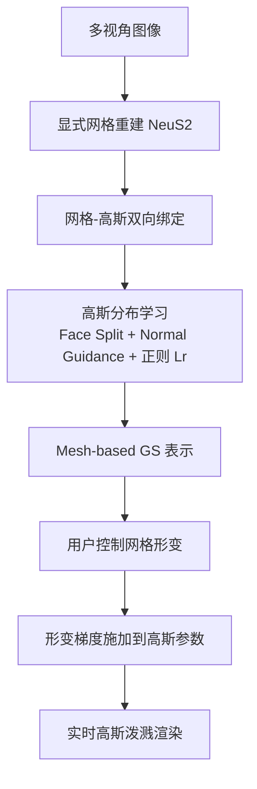

## 一句话总结

通过把 3D 高斯核绑定到一张显式三角网格上，让网格的拓扑先验既指导高斯的分裂与规整、又驱动高斯的形变，从而实现对高斯泼溅（3DGS）场景的实时、大尺度、高保真交互式形变编辑。

## 研究背景

3D 高斯泼溅（3DGS）用离散高斯核显式表达场景，兼具高质量与实时渲染能力，是隐式表达（NeRF、SDF）在渲染速度上的有力替代。但正因为它由离散、无结构的高斯核构成、缺乏显式拓扑，直接对其做形变会遇到麻烦：

- 基于稀疏控制点的方法（如 SC-GS）缺少拓扑先验，难以应对复杂几何或复杂形变。
- 基于网格提取的方法（如 SuGaR）在形变时只调整已有高斯核的缩放和旋转，不做合并或分裂，也不考虑法向等网格属性；在大尺度形变（会大幅改变网格形状）时容易产生错位伪影。

作者的核心观察是：离散无结构的高斯核需要强拓扑信息来约束相邻核之间的关系，才能在大尺度形变下保持有意义的外观。因此本文引入显式网格作为拓扑桥梁，把成熟的网格形变方法迁移到 3DGS 上。

## 方法

### 整体框架

给定多视角图像，先用现成方法（如 NeuS2）重建一张显式网格 $$M$$，再把 3DGS 与网格双向绑定：网格指导高斯的学习（分裂与规整），高斯的渲染又反过来指导网格面的自适应细分。学习完成后，用户对网格施加控制，网格形变梯度被施加到关联高斯的参数上，实现实时可渲染的形变。

### 关键设计一：网格锚定的高斯参数化

每个高斯核初始锚定在三角面片的质心。其空间位置由所在三角形三个顶点的重心坐标 $$(w_a, w_b, w_c)$$ 与沿法向的偏移量共同决定：

$$\mu = (w_a v_a + w_b v_b + w_c v_c) + \tau R n$$

其中 $$n$$ 是面法向，$$R$$ 是三角形外接圆半径，$$\tau \in [-0.5, 0.5]$$ 是沿法向的可学习位移。重心坐标和偏移量作为附加属性参与 3DGS 的优化，从而把每个高斯牢牢关联到具体的网格面。

### 关键设计二：网格引导的分裂策略

训练中高斯的分裂不再是原始 3DGS 的自由分裂，而被限制为两种与网格耦合的方式：

- Face Split（面分裂）：当某个三角面满足阈值判据（$$2 \times 10^{-4}$$）时，在各边中点插入新顶点，将其细分为四个小三角形，对应的高斯核也同步分裂并留在表面上。
- Normal Guidance（法向引导）：每个高斯沿面法向做垂直移动，移动距离 $$\tau$$ 可学习，使高斯位于表面附近而非严格贴在表面，从而更好地表达高频细节。

这两种策略共同抑制了错位、细长等不合理高斯，提升渲染质量并为形变打基础。

### 关键设计三：形状正则 $$L_r$$

为避免大尺度形变时因高斯各向异性过强产生模糊伪影，引入正则项约束高斯尺度不超过所在三角形的尺寸：

$$L_r = \sum_{g \in G} \max\left(\max(s_i) - \gamma R_i,\; 0\right)$$

其中 $$s_i$$ 是高斯的 3D 缩放向量，$$R_i$$ 是所在三角形外接圆半径，$$\gamma$$ 是控制邻近三角形对高斯尺寸影响的超参数。

### 关键设计四：网格形变驱动的高斯变换

采用可处理大尺度形变的数据驱动网格形变方法，通过最小化如下能量得到形变网格：

$$E(M') = \sum_{i=1}^{N} \sum_{j \in N(i)} w_{ij} \left\| (v_i' - v_j') - T_i (v_i - v_j) \right\|^2$$

每个顶点的变换矩阵 $$T_i$$ 经极分解为旋转 $$\bar{R}_i$$ 与剪切 $$\bar{S}_i$$。对绑定在形变面上的高斯，用重心坐标插值得到位移与形变梯度：

$$\Delta P = w_a(v_a' - v_a) + w_b(v_b' - v_b) + w_c(v_c' - v_c)$$

$$T_i = \exp(\bar{R}_i)\bar{S}_i$$

于是形变后的高斯位置为 $$\mu' = \mu + \Delta P$$，协方差为 $$\Sigma' = T_i \Sigma T_i^{\top}$$。同时对球谐系数施加局部旋转的逆变换以修正视角相关外观。由于这些都是仿射变换，可直接进入泼溅渲染管线实现实时形变。此外，借助绑定网格还能利用现有网格形变数据集实现数据驱动形变——这是以往 GS 方法所不具备的能力。

## 实验结果

在 NeRF-Synthetic 数据集上与 NeRF-Editing、3D-GS、SuGaR 对比新视角合成质量。本方法在 PSNR 和 SSIM 上最优，LPIPS 上相当：

| 方法 | PSNR↑ | SSIM↑ | LPIPS↓ |
| --- | --- | --- | --- |
| NeRF-Editing | 30.58 | 0.960 | 0.058 |
| 3D-GS | 33.31 | 0.967 | 0.023 |
| SuGaR | 32.39 | 0.958 | 0.037 |
| Ours | 33.43 | 0.968 | 0.034 |

消融实验（NeRF-Synthetic 平均）显示：去掉 Face Split（w/o F.S.）平均 PSNR 32.73、去掉 Normal Guidance（w/o N.G.）为 31.76，完整方法为 33.43，两项关键设计均有明显贡献。此外方法对网格分辨率（5 万 / 10 万 / 50 万顶点）不敏感。

效率方面：高斯分布训练约 10 分钟（分辨率 1024×1024），形变渲染在单张 RTX 4090 上平均达 65 FPS，支持实时交互式拖拽形变。

## 亮点与局限

亮点：
- 用一张显式网格作为拓扑桥梁，把成熟的网格形变（含数据驱动形变）自然迁移到 3DGS，且全程仅优化高斯参数、不涉及网络参数。
- 网格与高斯双向绑定：渲染指导网格自适应细分，网格细分指导高斯分裂；正则项进一步抑制不合理高斯，兼顾渲染质量与形变鲁棒性。
- 大尺度形变下仍保持高频细节与实时渲染（平均 65 FPS）。

局限（结合方法设定推断）：
- 依赖外部方法（如 NeuS2）预先重建显式网格，重建质量与拓扑正确性会直接影响后续绑定与形变效果。
- 形变结果缺乏真值，量化评估集中在新视角合成质量，形变本身主要靠定性展示。
- 高斯被约束贴近表面，对半透明、体积性或薄结构等难以用清晰表面网格表达的场景可能受限。

## 延伸思考

- 网格作为可控代理是显式表达的天然优势，这套"绑定—分裂—形变梯度传递"范式或可推广到物理仿真、动画重定向等需要拓扑一致性的编辑任务。
- 若把显式网格重建也纳入端到端优化，或用可微网格提取替换现成方法，可能进一步减少对重建质量的依赖。
- 数据驱动形变的引入提示了一个方向：把大量网格形变/动画数据当作先验，为 GS 提供"合理形变"的统计约束，从而在稀疏用户控制下生成更自然的结果。
