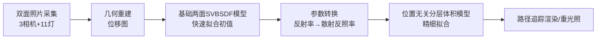

## 一句话总结

用一套无运动部件、双面同时布置相机与光源的采集装置，配合"先简单表面模型、再位置无关分层体积模型"的两阶段可微逆向渲染流程，从少量真实照片中联合重建薄半透明物体（树叶、纸张）的几何形状与物理外观参数。

## 研究背景

树叶、花瓣、纸张这类薄而具有多层结构的半透明物体在日常中随处可见，但对其外观建模一直很难做到足够精细。它们因为层间多次散射而产生**非漫射透射**：背光时呈现独特质感，正面照明时两侧看起来也明显不同。

传统外观采集方法大多针对不透明表面拟合空间变化的反射模型（SVBRDF），扩展到薄半透明物体时会遇到三重困难：

- **参数量巨大**：既要重建几何位移，又要重建两侧体积参数与表面粗糙度，未知量非常多，随机初始化难以稳定收敛。
- **蒙特卡洛噪声**：可微渲染器对复杂材质（粗糙介质界面、强散射参与介质）产生的 MC 噪声很敏感，优化易被噪声带偏。
- **长光路开销大**：为捕捉多次散射，光路最长可达 32 次反弹，巨大的计算图使梯度反传代价高昂。

此外，传统"漫射透射"假设无法复现真实透射波瓣的形状，需要更精确的基于蒙特卡洛的物理模型。本文提出一套廉价快速的采集与逆向渲染流水线，用**统一的物理模型**同时刻画双面反射与非漫射透射。

## 方法

整体流水线包含四个阶段：照片采集 → 几何重建 → 简单材质重建 → 位置无关分层材质重建。核心思路是用一组参数、一个全局物理一致的模型来同时决定两侧的反射与透射，并通过"由易到难"的多阶段优化获得可靠收敛。

### 采集系统：无运动部件的双面装置

装置由固定在样本两侧的 3 台相机和 11 个光源（正面 6、背面 5）组成，无任何运动部件以避免振动。样本用细钓鱼线稀疏网格固定，避免玻璃板带来的折射与杂散反射。每个表面点可获得 33 组 RGB 测量，为两层模型的 13 个空间变化参数提供足够冗余。由于薄生物样本（如树叶）会干燥变形，采集速度很关键，整个 HDR 序列约 25 分钟完成。

### 两个外观模型

- **基础两面 SVBSDF 模型**：两个不透明反射层各含 Lambert 漫射叶与 GGX 光泽叶，中间加一个 Lambert 透射叶。按入射方向正负决定使用正面还是背面参数：

$$
F_s(x, \omega_i, \omega_o) = \begin{cases} w^{front}_D f^{front}_D + f^{front}_{GGX} + w_T f_T, & \cos\omega_i > 0, \\ w^{back}_D f^{back}_D + f^{back}_{GGX} + w_T f_T, & \cos\omega_i < 0. \end{cases}
$$

- **位置无关分层模型**：两个粗糙介质界面夹两层体积介质，体积层具有空间变化的单次散射反照率 $$c$$ 与消光系数 $$\sigma_t$$。它以物理无偏方式模拟物体内部光传输，唯一假设是光进出位置相同（薄物体近似成立）。分层 BSDF 表示为对光路 $$z$$ 的积分：

$$
F_p(x, \omega_i, \omega_o) = \int f(z)\, d\mu(z)
$$

其中贡献函数为散射函数（BSDF 或相函数）与透射率 $$Tr$$ 的乘积链：

$$
f(z) = \rho(\omega_i, \phi_1)\rho(\phi_k, \omega_o)Tr(t_k)\prod_{i=1}^{k-1}\rho(\phi_i, \phi_{i+1})Tr(t_i)
$$

### 关键设计一：一维距离预积分降噪

MC 估计分层模型带来严重噪声。作者将光路上**最后一维距离采样解析地预积分**，把透射率中两个指数项的内层积分替换为闭式解（仍是一个由方向余弦加权的指数项），从而把积分降低一维、以可忽略的额外开销显著降噪。相比 Bitterli 与 d'Eon 可预积分所有距离维度但仅限单层、超过十次反弹后性能退化，本文的一维预积分保持了对任意层内多次反弹的向量化能力与简单的计算图，更适合可微渲染场景。

### 关键设计二：两阶段优化与参数转换

直接把基础模型拟合出的漫射反照率当作体积单次散射反照率，会因粗糙度、IOR、相函数依赖而拟合很差。作者采用**反照率映射**方案，把第一阶段的反射率贴图转换为接近最优的散射反照率贴图，作为分层模型的良好初值。几何用 2.5D 位移图表示（仅沿 z 方向位移规则网格顶点），先用三视图多视三角化在边缘处估计高度并解拉普拉斯方程得平滑初值，再用"large steps"预条件器优化。

### 关键设计三：基于敏感度分析的方差加权损失

作者对三种损失（标准 $$\ell_2$$、色调映射后 $$\ell_2$$、按逐像素方差倒数加权的 $$\ell_2$$）做敏感度分析，发现前两者会让某些参数对特定视图的像素值极度敏感、易陷入局部极小；而**方差加权 $$\ell_2$$ 损失**敏感度低且均衡，收敛更快、残差更低。因此所有结果均采用方差加权损失，并辅以全变差损失与范围损失。

## 实验结果

流水线基于 PSDR 框架与 Dr.Jit 实现，最大路径长度 32，用 Adam 优化，在 RTX 3090 上运行。采集约 25 分钟，几何约 1 小时，基础模型约 40 分钟（5000 次迭代），分层模型约 2 小时（2500 次迭代，128 spp）。

在新光照下的重建验证实验中（重建时留出若干光照方向作测试），比较基础模型与用基础模型初始化的位置无关分层模型的 RelMSE（数值忠于原文）：

| 样本 | Basic 模型 RelMSE | Pos-Free 模型 RelMSE |
| --- | --- | --- |
| 样本 1 | 4.9e-3 (1.00x) | 2.0e-3 (0.21x) |
| 样本 2 | 1.0e-2 (1.00x) | 2.7e-3 (0.27x) |
| 样本 3 | 3.6e-3 (1.00x) | 2.3e-3 (0.65x) |
| 样本 4 | 1.0e-3 (1.00x) | 5.0e-4 (0.53x) |

结果表明：基础模型已能较好复现外观，但位置无关分层模型在模拟透射波瓣形状上持续更优，对未见光照方向的预测更准。合成数据上的几何重建用 Hausdorff 距离衡量，优化后重建距离明显下降（如从 4.125e-3 降到 3.614e-3、5.518e-3 降到 1.178e-3）。消融实验显示，用基础模型初始化的分层优化远优于随机初始化——随机初始化难以恢复贴图锐度、有时无法重建光学属性，且每次迭代耗时约为基础模型的三倍。

## 亮点与局限

亮点：

- 采集装置简单廉价、无运动部件，双面同时测量方向与空间变化的反射及透射，几分钟内完成。
- 统一物理模型 + 由易到难的多阶段优化，有效应对参数量大、MC 噪声敏感、长光路开销大三重挑战。
- 一维距离预积分在几乎零额外成本下显著降噪；方差加权损失基于敏感度分析选出，收敛更稳更快。
- 将发布包含树叶与纸张测量及重建结果的数据集。

局限：

- 简单模型重建出的透射贴图尚未用于初始化分层模型（未来可用双流模型改进初始化）。
- 未重建法线贴图，单张位移图无法刻画正反两面的精细几何差异。
- 更高分辨率的粗糙度贴图需要更密的角度测量。
- 尚未在随机 BSDF 评估内部启用 Path Replay Backpropagation 以支持更高采样数。

## 延伸思考

这项工作展示了可微物理渲染在真实材质外观建模中的实用价值，其核心经验是"逆向渲染虽强大灵活，但模型选择与优化策略的精心设计才是真正达成效果的关键"。方差加权损失背后的敏感度分析思路很有启发：它把"哪些测量对参数最有信息量"量化出来，既可用于选取有用像素，也可反过来指导采集系统的视角与光源布置——这为"采集-重建协同设计"提供了可操作的分析工具。此外，"先拟合便宜的近似模型再迁移到昂贵的物理模型"的初始化策略，对更广泛的病态逆问题（存在近似零空间方向）都具有借鉴意义。未来若结合神经分层模型加速与 Path Replay Backpropagation，有望进一步把这类物理精确的外观采集推向更复杂的多层结构与更高分辨率。
