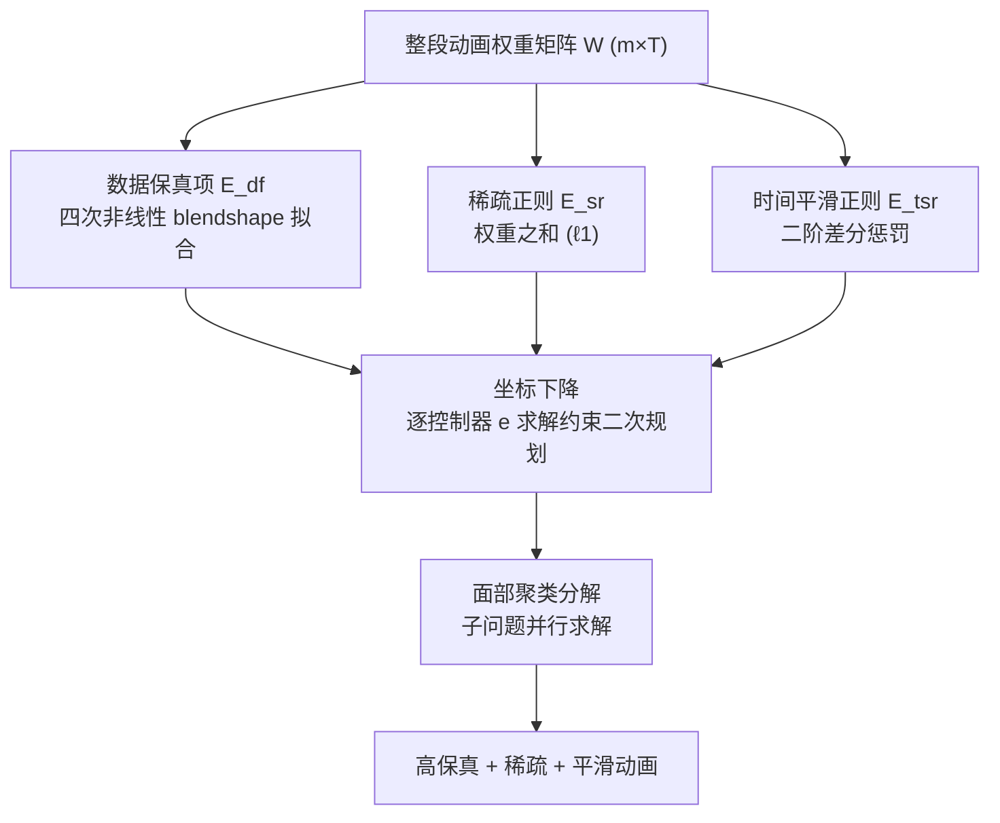

## 一句话总结

面向 blendshape 面部动画的逆向绑定问题，作者在四次(quartic)非线性 blendshape 模型上同时引入稀疏正则与时间平滑正则，并把整段动画序列解耦成可并行求解的优化问题，从而在网格保真度、权重稀疏性与帧间平滑度三者之间取得平衡。

## 研究背景

Blendshape 是面部动画中最主流的建模方式：一张中性网格 $$b_0$$ 通过一组预定义 blendshape 向量的线性组合来产生各种表情。线性模型为

$$f_L(w; B) = b_0 + Bw$$

但现代工业级绑定(如 Metahuman)会加入多层非线性修正项以提升真实感。带三级修正的四次 blendshape 函数为

$$f_Q(w) = Bw + \sum_{\{i,j\}\in P} w_i w_j b_{\{ij\}} + \sum_{\{i,j,k\}\in T} w_i w_j w_k b_{\{ijk\}} + \sum_{\{i,j,k,l\}\in Q} w_i w_j w_k w_l b_{\{ijkl\}}$$

逆向绑定问题即：给定目标网格 $$\hat{b}$$，求解一组权重 $$w$$ 使模型输出逼近目标。已有工作存在明显割裂：一类(如 Quartic)用非线性修正项换取高保真，但逐帧独立求解、忽略帧间连续性；另一类(如 Linear Smooth)加入时间平滑正则，却只能用线性模型、难以刻画复杂表情，且其 $$\ell_2$$ 正则无法带来真正的稀疏。作者的目标是把"高保真非线性模型 + 稀疏 + 时间平滑"整合进单一框架。

## 方法

整体框架把整段 $$T$$ 帧动画的权重堆叠为矩阵 $$W = [w^{(1)}, \dots, w^{(T)}] \in \mathbb{R}^{m \times T}$$，并将目标网格堆叠为 $$\hat{B}$$。总目标函数由三项组成：

$$\underset{0 \le W \le 1}{\text{minimize}} \; E_{df} + \alpha E_{sr} + \beta E_{tsr}$$

关键设计一：数据保真项。以 Frobenius 范数度量整段序列的网格误差

$$E_{df} = \frac{1}{n}\lVert f(W) - \hat{B}\rVert_F^2$$

针对单个控制器 $$e$$ 沿时间维展开，可整理为二次型 $$E_{df} = \frac{1}{n} W_e^T \Phi W_e + \frac{2}{n} W_e^T \Theta$$，其中 $$\Phi$$、$$\Theta$$ 编码了该控制器与其它控制器在各级修正项中的交互。

关键设计二：稀疏正则。利用权重非负这一约束，直接用权重之和作为 $$\ell_1$$ 型稀疏项

$$E_{sr} = \frac{1}{m}\sum_{i=1}^{m}\sum_{t=1}^{T} w_i^{(t)} = \frac{1}{m}\mathbf{1}^T W \mathbf{1}$$

促使每帧只激活尽可能少的 blendshape，便于动画师后续手工调整。

关键设计三：时间平滑正则(roughness penalty)。惩罚相邻三帧权重的二阶差分

$$E_{tsr} = \sum_{t=1}^{T-2}\sum_{i=1}^{m} \lvert w_i^{(t)} - 2 w_i^{(t+1)} + w_i^{(t+2)}\rvert^2 = \sum_i W_i^T F W_i$$

其中 $$F$$ 是一个五对角(pentadiagonal)矩阵，用于抑制权重轨迹的突变。这一项让"整段序列联合优化"成为可能，正是本文与逐帧方法的本质区别。

关键设计四：最终按控制器逐个求解，把非凸问题解耦成约束二次规划

$$\underset{0 \le W_e \le 1}{\text{minimize}} \; W_e^T\!\left(\tfrac{1}{n}\Phi + \beta F\right) W_e + 2 W_e^T\!\left(\tfrac{1}{n}\Theta + \tfrac{\alpha}{2m}\mathbf{1}\right)$$

用坐标下降求解，保证代价单调不增；更新顺序按 blendshape 对网格的整体形变幅度排序，先定大动作再修细节，契合动画师直觉。此外引入面部聚类(RSJD / RSJDA)把整脸分解为若干"网格片—控制器"子问题并行求解，进一步降低计算量。

## 实验结果

在 Metahuman 角色 Jesse 上评测($$m=80$$ 个基础 blendshape、400+ 修正项，$$n=10000$$ 顶点，训练 80 帧 / 测试 100 帧)。测试集平均指标如下(本文方法为 Quartic Smooth)：

| 方法 | Max 网格误差 | Mean 网格误差 | 基数(激活数) | ℓ1 范数 | 粗糙度惩罚 | 执行时间(s) |
|------|------|------|------|------|------|------|
| Quartic Smooth (本文) | .101 | .019 | 56.3 | 9.431 | 7.2e−5 | 2.16 |
| Linear Smooth | .257 | .051 | 68.6 | 9.649 | 4.2e−4 | 0.02 |
| Quartic | .086 | .016 | 49.7 | 9.818 | 1.1e−3 | 14.4 |
| Clustered RSJD 29 | .387 | .093 | 58.2 | 8.695 | 2.8e−4 | 0.15 |
| Clustered RSJDA 13 | .433 | .115 | 54.0 | 5.500 | 1.5e−4 | 0.44 |

解读：Quartic 在网格误差上最优(.086/.016)但粗糙度最高(1.1e−3)且最慢(14.4s)；Linear Smooth 最快(0.02s)但精度与平滑度均较差。Quartic Smooth 取得最低的粗糙度惩罚(7.2e−5)，即帧间过渡最平滑，同时网格误差接近 Quartic，并借助可并行结构把执行时间压到 2.16s(约为 Quartic 的 1/7)。聚类版本(RSJD/RSJDA)进一步加速,但以更高的网格误差为代价。

## 亮点与局限

亮点：
- 首次把高阶非线性修正项、稀疏正则、时间平滑正则统一到一个可解框架中，兼顾保真度、稀疏性与平滑度三个常被割裂处理的目标。
- 时间解耦让整段序列可联合优化，而非逐帧独立求解，天然得到平滑轨迹。
- 坐标下降 + 面部聚类的并行策略在保持高精度的同时显著降低执行时间。

局限：
- 仅在单个 Metahuman 角色(Jesse)上验证,泛化性与跨角色鲁棒性未充分展示。
- 与纯逐帧的 Quartic 相比,平滑与效率的收益是以略微牺牲网格误差换来的。
- 属于 model-based 方法,依赖已有的高质量 blendshape 基与修正项,不涉及 blendshape 本身的构建。

## 延伸思考

- 时间平滑用的是二阶差分(加速度)惩罚,若换成更高阶或自适应窗口,是否能在快速表情(如眨眼、爆破音口型)与平滑之间取得更好折中?
- 稀疏项利用了权重非负从而用简单求和近似 $$\ell_0$$,这一技巧对其它带非负约束的组合优化问题(如混合系数估计)也有借鉴意义。
- 聚类分解引入的并行性提示:面部逆向绑定本质上是局部性很强的问题,是否可以与数据驱动/神经网络方法结合,用学习到的聚类或先验进一步加速?
- 该框架对修正项级别是可调的(从线性到四次),在实时场景中可根据算力预算动态选择模型复杂度,值得在交互式绑定工具中探索。
