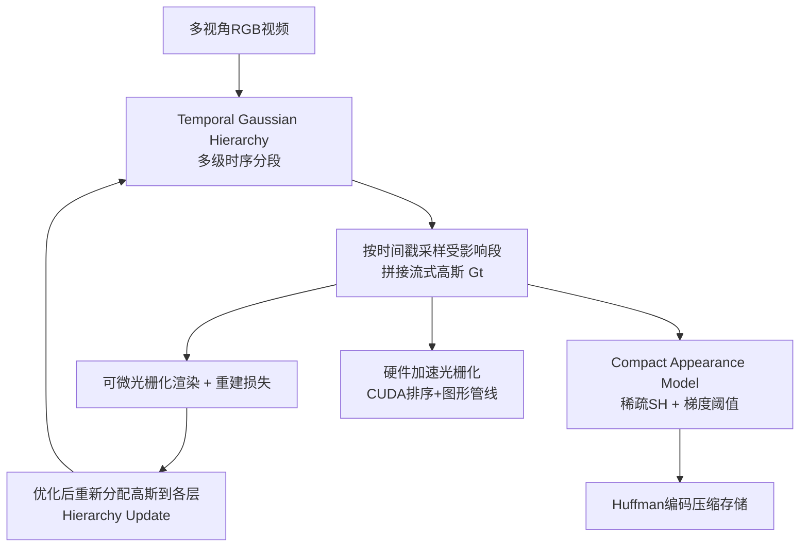

## 一句话总结

提出 Temporal Gaussian Hierarchy（时序高斯层级）这一新的 4D 表示，通过按运动快慢分层复用 4D 高斯基元，使长达十余分钟（18000 帧）体积视频的训练与渲染显存、存储近乎与视频长度无关，同时保持实时高质量渲染。

## 研究背景

体积视频（volumetric video）从多视角捕捉动态场景，支持自由视点合成，是 AR/VR、游戏、远程呈现等场景的关键能力。传统方案依赖定制硬件与复杂棚拍，可及性差；而基于神经渲染的方法虽能做到照片级动态视图合成，却各有瓶颈：

- 早期用带时间嵌入的神经辐射场，模型虽小但表达力弱、渲染慢（每帧数秒到数分钟）。
- 近期用特征网格或点云序列等更强的 4D 表示提升质量与效率，但通常只能处理 1~2 秒的短片段。
- 以 4DGS 为代表的 4D 高斯方法在渲染某一时刻时需要加载全时段的所有高斯基元，显存极易爆掉；应用到 1~10 分钟长视频时模型规模巨大，存储与训练成本随时长线性膨胀。

作者的关键观察是：动态场景中不同区域的变化速度不同，存在不同程度的时序冗余——背景等慢变/静止区域可以在很长时间尺度上共享同一套基元，只有快变区域才需要细粒度的时序描述。据此设计层级化表示来显式利用这种冗余。

## 方法

整体框架分三部分：Temporal Gaussian Hierarchy（时序高斯层级表示，负责几何与运动建模）、Compact Appearance Model（紧凑外观模型，负责压缩存储）、硬件加速光栅化渲染管线（负责实时渲染）。给定多视角视频，系统重建出紧凑、可实时回放的 4D 表示。

### 关键设计一：时序高斯层级结构

构建深度为 $$L$$ 的树状层级，每一层由等长时序分段（segment）组成，越深的层分段长度减半。设视频总时长 $$T$$、根层分段长 $$S$$，则第 $$l$$ 层的分段尺度与分段数为：

$$s_l = \frac{S}{2^l}, \quad N_l = \mathrm{ceil}\left(\frac{T}{s_l}\right)$$

并额外附加一个长度为 $$\infty$$ 的全局段来承载静态部分。每个分段内存放一组 4D 高斯（4D 均值 $$\boldsymbol{\mu}\in\mathbb{R}^4$$、4D 尺度、不透明度、左右四元数等）。4D 高斯的不透明度沿时间服从 $$o_t\sim\mathcal{N}(t;\mu_t,\sigma_t)$$，据此可反解其影响半径与影响区间：

$$r = \sqrt{\frac{\log(o_{th})}{-0.5}\cdot\sigma_t}, \quad \underline{\tau}=\mu_t-r,\ \overline{\tau}=\mu_t+r$$

放置规则保证：慢运动的高斯落入粗层的长分段，快运动的落入细层的短分段，且每个高斯被放进"能容纳其影响半径的最短分段"，从而让表示唯一且冗余最小。

### 关键设计二：高效渲染与恒定显存

由于同一层各分段不重叠，任意时间戳 $$t$$ 在每层只命中一个分段，索引为：

$$n_l^t = \mathrm{floor}\left(\frac{t}{s_l}\right)$$

于是全层共命中 $$L$$ 个分段，定位复杂度仅 $$O(\log N)$$。只需拼接这些被命中段内的高斯得到"流式高斯" $$G_t$$ 即可渲染。整套层级放在内存（RAM）中，只把被命中的段拷入 GPU，因此显存占用几乎与视频长度无关，且拷贝可与渲染并行、不掉速。为避免相邻层同起点导致短影响半径高斯被塞进长分段而被过度采样，引入按下一层分段半长的校正偏移：

$$\overline{\tau}_l = -\frac{S}{2^{l+2}}$$

每步优化后，高斯影响区间会变化，需按更新算法重新分配层级；由于更新以层为单位而非逐段，复杂度保持 $$O(L)$$，而 $$L$$ 与视频时长无关，从而维持恒定显存与迭代速度。

### 关键设计三：紧凑外观模型

标准 SH 每个高斯需 $$3\times(m+1)^2$$ 个外观参数，长视频下存储开销巨大。作者观察到漫反射高斯即便当作视点相关高斯优化，其残差 SH 系数 $$\mathbf{h}$$ 上的梯度幅度也很低。于是采用零初始化 + 梯度阈值策略：

$$g'_h = \begin{cases} g_h, & \|g_h\|_2 \ge g_{th}\ \vee\ \|\mathbf{h}\|_2\neq 0 \\ 0, & \|g_h\|_2 < g_{th}\ \wedge\ \|\mathbf{h}\|_2=0 \end{cases}$$

即只保留少量真正需要视点相关效果的高斯的 SH，其余保持漫反射。当视点相关高斯比例达到 $$\lambda_h$$ 时将阈值置为无穷停止扩张。训练后按漫反射/视点相关分组，使大量零系数聚在一起再做 Huffman 编码，大幅提升压缩比。训练目标为 MSE、SSIM 与感知损失的加权和：

$$\mathcal{L} = \lambda_m\cdot\mathcal{L}_{mse} + \lambda_s\cdot\mathcal{L}_{ssim} + \lambda_p\cdot\mathcal{L}_{perc}$$

渲染端另开发了硬件加速光栅化：GPU 上用基数排序对流式高斯做后到前排序，转成带不透明度阈值的四边形图元交由图形硬件光栅化并做 alpha 混合，较 3DGS 软件光栅化提速约 5 倍。

## 实验结果

在 Neural3DV、ENeRF-Outdoor、MobileStage、CMU-Panoptic 上与 4DGS、4K4D、ENeRF、3DGS、Dy3DGS 对比。基线中带 "*" 者其成本按整段视频求和（因它们只能按 300 帧或单帧分段训练）。下表摘取 Neural3DV（1200 帧）主实验：

| 方法 | PSNR ↑ | SSIM ↑ | LPIPS ↓ | VRAM ↓ | Storage ↓ | Train. ↓ | Render. ↑ |
|------|--------|--------|---------|--------|-----------|----------|-----------|
| Ours | 29.44 | 0.9450 | 0.2144 | 6.1 GB | 0.09 GB | 2.1 h | 550 FPS |
| 4DGS | 28.89 | 0.9521 | 0.1968 | 84 GB* | 2.68 GB* | 10.4 h* | 90 FPS |
| 4K4D | 21.29 | 0.8266 | 0.3715 | 84 GB* | 2.46 GB* | 26.6 h* | 290 FPS |
| ENeRF | 23.48 | 0.8944 | 0.2599 | 23 GB | 0.83 GB | 4.6 h | 5 FPS |
| 3DGS | 28.61 | 0.9498 | 0.2103 | 7200 GB* | 37.5 GB* | 110 h* | 150 FPS |
| Dy3DGS | 25.91 | 0.8809 | 0.2555 | 5.0 GB | 19.5 GB | 37.1 h | 610 FPS |

本方法在质量相当或更优的前提下，显存与存储大幅下降。消融显示：去掉时序层级（w/o TGH）显存从 6.1 GB 升到 9.5 GB、渲染从 550 FPS 降到 278 FPS；去掉紧凑外观模型（w/o App.）存储从 0.09 GB 升到 0.238 GB；去掉硬件光栅化（w/o Rend.）渲染速度降到 138 FPS。在自采长视频数据集 SelfCap 上，6000 帧序列仅需 12.9 GB 显存、0.89 GB 存储、15.3 h 训练、450 FPS 渲染，验证了随时长近乎恒定的开销。相较此前 SOTA 的 4K4D，18000 帧场景显存与存储分别约减少 30 倍与 26 倍。

## 亮点与局限

亮点：
- 用"按运动快慢分层 + 分段复用"的层级结构，把长视频建模的显存/存储成本从随时长线性增长压到近乎恒定，首次实现分钟级体积视频的高效重建与实时渲染。
- 树状结构定位复杂度 $$O(\log N)$$、层级更新 $$O(L)$$，工程上把层级放 RAM、按需拷 GPU，思路简洁且可与渲染并行。
- 紧凑外观模型用梯度阈值区分漫反射/视点相关高斯并配合 Huffman 编码，存储约降至全 SH 的 40% 而质量不降。
- 自研 CUDA 排序 + 图形硬件光栅化管线，较软件光栅化提速约 5 倍，并已开源。

局限：
- 重建本身非实时，长视频仍需数小时训练成 4D 表示。
- 依赖半密集的多视角覆盖，稀疏视角下泛化差；作者计划引入扩散模型的生成先验改善稀疏视角重建。

## 延伸思考

该工作的核心思想是"用层级化时间尺度显式建模时序冗余"，这与视频编码里的 I/P/B 帧、多分辨率金字塔思路一脉相承，只是迁移到了显式 4D 高斯表示上。一个自然延伸是把空间冗余也纳入同一层级（时空联合的自适应细分），或让分段边界自适应于运动事件而非等长划分，可能进一步压缩快变区域之外的基元数量。此外，恒定显存特性使流式加载/播放成为可能，若与训练加速（几何先验、生成先验）结合，有望走向"近实时采集—重建—回放"的完整长体积视频管线。
