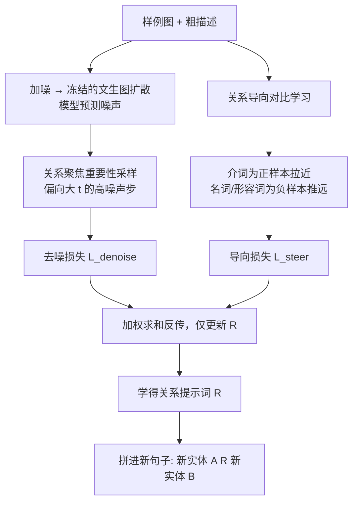

## 一句话总结

给定几张"共享同一种关系"的样例图，ReVersion 能从冻结的文生图扩散模型里反演出一个专门表示这种交互关系的"关系提示词" $$\langle R \rangle$$，之后把它拼进任意文本提示，就能让全新的物体以同样的关系互动。

## 研究背景

文生图扩散模型带火了"反演"这一方向：从几张样例图里学一个新词，用来在生成时复现某个概念。但已有的反演工作几乎都在做**外观反演**——学的是某个物体"长什么样"（颜色、纹理、形状），比如 Textual Inversion、DreamBooth。

真实视觉世界的另一根支柱是**物体之间的关系**（谁坐在谁上面、谁给谁画在墙上、谁和谁背靠背），这一块基本没人碰。作者把它定义成一个新任务:**关系反演（Relation Inversion）**。

核心痛点在于:关系是比外观更抽象的高层概念。外观反演常用的像素级重建损失就够了，因为它只要抓住样例图的共同像素信息；但关系没法靠逐像素对齐来精确提取，只用重建损失优化，学出来的 $$\langle R \rangle$$ 会更多地绑定物体的外观，把样例图里的实体"泄漏"到生成结果里，还会搞错关系本身。

本文的 idea:抓住语言先验和采样先验来引导优化。作者观察到在 Stable Diffusion 的文本嵌入空间里，词按词性（Part-of-Speech）聚类，而"关系"这个概念天然和介词相关（"rides on" 语义上靠近 "atop / above"）。于是把关系提示词往介词簇里"拉"，同时把它从名词、形容词等外观词里"推"开。

## 方法

### 整体框架

任务设定:一组样例图 $$I=\{I_1,...,I_n\}$$，每张图里有两个主要实体 $$E_{i,A}$$、$$E_{i,B}$$，它们通过一个共同关系 $$R$$ 互动。每张图配一句粗描述 $$c_i = E_{i,A}\,\langle R \rangle\,E_{i,B}$$。目标是优化 $$\langle R \rangle$$ 这个文本嵌入，让它精准表达这个共存关系。整个扩散模型权重冻结，只优化 $$\langle R \rangle$$。

### 关键设计一:关系导向对比学习（Relation-Steering Contrastive Learning）

基础目标是用 $$\langle R \rangle$$ 重建样例图（式中 $$c$$ 含 $$\langle r \rangle$$）:

$$\langle R\rangle = \arg\min_{\langle r\rangle}\ \mathbb{E}_{t,x_0,\boldsymbol{\epsilon}}\big[\|\boldsymbol{\epsilon}-\boldsymbol{\epsilon}_\theta(x_t,t,\tau_\theta(c))\|^2\big]$$

但这个像素级重建会让 $$\langle R \rangle$$ 偏向抓外观。为此引入基于 InfoNCE 的导向损失:把一组**基介词**的嵌入作为正样本 $$P_i$$，把当前 batch 文本描述里其他词性（名词、形容词等）的嵌入作为负样本 $$N_i$$，所有嵌入归一化到单位长度:

$$L_{\text{steer}} = -\log\frac{\sum_{l=1}^{L} e^{\langle r\rangle^\top \cdot P_i^l/\gamma}}{\sum_{l=1}^{L} e^{\langle r\rangle^\top \cdot P_i^l/\gamma} + \sum_{m=1}^{M} e^{\langle r\rangle^\top \cdot N_i^m/\gamma}}$$

其中 $$\gamma$$ 是温度系数。直观上就是把 $$\langle R \rangle$$ 拉进介词所在的"关系稠密"子空间，同时推离外观相关语义，从而缓解实体泄漏。

### 关键设计二:关系聚焦重要性采样（Relation-Focal Importance Sampling）

扩散采样过程中，高层语义先出现，细节在后期才显现。既然目标是抓高层关系，就应该少关注低层细节。作者不再像常规做法那样从均匀分布采时间步 $$t$$，而是偏斜采样分布，给较大的 $$t$$（高噪声、决定高层布局的阶段）更高概率:

$$L_{\text{denoise}} = \mathbb{E}_{t\sim f(t),x_0,\boldsymbol{\epsilon}}\big[\|\boldsymbol{\epsilon}-\boldsymbol{\epsilon}_\theta(x_t,t,\tau_\theta(c))\|^2\big],\quad f(t)=\frac{1}{T}\Big(1-\alpha\cos\frac{\pi t}{T}\Big)$$

偏斜程度随 $$\alpha\in(0,1]$$ 增大，实验取 $$\alpha=0.5$$。

总目标是两个损失的加权和:

$$\langle R\rangle = \arg\min_{\langle r\rangle}\ (\lambda_{\text{steer}}L_{\text{steer}} + \lambda_{\text{denoise}}L_{\text{denoise}})$$

### 关键设计三:ReVersion Benchmark

作为该方向第一份工作，作者还建了一个基准:定义十种抽象层次不同的代表性关系（从"在……之上"这类空间关系，到"握手"这类交互，再到"被雕刻成"这类抽象概念），每种关系配 4~10 张含不同实体的样例图，并给每张图标注多个不同详细程度的文本模板用于优化。评测时为每种关系设计 100 个推理模板，共 1000 个用于衡量鲁棒性。

## 实验结果

在 Stable Diffusion 1.5 上、512×512 分辨率，用客观指标（关系分 Relation Score、实体分 Entity Score）与 Textual Inversion、DreamBooth 以及直接文生图对比:

| 方法 | Relation Score ↑ | Entity Score ↑ |
|---|---|---|
| Text-to-Image (Stable Diffusion) | 0.3516 | 0.2896 |
| Textual Inversion | 0.3785 | 0.2679 |
| DreamBooth | 0.3576 | 0.2902 |
| **本文 ReVersion** | **0.3817** | 0.2820 |

ReVersion 在关系分上领先所有基线，实体分处于同一梯队（略低于直接文生图与 DreamBooth，但这两者关系分明显更差，说明它们靠实体先验作弊而没真正学到关系）。在人类偏好评测中，用户在关系准确度、实体准确度、整体质量三项上分别以约 69%、65%、66% 的投票偏好本文结果，大幅超过各基线。消融实验也显示:去掉关系导向或去掉重要性采样都会带来明显性能下降，二者都必要。

## 亮点与局限

亮点:
- 提出了一个此前无人探索的新任务，把关系建模从"判别式、封闭集分类"转成"生成式、开放世界反演"。
- 巧妙利用文本嵌入空间的词性聚类这一语言先验，用介词正样本 + 其他词性负样本的对比学习，干净地把关系与外观解耦，直击实体泄漏这一核心难题。
- 结合扩散采样"先高层后细节"的特性做重要性采样，让优化聚焦高层交互。
- 配套 benchmark 让新任务可复现、可比较。

局限:
- 每张样例图仍假设为两个主要实体的成对关系，对多实体、复杂多元关系的扩展没有展开。
- 依赖冻结的 Stable Diffusion 1.5，能反演的关系上限受制于底模的表达能力与其对介词语义的理解。
- 需要人工提供粗描述（区分实体与关系占位符），并非完全无监督。

## 延伸思考

把"概念反演"从名词（外观）推广到介词/动词（关系），本质是在文本嵌入空间里按词性做定向操控——这提示我们，嵌入空间的结构化先验本身就是可利用的强约束。沿这条线，可以想象进一步反演"属性变化""动作过程""风格关系"等更多非名词概念。关系反演的输出天然是可组合的关系图元件，若能与场景图生成、少样本学习结合，或许能构建"从少量示例学会一套可复用交互语法"的生成系统。此外，用采样分布偏斜来控制模型关注的语义层级，是个通用且低成本的技巧，值得迁移到其他需要区分高低层信息的扩散任务上。
