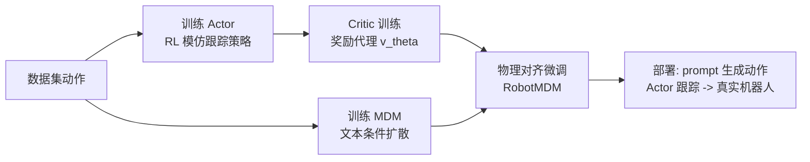

## 一句话总结

本文提出 RobotMDM，通过训练一个可微的"奖励代理"（critic）来预测下游跟踪控制器对某段动作的执行表现，并用它微调文本条件的运动扩散模型，使生成的动作在保持多样性与语义准确的同时满足物理可行性，最终能部署到真实的人形机器人上。

## 研究背景

近年来文本驱动的生成式运动模型已能合成生动多样的人体动作，但这些纯运动学（kinematic）方法生成的动作往往不满足物理约束，出现漂浮、脚步滑动、自穿插、关节超限、动态失衡等瑕疵，难以在真实世界部署。虽然已有鲁棒的运动跟踪控制器，但跟踪结果的质量根本上受限于所提供参考动作的质量。

一个自然的思路是直接评估受控角色在生成动作上的表现，但这需要长时程仿真，计算昂贵且不可微；即便有可微仿真，铰接刚体系统与接触动力学的强非线性也会导致梯度性质极差。因此作者需要一种既可微又高效的方式，把运动学生成模型的输出与"用物理角色跟踪这段动作"这一下游任务对齐。

作者借鉴人类反馈强化学习（RLHF）的思路，把评价动作可行性的问题转化为学习一个奖励代理，从而为微调生成模型提供可微的损失信号。与直接用强化学习训练生成式控制器（受限于浅层 MLP、难以扩展到大数据集）不同，本文将"生成动作"与"跟踪动作"解耦，使得可以使用更先进的网络与专门的训练策略，直接扩展到更大规模数据集。

## 方法

整体框架分三个阶段：先在数据集上分别训练一个基于强化学习的模仿跟踪策略（Actor，采用 VMP 策略）和一个文本条件的运动扩散模型（MDM 基线）；然后训练一个 critic 作为奖励代理来评估 Actor 的跟踪表现；再用该 critic 作为附加损失微调 MDM，得到物理对齐的 RobotMDM；部署时把 RobotMDM 的输出送入跟踪控制器执行。

**动作表示。** 时长为 $$n$$ 的动作用 $$n \times (7 + 2j)$$ 矩阵 $$M$$ 编码（$$j$$ 为关节数），包含根部高度、根部线速度（$$xy$$ 平面）、根部角速度（绕 $$z$$ 轴）、根部三维姿态，以及各关节位置与速度。数据归一化到角色的局部朝向坐标系，使每帧与其全局绝对位置和朝向解耦，从而更高效地利用数据。$$m_t$$ 是 $$M$$ 中对应单帧或运动窗口的行子集。

**Critic（奖励代理）训练。** 冻结已训练好的 Actor 参数后，在同一环境中学习一个函数来预测：给定当前动作参考，Actor 能获得的期望折扣累积奖励

$$v(m) = \mathbb{E}\left[\sum_{t=0}^{\infty} \gamma^t r_t \;\middle|\; m_0 = m, \pi\right],$$

其中期望在状态-动作轨迹与未来动作参考上取，$$\gamma \in [0,1]$$ 是折扣因子。它与 RL 中的值函数 $$v_{RL}(s,m)$$ 密切相关，区别在于 critic 不访问角色当前状态 $$s$$，因此可理解为对状态分布求平均后的值函数，从而在运动学动作与期望奖励之间建立起可微的桥梁。训练采用 PPO 中的做法，用截断的广义优势估计（GAE，即截断 TD($$\lambda$$)）计算值函数目标

$$\hat{v}_t = v^\theta_t + \sum_{t'=t}^{T-1} (\gamma\lambda)^{(t'-t)} \delta_{t'}, \qquad \delta_t = r_t + \gamma v^\theta_{t+1} - v^\theta_t,$$

并以平方损失 $$\min_\theta \sum \lVert \hat{v}_t - v^\theta_t \rVert_2^2$$ 更新 critic 参数。

**物理对齐（RobotMDM 微调）。** 基线扩散模型学习逆向去噪过程，用参数化函数预测干净动作，损失为

$$\mathcal{L}_{MDM} = \lVert M_0 - p_\phi(M_d, d, c) \rVert_2^2,$$

其中 $$c$$ 为文本提示等条件。给定预训练 MDM 与 critic，作者用冻结参数的 critic 评估生成动作的期望表现，并把它作为附加损失微调扩散模型

$$\mathcal{L}_{RobotMDM} = \mathcal{L}_{MDM} - \beta \sum_{t=0}^{|M|} v_\theta(m_t).$$

保留标准 MDM 损失以保证生成动作贴合数据分布与文本条件，同时用 critic 值之和的负项引导动作朝更可行、更容易被策略准确跟踪的方向调整。关键在于：critic 提供了下游不可微跟踪任务的可微、高效替代，且推理时相比 PhysDiff 不增加任何额外计算开销（无需运行时仿真投影）。

**边缘化 critic 的复用。** 作者指出这种"仅基于上下文而非当前状态"的边缘化 critic 原本用于 RL 中构造过采样欠佳场景的课程，本文首次将其作为第二个学习问题（微调生成模型）中的损失函数使用。

## 实验结果

在 HumanML3D 的 AMASS 文本标注子集上，将动作重定向到一个 20 自由度、身高 0.84 m、质量 16.2 kg 的双足机器人（腿部用 Unitree A1 执行器，颈臂用 Dynamixel 执行器）。运动学生成质量与可行性对比如下（其中 Realism 为 critic 累积值，越高表示越可行；PhysDiff 使用无外力控制器做单步投影）：

| 方法 | R-Precision top3 ↑ | FID ↓ | MultiModal Dist ↓ | Diversity → | Multi-modality ↑ | Realism ↑ |
|------|------|------|------|------|------|------|
| Dataset | 0.696 | 0.002 | 3.799 | 8.958 | - | 6.774 |
| MDM-1K | 0.675 | 0.688 | 3.840 | 8.952 | 2.355 | 8.392 |
| MDM | 0.680 | 0.415 | 3.831 | 9.074 | 2.068 | 8.730 |
| PhysDiff (1-step) | 0.482 | 10.401 | 5.500 | 6.546 | 1.890 | 8.951 |
| RobotMDM (ours) | 0.684 | 0.472 | 3.835 | 9.170 | 2.087 | 9.562 |

RobotMDM 在显著提升 Realism 的同时，其余质量与多样性指标与 MDM 基本持平；而 PhysDiff 虽小幅提升可行性，但因投影依赖控制器跟踪精度，导致其余指标大幅退化。

物理跟踪方面，对每种方法生成的动作用 2048 次 30 秒仿真评估跟踪误差：

| 输入 | 线速度 [m/s] | 角速度 [rad/s] | 根部旋转 [°] | 上肢 DoFs [°] | 下肢 DoFs [°] |
|------|------|------|------|------|------|
| MDM | 4.90 | 0.29 | 4.13 | 10.88 | 16.11 |
| RobotMDM | 3.43 | 0.23 | 2.34 | 9.36 | 11.44 |

RobotMDM 生成的动作被跟踪得更准，尤其下肢姿态，根部旋转误差近乎减半。定性上，RobotMDM 会把过强的高踢腿调节为更平衡的踢腿、把"空中坐下"改为可行的下蹲、并自然规避头臂自碰撞。真实机器人上也能准确执行如"右勾拳""侧向潜行下蹲""举哑铃过头"等富有表现力的动作，而 MDM 动作常导致机器人失衡。

## 亮点与局限

亮点：把不可微、昂贵的长时程仿真评估，转化为一个可微、廉价的 critic 奖励代理，为微调生成模型提供了干净的损失信号；将生成与跟踪解耦，使方法能沿用先进网络并扩展到大数据集；推理时零额外开销；并真实部署到人形机器人验证。

局限：方法对动作可行性没有硬约束，当提示明显超出角色物理能力时（如让机器人"游泳"），为变得可行会大幅改动动作，从而与原文本产生冲突，无法保证在性能关键场景下的可靠性；此外仍依赖需从人体数据重定向的角色专属数据集，无法覆盖机器人硬件的全部表现力。

## 延伸思考

本文的核心洞见——用一个"边缘化 critic"把下游不可微目标蒸馏为可微损失来对齐生成模型——本质上是一种领域特定的对齐/RLHF 变体，具有超出运动生成的一般性，理论上可迁移到任何"生成器 + 不可微评估器"的组合。作者也指出的一个有前景方向是迭代式协同改进：用物理感知生成器产出大规模合成数据反哺跟踪策略，再用更强策略训练更好的 critic，形成生成与控制互相增强的闭环，逐步弥合运动学与物理方法之间的差距。
