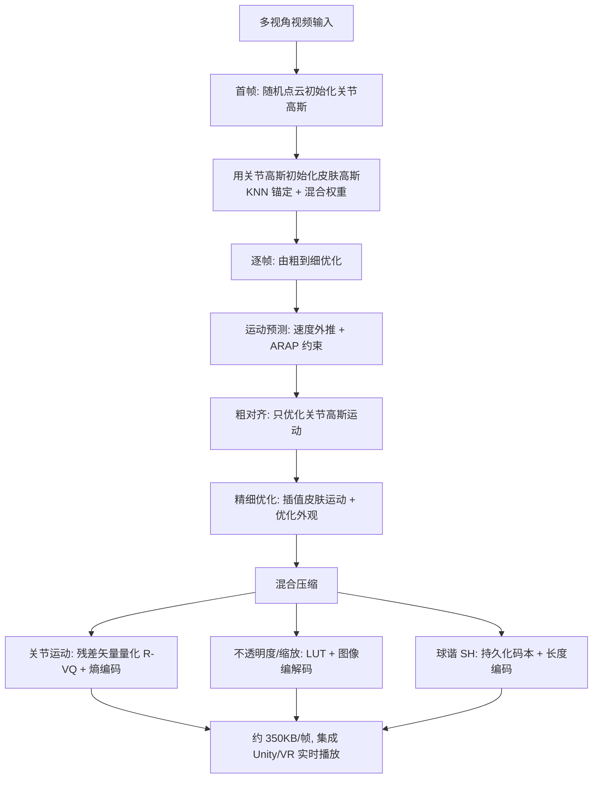

## 一句话总结

DualGS 用"关节高斯 + 皮肤高斯"的双层高斯表示，把人体表演的运动与外观显式解耦，配合由粗到细的逐帧优化和面向运动/外观的混合压缩策略，实现了对复杂人体表演的鲁棒跟踪、高保真渲染，以及高达 120 倍的压缩率（约 350KB/帧），可无缝集成进 VR 头显进行沉浸式实时播放。

## 研究背景

体积视频（volumetric video）赋予观众六自由度的沉浸式观看体验，是连接数字世界与现实世界的重要媒介。但当前以人为中心的体积视频制作仍存在两大痛点：

- **依赖显式网格重建与跟踪**：主流工作流需要重建并跟踪带纹理网格，容易受遮挡影响产生空洞和噪声，且需要大量算力与美术师手工清理。
- **资产体积过大**：生成的体积资产往往过大，难以存储并集成到 VR 头显等低端设备中，阻碍了广泛落地。

3D Gaussian Splatting（3DGS）以显式高斯核实现了高帧率高保真渲染，催生了众多动态变体。但已有动态方法要么用 MLP 建模时序相关性、牺牲了 3DGS 显式且 GPU 友好的特性，要么对快速运动缺乏鲁棒性，且存储需求依然巨大。作者据此提出 DualGS，用双高斯表示同时解决鲁棒跟踪、高保真渲染与高效压缩三个目标。

## 方法

整体框架：受 SMPL 模型"少量关节插值驱动皮肤顶点"的启发，DualGS 用一小组**运动感知的关节高斯**（约 15,000 个）捕捉全局运动，用一大组**外观感知的皮肤高斯**（约 180,000 个）表达视觉细节。先在首帧初始化并建立两者的锚定关系，然后对后续帧采用由粗到细的优化策略，最后对运动与外观分别做混合压缩，集成进 CG 引擎与 VR 设备。

### 关键设计一：双高斯表示与初始化

高斯属性被分为两类：运动感知参数（位置 $$p$$、旋转 $$q$$）与外观感知参数（球谐 $$C$$、不透明度 $$\sigma$$、缩放 $$s$$）。先在首帧用均匀随机初始化训练关节高斯，在 15,000 次迭代前做致密化与剪枝并下采样固定到约 15,000 个。为避免关节高斯过于"细长"或过大造成局部过重建，引入各向同性约束与尺寸约束：

$$E_{iso} = \frac{1}{N}\sum_{i=1}^{N} \mathrm{ReLU}\big(e^{max(s_i)-min(s_i)} - r\big)$$

$$E_{size} = \sum_{i=1}^{N} \mathrm{ReLU}\Big(s_i - \alpha \frac{1}{N}\sum_{i=1}^{N} sg[s_i]\Big)$$

其中 $$sg$$ 为停止梯度算子。随后用关节高斯初始化皮肤高斯，并将每个皮肤高斯锚定到 k 近邻（$$k=8$$）关节高斯，混合权重按距离高斯衰减定义：

$$w\big(p_i^{s}, p_k^{j}\big) = \exp\Big(-\lVert p_i^{s} - p_k^{j}\rVert_2^{2} / l^{2}\Big)$$

该 KNN 图与权重在初始化后固定，贯穿整个序列优化，既保证时空一致性又避免额外存储。

### 关键设计二：由粗到细的逐帧优化

作者观察到高斯倾向于"改外观"而非"移位置"来拟合光度损失，因此把优化拆成两阶段。**粗对齐**阶段固定颜色/不透明度/缩放，只微调关节高斯运动，用局部尽量刚性（ARAP）平滑正则约束相邻关节的相对运动：

$$E_{smooth} = \sum_{i}\sum_{k\in N(i)} w_{i,k}\big\lVert R\big(q_{i,t}^{j}\,{q_{i,t-1}^{j}}^{-1}\big)\big(p_{k,t-1}^{j}-p_{i,t-1}^{j}\big) - \big(p_{k,t}^{j}-p_{i,t}^{j}\big)\big\rVert_2^{2}$$

同时维护每个高斯的速度属性，用最近两帧的位置变化做加权外推来初始化新帧运动（运动预测模块），再用 ARAP 约束抑制不合理运动。**精细优化**阶段则由关节运动插值出皮肤高斯的位姿：

$$p_{i,t}^{s} = \sum_{k\in N(p_{i,1}^{s})} w\big(p_{i,1}^{s}, p_{k,1}^{j}\big)\big(R(q_{k,t}^{j})\,p_{i,1}^{s} + p_{k,t}^{j}\big)$$

梯度沿计算图从皮肤高斯回传到关节高斯。并加入时序正则约束外观属性在相邻帧不剧烈突变，为后续压缩创造条件：

$$E_{temp} = \sum_{a\in\{C,\sigma,s\}} \lambda_a \lVert a_{i,t} - a_{i,t-1}\rVert_2^{2}$$

### 关键设计三：面向解耦的混合压缩

得益于运动/外观的显式解耦，作者对两类高斯分别压缩（每 50 帧为一段）：

- **关节运动**：对位置和旋转采用残差矢量量化（R-VQ），保留段首帧、按时序量化残差，避免误差累积，再配合 RANS 熵编码做无损压缩：

$$R_{i,t} = Q\Big(p_{i,t}^{j} - \big(R_{i,1} + \sum_{k=2}^{t-1} Q^{-1}(R_{i,k})\big)\Big),\quad t>1$$

- **不透明度与缩放**：排成 2D 查找表（LUT，高为高斯数、宽为段帧长），按行均值排序增强一致性，用 WebP/JPEG 图像编解码压成 8-bit 图。
- **球谐 SH**（占 59 个参数中的 48 个，是存储大头）：对各阶 SH 系数做 K-Means 聚类得到长度 $$L=8192$$ 的**持久化码本**，把 SH 编码为索引：

$$\tau_{i,t}^{d} = \arg\min_{k\in\{1,...,L\}} \lVert Z^{d}[k] - C_{i,t}^{d}\rVert_2^{2}$$

由于相邻帧平均只有约 1% 的 SH 索引变化，只需保存首帧索引与后续变化位置的四元组 $$(t,d,i,k)$$ 并做长度编码，SH 单项可达约 360 倍压缩。

## 实验结果

采集系统为 81 台 Z-CAM 电影机、3840×2160@30fps；数据集含 8 位演奏者演奏中西乐器（小提琴、吉他、钢琴、笛、琵琶、古筝等）。在自采数据集上与 SOTA 动态渲染方法对比（每方法 3 段、每段 200 帧），单卡 RTX 3090 每帧处理约 12 分钟，4K 渲染 77fps。

| 方法 | PSNR↑ | SSIM↑ | LPIPS↓ | VMAF↑ | 存储(MB/帧)↓ |
|------|------|------|------|------|------|
| HumanRF | 29.701 | 0.969 | 0.0461 | 79.171 | 7.566 |
| NeuS2 | 29.417 | 0.970 | 0.0593 | 77.912 | 24.163 |
| Spacetime Gaussian | 29.532 | 0.964 | 0.0362 | 70.923 | 0.846 |
| HiFi4G | 33.503 | 0.988 | 0.0239 | 84.737 | 1.581 |
| Ours（压缩前） | 35.577 | 0.990 | 0.0196 | 86.504 | 42.020 |
| Ours（压缩后） | 35.243 | 0.989 | 0.0221 | 86.171 | 0.323 |

- 在渲染质量（PSNR/SSIM/LPIPS）与时序一致性（VMAF）上均领先对比方法；压缩后每帧仅约 0.323MB（约 350KB），压缩带来的质量损失极小。
- 与静态压缩方法对比（Tab. 2）：Ours 存储 0.323MB/帧对应约 122.76 倍压缩，远高于 Compact-3DGS（6.38×）与 C3DGS（20.11×），且运行时间更短（12m12s）、质量相当。
- 消融显示：去掉速度预测会在快速运动下跟踪不准；去掉关节高斯会产生严重伪影并丢失时序一致性；去掉粗对齐或精细优化都会导致伪影或不自然结果。码本大小实验表明超过 8192 后压缩收益甚微而存储显著上升。

## 亮点与局限

亮点：
- 用"关节高斯 + 皮肤高斯"显式解耦运动与外观，天然减少运动冗余、增强时序一致性，且直接为压缩铺路，是表示与压缩协同设计的范例。
- 由粗到细策略 + 运动预测，解决了高斯"重外观轻位移"的退化问题，对快速/复杂运动（如挥双节棍、演奏、舞蹈）鲁棒。
- 混合压缩针对不同属性各取所长（运动用 R-VQ、不透明度/缩放用图像编解码、SH 用持久化码本），达到 120 倍压缩仍保持高保真，并落地 Unity 插件与移动端 Vulkan 播放器。

局限：
- 依赖基于图像的前景分割，对琴弦、发丝等细长物体易分割出错，影响细节跟踪。
- 训练仍较慢（每帧约 12 分钟），瓶颈在粗对齐与精细优化；180,000 皮肤高斯存在冗余。
- 初始化后固定关节-皮肤 KNN 关系，牺牲了处理拓扑变化的能力。
- 不支持可驱动化身/动作迁移等下游任务，且缺乏几何/法线信息无法重光照。

## 延伸思考

- 关节-皮肤的固定 KNN 绑定限制了拓扑变化处理，结合动态图与关键帧策略或可在保持时序一致性的同时支持开合、增删物体等场景。
- 持久化码本利用了"SH 索引跨帧仅约 1% 变化"的时序冗余，这一思路能否推广到其他高维时序属性（甚至动态场景 GS 的通用属性流）值得探索。
- 显式解耦的双高斯若能进一步标注语义并接入文本/音乐/骨骼等多模态驱动，有望从"回放"走向"可驱动、可重演"的 4D 资产。
- 与 LightGaussian 等剪枝方法正交叠加，可能在不掉质量的前提下同时压缩存储与加速渲染。
