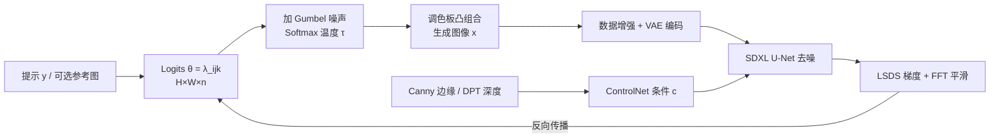

## 一句话总结

SD-πXL 用分数蒸馏（SDS）驱动一个可微的量化图像生成器，把文本提示（可选参考图）转成任意分辨率、严格限定调色板的像素艺术，并可直接用于刺绣、拼豆、乐高等受色数/单元约束的手工制造。

## 研究背景

像素艺术这类低分辨率、量化图像在游戏、设计与手工制造中广泛复兴，但从原始输入自动生成高质量像素艺术仍很困难，通常需要大量手工介入，且缺乏合适的大规模开放数据集，常见数据增强（旋转、抖色、模糊）反而会破坏像素风格。

作者提出一个好的像素艺术生成方法应满足四条性质：

- 硬约束：严格遵守预定义的调色板等约束。
- 分辨率无关：能生成任意分辨率、无抗锯齿的清晰图像。
- 灵活的生成与条件控制：能基于提示或图像生成，并可调节语义与几何条件。
- 风格无关：能适配不同风格（如把写实输入转成刺绣输出）。

现有方法都不能同时满足这些要求：经典与神经像素化方法缺乏语义条件、且不严格遵循调色板；直接用扩散模型（提示工程、LoRA 微调或已有分数蒸馏如 VectorFusion）无法强制约束分辨率与调色板。SD-πXL 的目标就是在这些约束内利用预训练扩散模型完成生成。

## 方法

整体框架：用一个可微生成器参数化输出图像，用预训练的 SDXL 潜空间扩散模型通过分数蒸馏提供语义感知梯度来优化这些参数；可选地用输入图像做初始化与空间条件（ControlNet），并加一项频域平滑损失。

### 可微的量化图像生成器

要用 $$n$$ 个调色板元素 $$C=\{c_k\}$$ 合成尺寸 $$(H,W)$$ 的图像，用张量 $$\theta=\lambda_{i,j,k}\in\mathbb{R}^{H\times W\times n}$$ 作为每个像素取各类别的 logits。每像素取 $$c_k$$ 的概率为

$$\pi_{i,j,k}=\dfrac{e^{\lambda_{i,j,k}}}{\sum_{l=0}^{n-1}e^{\lambda_{i,j,l}}}.$$

最终有两种出图方式：argmax 生成严格落在调色板上（$$x_{i,j}=c_{\tilde{k}_{i,j}},\ \tilde{k}_{i,j}=\arg\max_k \lambda_{i,j,k}$$），满足硬约束；softmax 生成用 $$\pi_{i,j,k}$$ 做凸组合 $$x_{i,j}=\sum_k \pi_{i,j,k}c_k$$，颜色落在调色板凸包内，像素效果更柔和。

### Gumbel-softmax 随机优化产生清晰像素

关键设计是训练期引入 Gumbel-softmax 重参数化：对每个 logit 加独立 Gumbel 噪声 $$y_{i,j,k}=\lambda_{i,j,k}+G_{i,j,k}$$，再做带温度的 softmax

$$s_{i,j,k}(\tau)=\dfrac{e^{\frac{1}{\tau}y_{i,j,k}}}{\sum_{l=0}^{n-1}e^{\frac{1}{\tau}y_{i,j,l}}},$$

输出 $$x_{i,j}(\tau)=\sum_k s_{i,j,k}(\tau)c_k$$。这让采样近似类别分布同时保持可反向传播（实践取 $$\tau=1$$）。作者用逐像素归一化熵 $$\bar{H}(\pi_{i,j})=\frac{1}{\log n}\big(-\sum_k \pi_{i,j,k}\log \pi_{i,j,k}\big)$$ 分析：随机采样引入的噪声被 SDS 损失"抵消"，从而促使 logits 强烈分化、熵下降，最终 argmax 出图更清晰锐利。相反，去掉 Gumbel 的确定性优化把 $$\pi$$ 当凸组合系数，虽利于 softmax 风格化出图，却损害 argmax 图的可读性。

### 条件控制与损失

初始化：把参考图下采样到 $$(H,W)$$ 得 $$\tilde{x}_d$$，令 $$\lambda_{i,j,k}=-\lVert \tilde{x}^d_{i,j}-c_k\rVert$$；无调色板时用 K-means 聚类得到 $$n$$ 个中心。空间条件用 ControlNet，分别以 Canny 边缘与 DPT 深度图约束扩散，条件记为 $$c=\{\tilde{x}_{\text{Canny}},\tilde{x}_{\text{depth}}\}$$，权重可调节对输入布局的忠实度。

针对潜空间扩散的 LSDS 损失可分解为噪声消减项与语义项：

$$\nabla_\theta\mathcal{L}_{\text{LSDS}}=\nabla_\theta\mathcal{L}_{\text{Noise}}+s\,\nabla_\theta\mathcal{L}_{\text{Sem}},$$

其中语义项由 classifier-free guidance 的条件/无条件预测之差给出，噪声消减项在此处起到去噪的正面作用（与 3D 生成中常见的干扰角色相反）。再加一项 FFT 平滑损失（对灰度图做 FFT、中心化后用掩码 $$M$$ 屏蔽低频、取绝对值均值）：

$$\mathcal{L}_{\text{FFT}}=\dfrac{\lVert \text{Shift}(\text{FFT}(x))\odot M\rVert_1}{\lVert M\rVert_1}.$$

总梯度为 $$\nabla_\theta\mathcal{L}=\nabla_\theta\mathcal{L}_{\text{Noise}}+s\,\nabla_\theta\mathcal{L}_{\text{Sem}}+w_{\text{FFT}}\,\nabla_\theta\mathcal{L}_{\text{FFT}}$$，实践取 $$s=40$$、$$w_{\text{FFT}}=20$$。

## 实验结果

在与 Pixelated Image Abstraction (PIA)、VectorFusion (VF) 的感知研究中（56 名参与者对 45 张图按语义、忠实度、美学排名，下表为各名次占比 %）：

| 方法 | 语义 R1 | 语义 R4 | 忠实度 R1 | 忠实度 R4 | 美学 R1 | 美学 R4 |
|------|--------|--------|-----------|-----------|--------|--------|
| PIA | 24.6 | 21.2 | 49.3 | 1.8 | 25.5 | 15.5 |
| VectorFusion | 22.0 | 46.9 | 0.8 | 90.4 | 17.5 | 50.8 |
| Ours-K-means | 36.2 | 4.2 | 47.1 | 0.2 | 26.5 | 12.4 |
| Ours-palette | 17.1 | 27.7 | 2.7 | 7.6 | 30.5 | 21.3 |

结论：K-means 变体在语义准确性上领先，palette 变体在美学上最受青睐；PIA 在忠实度上最强，VectorFusion 因缺乏空间条件在各项普遍偏低。SD-πXL 在色彩量化约束下仍能在语义与忠实度上保持竞争力，整体美学最佳，较好地平衡了各目标。

## 亮点与局限

亮点：

- 首次同时满足硬约束（严格调色板）、分辨率无关、语义与空间条件、风格无关四条性质。
- 用 Gumbel-softmax 随机优化配合 SDS，实现了可反向传播且能出清晰锐利像素图，并用熵分析给出机理解释。
- 基于优化、不依赖数据集，天然适配任意风格与任意输出尺寸；结果可直接落地到刺绣、拼豆、乐高等制造场景。

局限：

- 优化速度慢，在 RTX 4090 上 6000 步约需 1.5 小时。
- 依赖文本提示，缺乏纯图像语义条件。
- 逐像素独立采样，缺少邻域/全局联合建模，可能影响整体一致性与收敛速度。
- 受底层扩散模型能力与伦理问题限制；尚未解决像素动画的帧间一致性。

## 延伸思考

方法把"离散约束下的图像生成"重构成"可微 logits + 随机重参数化 + 预训练扩散先验蒸馏"，这一范式其实不止像素艺术：任何"从有限元素库拼装、需语义感知"的问题（马赛克、瓷砖、编织图案，甚至受材料约束的版式设计）都能套用。Gumbel 噪声在这里的作用尤其有意思——它不是负担，而是被损失函数主动"消化"以逼出低熵、清晰的离散解，这为在连续优化中逼近离散结构提供了一个通用思路。后续若引入邻域联合分布采样与图像级语义条件（如 IP-Adapter 类），有望缓解逐像素独立与提示依赖两大瓶颈，并向像素动画的时序一致性扩展。
