## 一句话总结

SGEdit 把大语言模型（LLM）与文生图扩散模型结合，用场景图（scene graph）作为图像编辑的交互界面：LLM 负责把图像解析成"物体节点 + 关系边"的结构，并在编辑时充当控制器规划操作，扩散模型则通过注意力调制完成对象的删除与插入，从而实现精准、跨类别且保持整体协调的物体级编辑。

## 研究背景

场景图用节点表示物体、用边表示物体间关系，天然适合做图像编辑界面：既能对单个元素做高层修改而不影响整图，又能通过改动图结构探索不同的场景组合，还能统一支持增、删、替换和关系变更等多种任务。

已有的场景图编辑方法存在明显局限：

- 早期基于 GAN 的方法（如 SIMSG、FFIMSG）先由场景图预测布局再生成图像，图像质量偏低，且可编辑对象被限制在场景图预测器支持的闭集类别内。
- 与本文并行的扩散方法（CSIE）虽提升了画质，但仍受类别限制，难以处理真实世界的开放词表图像。

另一方面，纯文本驱动的扩散编辑方法（Prompt-to-Prompt、MasaCtrl、InstructPix2Pix 等）在多物体、复杂关系的真实场景中，难以在没有明确空间指令的情况下精确定位待编辑区域。本文因此提出：用显式场景图作为界面，借助 LLM 的理解与推理能力自动确定编辑区域，减轻用户手动指定区域的负担。

## 方法

### 整体框架

框架分为两个阶段：**场景解析**与**图像编辑**。

```mermaid
flowchart TD
    A[输入图像] --> B[LLM 场景解析器]
    B --> C[场景图 SG&#40;O,R&#41;]
    B --> D[节点属性: 掩码 m / 边界框 b / 详细描述 t]
    D --> E[概念学习: 微调扩散模型\n每个物体 = 优化 token + 详细描述]
    C --> F[用户在场景图上修改节点/边]
    F --> G[LLM 编辑控制器]
    G --> H[删除/插入操作序列 + 文本提示]
    E --> I[注意力调制的扩散编辑器]
    H --> I
    I --> J[编辑后图像]
```

### 关键设计一：LLM 驱动的场景解析器

把场景解析拆解成多轮定向提问，通过带上下文示例的提示模板引导 LLM 稳定输出。先让 LLM 描述场景，再依次识别"主要物体"和"物体间关系"，构建场景图 $$SG(O, R)$$，其中每条关系是三元组 $$(o_i, r_k, o_j)$$（主语、谓词、宾语）。LLM 还被约束遵守具体要求：区分前景实例、排除附属部件（如马身上的"马鞍"）、把背景简化为基本元素（如"田野""地面"）。随后用开放词表分割器 Grounded-SAM 为每个节点提取分割掩码 $$m_i$$ 与边界框 $$b_i$$，再由 LLM 生成每个物体的详细描述 $$t_i$$。

### 关键设计二：详细描述 + 文本反演的概念学习

编辑要保留原图物体的视觉特征。已有方法要么用单个 token 做文本反演（易过拟合到姿态等无关细节、限制可编辑性），要么只用信息丰富的文本（无法完美重建细粒度外观）。SGEdit 结合两者：每个物体用一个待优化 token `<opt>` 加一段详细描述来表示。训练提示从 `"a photo of <opt>."` 改为 `"a photo of <opt>. <detail_des>"`。详细描述承载可用语言表达的外观、配饰、姿态等语义，token 只需学习描述中未提及的**残差信息**（如身份、发色）。

其带来三点好处：详细描述让 token 优化聚焦残差、更易学习；显式写入外观提升视觉属性的一致性；把姿态等属性从 token 中解耦可防止过拟合、保证可编辑性。

### 关键设计三：注意力调制的对象删除与插入

所有编辑操作被统一形式化为"删除 + 插入"序列，由 LLM 控制器给出待删除集合 $$O_{rm}$$（附掩码）和待生成集合 $$O_{gen}$$（附 LLM 预测的边界框 $$b_{gen}$$）及文本提示。注意力基本形式为：

$$Attention(Q, K, V) = softmax\left(\frac{QK^T}{\sqrt{d}}\right)V$$

**对象删除**：先对源图 $$I_s$$ 做 DDIM 反演，抽取自注意力层的 $$K_s, V_s$$；采样时用 $$K_s, V_s$$ 替换，并按删除掩码 $$M_{rm}$$ 调制自注意力，让被擦除区域只从未遮挡区域取内容以实现无缝填充：

$$A' = softmax\left(\frac{QK_s^T + X}{\sqrt{d}}\right)V_s$$

$$X_{ij} = \begin{cases} -\infty, & M_{rm}[j] = 1 \\ 0, & \text{otherwise} \end{cases}$$

**对象插入**：借鉴 DenseDiffusion，用调制矩阵增强文本片段与对应边界框区域的空间对齐，并抑制不同框之间的自注意力交流，把物体限制在指定区域：

$$A' = softmax\left(\frac{QK^T + X}{\sqrt{d}}\right)V$$

$$X = \lambda_t \cdot R \odot X_{pos} \odot (1 - S) - \lambda_t \cdot (1 - R) \odot X_{neg} \odot (1 - S)$$

为防止物体溢出边界框，在非物体区域 $$M_{non}$$ 用无物体提示 $$y_{non}$$ 生成噪声、并与物体区域的 $$y_{gen}$$ 引导噪声在每步混合（区别于 DenseDiffusion 的关键点）。采样分两阶段：前期在指定框内生成物体（多物体时用多实例采样器减少属性泄漏），到 $$T_n$$ 时用 Grounded-SAM 得到精确掩码 $$M_{seg}$$，后续步骤与原背景混合，实现新物体与未改动背景的平滑衔接。

实现上，场景解析用 GPT-4V、编辑控制器用 GPT-4；概念学习与编辑均基于 Stable Diffusion v2-1-base。概念学习按物体数量动态设步数（800~1200 步），单张 A6000 约 6~10 分钟；删除采样约 6 秒、插入约 5 秒，单次高层操作耗时不超过 15 秒。

## 实验结果

在 30 张网络收集图像（每张含 2~6 个常见前景物体）上做四类编辑（增、替换、删、改关系），共 120 组场景图编辑，与四个基线对比。评测从元素组成（EC）、关系对齐（RA）、图像质量（IQ）三方面，用人工用户研究（胜出率）和 GPT-4V（评分）两种方式衡量。

| 方法 | EC | ˜EC | RA | ˜RA | IQ | ˜IQ |
|------|------|------|------|------|------|------|
| SIMSG | 0.01 | 0.76 | 0.01 | 0.66 | 0.01 | 0.52 |
| DiffSG | 0.00 | 0.19 | 0.00 | 0.09 | 0.01 | 0.37 |
| InstructP2P | 0.08 | 0.79 | 0.07 | 0.66 | 0.11 | 0.81 |
| Break-a-scene | 0.11 | 0.86 | 0.10 | 0.82 | 0.19 | 0.88 |
| **Ours** | **0.80** | **0.96** | **0.82** | **0.90** | **0.69** | **0.89** |

（EC/RA/IQ 为人工用户研究胜出率，˜EC/˜RA/˜IQ 为 GPT-4V 评分）

本方法在三项指标上均全面领先。人工评价的胜出率分别为元素组成 0.80、关系遵从 0.82、图像质量 0.69。人工胜出率与 GPT-4V 评分的 Pearson 相关系数分别为 0.541、0.557、0.669，验证了 GPT-4V 评价的有效性。消融实验进一步表明：仅用详细描述无法保持物体身份，仅用文本反演会过拟合固定姿态、面部细节差；提示中细节层级越高，视觉特征保留越好。

## 亮点与局限

亮点：

- 首次把 LLM 与文生图扩散模型结合用于场景图编辑，摆脱了闭集类别限制，支持开放词表的跨类别编辑。
- 用"详细描述 + 优化 token"的概念学习，兼顾身份保真与可编辑性，是区别于既有单 token 或纯文本方法的核心设计。
- 用注意力调制统一实现删除/插入，从而覆盖增、删、替换、改关系四类操作，并提供交互式场景图编辑界面。

局限：

- 依赖 GPT-4V/GPT-4 等外部大模型进行解析和控制，访问延迟与稳定性受网络影响（论文在计时中排除了访问时间）。
- 每张图需针对性微调扩散模型（数分钟），并非即时编辑；插入物体的定位依赖 LLM 预测边界框，规划质量会传导到最终结果。
- 缺乏该任务的标准自动指标，评测主要依赖人工与 GPT-4V，仍带主观性。

## 延伸思考

- 场景图作为"结构化中间表示"把编辑意图与生成过程解耦，这一思路可推广到视频编辑、3D 场景编辑，用图结构描述时序或空间关系的变化。
- "详细描述承载语义、优化 token 承载残差"的分工，本质是把可语言化与不可语言化的信息分开建模，对个性化生成中的身份保持问题有普遍借鉴意义。
- 用 LLM 做编辑规划器、扩散模型做执行器的"规划-执行"分层范式，随着更强多模态模型出现，有望减少每图微调成本、走向更接近实时的交互式编辑。
