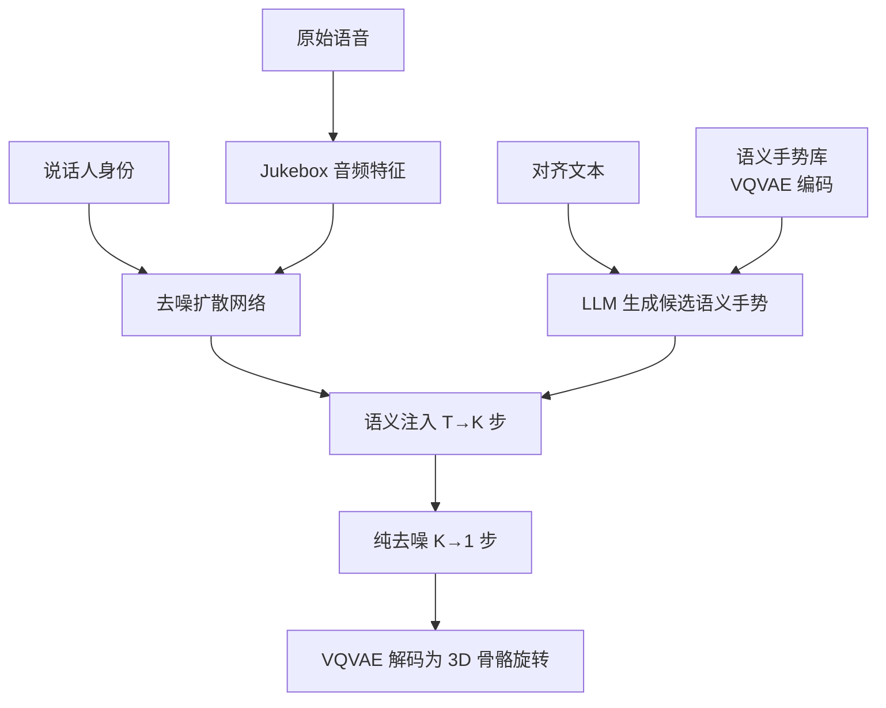

## 一句话总结

SIGGesture 用一个在约 400 小时伪标注数据上预训练的扩散基础模型生成韵律手势,再借助大语言模型把文本语义映射到预置语义手势库,并在扩散反向去噪过程中做"语义注入",从而合成既自然又语义精准、且能泛化到多语种真实语音的 3D 共语手势。

## 研究背景

共语手势(co-speech gesture)对虚拟人、游戏 NPC、机器人助手等应用价值很高。手势可分为两类:与语音节奏对齐的**韵律手势**,和表达具体含义的**语义手势**。

以往方法主要解决韵律同步,却忽视语义手势,原因有二:

- 语义手势在整段序列中稀疏出现,且服从长尾分布,难以在端到端框架中直接学习其多模态映射关系。
- 韵律手势生成往往难以泛化到"真实场景"(in-the-wild)的任意语音。

此外,3D 骨骼动捕数据昂贵稀缺(此前最大数据集 BEAT 仅 76 小时),制约了数据驱动方法的基础质量。作者的核心洞察是:真实对话中语义手势相对有限,不同人表达同一语义词(如 "wonderful")往往做出相似动作(如"张开双臂"),因此可以把语义手势当作提示(prompt)在生成过程中显式注入,而不必强行端到端学习。

## 方法

整体框架分为三块:

1. **韵律手势基础模型**:在自建大规模伪标注数据集 Gesture400(约 400 小时)上预训练一个基于 Transformer 的扩散模型,再用高质量数据微调,负责生成自然平滑的韵律手势。
2. **LLM 语义分配**:把与语音时间轴对齐的文本喂给大语言模型,用预定义 prompt 让其为具体语句挑选合适的候选语义手势。
3. **语义注入模块**:在扩散反向去噪过程中,把候选语义手势的潜在编码按时间线掩码融合进去噪结果。

**关键设计一:潜空间扩散 + Jukebox 音频特征。** 所有动作先用 VQVAE 编码为离散 token / 潜在嵌入 $$x_0$$,扩散在潜空间进行。前向加噪为马尔可夫链

$$q(x_t \mid x_{t-1}) = \mathcal{N}(x_t; \sqrt{1-\beta_t}\, x_{t-1}, \beta_t I)$$

条件去噪反向过程为

$$p_\theta(x_{t-1} \mid x_t, c) = \mathcal{N}(x_t; u_\theta(x_t, t, c), \beta_t I)$$

其中条件 $$c = [c_{audio}, c_{id}]$$。音频特征特意用在大规模音乐数据上预训练的 Jukebox 提取(而非 WavLM),以聚焦节奏特征而非语音语义转录。训练目标为

$$\mathcal{L} = E_{x,t}\left[\lVert x - p(x_t, t, c)\rVert_2^2\right]$$

**关键设计二:语义注入(Semantic Injection)。** 用超参 $$K$$ 控制注入程度。从时间步 $$T$$ 到 $$K$$,在带语义信息的潜变量 $$\hat{x}_t$$ 上按语义词时间线掩码 $$m$$ 融合候选手势:

$$\hat{x}_t = x_t \ast m + G_{candidate} \ast (1 - m)$$

从 $$K$$ 到 1 的去噪步不再注入,以保持生成手势的结构、平滑性和多样性。语义手势库含 2,537 个独立语义动作片段(均短于 3 秒),经 VQVAE 编码后注入时再加随机噪声以增加多样性。

**关键设计三:大规模预训练语料 Gesture400。** 从 TED、一席等演讲视频出发,用 HybridIK、SMPLify 等视频动捕技术生成伪标注 3D 手势。经过 6,032 段原始视频→138,209 个兴趣片段→70,784 个最终结果的后处理管线,得到约 393 小时数据,规模比此前数据集至少大 6 倍。采用"噪声数据预训练 + 高质量数据微调"范式。

**长序列生成**:不用自回归,而采用 DiffCollage 并行合成,长序列的分数函数可拆为短片段分数之和:

$$\nabla q(m) = \nabla q(m_2, m_1) + \nabla q(m_1, m_0) - \nabla q(m_1)$$

## 实验结果

在 BEAT 数据集(后处理后约 46 小时)上评测。定量指标对比(FGD 越低越好,其余越高越好):

| 方法 | FGD↓ | SRGR↑ | BC↑ | Diversity↑ |
|------|------|-------|------|------------|
| DiffuseStyleGesture | 10.14 | 0.233 | 0.504 | 11.975 |
| TalkSHOW | 7.313 | 0.279 | 0.463 | 12.859 |
| QPGesture | 19.921 | 0.209 | 0.453 | 9.438 |
| EMAGE | 5.430 | 0.272 | 0.679 | 13.075 |
| **SIGGesture** | **2.021** | 0.263 | **0.707** | **14.020** |

SIGGesture 在 FGD、BC、Diversity 上显著领先。SRGR 略低于 TalkSHOW,作者指出该指标只按特定语音的 GT 语义动作计算骨骼距离,而同一句话可有不同语义表达方式,故 SRGR 无法准确反映语义表现。

用户研究(50 个样本打分,归一化到 0-1)中 SIGGesture 在自然度/韵律/多样性/语义四项均领先,语义一致性优势尤为明显(0.92 对比次高 0.60)。消融显示:去掉预训练主要拉低韵律与多样性,去掉语义注入则语义分从 0.92 骤降到 0.53。方法还在英/中/日多语种真实语音上验证了泛化能力。

## 亮点与局限

亮点:
- 用"预训练基础模型 + 显式语义注入"巧妙绕开了语义手势稀疏长尾难以端到端学习的问题,可控性和可解释性强。
- 借 LLM 做文本到语义手势的桥接,天然支持多语种,无需针对新语言复杂调整。
- 建立并使用了目前该领域最大的共语手势数据集(约 400 小时),推动了手势基础模型方向。

局限:
- 语义手势库靠人工挑选与技术美术修改构建,覆盖范围与质量依赖人工;注入的是预置片段,表达受限于库容量。
- 仅用音频与说话人身份两种模态,尚未纳入更丰富的风格/情绪控制。
- 常用定量指标(FGD、SRGR 等)与人眼感知存在明显差距,评估主要依赖主观用户研究。
- 目前聚焦身体手势,尚未生成含面部表情的全身动画。

## 延伸思考

- 语义注入本质是"检索式提示 + 扩散修补",与近期把 RAG/DDIM inversion 引入手势生成的思路殊途同归;可否让语义片段本身也由生成模型合成,以摆脱固定库的表达上限?
- LLM 作为文本到手势的调度器,其挑选质量直接决定语义正确性,如何评估与约束 LLM 的映射可靠性(尤其小语种或专业术语)值得深入。
- 伪标注视频动捕数据用于预训练、少量高质量数据微调的范式,与大模型训练思路一致,提示了共语手势乃至更广动作生成"foundation model"的可行路径。
