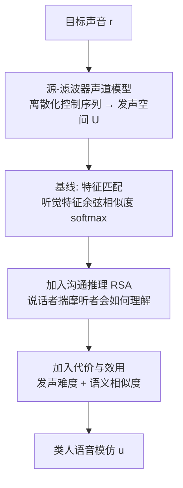

## 一句话总结

本文把图形学中"非真实感渲染（把视觉抽象成素描）"的思想搬到听觉领域，提出一个不依赖任何人类模仿数据、从人类发声器官与沟通认知的第一性原理出发的方法，自动生成"用嗓子模仿声音"的类人语音草图。

## 研究背景

图形学长期研究"如何抽象体验以诱发受众心中的感知"：既有写实的视觉表示（物理渲染），也有非写实的视觉表示（线条画、素描），还有写实的听觉表示（物理声音仿真）。作者指出，表示模式的"四象限"中缺了一块——**非真实感（non-phonorealistic）的听觉表示**，即人用嗓子模仿声音这件事。

人不需要专门训练就能用嗓子传达一个声音的"神韵"：引擎的呼啸、长号的音色、鸟的鸣叫。这与素描类比：尽管发声器官（或线条）表达能力有限，人却能借它快速传达大量听觉（或视觉）体验。作者的目标不只是生成类人语音模仿，更想理解语音抽象的本质，从而为声音设计探索类似"草图接口"的新交互方式。因此方法刻意从第一性原理构建，不在任何人类模仿数据集上训练。

## 方法

任务被形式化为两个方向：

- **说（Speaking）**：给定一段声音纹理（referent，记作 $$r$$），产生类人的语音模仿（utterance，记作 $$u$$）。
- **听（Listening）**：给定人类的语音模仿 $$u$$，推断被模仿的声音 $$r$$。

关键前提是可能的人类发声只是所有声音纹理的稀疏子集（$$U \subsetneq R$$），这正是模仿的难点。方法对应两个分布：说话者 $$p_S(u \mid r)$$ 与听者 $$p_L(r \mid u)$$。

**1. 声道模型定义发声空间 $$U$$。** 采用标准源-滤波器模型：源信号建模声带振动（脉冲串，浊音）与气流噪声（宽带噪声，清音），滤波器建模口腔/鼻腔共振（谐振 LTI 滤波器组 + 塞音包络生成器）。用 Faust 语言实现，并调出偏男声与偏女声两套音色，另接一个现成的浊化增强模型仅作"去机器味"的美化。对 5 个参数（基频 $$F_0$$、响度、元音类型、塞音门、浊化程度）各按 11 种模式（常值、不同频率的正弦/锯齿、随机游走）调制，得到 $$|U| = 11^5 = 161051$$ 个候选发声。

**2. 基线：按听觉特征匹配。** 提取谱平坦度、谱质心、谱峰、RMS 响度等感知相关特征及其导数（共 19 维）$$\phi$$，用余弦相似度做 softmax 选择发声：

$$
p_S(u \mid r) \propto \exp\!\left(\beta \cdot \frac{\phi(r)\cdot\phi(u)}{|\phi(r)||\phi(u)|}\right)
$$

听者可对称定义，在 FSD50K 数据集（$$|R| = 51197$$）上检索。但这套方法常与人的直觉不符：如快艇的宽带水花噪声最显著，基线会输出"shhhh"，而人却忽略它去模仿低频引擎轰鸣"woh-woh"——因为人模仿的不是**最显著**的特征，而是**最有辨识度**的特征。

**3. 加入沟通推理（RSA）。** 借助 Rational Speech Acts 框架，把基线说话者当作"不考虑听者"的基例。定义"二阶说话者" $$S_2$$：不再匹配特征，而是选择能让基例听者最可能推断出正确 referent 的发声：

$$
p_{S_2}(u \mid r) \propto \exp(\beta \cdot p_L(r \mid u))
$$

对应可用贝叶斯规则定义二阶听者 $$p_{L_2}(r \mid u) \propto p_{S_2}(u \mid r)\cdot p(r)$$。递归到 $$S_2$$ 即收敛得足够好。

**4. 加入代价与效用（完整模型）。** 进一步推广说话者模型：

$$
p_{S_2}(u \mid r) \propto \exp(\beta \cdot (V_2(u,r) - c(u)))
$$

其中代价 $$c(u)$$ 正比于控制参数变化速率与处于发声极端（过快、过响、过高/低）的比例；效用 $$V_2(u,r)$$ 用 AudioSet 本体层级衡量听者推断结果 $$r'$$ 与真实 $$r$$ 的语义相似度 $$\Delta$$：

$$
V_k(u,r) = \mathbb{E}_{r'}\big[\Delta(r,r')\big] = \sum_{r' \in R} \Delta(r,r') \cdot p_L(r' \mid u)
$$

三档模型分别称为 baseline、communicative-only、full。整套计算轻量，full 模型在 2021 款 M1 MacBook Pro 上对 FSD50K 全部 51197 条音频做预测仅需约 14 分钟。

## 实验结果

核心评测：将三档模型预测的发声与 VocalImitationSet 中实验采集的人类模仿对比，对 16 个 referent、每个 16 条人类模仿，从"是否浊音、是否含塞音、元音是否开、是否前元音"四个语音学特征上比较分布相关性（男/女声各算）。此外还有偏好用户研究、听者理解（动物声检索）等。

| 评测 | Baseline | Communicative-only | Full | 人类 |
| --- | --- | --- | --- | --- |
| 与人类语音特征相关性 $$r^2$$（男声） | 0.568 | 0.676 | 0.809 | — |
| 与人类语音特征相关性 $$r^2$$（女声） | 0.557 | 0.637 | 0.808 | — |
| 动物声 3 类检索 top-1 | 46% | 55% | 58% | 70% |
| 动物声 30 类检索 top-1 | 7% | 18% | 18% | 42% |
| 动物声 30 类检索 top-5 | 31% | — | 53% | — |

用户研究（$$N=60$$）：人们一致更偏好 full 而非 baseline 与 communicative-only；即便与真实人类模仿相比，也有约 25% 的时间偏好 full 的输出，部分单一声音上达到约 50%（即持平）的水平。特征消融显示，从 19 维随机去掉 6 维，full 的相关性仅从 0.81 微降到 0.74，说明沟通推理对底层特征选择稳健（体现"语用强化"）。

## 亮点与局限

**亮点**
- 提出图形学表示"缺失象限"——非真实感听觉表示，并给出可操作的计算方法。
- 完全不训练于任何人类模仿数据，仅凭对声道、听觉与沟通的第一性建模就能预测人类行为，说明模型真正抓住了语音模仿的本质。
- 同一框架天然支持"说"与"听"两个方向，可灵活加入新约束（如耳语：把浊音代价设为 $$+\infty$$），也能反向用于按嗓音检索声音。

**局限**
- 无法预测文化演化出的语言约定（如心跳的"ba-boom"这类拟声词）。
- 只针对时间上统计稳定的声音纹理，难处理有高阶时间结构的语音与音乐（如"哼唱检索"）。
- 声道模型尚不能产生某些辅音（如 [z]），导致模仿蜜蜂时发出的是长鸣而非嗡嗡声；依赖离散化的发声空间也限制了精度。

## 延伸思考

- 把"非真实感渲染=优化刺激以在受众心中诱发目标感知"这一 Durand 式框架从视觉迁移到听觉，提示"渲染"可被理解为跨模态的沟通优化问题；这套"说话者揣摩听者"的递归推理是否也能反哺视觉素描、动画甚至可视化图表的抽象策略？
- 完整模型在无监督下逼近人类，还与人犯相似错误（混淆蜜蜂/蚊子嗡鸣，却不混淆猫的嘶叫与喵叫），暗示语用推理是人类抽象能力的通用组件，值得作为认知科学工具去研究拟声、婴儿语言习得与鸟类少样本学习。
- 若把离散发声空间换成连续可微声道并端到端优化，或将框架扩展到合成器音色设计（用电子音色"暗示"而非复刻乐器），可能催生真正基于嗓音/草图的声音设计交互界面。
