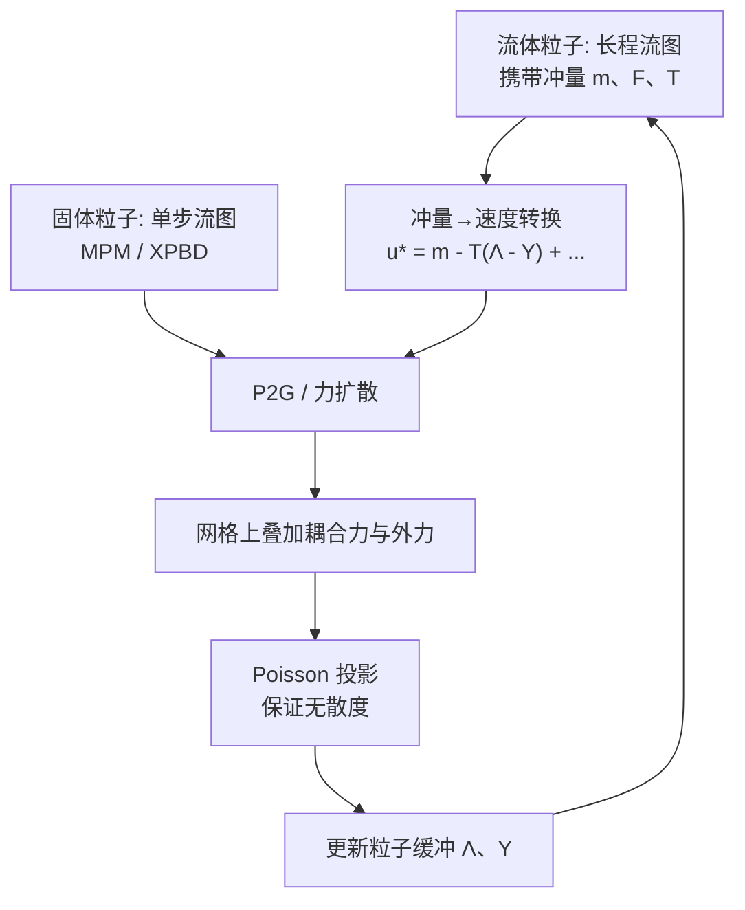

## 一句话总结

本文提出一种基于粒子流图（Particle Flow Map, PFM）的流固耦合框架：将流体与固体统一表示为不同长度、不同动力学的粒子流图，借助"冲量-速度转换"与"粒子路径积分"两个机制，把 MPM、IBM 等传统耦合模型无缝嵌入长程流图流体求解器，从而在保持强涡结构的前提下模拟游鱼、飘旗、降落伞、燃烧等流固相互作用现象。

## 研究背景

流图（flow map）方法通过在初始帧与当前帧之间建立双向点对点映射来输运物理量，相比逐步半拉格朗日平流能显著减少数值耗散，尤其擅长保持涡结构的生成与演化。这一特性使其天然适合模拟由固体运动边界诱导涡量的流固相互作用（如鱼游、鸟飞、降落伞下降、风吹薄布）。

然而流图方法几乎只用于纯流体求解，流固耦合研究极少。作者指出传统耦合策略（MPM、IBM、变分法、单块整体法）难以嵌入流图框架的三个根本原因：

- **表示不统一**：流图耦合要求固体与流体采用相同的表示与离散（相同起止时刻、相同网格），严重限制可用的固体模型。
- **交换量不兼容**：现代流图方法演化的是规范变量（冲量、涡量等）而非速度，无法直接与固体速度做 P2G/G2P 交换。例如流体粒子携带冲量、固体粒子携带速度，无法朴素地跨界面做 P2G。
- **外力施加困难**：向流图模型添加局部力（如动量交换）如何从固体正确传递到流体尚无定论。

已有计算物理工作（如参考映射技术 RMT）多在欧拉设定下用 Heaviside 混合函数在固体边界窄带内混合固/流应力，对窄带宽度与混合函数高度敏感，参数不当会产生非物理结果。

## 方法

### 整体框架

核心思想：把固体与流体都建模为**粒子上的前向流图**——每个流体粒子代表一条由冲量流体动力学控制的**长程**流图，每个固体粒子代表一条由弹性固体动力学控制的**单步（短程）**流图。固体流图限制为单个时间步，从而可以适配任意传统固体模型（MPM、XPBD 等）。两类流图通过两个关键机制耦合。

流图定义了物质空间 $$\boldsymbol{X}$$ 与世界空间 $$\boldsymbol{x}$$ 之间的双向映射，其雅可比矩阵满足：

$$\frac{D\mathbf{F}}{Dt} = \nabla\boldsymbol{u}\,\mathbf{F}, \qquad \frac{D\mathbf{T}}{Dt} = -\mathbf{T}\,\nabla\boldsymbol{u}.$$

冲量可沿双向流图输运：$$\boldsymbol{m}(\boldsymbol{x},t) = \mathbf{T}^{T}\boldsymbol{m}(\psi(\boldsymbol{x}),0)$$。

耦合系统的控制方程（冲量形式）为：

$$\frac{D\boldsymbol{u}}{Dt} = -\nabla p + \boldsymbol{f}_{s\to f}, \qquad \frac{D\boldsymbol{m}}{Dt} = -(\nabla\boldsymbol{u})^{T}\boldsymbol{m}, \qquad \boldsymbol{u} = \boldsymbol{m} - \boldsymbol{q}.$$

在有外力时，$$\boldsymbol{q}$$ 不再只包含压强项，需重新推导。经推导得到流图端点处速度的三项分解：

$$\boldsymbol{u}_c = \underbrace{\mathbf{T}^{T}_{[a,c]}\boldsymbol{m}_a}_{\text{冲量映射}} - \underbrace{\mathbf{T}^{T}_{[a,c]}\int_a^c \mathbf{F}^{T}_{[\tau,a]}\left(\nabla p_\tau - \nabla\tfrac{1}{2}\vert \boldsymbol{u}_\tau\vert ^2\right)d\tau}_{\text{投影}} + \underbrace{\mathbf{T}^{T}_{[a,c]}\int_a^c \mathbf{F}^{T}_{[\tau,a]}\boldsymbol{f}_\tau\, d\tau}_{\text{耦合力积分}}.$$

无耦合的纯冲量流图系统只需前两项；第三项（耦合力积分）是评估固体到流体耦合效应的关键，可理解为沿整条轨迹对耦合力做流图积分。

### 关键设计一：冲量-速度转换机制

耦合本质发生在**速度域**，因此需将流图平流得到的冲量转换为速度。作者定义两个粒子缓冲：压强修正缓冲 $$\boldsymbol{\Lambda}$$ 与耦合力缓冲 $$\boldsymbol{\Upsilon}$$：

$$\boldsymbol{\Lambda}_c = \int_a^c \mathbf{F}^{T}_{[\tau,a]}\nabla\left(p_\tau - \tfrac{1}{2}\vert \boldsymbol{u}_\tau\vert ^2\right)d\tau, \qquad \boldsymbol{\Upsilon}_c = \int_a^c \mathbf{F}^{T}_{[\tau,a]}\boldsymbol{f}_\tau\, d\tau.$$

网格法难以从域内任意点起算路径积分，而粒子天然能沿轨迹累积，因此选用粒子流图框架，把 $$\mathbf{F}$$、$$\mathbf{T}$$、初始冲量 $$\boldsymbol{m}_a$$ 及两个缓冲都携带在流体粒子上。单步（从 $$b=c-\Delta t$$ 到 $$c$$）更新方程组为：

$$\boldsymbol{m}_c = \mathbf{T}^{T}_{[a,c]}\boldsymbol{m}_a,$$

$$\boldsymbol{u}^{*}_c = \boldsymbol{m}_c - \mathbf{T}^{T}_{[a,c]}(\boldsymbol{\Lambda}_b - \boldsymbol{\Upsilon}_b) + \nabla\tfrac{1}{2}\vert \boldsymbol{u}_b\vert ^2\Delta t + \boldsymbol{f}_c\Delta t,$$

$$\boldsymbol{\Lambda}_c = \boldsymbol{\Lambda}_b + \mathbf{F}^{T}_{[c,a]}\Delta t\left(\nabla p_c - \nabla\tfrac{1}{2}\vert \boldsymbol{u}_c\vert ^2\right), \qquad \boldsymbol{\Upsilon}_c = \boldsymbol{\Upsilon}_b + \mathbf{F}^{T}_{[c,a]}\Delta t\,\boldsymbol{f}_c.$$

转换后固体与流体都用速度这一"短程"物理量描述，耦合即可退化为传统速度域方法（P2G 或力扩散 + Poisson 投影）。重力、黏性等外力也能以相同方式累积进 $$\boldsymbol{\Upsilon}$$；非均匀密度场景下 $$\boldsymbol{\Lambda}$$ 中的压强项替换为 $$\tfrac{1}{\rho}\nabla p_c$$。

### 关键设计二：粒子路径积分与力累积

耦合力沿整条流图轨迹累积：每个时间瞬时先做从当前帧到初始帧的反向映射、再做初始帧到端点的前向映射，从而把力"搬运"到正确的参考系再累加。这解决了"如何向流图模型施加局部力"的开放问题。缓冲 $$\boldsymbol{\Lambda}$$、$$\boldsymbol{\Upsilon}$$ 在每步末通过 G2P 得到网格量并借助已平流的 $$\mathbf{F}_{[c,a]}$$ 映射回初始帧累积。

### 关键设计三：将传统耦合模型统一嵌入

- **MPM 耦合**：耦合力隐式来自投影步的压强梯度，恰好由 $$\boldsymbol{\Lambda}$$ 缓冲承担。长程流图冲量转换为短程速度后与固体粒子在同一物理模型下做标准 P2G/G2P；平流采用 RK4 以更好保能。
- **IBM 耦合**：弹性力通过光滑 Dirac-Delta 核显式扩散到网格，直接累积进 $$\boldsymbol{\Upsilon}$$；投影后无散速度再插值回固体粒子驱动其运动。

时间积分（Alg. 1）主要步骤：按 $$n$$ 步周期重置粒子（$$\mathbf{F}$$、$$\mathbf{T}$$ 复位为单位阵，$$\boldsymbol{m}_a$$ 用 $$\boldsymbol{u}_b$$ 重置，清空缓冲）；流固各自 CFL；采用蛙跳/中点法增强涡量保持；平流 $$\boldsymbol{x}^f$$、$$\mathbf{T}$$、$$\mathbf{F}$$；计算 $$\boldsymbol{m}_c$$；冲量转速度；P2G 与耦合；叠加外力；Poisson 求解；更新缓冲。

## 实验结果

作者用消融实验对比七种实现（在流体中下落球体，域 128×384，密度比 15:1，杨氏模量 $$E=5\times10^3$$，$$\mu=0.3$$，重力 3）：

| 方法 | 表示/力处理 | 结果 |
| --- | --- | --- |
| (a) Direct GFMC | 网格流图，直接用固体形变梯度算力、不与流体 F 混合 | 数值误差主导 |
| (b) Single-Step Heaviside GFMC | RMT，仅单帧加力 | 下落偏慢、固体过软 |
| (c) Accumulative Heaviside GFMC | RMT，累积力但不映射回首帧 | 数值不稳定 |
| (d) Tuned Accumulative Heaviside GFMC | 同 (c)，调小步长/密度比/重力 | 流图外推畸变主导、行为错误 |
| (e) Direct HFMC | 混合流图，冲量与速度粒子直接 P2G 共解 Poisson | 速度不收敛 |
| (f) Padded Velocity HFMC | 固体外包一层速度粒子 | 速度收敛但流体行为异常 |
| (g) 本文方法 | 统一表示 + 力正确管理 | 正确耦合，无上述问题 |

消融得出两条必要条件：耦合时流固须具有相同物理表示；力须在流图框架内被正确管理。

其它验证与示例：Karman 涡街在雷诺数 20/200/2000（黏性 $$4\times10^{-4}$$、$$4\times10^{-5}$$、$$4\times10^{-6}$$）下正确复现；2D 圆柱沉降中不同密度收敛到与密度成正比的终端速度；3D 浮力羽流；与 Euler、APIC+M 对比，本文涡结构最清晰（Euler 无涡、APIC+M 涡模糊）。示例涵盖 2D/3D：多圆柱沉降、主动应变自收缩游鱼、长丝旗、鲤鱼旗（Koinobori）、头发、T 恤、落叶、降落伞及燃烧场景。全部用 Taichi 实现，3D 每步平均耗时约 1.7 秒（3D 降落伞/鲤鱼旗）到 5.2 秒（3D 鱼/草地）。

## 亮点与局限

**亮点**
- 首次在计算机图形学中系统研究流图上的流固耦合，用"不同长度粒子流图"统一固体与流体表示。
- 冲量-速度转换 + 粒子路径积分两个机制解决了表示不统一、交换量不兼容、外力施加三大难题。
- 框架通用：MPM（隐式耦合力）与 IBM（显式核扩散）都能自然嵌入，并可容纳重力、黏性、浮力等外力。
- 由于流图固有的涡量保持能力，涡-固相互作用在物理精度与视觉复杂度上优于传统方法。
- 因在粒子上正向演化 $$\mathbf{T}$$（而非求 $$\mathbf{F}$$ 逆），避免了冲量拉伸不稳定，无需额外的雅可比限幅；先转速度再 P2G 也规避了 $$\nabla\mathbf{T}$$ 的高阶 Hessian 项计算。

**局限**
- 采用依赖显式力交换的弱耦合，尚未支持变分法、单块整体投影等隐式动量守恒耦合（需将两个积分重构为流图上的隐式系统）。
- 受限于粒子式流图表示，需维护大量流图粒子来缓冲耦合力并在粒子-网格间传递信息，开销较大。
- 仅处理非滑移边界，不支持自由边界/开放水面（自由面附近冲量拉伸项难解），非穿透等其它边界条件也尚不清楚如何施加。
- 开放边界处 $$\mathbf{T}$$、$$\mathbf{F}$$ 未定义会引入不稳定，需将 CFL 限制得很小（壁面边界无此问题）。

## 延伸思考

- 把耦合力积分重构为隐式单块系统，是通往流图与刚体/铰接体等硬约束刚性系统两向耦合的关键，也可结合投影式浸入边界法。
- 将纯欧拉固体（如 Teng 等 2016 的欧拉流固耦合）扩展到流图框架，或探索降低粒子维护成本的途径，都是提升长程流图效率的方向。
- 解决自由面附近的冲量拉伸难题后，有望把流图带来的边界涡细节引入大尺度开放水体与多相流模拟，并支持更丰富的边界条件类型。
- 重置频率是一个值得注意的工程权衡：固体游速对其不敏感，但涡量保持依赖它且在阈值（2D 用 $$n=20$$、3D 用 $$n=12$$）后收敛，过高频率在强外力累积下反而不稳定。
