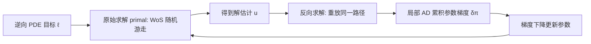

## 一句话总结

把渲染领域的路径重放反向传播（PRB）迁移到无网格蒙特卡洛 PDE 求解器（walk on spheres），得到无偏、常数内存、随机游走步数线性复杂度的参数梯度估计器，从而用梯度下降求解逆向 PDE 问题。

## 研究背景

许多物理现象（热传导、扩散等）用偏微分方程（PDE）描述。正向求解是"给定系数与边界条件求解 $$u$$"，而**逆向 PDE 问题**反过来：从对解的观测中反推未知参数（PDE 系数、边界值、甚至区域形状）。这类问题出现在热导体参数辨识、电阻抗成像等场景。

作者采用基于梯度的方法：对求解器求导，再用梯度下降恢复未知参数。传统有限元（FEM）求解器需要网格划分步骤，既脆弱又昂贵。无网格蒙特卡洛方法（基于 walk on spheres，WoS）改用随机游走采样路径构造解的无偏估计，且与物理渲染算法高度相似。

关键难点在于反向求导：标准反向模式自动微分（反向传播）需要反转全部数据依赖，对随机游走意味着要存储大量迭代的中间状态，内存开销随路径长度线性增长。渲染领域已通过辐射反向传播、路径重放反向传播（PRB）解决类似问题——把求导转化为一次独立的"导数光"模拟，并利用算术可逆性以常数内存、线性时间求梯度。本文探讨能否将这两条线结合，得到廉价的无网格 PDE 求解器参数导数。

## 方法

### 整体框架

逆向 PDE 问题形式化为：

$$
\hat{\boldsymbol{\pi}} = \arg\min_{\boldsymbol{\pi}} \ell(u(\boldsymbol{\pi}))
$$

其中 $$u(\boldsymbol{\pi})$$ 是由参数向量 $$\boldsymbol{\pi}$$（边界值、源项等）参数化的 PDE 解，$$\ell$$ 是可微目标函数（通常取解与参考解在若干位置的 $$L_2$$ 差）。

本文考虑的 PDE 解都可写成第二类 Fredholm 积分方程：

$$
u(x,\pi) = S(x,\pi) + \int_{\mathcal{Y}} K(x,x',\pi)\, u(x,\pi)\, \mathrm{d}x'
$$

其中 $$\mathcal{Y}$$ 通常是围绕 $$x$$ 的球面，$$K$$ 衰减解的递归贡献，$$S$$ 是源项。这与渲染方程结构一致（解都递归出现在右侧积分中），因此可用递归蒙特卡洛积分估计。

### 关键设计一：路径重放反向传播（PRB）适配 WoS

对积分方程求导会产生两个递归项（$$\partial_\pi u$$ 与 $$u$$ 各需一次随机游走），朴素递归估计是二次复杂度。PRB 的核心思想是：先跑一遍原始随机游走得到解 $$u$$，再**重新生成同一条路径**（通过复用伪随机数种子），利用已知最终结果反向累积梯度。这样避免存储中间随机游走状态，实现常数内存。方法计算向量-雅可比积 $$\delta_\pi = \delta_u^T J_s$$，其中 $$\delta_u$$ 是目标函数对解的梯度。关键实现细节是把自动微分局部化（`ad_enabled()` 块），只对循环体的部分求导，从而不跨迭代构建 AD 计算图。

### 关键设计二：detached 估计器回避采样不可微

算法采用 **detached（分离）** 估计器：

$$
\int_{\mathcal{X}} \partial_\pi f(x,\pi)\, \mathrm{d}x \approx \frac{1}{N}\sum_{i=1}^{N} \frac{\partial_\pi f(x_i,\pi)}{p(x_i,\pi)}
$$

即不对采样策略与 PDF 求导，只微分被积函数 $$f$$ 本身。只要被积函数关于 $$\pi$$ 连续，就无需处理采样过程的不可微（例如离散采样决策），这也是渲染中用 PRB 微分 delta tracking 的同一思路。本文假设区域固定、$$S$$/$$K$$/边界值连续，暂不处理不连续参数与区域边界导数。

### 关键设计三：由易到难的三类 PDE

- **泊松方程** $$\Delta u = -f$$：吞吐量不依赖参数，最易微分，无需路径重放，直接用微分 WoS（dWoS）对 $$f$$、$$g$$ 各项求反向导数。
- **屏蔽泊松方程** $$\Delta u - \sigma u = -f$$：Poisson 核 $$P_\sigma$$ 不与采样 PDF 抵消，产生参数相关吞吐量，必须用路径重放高效反向求导。
- **一般非均匀椭圆 PDE** $$\nabla(\alpha(x)\nabla u) - \sigma(x)u = -f$$：借鉴 Sawhney 等人基于 delta tracking 的空间变系数求解器。积分含源项、体项、面项三部分，每步只采样体项或面项之一以避免二次复杂度；detached 估计器无需微分该离散决策，故仍可正确求导。

## 实验结果

作者首先用有限差分（FD）验证梯度正确性：屏蔽泊松的源项梯度、一般椭圆 PDE 的源项/屏蔽/扩散系数梯度均与 FD 参考完全吻合，确认估计器无偏。随后在 2D 上对单个参数（用规则 2D 纹理表示）做优化，最小化与参考解的 $$L_2$$ 误差，运行 128 次迭代。

| 优化参数 | 收敛表现 | 参数可辨识性 |
| --- | --- | --- |
| 源项 (Source) | $$L_2$$ 损失下降到约 $$10^{-3}$$ | 感兴趣区域几乎完全恢复参考，最鲁棒 |
| 屏蔽系数 (Screening) | $$L_2$$ 损失下降到约 $$10^{-6}$$ | 大致形状可恢复，部分成功 |
| 扩散系数 (Diffusion) | $$L_2$$ 损失下降到约 $$10^{-3}$$ | 最不凸，纹理形状可能与参考差异大 |

三个问题误差均随优化下降，且优化后 PDE 解都与参考解接近；但椭圆问题本身存在歧义，误差下降不保证恢复参数匹配参考。源项最易优化，与渲染中发射式表示更易优化的观察一致。

## 亮点与局限

亮点：
- 将渲染领域成熟的路径重放反向传播首次系统迁移到无网格蒙特卡洛 PDE 求解，方法**无偏、常数内存、步数线性复杂度**。
- 覆盖泊松、屏蔽泊松、一般非均匀椭圆三类 PDE，并用有限差分严格验证梯度正确性。
- detached 估计器巧妙回避了随机游走中离散采样决策的不可微问题。

局限：
- 论文自述为**初步结果（preliminary）**，仅在 2D 合成问题上验证，未在真实逆向 PDE 应用上检验。
- 假设区域固定、参数连续，未处理区域边界导数与不连续参数。
- 椭圆逆问题固有歧义，扩散系数等重建易陷局部最优，实际应用需先验或正则化。

## 延伸思考

- **区域形状反演**：作者指出可用 attached 版 PRB（类比渲染中镜面表面的处理）计算对区域边界的梯度，这将把方法从"反演系数"扩展到"反演几何"，但需处理边界移动带来的不连续。
- **与神经表示结合**：源项最易优化的现象呼应了 NeRF 等发射式表示易优化的经验；把 WoS 梯度估计器与神经场、application-specific 先验/正则化结合，或能缓解歧义与局部最优。
- **渲染与仿真的算法互通**：本文再次印证 walk on spheres 与蒙特卡洛渲染的深层同构——渲染中的方差缩减、重要性采样、可微技术都有望反哺无网格 PDE 求解，反之亦然。
