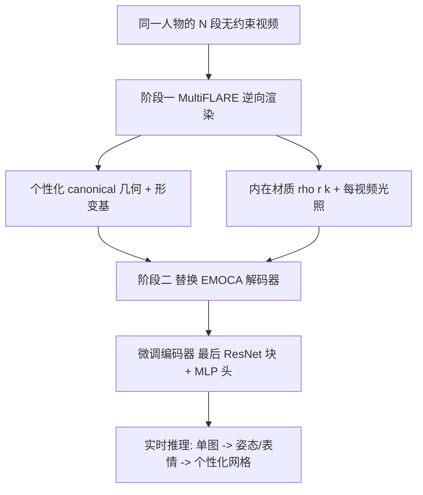

## 一句话总结

SPARK 用一组同一人物的无约束视频作为先验，先重建出高精度的个性化 3D 人脸头像，再把预训练的前馈人脸跟踪器的解码器替换为该个性化模型并微调其编码器，从而在实时前提下从未见图像中回归出比通用 3DMM 更精细、更贴合的人脸几何。

## 研究背景

3D 人脸表演捕捉在 AR/VR 远程呈现和影视特效中至关重要，但高质量结果通常依赖昂贵的采集设备、标记点跟踪或长时间的演员采集。另一端是基于消费级硬件的重建方法，主流做法是把 3D 可变形模型（3DMM，如 FLAME）通过优化或学习拟合到 RGB 图像/2D 关键点上。基于学习的自监督方法（如 DECA、EMOCA）已能在多种身份、光照和姿态下实时回归参数化人脸，鲁棒性很强。

但这类方法有明显短板：底层参数化模型只能给出粗略的形状估计，几何精度不足以支撑对精度要求高的任务（如年龄化、换脸、数字化妆）。神经头像方法虽能通过神经渲染获得更好的外观细节，但几何仍落后于工业级系统，且计算开销大，难以实时。

本文提出的核心问题是：给定一个人的一组无约束视频作为先验信息，能否构建一个能回归更高质量几何的个性化实时跟踪器？视频集合提供了介于高端采集系统与消费级方案之间的中间地带——无需复杂硬件，就能借助多段不同光照、姿态的视频更好地约束这个病态问题。

## 方法

整体是两阶段训练框架。阶段一 MultiFLARE：利用同一人物的多段无约束视频，通过逆向渲染构建个性化几何解码器，把颜色解耦为光照与内在材质。阶段二 Face Tracker Adaptation：把一个通用前馈人脸捕捉网络（基于 EMOCA）的 3DMM 解码器换成 MultiFLARE 几何模型，并在视频集合上微调其编码器。推理时，编码器从单张图像回归姿态与表情参数，结合冻结的个性化几何模型即可实时生成高保真网格。

**多视频逆向渲染（MultiFLARE）**。几何基于 FLAME 三角网格，在 canonical 空间优化模板顶点，对给定点 $$x_c$$ 用如下方式做姿态与表情形变：

$$FLAME(x_c, P, E, W, \theta, \psi) = LBS(x_c + B_P(\theta; P) + B_E(\psi; E), J(\beta), \theta, W)$$

其中形变网络 $$D$$ 从 canonical 顶点位置预测个性化表情基 $$D(\gamma(x_c)): \mathbb{R}^3 \rightarrow E$$，用正弦位置编码 $$\gamma(\cdot)$$ 提升对高频变化的建模能力，并在预训练阶段初始化为模仿 FLAME 表情基。

**光照与材质解耦**。由于 N 段视频光照各异且为低动态范围、曝光不受控，作者沿用 FLARE 把渲染方程拆成 Lambertian 漫反射项和 Cook-Torrance 微表面镜面项，用神经 split-sum 近似 $$L$$ 表示光照：$$L(n, 1) = l_d$$、$$L(\omega, r) = l_s$$，并为每段视频单独优化一组光照参数。材质则假设人物内在外观在视频间变化很小，用单个 MLP $$M(x_c): \mathbb{R}^3 \rightarrow \rho, r, k$$ 在 canonical 空间学习共享的反照率、粗糙度和镜面强度，第 $$i$$ 段视频最终颜色为 $$C = \rho \cdot l_d^i + k \cdot l_s^i$$。

**跟踪器适配（迁移学习）**。直接把 FLAME 换成个性化几何会导致结果很差，因此作者只更新编码器骨干最后一个 ResNet 块和整个 MLP 头（对粗形状编码器与表情编码器都如此），既适配新的回归任务，又保留早期层的通用特征。微调损失沿用 EMOCA v2 的组合损失：

$$L(\phi) = \lambda_{emo}L_{emo} + \lambda_{pho}L_{pho} + \lambda_{lmk}L_{lmk} + \lambda_{eye}L_{eye} + \lambda_{mc}L_{mc} + \lambda_{\psi}L_{\psi} + \lambda_{lipr}L_{lipr}$$

其中自监督光度损失 $$L_{pho}$$ 使用个性化几何模型与预估反射率函数（配合每段视频对应的光照 $$l_d^i, l_s^i$$）来渲染，从而获得更精确的自监督目标。

**新评估指标**。由于缺乏逐帧 3D 真值，作者提出两个不依赖反照率/着色的姿态几何评估指标：语义 IoU（用 BiSeNet 分割各面部区域后与渲染网格的语义分割做交并比）和基于几何的图像 warping 指标（用跟踪几何把 $$I_t$$ 的像素回溯到 $$I_{t-k}$$，以 PSNR 衡量对齐质量）。

## 实验结果

在 6 个不同人物数据集（每个由 6~12 段 10 秒到 1 分钟的无约束视频构成）上做 k-fold 交叉验证，对比 DECA、EMOCA、EMOCA（逐身份微调）和 SMIRK，评估未见数据上捕捉几何的精度：

| 方法 | Warp PSNR ↑ | Semantic IoU ↑ | Landmarks L1 ↓ |
| --- | --- | --- | --- |
| DECA | 29.501 | 0.616 | 0.047 |
| SMIRK | 30.062 | 0.649 | 0.035 |
| EMOCA | 29.979 | 0.644 | 0.036 |
| EMOCA（微调） | 30.275 | 0.673 | 0.027 |
| Ours | 30.647 | 0.702 | 0.027 |

在相近推理时间下，SPARK 在三项指标上均优于或持平最佳基线。消融显示：去掉迁移学习会大幅拉低语义 IoU（0.702 → 0.621）；训练序列数从 1 增到 8，各指标持续提升，但超过 4 段后收益递减。

## 亮点与局限

亮点：首次同时利用同一人物的多段无约束视频进行头像重建；通过"替换解码器 + 微调编码器"的迁移学习巧妙融合了通用前馈模型的泛化能力与个性化几何的高保真度；推理走 ResNet-50 前向即可实时；提出两个无需 3D 真值的姿态几何评估指标（语义 IoU 与图像 warping PSNR），填补了现有评测多只评中性脸的空白。

局限：语义 IoU 指标对语义分割本身的准确性敏感；图像 warping 在长帧间隔时会受走样、错误着色和大遮挡影响，因此依赖短间隔（约 170ms）；方法需要目标人物的多段视频作为前提，无法对任意单张陌生图像做个性化；头发等区域仍不被前馈人脸捕捉模型建模而被遮罩掉。

## 延伸思考

这套"通用先验 + 个性化适配"的思路本质上是把大规模训练得到的鲁棒编码器与逐人定制的精细解码器解耦，值得推广到身体、手部等其他可变形捕捉任务。用视频集合而非单段视频作先验，是介于消费级与工业级之间的现实折中，尤其适合影视场景里已有大量演员素材的情况。此外，作者对"缺乏逐帧 3D 真值时如何评估姿态几何"的思考很有价值——语义 IoU 和几何 warping 提供了一种可自监督式验证跟踪质量的路径，或可成为该领域更通用的评测手段。
