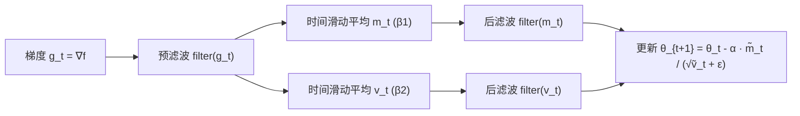

## 一句话总结

把 Adam 的"时间域梯度滤波"扩展为"空间-时间联合滤波"：用一个边缘感知的交叉双边滤波器（cross-bilateral filter）对逆渲染的梯度做各向异性预条件，使参数更新分段光滑，从而在纹理、体积、网格恢复任务上比 Adam 和 Laplacian Smoothing 收敛更快、质量更高。

## 研究背景

逆渲染广泛依赖基于梯度的优化，且绝大多数工作使用 Adam 优化器。Adam 可以看作一种**时间域滤波器**：它对历史迭代的梯度做指数滑动平均，既降噪，又按分量自适应调整学习率。但 Adam 存在两个局限：

- 它只做**对角预条件**，假设参数之间互不相关，每个分量独立演化。当梯度噪声很大、目标函数高度各向异性、或提前停止优化时，会产生虚假的高频伪影。
- 逆渲染要恢复的目标信号（纹理、体积、几何）通常是**分段光滑**的，而 Adam 并未针对这一先验做设计。

已有工作（如 Large Steps、Sobolev 梯度下降）尝试对梯度做**空间域滤波**来加速收敛，思路是：若目标空间光滑，则让参数更新也空间光滑。但这些方法都用各向同性的逆 Laplacian 算子，会在目标存在强边缘时**过度平滑**，反而损害收敛。

本文的出发点：用边缘感知的交叉双边滤波替代各向同性滤波——在恢复信号的光滑区域施加强滤波，在锐利特征附近施加弱滤波，得到分段光滑的解，兼顾降噪与保边。

## 方法

### 整体框架

设目标函数 $$f:\mathbb{R}^n \to \mathbb{R}$$，优化参数为 $$\theta$$。带预条件的梯度下降为

$$\theta_{t+1} = \theta_t - \alpha P^{-1}\nabla_\theta f_t$$

其中 $$P^{-1}$$ 正定即可保证是下降方向。Adam 的更新可写为对 $$m_t$$（梯度一阶矩）与 $$v_t$$（二阶矩）做时间滤波后按 $$m_t/\sqrt{v_t}$$ 更新，本质是对角预条件。

本文在 Adam 的时间滤波基础上**插入最多三处空间滤波**，构成空间-时间联合滤波器：

- **预滤波（prefilter）**：在做指数滑动平均之前对 $$g_t$$ 滤波。
- **后滤波（postfilter）**：在滑动平均之后分别对 $$m_t$$ 和 $$v_t$$ 滤波。

在网格类应用（纹理/体积）中，作者发现**只用后滤波**效果最好且收敛略快；在网格应用中使用不同的滤波组合。

### 关键设计 1：交叉双边滤波器

滤波函数写作

$$\tilde{h}(x) = \frac{1}{Z(x)} \int_{\Omega} h(y)\, w_s(x-y)\, w_d\big(\theta(y)-\theta(x)\big)\, dy$$

其中 $$w_s$$ 是空间各向同性低通核，$$w_d$$ 是防止跨越不连续处平滑的数据项，$$Z(x)$$ 为归一化项。网格应用中取高斯形式

$$w_s(x-y) = \exp\left(-\frac{\|x-y\|}{\sigma_s}\right),\qquad w_d(\theta_x-\theta_y) = \exp\left(-\frac{\|\theta_x-\theta_y\|}{\sigma_d}\right)$$

关键点是使用**交叉**双边滤波：用参数值 $$\theta$$（而非梯度值本身）作为边缘停止的引导。因为参数值比其梯度更干净、动态范围更低，用它做引导可显著减少梯度噪声同时保住细节。为保证像 Adam 一样的**有界步长**，对 $$m_t$$ 和 $$v_t$$ 必须用**相同参数**滤波，否则训练会不稳定。

### 关键设计 2：非对角预条件

将滤波作为预条件算子时，可写成矩阵-向量积 $$(D^{-1}W)\nabla_\theta f$$，其中 $$W$$ 是刻画 $$w_s$$、$$w_d$$ 的对称正定亲和矩阵，$$D$$ 是对应归一化的对角阵。$$D^{-1}W$$ 虽不对称，但特征值均为实数、非负且被 $$1$$ 界定，可作为合法预条件。由于 $$W$$ 含非对角元素、捕捉了参数间相关性，本文方法实现了**非对角预条件**——这正是它在无噪声但强各向异性目标上仍优于 Adam 的原因。

### 关键设计 3：与 Laplacian Smoothing 的统一

已有的 Laplacian Smoothing / Large Steps 使用形如 $$(I+\lambda L)^{-1}$$ 的预条件（$$L$$ 为 Laplacian 矩阵）。由屏蔽泊松方程（screened Poisson）在 2D/3D 的闭式解可知，其等效卷积核近似为 $$e^{-r}/r$$ 形状，而本文空间核 $$w_s$$ 为 $$e^{-r}$$ 形状，二者高度相关。因此**各向同性 Laplacian Smoothing 是本文框架在把空间滤波限制为各向同性时的特例**。区别在于本文的数据项 $$w_d$$ 使滤波边缘感知，避免了对锐利区域的过度平滑。

对于网格，本文采用 Solomon 等人的广义双边滤波，并证明 Large Steps 的重参数化 + UniformAdam 流程可映射为本文框架中选择一组特定滤波器的结果（其预条件相当于 $$(I+\lambda L)^{-1}$$ 应用两次）。

### 实现

用 à-trous 滤波序列近似交叉双边滤波：每步用膨胀的 3×3（2D）或 3×3×3（3D）核，滤波器个数 $$N$$ 间接决定 $$\sigma_s$$。基于 PyTorch 实现，交叉双边滤波用 Slang 编写的自定义 CUDA kernel，逆渲染在 Mitsuba 3 上、NVIDIA RTX 3080 上运行，额外开销约 4%，故所有对比都是等迭代次数对比。

## 实验结果

在纹理、体积、网格三类逆恢复任务上与 Adam、Laplacian Smoothing、以及标准双边滤波（消融）对比；梯度估计全部只用 1 spp。主要配置与结论如下（数字取自原文）：

| 任务 | 主要设置 | 对比结论 |
| --- | --- | --- |
| 纹理恢复（金属板粗糙度，512² 网格，单视角） | primal 16 spp / 梯度 1 spp；本文 $$N=5,\ \sigma_d=0.1$$，$$\alpha=0.1,\ \beta_1=0.2$$；Adam 最佳 $$\alpha=0.01$$ | 交叉双边滤波最贴近参考，细节最全；Laplacian 过平滑，标准双边更噪，Adam 伪影最强 |
| 低采样体积恢复（密度+反照率，64³，64 视角） | primal 16 spp / 梯度 1 spp；$$\beta_1=0.2$$，本文 $$\alpha=0.02$$、Adam $$\alpha=0.008$$ | 约 50 次迭代即恢复分段光滑解，无高频伪影；Adam 有高频噪声，Laplacian/标准双边过平滑 |
| 高采样体积恢复（密度+反照率，64³） | primal 128 spp / 梯度 32 spp | 即便梯度较干净，Adam 仍收敛更慢、最终 loss 更高（90 迭代处）且伪影更多；本文靠非对角预条件更快 |
| 网格恢复（顶点位置） | 采用 Solomon 双边滤波变体 | 对分段光滑物体（立方体）与薄结构（龙）均比 Large Steps 收敛更快 |

消融要点：后滤波与预滤波在最优超参下表现相近、后滤波略快且在低 $$\beta_1$$ 下对噪声更自适应；必须同时滤波 $$m_t$$ 与 $$v_t$$ 才能保证步长有界、训练稳定；令 $$\beta_1=\beta_2=0$$ 可关闭时间滤波，使优化器"无记忆"、省去 $$m_t/v_t$$ 缓冲（约 2/3 内存节省），仍能借空间滤波动态调节学习率。

## 亮点与局限

亮点：

- 用一个统一框架**同时泛化了 Adam（时间滤波）与 Laplacian Smoothing / Large Steps（各向同性空间滤波）**，把它们纳入各向异性空间-时间滤波的特例。
- 交叉双边滤波带来**非对角预条件**，既能在高噪声梯度下更快恢复高质量解，也能在低噪声但各向异性目标上加速收敛。
- 中间解**分段光滑**，天然契合自然信号先验，适合与早停结合作为隐式先验。
- 通用性强，纹理/体积/网格皆适用；无需训练；额外开销约 4%，存储与 Adam 相同。

局限：

- 依赖"目标信号分段光滑"这一先验，对不满足该假设的目标收益有限。
- 引入额外超参数（$$\sigma_s$$ 经由滤波器个数 $$N$$ 控制、数据项尺度 $$\sigma_d$$），需要按任务调参。
- 网格与网格类应用需选用不同的双边滤波实现，滤波组合（预/后滤波）的最佳选择因任务而异。

## 延伸思考

- 本文把"图像去噪即通用先验"的思想迁移到"对梯度做边缘感知去噪"，提示优化器设计可以更多借鉴信号处理中的边缘保持滤波，而不止步于对角自适应。
- 交叉双边滤波用参数值而非梯度做引导，本质是"用更干净、低动态范围的量指导预条件"，这个思路或可推广到神经网络训练中利用激活/权重结构做非对角预条件。
- 由于方法与专门的方差缩减梯度估计器互补，可以叠加使用；也值得探索与学习式预条件器（learned preconditioner）的结合。
- "无记忆"设置（关闭时间滤波、纯空间滤波）在大规模逆优化中省内存的潜力，对超大网格/体素场景可能特别有价值。
