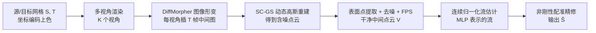

## 一句话总结

SRIF 用扩散模型做多视角图像插值、动态 3D 高斯重建出"中间点云"，再学一条连续归一化流把源形状平滑变形到目标，从而在语义差异很大的形状对之间获得高质量稠密对应，同时附带一段语义连贯的形变过程。

## 研究背景

估计 3D 形状间的稠密对应是重建、动画、统计形状分析等应用的基石。对于刚性或等距形变，已有成熟方法；但当形状经历更一般、更复杂的形变（例如茶壶对茶壶、牛对长颈鹿、椅子对马这类跨类别、异质对象）时，现有路线各有短板：

- **纯几何方法**（先找地标、再传播稠密对应）依赖几何特征，而几何地标不一定对应语义，异质情况下容易错配。
- **依赖用户地标的方法**把问题看作对应插值，但人工标注限制了自动化，标注不足会导致次优结果。
- **类别特定的学习方法**受限于 3D 数据规模，通常只能处理特定类别。
- **借助大视觉模型（LVM）的方法**把 3D 形状渲染成多视角 2D 图再做语义编码。但作者观察到：这类做法提取的语义偏粗（分割区域或稀疏地标）；无纹理渲染图与 LVM 训练用的自然图像存在明显差距，特征含噪；很多方法以简单前馈方式使用语义，需要复杂的过滤才能可靠。

作者认为根源在于：LVM 是在"静态、独立"地对每个形状单独提特征，当两个形状差异大时就会出问题。SRIF 的核心洞见是**以动态的视角用 LVM 去关联两个形状**——通过生成两者之间的图像形变序列，隐式捕捉"形状之间如何过渡"的丰富语义关系。

## 方法

### 整体框架

输入是一对外在对齐（大致同朝向）的网格 $$(S, T)$$，输出是与 $$S$$ 同拓扑、几何上逼近 $$T$$ 的配准结果 $$\hat{S}$$。流程分三块：

### 关键设计 1：坐标编码上色让扩散形变更可靠

扩散模型在真实图像上训练，直接渲染无纹理形状会与训练分布脱节。作者把空间坐标编码成颜色：对点 $$(x,y,z)$$，先按 z 坐标归一化得到 $$d = \lfloor \frac{z - z_{min}}{z_{max} - z_{min}} \times 65535 \rfloor$$，再拆到 RGB 三通道 $$[C_R, C_G, C_B] = [\lfloor \frac{d}{256} \rfloor, \lfloor \frac{d}{256} \rfloor, d - 256 \times \lfloor \frac{d}{256} \rfloor]$$。这样渲染出的图更接近自然图像分布，DiffMorpher 的形变效果更好。随后每对同视角图像 $$(I^S_i, I^T_i)$$ 被插值出 $$T$$ 张中间图。

### 关键设计 2：动态 3D 高斯重建 + 表面点提取

图像形变是各视角独立进行的，难以保证多视角一致性，因此不能用"同一形变阶段做多视角重建"的朴素思路。作者改用**动态重建**：以源网格顶点初始化高斯中心，用 SC-GS 对每个形变阶段 $$t$$ 预测 $$(\delta x, \delta r, \delta s)$$ 得到形变后的高斯，经可微光栅化优化后在时间步 $$t$$ 提取原始点云 $$V^G_t$$。

后处理两步：一是按最近邻距离阈值滤掉漂浮高斯造成的离群点；二是针对自适应密度控制在物体内部生成的高斯，提出**表面点提取模块**——从标准六面体每个面投影深度图，再反投影成局部视点点云并聚合，得到干净表面点云 $$V_t$$，最后用最远点采样（FPS）把点数降到与 $$S$$ 一致。

### 关键设计 3：连续归一化流做全局一致配准

在连续中间点云 $$V = \{V_t \mid t=1,...,T\}$$ 下（记 $$V_0$$ 为 $$S$$ 顶点、$$V_{T+1}$$ 为 $$T$$ 顶点），逐对朴素迭代配准会累积畸变（尤其中间点云质量差时）。作者改为学习一条**连续归一化流**，把配准建模为让 $$y(t)$$ 随时间连续形变的动力学 $$\frac{\partial y(t)}{\partial t} = f(y(t), t)$$，其中 $$f$$ 用 MLP 表示（借鉴 PointFlow 框架，流可逆）。目标值通过求解 ODE 得到：

$$y(t_0) = x + \int_{t_1}^{t_0} f(y(t), t)\, dt$$

优化用三项损失：终点 Chamfer 距离 $$E_{cd\_final} = CD(y(t_0), V_{T+1})$$；中间点云弱引导 $$E_{cd\_inter} = \frac{1}{T} \sum_{i \in [T]} CD(y(t_i), V_i)$$；以及防止过度畸变的 ARAP 正则 $$E_{arap}$$。总损失为：

$$E_{total} = \lambda_{cd\_inter} E_{cd\_inter} + \lambda_{cd\_final} E_{cd\_final} + \lambda_{arap} E_{arap}$$

实现中 $$\lambda_{cd\_inter}=1$$、$$\lambda_{cd\_final}=10$$、$$\lambda_{arap}=2$$（更信任目标形状而非中间点云）。最后再对流网络输出与 $$T$$ 做一次非刚性配准精修。

## 实验结果

在 SHREC'07（9 个类别，按谱距离选取最具区分度的形状对）与 EBCM 上评测，以平均测地误差为主指标。SRIF 在所有测试集上均优于全部基线，总平均测地误差 0.0956，不到次优基线的一半。

| 方法 | Airplane | Ant | Bird | Chair | Fish | Fourleg | Glasses | Human | Plier | EBCM |
|------|------|------|------|------|------|------|------|------|------|------|
| MapTree | 0.5634 | 0.2635 | 0.4117 | 0.4742 | 0.2949 | 0.3507 | 0.6878 | 0.2633 | 0.2805 | 0.4231 |
| BIM | 0.2589 | 0.3050 | 0.4123 | 0.4800 | 0.2699 | 0.2449 | 0.6160 | 0.1810 | 0.5197 | 0.2968 |
| SmoothShell | 0.2749 | 0.2694 | 0.3009 | 0.2627 | 0.1032 | 0.1234 | 0.3100 | 0.1572 | 0.3900 | 0.4476 |
| NeuroMorph | 0.1510 | 0.1895 | 0.1672 | 0.1853 | 0.1366 | 0.1697 | 0.2652 | 0.2141 | 0.2830 | 0.1844 |
| ENIGMA | 0.3568 | 0.3675 | 0.3278 | 0.4482 | 0.1733 | 0.2466 | 0.6187 | 0.2925 | 0.4379 | 0.3032 |
| **Ours** | **0.0356** | **0.1133** | **0.0965** | **0.0295** | 0.0804 | 0.0824 | **0.0614** | **0.1467** | **0.1476** | **0.0886** |

在综合指标上（全类别平均）SRIF 也全面领先：Dirichlet 能量 6.4702、Coverage 0.6418、地标误差 0.0956、Bijectivity 0.0075，均为最优；即便不显式优化 Dirichlet 能量，也略优于用 RHM 后处理的 ENIGMA。

消融显示：去掉中间几何直接估流会明显退化（地标误差从 0.0529 升到 0.1157），去掉表面点提取、改用逐帧独立 3D-GS、减少视角数都会带来性能下降；16 视角是效率与精度的折中。方法对最多 45 度的旋转扰动、劣质网格、下采样点云均有较好鲁棒性，还能直接作用于无结构点云。

## 亮点与局限

**亮点**
- 以"动态关联"取代"静态独立提特征"的思路，用图像形变序列隐式承载 LVM 语义，避免了粗糙分割/稀疏地标的信息损失和复杂过滤。
- 连续归一化流把逐步配准变成全局一致优化，对含噪中间点云有很好的鲁棒性，避免畸变累积。
- 完全自动、无需地标标注、无近等距假设，可跨类别工作，且配准之外还免费产出语义连贯的形变插值，具备生成 3D 资产的潜力。

**局限**
- 效率是主要瓶颈：单对形状约 40 分钟（图像形变 20 分钟、中间点云 10 分钟、流估计 10 分钟），其中 LoRA 微调占一半以上时间。
- 不保证输出连续或双射。
- 依赖图像插值，当中间结果质量差时会次优；在 SMPL、SHREC19 这类可用内在几何的场景下，被利用内在信息的 SmoothShells 明显超越。

## 延伸思考

- 效率瓶颈来自 LoRA 微调，参数高效微调或更快的图像形变方法可能大幅压缩耗时；随着扩散/高斯重建加速，这类"绕道 2D 语义再回 3D"的管线会更实用。
- "先生成中间过渡、再估对应"与 NeuroMorph 的"联合优化"形成对比，前者让语义主导、后者让几何主导；这提示对应估计中"过程建模"本身能提供强先验。
- 该方法对外在对齐和图像插值质量敏感，说明其能力上限受 2D 视觉模型的语义关联能力约束；当内在几何信息更可靠时（近等距人体），纯几何方法仍有优势，二者结合或是更稳健的方向。
