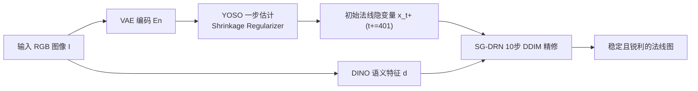

## 一句话总结

StableNormal 把 Stable Diffusion 先验改造成单目法线估计器，通过"缩减扩散推理方差"的粗到细策略（一步初始化 YOSO + 语义引导精修 SG-DRN），在无需集成（ensembling）的情况下产出既稳定又锐利的法线图。

## 研究背景

法线图作为一种 2.5D 表示，是连接 2D 与 3D 的桥梁：在 3D 建模中为多边形补充表面细节，在 2D 领域则支撑重光照、内蕴分解等应用。近年将扩散先验重新用于几何/内蕴线索估计（深度、法线、材质）成为主流，能产出"看起来很锐利"的结果。

但作者指出这类方法存在核心矛盾：扩散过程天然带有随机性（stochasticity），而 Image2Normal 本质上是一个应尽量确定性（deterministic）的任务。这种随机性导致结果虽"锐利"却"既不正确也不稳定"——时序上不一致，即便做了集成，法线方向仍显著偏离真值。方差主要来自两处：初始高斯噪声，以及多步采样中不断注入并被放大的噪声（signal-leak 问题）。

已有的两种缓解思路都各有缺陷：后处理集成（对多次输出取平均）计算量大，且其仿射不变假设难以推广到法线；而完全放弃多步生成、退化为一步感知（如 GenPercept）又会抹平高频细节、产生过度平滑的结果。因此需要在"稳定性"与"锐利度"之间找到平衡。相比深度估计（一对多的仿射不变映射），法线估计是一对一映射、更"确定"，因此消除随机性更为迫切也更可行。

## 方法

整体是一个粗到细的两阶段流水线，都基于微调后的 Stable Diffusion V2.1，文本提示统一设为 "The normal map"：

1. **YOSO（You-Only-Sample-Once）** 一步法线初始化，给出可靠但相对粗糙的初始估计 $$x_{t^+}$$。
2. **SG-DRN（Semantic-Guided Diffusion Refinement Network）** 语义引导的多步精修，逐步恢复几何细节。

**设计一：YOSO 的 $$x_{t^+}$$ 参数化。** 与 GenPercept 无噪声的一步确定性采样不同，YOSO 在输入端保留高斯噪声以兼顾锐利与稳定。它不去预测 $$t=0$$ 时刻的干净结果，而是映射到某个中间时刻 $$t^+ \in (0, T)$$（$$T=1000$$）对应的分布，损失为：

$$
L_{\theta,\phi}=\mathbb{E}_{x_{t^+},c,I,t^+}\left\|x_{t^+}-\mu_\theta^{x_{t^+}}(x_\infty, c, t^+, f_\phi(E_n(I)))\right\|^2
$$

其中 $$x_\infty$$ 是前向扩散跑到 $$t\to\infty$$ 得到的高斯样本。

**设计二：Shrinkage Regularizer（收缩正则）。** 从高斯分布直接估计 $$x_{t^+}$$ 是一个困难的多对一映射。作者不去直接惩罚预测分布的熵，而是以概率把预测分布"收缩"到狄拉克 delta 函数（即以零噪声输入的确定性预测为锚点）：

$$
L_{\theta,\phi}=
\begin{cases}
\mathbb{E}\left\|x_{t^+}-\mu_\theta^{x_{t^+}}(x_\infty, c, t, f_\phi(E_n(I)))\right\|^2, & p \ge \lambda \\
\mathbb{E}\left\|x_{t^+}-\mu_\theta^{x_{t^+}}(0, c, t, f_\phi(E_n(I)))\right\|^2, & p < \lambda
\end{cases}
$$

其中 $$p \sim U(0,1)$$，$$\lambda=0.4$$。这样有效降低了训练方差。

**设计三：SG-DRN 的语义注入。** 精修阶段的图像条件扩散模型倾向于只用局部 RGB 信息，但判断墙面等区域法线更需要全局语义。作者引入预训练 DINO 特征作为辅助条件：用一个轻量语义注入网络 $$g_\psi$$（4 层卷积，通道 16/32/64/128），配合 FeatUp 与双线性插值把 DINO 特征对齐到隐变量分辨率，再加到带噪隐变量上送入 U-Net。最终投影层用零卷积初始化。SG-DRN 采用 $$x_0$$-参数化：

$$
L_{\theta,\chi,\psi}=\mathbb{E}_{x_0,c,I,d,t}\left\|x_0-\mu_\zeta^{x_0}(x_t, c, t, f_\chi(E_n(I)), g_\psi(d))\right\|^2
$$

**设计四：启发式去噪采样。** 推理时用 10 步 DDIM，从 YOSO 给出的 $$x_{t^+}$$ 出发，经验性地把初始采样步设为 $$t^+=401$$，在稳定性与锐利度间取得最佳折中。

## 实验结果

在四个室内基准上与 SOTA 对比（角度误差，mean/med 越低越好，各阈值内像素百分比越高越好）。StableNormal 在 iBims-1、ScanNet、DIODE-indoor 上大幅领先；在 NYUv2 上略逊于 DSINE，作者归因于 ScanNet/NYUv2 由低质量传感器采集、GT 法线本身不准。

| 数据集 | 方法 | mean ↓ | med ↓ | 11.25° ↑ | 22.5° ↑ | 30° ↑ |
|---|---|---|---|---|---|---|
| DIODE-indoor | GeoWizard | 19.371 | 15.408 | 30.551 | 75.426 | 86.357 |
| DIODE-indoor | Marigold† | 16.671 | 12.084 | 45.776 | 82.076 | 89.879 |
| DIODE-indoor | GenPercept | 18.348 | 13.367 | 39.178 | 79.819 | 88.551 |
| DIODE-indoor | DSINE | 18.453 | 13.871 | 36.274 | 77.527 | 86.976 |
| DIODE-indoor | **Ours** | **13.701** | **9.460** | **63.447** | **86.309** | **92.107** |
| iBims-1 | DSINE | 18.773 | 8.258 | 64.131 | 78.570 | 82.160 |
| iBims-1 | **Ours** | **17.248** | **8.057** | **66.655** | **81.134** | **84.632** |
| ScanNet | DSINE | 18.610 | 9.885 | 56.132 | 76.944 | 82.606 |
| ScanNet | **Ours** | **18.098** | 10.097 | 56.007 | **78.776** | **84.115** |
| NYUv2 | DSINE | **18.610** | **9.885** | **56.132** | **76.944** | **82.606** |
| NYUv2 | Ours | 19.707 | 10.527 | 53.042 | 75.889 | 81.723 |

方差与速度：在 DIODE-indoor 上，本方法单次前向即可把输出方差降到 0.410（GeoWizard 需集成 5 次约 10 秒才降到 1.370），且仅耗时约 3 秒（单卡 A100）。消融显示 SG-DRN 精修、YOSO 初始化、DINO 语义特征、Shrinkage Regularizer 各自都有正贡献——例如去掉 DINO 后 DIODE-indoor 的 mean 从 13.701° 升到 15.611°，用 DSINE 初始化替代 YOSO 则升到 18.453°。下游任务上，本方法在 DTU 表面重建（2DGS + Ours 平均 Chamfer 0.70，优于各基线）、多视图重建与法线增强（配合 Wonder3D）中均带来提升。

## 亮点与局限

**亮点**
- 精准指出扩散先验用于 Image2Normal 的核心矛盾：随机性 vs. 确定性，并给出简洁有效的方差缩减解法。
- YOSO + Shrinkage Regularizer 让一步估计就能与 SOTA 回归方法 DSINE 相当，作为可靠初始化。
- 无需集成即可显著降低方差、提升速度，对极端光照、模糊、透明/反射表面、杂乱场景都较鲁棒。
- 代码与模型已开源，法线质量直接惠及单目/多视图表面重建与法线增强等下游任务。

**局限**
- 训练数据以合成室内/物体为主，缺少户外场景与植物等，导致对植物表面等存在归纳偏置误差；作者认为可通过增加相应渲染数据缓解。
- 在 NYUv2/ScanNet 这类 GT 法线偏平滑的数据集上，精修反而可能在数值指标上不占优（尽管定性更好），反映指标与真实质量之间的错位。
- 精修仍依赖多步 DDIM 采样，虽已压到 10 步，但相比纯一步方法仍有额外开销。

## 延伸思考

- "把预测分布收缩到 delta 函数"的思路，本质是在生成式损失与重建式损失之间做概率混合，这一 Shrinkage 正则可能迁移到深度、材质等其他确定性稠密预测任务。
- YOSO 提供可靠初值、再用少量扩散步精修的"粗到细"范式，与图像超分、视频插帧中"先粗估再细化"的思想相通，暗示扩散模型用于判别式任务时，控制初始化分布比堆叠采样步更关键。
- 用 DINO 全局语义作为条件来降低采样方差、补充局部细节，说明外部自监督表征可作为扩散去噪的"锚"，这对更广义的条件生成稳定性问题有借鉴意义。
- 论文自称是"repurpose 扩散先验做确定性估计"的一次初步尝试，如何在保留生成先验丰富性的同时进一步逼近纯确定性映射，仍是开放问题。
