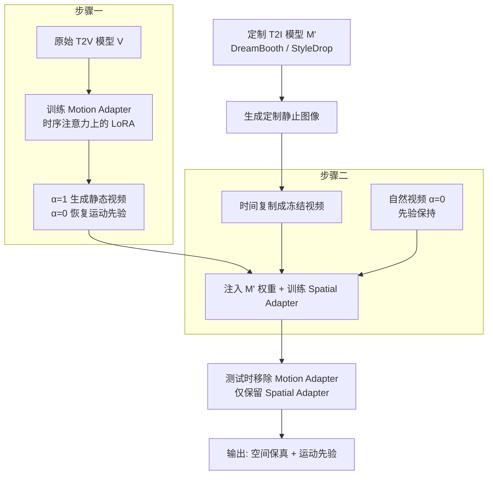

## 一句话总结

Still-Moving 提出一个通用框架，仅用静止图像（无需任何定制化视频数据）就能把定制化的文本到图像（T2I）模型权重注入到文本到视频（T2V）模型中，通过训练轻量的 Spatial Adapter 与 Motion Adapter，让生成视频既保留 T2I 的空间先验，又保留 T2V 的运动先验。

## 研究背景

T2I 模型的定制化（个性化、风格化、条件生成）近年进展迅速，但把这些进展扩展到视频领域仍处于起步阶段，核心障碍是缺乏定制化的视频数据。

主流的 T2V 设计是在 T2I 模型上"膨胀"（inflation）——在已有空间模块之间插入时序模块。一个自然的想法是：先用 DreamBooth、StyleDrop 等方法在静止图像上定制 T2I 模型，然后把定制后的 T2I 权重直接替换进 T2V 模型。但定制后的 T2I 权重与膨胀后 T2V 中对应权重存在分布偏移，直接替换会导致明显伪影或对定制内容保真度不足。

理想做法是直接用定制内容的视频监督微调 T2V 模型，但这类视频数据往往无法获得。本文的核心思路是：把定制 T2I 生成的静止图像在时间上复制，构造"冻结视频"（frozen videos）来微调 T2V 模型，同时想办法避免模型因此丧失生成运动的能力。

## 方法

### 整体框架

给定由 T2I 模型 M 膨胀而来的视频模型 V，以及从 M 微调得到的定制模型 M′，目标是把 M′ 的权重"即插即用"地注入 V。整个流程分两步：

关键难点在于：静止图像可以复制成冻结视频，但若直接在冻结视频上训练，模型会丧失运动生成能力。为此本文用 Motion Adapter 作为"运动开关"，先让模型能在静态数据上训练，训练完再移除它以恢复运动先验。

### 关键设计一：Motion Adapter（运动开关）

时序注意力是膨胀模型跨帧共享信息的核心。输入序列 $$X \in \mathbb{R}^{F \times H \times W \times C}$$ 被重排为 $$X \in \mathbb{R}^{H \cdot W \times F \times C}$$，投影得到查询/键/值，注意力矩阵为

$$A = \mathrm{softmax}\left(\frac{Q \cdot K^{T}}{\sqrt{d_k}}\right),$$

输出为 $$Y = A \cdot V$$。这相当于把视频拆成 $$H \cdot W$$ 条时间"针"，每条针内做注意力，决定了生成视频的运动。

Motion Adapter 以 LoRA 形式加在时序注意力的投影矩阵上：

$$\tilde{W} = W + \alpha \cdot A^{W,\mathrm{down}}_{t} \cdot A^{W,\mathrm{up}}_{t},$$

其中 $$\alpha$$ 是缩放系数，$$A^{W,\mathrm{down}}_{t}$$ 随机初始化、$$A^{W,\mathrm{up}}_{t}$$ 零初始化，因此训练前模型等价于 V。训练时设 $$\alpha=1$$，从模型训练集中随机取一帧复制 F 次，用扩散去噪目标训练，使模型生成"冻结视频"。而设 $$\alpha=0$$ 时模型恢复运动能力。这个模块仅在原始非定制 T2V 上训练一次。有趣的是，其运动控制能力还能推广到负数缩放（如 $$\alpha=-1$$ 时运动量增大），可在推理时用于控制运动幅度。

### 关键设计二：Spatial Adapter（空间分布修正）

核心前提是：特征分布偏移可以用简单的线性投影修正。因此在每个被注入的定制 T2I 层之后添加 Spatial Adapter，修正进入时序层前的分布差异：

$$\mathrm{Adapter}(X) = X \cdot \left(I + A^{\mathrm{down}}_{s} \cdot A^{\mathrm{up}}_{s}\right),$$

同样是低秩矩阵相乘，$$A^{\mathrm{down}}_{s}$$ 随机初始化、$$A^{\mathrm{up}}_{s}$$ 零初始化，训练前等价于 V。训练需要梯度贯穿整个视频模型。

### 关键设计三：混合训练与先验保持

训练 Spatial Adapter 时结合两类数据：定制 T2I 模型 M′ 生成的图像（冻结视频，$$\alpha=1$$），以及 40 段非定制的自然视频用于先验保持（$$\alpha=0$$）。测试时移除 Motion Adapter，只保留训练好的 Spatial Adapter，从而在保持 T2V 运动先验的同时贴合定制 T2I 的空间先验。

## 实验结果

在两个膨胀式 T2V 模型上验证：Lumiere（基于 Imagen）和 AnimateDiff（基于 Stable Diffusion）。定制任务包括用 DreamBooth 做个性化、用 StyleDrop 做风格化，并结合 ControlNet 做条件生成。评测数据集含 10 个定制对象/风格，每个 10 条视频，共每基线 100 条对比视频。

用 CLIP 图-图相似度（CLIP-I，衡量主体/风格保真度）和文-图相似度（CLIP-T，衡量提示对齐）作为自动指标：

| 方法 | 个性化 CLIP-I | 个性化 CLIP-T | 风格化 CLIP-I | 风格化 CLIP-T |
|------|------|------|------|------|
| Injection（朴素注入） | 0.680 ± 0.018 | 0.236 ± 0.007 | 0.670 ± 0.013 | 0.211 ± 0.007 |
| Interpolation（权重插值） | 0.724 ± 0.009 | 0.320 ± 0.006 | 0.664 ± 0.008 | 0.259 ± 0.005 |
| Interleaving（交替训练） | 0.717 ± 0.011 | 0.324 ± 0.006 | 0.642 ± 0.011 | 0.275 ± 0.008 |
| Ours | **0.772 ± 0.007** | **0.325 ± 0.004** | **0.673 ± 0.01** | **0.297 ± 0.005** |

本文方法在所有子集、所有指标上均以统计显著的优势超过基线。此外作者指出仅靠 CLIP 指标不足以评价运动质量（可通过复制单张图冒充冻结视频刷高分），因此补充了用户研究：31 名参与者、每人 20 组对比 3 个问题，共 1860 票。用户研究在主体保真度、提示对齐、运动质量三方面均显著偏好本文方法。

消融实验验证三个关键组件缺一不可：去掉 Motion Adapter 会使模型几乎生成静态视频；去掉 Spatial Adapter（改为训练全部权重）会因参数量过大导致过拟合、运动减少、背景多样性下降；去掉先验保持损失会削弱泛化能力（如角色不再戴上帽子）并减少运动。

## 亮点与局限

亮点：
- 完全不需要定制化视频数据，仅用静止图像即可把 T2I 定制成果迁移到视频，直接嫁接图像领域的丰富进展。
- Motion Adapter 作为"运动开关"的设计巧妙——用它使得在静态数据上训练成为可能，训练后移除即恢复运动先验；该开关还能推广到负缩放来放大运动。
- 框架通用、轻量（参数量和优化步数都少），可应用于任意基于预训练 T2I 的膨胀式 T2V 模型，并已在 Lumiere 和 AnimateDiff 上验证，支持个性化、风格化、ControlNet 条件生成等多任务。
- 揭示了 T2V 模型学到的强运动先验：即便从未见过特定主体的运动，也能为其生成合理运动。

局限：
- 结果本质上受限于所注入的定制 T2I 模型的质量。若 T2I 模型未能准确捕捉定制对象的某些特征，视频也会表现出同样缺陷。
- 若定制 T2I 模型对背景过拟合，本文方法往往也会产生类似的过拟合。
- 作者也提出社会影响方面的担忧：技术可能被滥用于生成虚假或有害内容，需配套偏见与恶意用例检测工具。

## 延伸思考

- "分布偏移可用线性投影修正"这一前提是方法轻量化的关键。它把复杂的跨模态适配简化为在关键接口（时序层输入处）插低秩修正，值得思考它在多大范围内成立——当 T2I 定制引入的偏移超出线性可修正范围时是否会失效。
- Motion Adapter 把"运动强弱"解耦为一个可控标量维度，这种"用一个开关隔离能力、训练时开启、推理时关闭"的思路，可能迁移到其他需要在受限数据上微调却又想保留原模型某种先验的场景（如在静态数据上微调却想保留时序一致性）。
- 方法依赖膨胀式 T2V 的结构（空间层与时序层可分离）。对于原生联合建模时空、无法清晰区分空间/时序权重的视频模型，该"即插即用注入"范式如何适配是一个开放问题。
