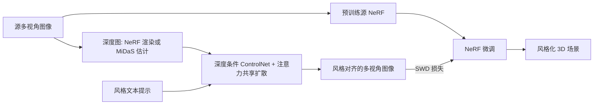

## 一句话总结

给定一个已重建好的 NeRF 场景，先用带"注意力共享"的深度条件扩散模型批量生成风格一致的多视角图像，再以切片 Wasserstein 距离（SWD）损失微调源 NeRF，从而完成由文本驱动、无需迭代替换数据集的 3D 艺术风格迁移。

## 研究背景

NeRF 等隐式三维重建技术让创作者能低成本地从真实拍摄数据构建 3D 资产，但要把整个场景编辑成某种艺术风格仍然不易。基于显式表示（如网格）的编辑需要建模、贴图、材质调整等专业技能；而近期基于 2D 生成模型的方法（如 Instruct-NeRF2NeRF、ViCA-NeRF）则借助大规模文生图模型 Instruct-Pix2Pix，通过"迭代式数据集更新"（Iterative DU）在 NeRF 训练过程中逐步替换并编辑训练图像。

这类做法的问题在于：编辑与 NeRF 训练耦合在一起同步进行，结果有时不可预测，也很难在训练前预览或调试风格效果。本文提出把"风格图像生成"与"NeRF 微调"解耦成两个独立步骤，使用户可以先用扩散管线反复尝试各种提示词和参数、预览效果，确认后再进入 NeRF 微调阶段。

## 方法

整体是一个解耦的两步流程：第一步用风格对齐的图生图扩散管线为各源视角生成风格一致的图像；第二步用 SWD 损失把源 NeRF 微调到目标风格。

**关键设计一：全共享注意力的风格对齐生成。** 仅靠对不同视角共用同一提示词，不足以产生感知一致的风格。方法采用 StyleAligned 的全共享注意力变体，让第 $$i$$ 个视角的查询同时关注所有视角的键值：

$$\text{Attn}(Q_i, K_{1\ldots n}, V_{1\ldots n}),\quad K_{1\ldots n}=[K_1,K_2,\ldots,K_n]^T,\ V_{1\ldots n}=[V_1,V_2,\ldots,V_n]^T$$

这样 $$n$$ 个视角被同时生成并共享风格特征，显著提升多视角风格一致性。

**关键设计二：源视角的深度条件约束。** 为进一步强化跨帧一致性，接入深度条件 ControlNet，并可选启用 SDEdit 对源视角做条件约束。深度图既可由源 NeRF 渲染（适合紧凑或前向场景），也可用 MiDaS 等现成估计器（适合大规模室外场景）。

**关键设计三：切片 Wasserstein 距离损失微调 NeRF。** 直接用 RGB 像素损失微调容易因几何/颜色歧义而过拟合、发糊，因此改用基于 VGG-19 特征统计的 SWD 损失来刻画感知相似度。将第 $$l$$ 层特征投影到随机单位方向后，一维 Wasserstein 距离可用排序后的 $$L_2$$ 差闭式计算：

$$\mathcal{L}_{SW1D}(p_V^l,\hat{p}_V^l)=\frac{1}{\vert p_V^l\vert }\lVert \text{sort}(p_V^l)-\text{sort}(\hat{p}_V^l)\rVert_2$$

$$\mathcal{L}_{style}=\sum_{l=1}^{L}\mathcal{L}_{SWD}(p_l,\hat{p}_l),\quad \mathcal{L}_{SWD}=\sum_{l=1}^{L}\mathbb{E}_V[\mathcal{L}_{SW1D}(p_V^l,\hat{p}_V^l)]$$

SWD 能完整捕捉目标分布，计算复杂度为 $$O(M\log M)$$，适合梯度下降训练。

**风格混合。** 给定两组风格视角的特征分布，可让源 NeRF 收敛到二者的 Wasserstein 重心，实现风格插值：

$$\mathcal{L}_{style}(I_1,I_2,\hat{I})=\sum_{l=1}^{L}\big[t\,\mathcal{L}_{SWD}(p_1^l,\hat{p}_l)+(1-t)\,\mathcal{L}_{SWD}(p_2^l,\hat{p}_l)\big]$$

实现上以 Stable Diffusion XL 为扩散骨干、Nerfstudio 的 "nerfacto" 为 NeRF 表示，一次最多同时生成 18 个视角，采用 50 步去噪、无分类器引导权重多在 5~30 之间。

## 实验结果

在多个真实场景（含大规模 360 室外、物体、前向人像）上评估，与三个消融变体对比 CLIP-TIDS、CLIP-DC 和帧间平均翘曲误差（两个场景、五个提示词、引导尺度固定 15 的平均值）：

| 指标 | No Style-Align | Train from Scratch | Style-Align w/ RGB Loss | Ours |
|---|---|---|---|---|
| CLIP-TIDS ↑ | 0.125 | 0.073 | 0.127 | **0.162** |
| CLIP-DC ↑ | 0.932 | 0.917 | 0.917 | 0.928 |
| Warp Error ↓ | 0.345 | 0.367 | 0.351 | **0.337** |

在与 Instruct-NeRF2NeRF、ViCA-NeRF 的横向对比中（四场景各三提示词，共 12 组结果），本方法在 CLIP-TIDS（0.084）、CLIP-DC（0.923）以及用户偏好（67.1%，共 33 人 396 票）上均领先，且较少出现幻觉/Janus 等问题。

## 亮点与局限

亮点：把风格图像生成与 NeRF 微调解耦，用户可在训练前反复调试提示词与参数并预览效果；抛弃迭代式数据集更新和 SDS 损失，训练显存占用更低；用 SWD 损失替代 RGB 损失有效缓解过拟合；支持基于 Wasserstein 重心的风格混合。

局限：随风格化强度增强，风格化训练图与 NeRF 渲染之间会有纹理差异，风格强度与视角一致性之间存在权衡（引导尺度约 7.5~22.5 较稳）；植物、树木等细结构和精细纹理因多视角歧义难以重建；训练图差异过大（背景不同人物、随机云层等）时难以学到细节；由于依赖深度条件，较大的几何编辑也较困难。

## 延伸思考

该方法的两步解耦范式提示了一个更通用的思路：把"生成监督信号"与"三维表示优化"分离，可显著提升可控性与可调试性。作者也指出方法可迁移到 3D Gaussian Splatting，并可能扩展到场景重光照与形变。值得进一步思考的是，SWD 这类分布匹配损失相比像素级损失在处理多视角几何/颜色歧义上的优势是否能推广到其他三维编辑任务；以及当风格对齐仅停留在"感知一致"而非"物理一致"时，如何在生成阶段就注入更强的几何约束来支持更大幅度的结构性风格迁移。
