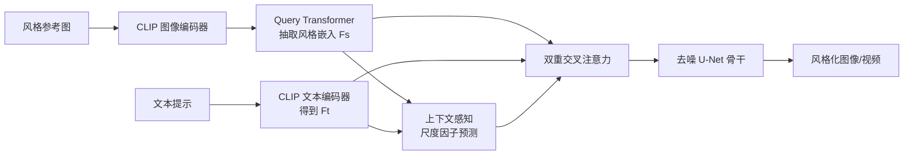

## 一句话总结

StyleCrafter 给预训练的文生视频（T2V）模型外挂一个"风格控制适配器"，只需输入一张参考图即可生成任意风格的视频；通过"先在富风格图像上训练适配器、再迁移到视频"的两阶段范式，绕开了风格化视频数据稀缺的难题。

## 研究背景

文生图（T2I）模型受益于互联网海量图像数据，能生成风格多样的图像；但文生视频（T2V）模型的训练数据以写实视频为主，风格类别匮乏，导致生成的风格化视频普遍存在风格保真度下降的问题。用文字直接描述风格也很笨拙——"words are often limited"，难以精确传达艺术风格的细节。

作者认为要给 T2V 模型补上"任意风格生成"能力，面临两个核心难点：

- 风格控制适配器需要以内容-风格解耦的方式，从参考图中准确抽取风格概念（经典的风格迁移/保持难题）。
- 开源风格化视频极度稀缺，直接对 T2V 模型做风格适配训练不现实。

StyleCrafter 的思路是把问题拆开：风格提取的能力可以在图像域学，时序质量的保持可以靠视频微调，二者分阶段解决。

## 方法

### 整体框架

StyleCrafter 在冻结的 T2V 骨干网络（基于 VideoCrafter，与 Stable Diffusion 2.1 共享空间权重）上加入一个风格适配器，由三部分组成：风格特征提取器、双重交叉注意力模块、上下文感知的尺度因子预测器。文本决定视频内容，风格图决定视觉风格，二者解耦控制。

训练采用两阶段策略：

- 第一阶段：在富含艺术风格的图像数据集（WikiArt + Laion-Aesthetics 6.5+）上学习基于参考图的风格调制（此时利用 T2V 模型保留的 T2I 能力做风格化图像生成）。
- 第二阶段：冻结风格调制部分，仅在"风格图 + 写实视频"混合数据上微调时序自注意力模块，提升生成视频的时序质量。

### 关键设计 1：内容-风格解耦的数据增强

一张风格图同时含有内容与风格信息，为保证抽取到的风格特征不夹带内容，作者构造了解耦监督：用 BLIP-2 重新生成图像描述并用正则去掉显式风格词（如 "a painting of"）；同时基于"图像的大块裁剪仍保留与整图相似的风格"这一洞察，对同一张图用不同策略生成**目标图**（短边缩放到 512 后中心裁剪内容）与**风格图**（短边缩放到 800 后随机裁 512×512 局部块），降低二者重叠区域，同时保持全局风格语义一致。

### 关键设计 2：自适应风格-内容融合（双重交叉注意力）

风格嵌入 $$F_s$$ 由可学习的 Query Transformer（Q-Former）从 CLIP 的全局语义 token 加 256 个局部 token 中抽取。融合方式上，作者对比了"attach-to-text"（把风格嵌入拼到文本嵌入再共用文本交叉注意力）与"dual cross-attention"（为风格新增一路交叉注意力再融合），实验表明后者在解耦文本与风格作用上更优，最终公式为：

$$
F^{i}_{out} = \mathrm{TCA}(F^{i}_{in}, F_t) + s_i \cdot \mathrm{LN}(\mathrm{SCA}(F^{i}_{in}, F_s))
$$

其中 $$\mathrm{TCA}$$ 与 $$\mathrm{SCA}$$ 分别为文本交叉注意力与风格交叉注意力，$$F^{i}_{in}$$ 是第 $$i$$ 层骨干特征，$$s_i$$ 为逐层尺度因子。

### 关键设计 3：上下文感知的尺度因子预测

不同风格流派对内容表达的侧重不同（抽象风格弱化内容具体性，写实风格强调内容准确性）。作者用一个可学习的因子查询与文本特征 $$F_t$$、风格特征 $$F_s$$ 交互，经 Q-Former 投影出 16 层的逐层尺度因子 $$s \in \mathbb{R}^{16}$$。观察显示：风格语义丰富的参考图（如浮世绘）倾向更高的尺度因子以强调风格，而复杂长文本提示倾向更低的尺度因子以增强内容控制。

### 关键设计 4：多条件的无分类器引导

视频模型对风格引导更敏感，用统一系数会失衡。作者在文本引导之外单独引入风格引导系数 $$\lambda_s$$：

$$
\hat{\epsilon}(z_t, c_t, c_s) = \epsilon(z_t, \varnothing) + \lambda_s\big(\epsilon(z_t, c_t, c_s) - \epsilon(z_t, c_t)\big) + \lambda_t\big(\epsilon(z_t, c_t) - \epsilon(z_t, \varnothing)\big)
$$

视频生成设 $$\lambda_t = 15.0$$、$$\lambda_s = 7.5$$；风格化图像生成设 $$\lambda_t = 7.5$$、$$\lambda_s = 5.0$$。

## 实验结果

基座为 VideoCrafter（空间权重同 SD 2.1），另用 SDXL 训练第一阶段做公平对比。测试集含 400 对风格化图像生成、300 对风格化视频生成（240 单参考 + 60 多参考）。评测用 CLIP/DINO 的文本对齐与风格一致性分数，以及 CLIP-Temp 和光流 warping error 衡量时序质量。

风格引导文生视频定量对比（CLIP-Text 文本对齐、CLIP-Style 风格一致性、CLIP-Temp 时序一致性、W.E. 光流误差 ×10⁻³）：

| 方法 | CLIP-Text ↑ | CLIP-Style ↑ | CLIP-Temp ↑ | W.E.(×10⁻³) ↓ |
|---|---|---|---|---|
| VideoComposer | 0.0468 | 0.7306 | 0.9853 | 9.903 |
| VideoCrafter* | 0.2209 | 0.3124 | 0.9757 | 61.41 |
| Ours（单参考） | 0.2726 | 0.4531 | 0.9892 | 18.73 |
| AnimateDiff（多参考） | 0.2867 | 0.3528 | 0.8903 | 37.17 |
| Ours(S-R) | 0.2661 | 0.4803 | 0.9851 | 14.13 |
| Ours(M-R) | 0.2634 | 0.4887 | 0.9852 | 9.396 |

VideoComposer 倾向直接复制参考图内容，风格分虚高但文本对齐极低（0.0468），且常生成静态视频（warping error 偏低但不代表时序质量好）。VideoCrafter* 风格化能力有限、动作割裂。本方法在保持文本对齐的同时显著提升风格一致性与时序质量，多参考进一步提升表现。用户研究（1125 票）中，单参考场景本方法风格偏好率 68.9%，多参考场景达 90.0%、时序偏好率 80.7%，均明显领先对手。

风格化图像生成上（400 对测试），Ours(SD 2.1) 的 CLIP-Style 0.4836、DINO-Style 0.3652，Ours(SDXL) 进一步达 0.5615 / 0.4514，优于 DreamBooth、InST、IP-Adapter-Plus、Style-Aligned 等，同时保持较高的文本对齐。

## 亮点与局限

亮点：

- 无需任何风格化视频监督即可训练出通用 T2V 风格适配器，巧妙规避了风格化视频数据稀缺问题。
- 内容-风格解耦的数据增强 + 双重交叉注意力，让风格提取更纯净、文本与风格控制更独立。
- 上下文感知尺度因子实现了对不同风格流派与文本复杂度的自适应平衡，泛化性好。
- 借助 Q-Former 的灵活性，天然支持免调优的多参考图输入。

局限：

- 依赖 CLIP 图像编码器与特定基座（VideoCrafter / SD 2.1），风格表达上限受基座与 CLIP 特征限制。
- 评测指标本身不完美（如完全复制参考图即可刷高风格分），需综合文本分与风格分判断。
- 时序质量依赖第二阶段在写实视频上的微调，对高度艺术化场景的运动生成仍是间接学习。

## 延伸思考

- 两阶段"图像学风格、视频学时序"的解耦范式，本质是把稀缺模态（风格视频）的能力拆解为两个数据充裕子任务的组合，这一思路可推广到其他缺乏配对数据的视频生成控制任务（如光照、材质迁移）。
- 上下文感知尺度因子提供了一个可解释的"风格强度自动调节"机制，若与用户可控滑杆结合，可能带来更精细的创作交互。
- 适配器式设计意味着随着更强 T2V 基座（如 DiT 架构视频模型）出现，该方法有望即插即用地迁移，是否能在更强基座上摆脱 CLIP 特征瓶颈值得探究。
