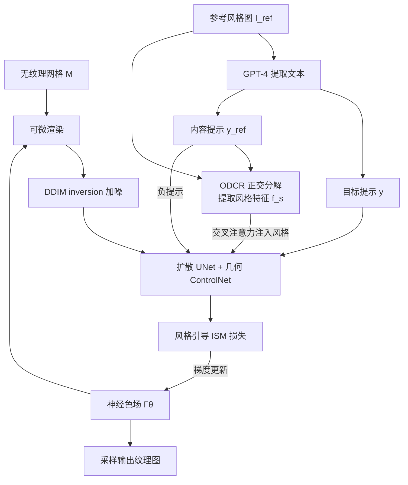

## 一句话总结

StyleTex 通过在 CLIP 空间中用正交分解剥离参考图的内容信息、只保留风格特征，并结合几何感知 ControlNet 与 Interval Score Matching 蒸馏，为给定 3D 网格生成既忠于参考图风格、又与文本提示和几何一致的纹理。

## 研究背景

风格图引导的纹理生成，目标是给定一张参考风格图、一个无纹理的 3D 网格及其文本描述，生成一张同时与参考图风格和网格几何相协调的纹理。这在游戏与影视的风格化数字环境创作中有重要价值。

已有工作大多把两个需求分开处理:2D 风格图生成通常靠微调扩散模型或调整其隐藏层来注入风格特征;3D 纹理生成则通过多视角迭代 inpainting、多视角一致的图像合成,或分数蒸馏采样(SDS)等方法实现。将蒸馏方法与"风格对齐的扩散分布"结合看似可行,但面临两个核心挑战:

- **风格与内容的彻底解耦**:在 2D 单视角下分离风格与内容大多能成功,但在 3D 中,任一视角解耦失败都会导致最终纹理出现风格不准和内容泄漏(content leakage)。
- **色调保持**:蒸馏方法容易带来过饱和(over-saturation)与过平滑(over-smoothing),造成色调偏移和细节缺失,无法准确反映目标风格。

## 方法

### 整体框架

输入为无纹理网格 M、参考风格图 $$I_{ref}$$、以及描述目标风格与内容的文本提示。作者用 GPT-4 从参考图中提取两段文本:描述目标网格及风格的提示 $$y$$,以及仅描述参考图内容的提示 $$y_{ref}$$。方法不直接优化 2D 纹理图,而是优化一个神经色场 $$\Gamma_{\theta}(p)=c$$(用 hash-grid 表示,$$p$$ 为表面位置,$$c$$ 为颜色),优化完成后再从色场采样出纹理图。

每次迭代渲染出图像、深度图与法线图,深度/法线经几何感知 ControlNet 注入以保证几何一致性;并借鉴 ISM 用 DDIM inversion 生成加噪结果 $$x_t$$ 以获得更优的噪声估计。

### 关键设计 1:正交分解去内容(ODCR)

核心洞察是:把参考图的内容用其文本提示的 CLIP 嵌入来表示,并从图像嵌入中"减掉"该内容分量。相比 InstantStyle 那种直接把图像嵌入朝内容嵌入反方向平移的朴素做法(减太少去不掉内容,减太多改变色调),作者将图像嵌入正交分解为两部分,其中一部分与内容嵌入对齐,只保留与风格相关的正交残差:

$$
f^{ref}_{g}=E^{img}_{CLIP}(I_{ref}),\quad f^{ref}_{c}=E^{text}_{CLIP}(y_{ref})
$$

$$
f^{ref}_{s}=f^{ref}_{g}-\frac{f^{ref}_{c}\,(f^{ref}_{g})^{T}f^{ref}_{c}}{\lVert f^{ref}_{c}\rVert^{2}_{2}}
$$

仅保留风格特征 $$f^{ref}_{s}$$ 去引导扩散模型。

### 关键设计 2:风格注入与内容负提示

作者观察到扩散模型不同 transformer 层对风格与内容的作用不同。与 2D 方法只选少数"风格层"不同,StyleTex 尽可能纳入所有对风格有影响的层来保持多视角风格一致性(否则会出现色调偏离参考图),同时用 ODCR 提取的干净风格特征通过交叉注意力注入。此外,把内容提示 $$y_{ref}$$ 作为负提示进一步剥离残余内容。总的梯度更新方向为:

$$
\delta(x_t,x_{t-1};y,I_{ref},y_{ref},t,t-1)=\epsilon_{\phi}(x_t;t)-\epsilon_{\phi}(x_{t-1};t-1)+\lambda_{cfg}\big(\epsilon_{\phi}(x_t;t,y)-\epsilon_{\phi}(x_t;t,y_{ref})\big)+\delta_{style}
$$

### 关键设计 3:风格引导项

借鉴分类器引导,显式加入风格引导项将渲染图分布导向目标风格分布:

$$
\delta_{style}(x_t;y,I_{ref},y_{ref},t)=\lambda_{style}\big(\epsilon_{style}(x_t;t,y,I_{ref},y_{ref})-\epsilon_{\phi}(x_t;t)\big)
$$

### 关键设计 4:ISM 蒸馏 + 几何 ControlNet

采用 Interval Score Matching(ISM)替代 SDS,用多步 DDIM 取代单步 DDPM,缓解过平滑/过饱和并加速收敛;几何感知 ControlNet 接收渲染的深度与法线图,增强复杂几何的纹理细节并抑制 Janus 问题。总损失梯度为:

$$
\nabla_{\theta}\mathcal{L}^{style}_{ISM}(\theta)=\mathbb{E}_{t,c}\Big[\omega(t)\,\delta(x_t,x_{t-1};y,I_{ref},y_{ref},t,t-1)\,\frac{\partial g(\theta,c)}{\partial\theta}\Big]
$$

## 实验结果

在 25 种风格 × 每种 4 个来自 Objaverse 的网格(共 100 个结果、每结果渲染 4 视角)上,用 Gram 矩阵距离衡量风格保真度、CLIP Score 衡量文本语义对齐,StyleTex 均优于对比方法:

| 方法 | Gram Matrix Distance ↓ | CLIP Score ↑ |
| --- | --- | --- |
| TEXTure | 0.830 | 68.01 |
| TextureDreamer | 0.947 | 68.57 |
| IPDreamer | 0.910 | 61.81 |
| SyncMVD | 0.920 | 69.60 |
| **Ours** | **0.723** | **73.66** |

此外,37 名参与者对 12 种风格 × 24 个网格结果的用户研究中,StyleTex 在整体质量(4.60)、风格保真度(4.61)、内容去除(4.36)三项均以显著优势领先(次优方法各项分别为 3.07、3.45、3.23)。单个网格纹理在 NVIDIA RTX 4090 上约需 15 分钟优化。

## 亮点与局限

**亮点**

- 用文本 CLIP 嵌入表示内容、通过正交分解去除内容分量的 ODCR 策略,在 3D 场景下比朴素的嵌入平移更干净地解耦风格与内容,兼顾风格表达与色调保持。
- 免训练/免微调:相比 TEXTure、TextureDreamer 依赖对单张参考图微调(易过拟合或抽风格不准),本方法无需额外训练即可推广到与参考图主体不同的网格。
- ISM + 几何 ControlNet 有效缓解过饱和/过平滑并保证多视角与几何一致性。

**局限**

- 风格的存在使方法难以定义一个通用渲染模型来解耦高光与阴影,导致生成纹理中可能出现"烘焙进去"的高光或阴影。
- 蒸馏耗时较长(每个网格约 15 分钟),限制了交互式应用。
- 风格由材质、笔触、色调、绘画风格等多因素组合而成,方法无法单独提取或调整其中某一要素。

## 延伸思考

- ODCR 本质是"用一段文本作为内容锚点、在 CLIP 空间做正交投影去噪",这一思路可迁移到其他需要属性解耦的多模态生成任务(如风格化图像/视频编辑)。
- 内容锚点依赖 GPT-4 从参考图反推的文本描述,描述质量与颗粒度会直接影响解耦效果;若参考图内容复杂或抽象,单条文本能否充分表征其内容值得关注。
- 结合 PBR 材质生成方向,若能把风格纹理进一步分解为反照率/粗糙度/金属度等通道,或可解决烘焙高光问题并让风格化资产更好地融入现代渲染管线。
- 蒸馏速度瓶颈可能随更快的扩散采样(few-step / 一致性模型)或更高效的 3D 表示得到改善。
