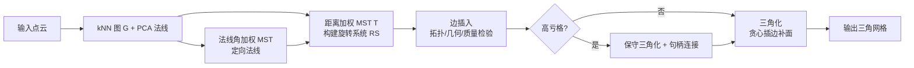

## 一句话总结

受"图加上旋转系统可唯一确定闭合流形拓扑"这一经典结论启发，本文提出一种基于旋转系统的组合式点云表面重建方法：从生成树出发，通过增量插入边不断切分面来三角化，并用显式加句柄的方式支持任意亏格，从而在离群点分类和输出拓扑控制上获得更强的可控性。

## 研究背景

从三维点云重建表面是几何处理中的基础问题，但它是病态的：即便限定输出为二流形可定向三角网格，对真实规模的输入而言可行解的数量也极其庞大。已有方法大致分为两类：

- 插值类（组合式）：以输入点为网格顶点，如 Delaunay/Voronoi 系（Crust、Power Crust、CoCone、Wrap）、Ball-Pivoting（BPA）及其尺度空间变体。
- 逼近类（体积/隐式）：如 Poisson 重建，构造一个标量场再提取等值面，抗噪、擅长补洞，但不直接使用原始点，难以量化精度。

作者观察到一个此前未被利用的图论事实：树（graph 意义上）一定是平面图，其平面嵌入由旋转系统（每个顶点上关联边的顺时针循环序）给出。因此一棵连接所有点的生成树加上旋转系统，等价于一个只有单个多边形面的多边形化，其边即树边（每条出现两次）。只要不断插入边把这个大面切成小面，就能得到三角网格。这一思路天然保证流形性质，并把拓扑控制变成"是否加句柄"的显式选择。

## 方法

### 网格表示与旋转系统

网格用半边（darts）表示。定义三个作用在半边集合上的函数：

$$\rho: H \to H$$

将顶点 $$v$$ 处一条出半边映射到其循环序中的下一条出半边（即旋转系统）；

$$\iota: H \to H, \quad \iota((v,w)) = (w,v)$$

为反转朝向的对合（fixed-point free involution）；面则由复合

$$\tau = \rho \circ \iota$$

的轨道定义：半边 $$h$$ 所属的面就是 $$\{\tau^n(h) \mid n \in \mathbb{N}_0\}$$。边是 $$\iota$$ 的轨道，顶点一环是 $$\rho$$ 的轨道。

编辑操作遵循 Euler-Poincaré 公式：

$$\vert V\vert  - \vert E\vert  + \vert F\vert  = 2(1 - g)$$

方法只需两个 Euler 算子：**切分面**（在同一面内两顶点间插边，$$\vert E\vert ,\vert F\vert $$ 各加一）与**加句柄**（在两个不同面的顶点间插边，两面合并为一个管状面，$$g$$ 加一）。

### 整体框架

三个阶段：初始化（建 kNN 图、定向法线、建两棵 MST 与旋转系统）→ 边插入（提升连通性）→ 三角化（贪心补三角形）。

### 关键设计一：旋转系统的构建与定向法线

法线用 PCA 估计朝向未定，通过法线角加权 MST 传播一致朝向，其边权为

$$w_{u,v} = 1 - \vert \mathbf{n}_u^T \mathbf{n}_v\vert $$

即法线夹角越小权重越小。随后把每个顶点的邻居投影到其切平面，以某参考方向计算角度并排序，得到循环序，从而构造 $$\rho$$。旋转系统建在完整图 $$G$$ 上，但初始网格结构取距离加权 MST $$T$$，随着插边同步更新。

### 关键设计二：边插入的三重检验

直接三角化 MST 会因连通性不足产生病态、自交三角形，因此需先对所有叶节点做边插入。每条候选边要通过：

- 拓扑检验：候选边两端必须属于同一面 $$f$$，且插入后被切分的角也属于 $$f$$，从而只切分面而不改变拓扑。
- 几何检验：在切平面内用查询集/拒绝集检测自交或重叠，拒绝集半径取 $$r_{rej} = r_{qry} + L_{max}$$；三维下还要求两端法线内积 $$\mathbf{n}_u \cdot \mathbf{n}_v \ge 0$$ 以处理薄结构。
- 质量检验：施加角度阈值避免瘦三角形、要求法线内积为正、做旋转系统一致性检查、并限制连接不能指向图距离太近的顶点。

### 关键设计三：高效的面维护与高亏格扩展

插边后需要给切出的两个面之一重新标号，朴素做法是线性成本。作者用 Euler Tour 技术把每个面的半边序列存进带隐式键的平衡二叉树，使"两半边是否同面"的查询与插边时的 split/join 维护都降到 $$O(\log N_v)$$。

对高亏格物体，先做**保守三角化**（对每个顶点设与其第 $$2/3 \cdot k$$ 短边相关的边长阈值），再做**句柄连接**：只在属于不同面、且图距离远大于欧氏距离（实践用 $$d_g(u,w) > 2n$$）的顶点对间加边，从而区分真实句柄与虚假句柄。

针对噪声，用投影距离替代欧氏距离：

$$\vert e\vert _p = (\vert e_{//v}\vert  + \vert e_{//u}\vert )/2$$

并直接在投影点上重建 kd-tree 做近邻搜索，以获得抗噪的初始 MST。

## 实验结果

在合成与真实扫描数据上与两种组合式 SOTA（Co3Ne、ScaleSpace）及 Screened Poisson 对比。核心定量指标（越小越好）：未引用顶点数 $$Unref.v$$、相交面数 $$Itsc.$$、边界边数 $$Bdry.e$$、运行时间 $$t(s)$$。下表摘录部分代表性模型（DTU 数据降采样至约 50 万点）：

| 模型 | #.v | Ours: Unref.v / Itsc. / Bdry.e / t(s) | Co3Ne(无平滑): Unref.v / Itsc. / Bdry.e / t(s) |
| --- | --- | --- | --- |
| Terrain | 80,000 | 0 / 0 / 2,741 / 12 | 471 / 0 / 8,469 / 0.2 |
| Mobius band | 76,387 | 0 / 0 / 2,377 / 10 | 1 / 0 / 386 / 0.1 |
| High-genus 1 | 143,662 | 0 / 0 / 0 / 21 | 0 / 0 / 338 / 0.2 |
| Bunny (扫描) | 362,271 | 0 / 0 / 169 / 65 | 24,998 / 0 / 62,053 / 1.2 |
| Armadillo (扫描) | 610,050 | 0 / 29 / 6,395 / 125 | 86,583 / 0 / 272,576 / 5.2 |
| Pot - stl001 | 499,251 | 0 / 0 / 404 / 117 | 46,805 / 0 / 168,397 / 3.8 |

本方法的显著特点是几乎不丢弃点（$$Unref.v$$ 常为 0），而 Co3Ne 在无平滑时会遗弃大量点、留下更多边界边；代价是本方法运行更慢。消融实验（Stanford Bunny 原始数据，指标为边界边数）表明三项检验缺一不可：全开时 173，去掉拓扑检验升至 385，去掉几何检验 889，去掉质量检验 720。参数方面 $$k=30, n=5, \theta=30, \phi=10$$；重建规模上，线性时间范围内约可处理 1000 万点（Thai Statue 约 500 万点 718 秒）。显式拓扑控制实验中，本方法能把皮层曲面强制重建为亏格 0，而其他方法难以做到。

## 亮点与局限

亮点：
- 把表面重建转化为清晰的图论框架，输出**始终保证流形**，适合可靠的自动化流程。
- 通过显式加句柄实现**可控拓扑**：已知为球/盘拓扑时可完全不加句柄，或按优先级加到指定亏格。
- **不丢点**：所有内点都进入输出网格，把去噪与重建解耦，对多子扫描合并场景无偏。
- 用 Euler Tour + 平衡二叉树把面维护降到对数复杂度，并用耳切避免后期重标号。

局限：
- 对位置噪声较鲁棒，但**对法线噪声敏感**（法线偏转 8° 即出现明显空洞）。
- 依赖一致定向的法线。
- 主要失效模式是多扫描严重错位导致的相互穿插——底层数据本身非流形，只能重建流形面，会产生无法三角化的面和断裂的网格分量。
- 当前实现是**串行**的，尚未并行化。

## 延伸思考

- 方法把"拓扑正确性"从隐式副产品变成可显式施加的约束，这在医学（皮层曲面固定亏格 0）、CAD 等对拓扑有先验的场景中价值突出，值得思考如何把类似的可控性思路迁移到隐式/神经重建里。
- 对法线噪声的敏感与对位置噪声的鲁棒形成有趣对比：作者指出法线场只需"平滑"而不必"准确"，暗示前置的法线平滑/一致化模块可能比追求精确法线更划算。
- 失效于穿插子扫描的根因是数据非流形，作者提出的"只在同扫描或法线相近时连边"是可行补救；这实际上把重建与配准/分层耦合起来，是一个可深入的方向。
- 面循环用互不干扰的平衡二叉树表示，天然适合"锁单个 faceloop、其余并行"的策略，并行化潜力随面数增长而增大，是提升实用性能的明确路径。
