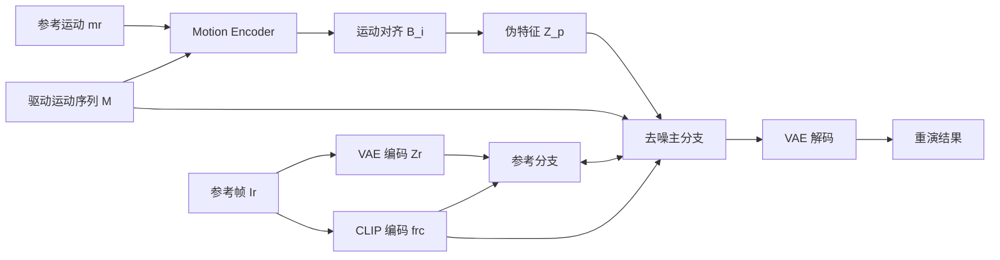

## 一句话总结

TALK-Act 提出一套以"运动增强的纹理对齐"为核心的扩散模型框架，把 2D 说话人的脸部、躯干和手势一起显式驱动，仅用 30 秒目标人视频微调即可实现时序稳定、高保真的整身 avatar 重演。

## 研究背景

2D 说话人 avatar 已广泛用于虚拟主播、助手、教学等场景，但既有工作大多只聚焦人脸动画，忽视了对躯干和手势的显式控制，而缺乏自然肢体动作的 avatar 明显不够真实。

早期整身驱动方法（基于光流 warping、GAN、神经渲染）受限于生成能力，在四肢与面部会产生明显伪影。近期基于扩散模型的方法引入 2D/3D 姿态、参数化人体模型、深度图等结构化条件，通过 ControlNet 之类的旁路网络注入控制信息，但存在两类问题：

- 外观信息利用不足、训练协议与本任务不匹配，导致结果时序不稳定；
- 代表性工作 Make-Your-Anchor 采用"通用预训练 + 个性化微调"两阶段协议，但用普通交叉注意力融合纹理与结构信息，无法在细节纹理与控制信号之间建立可靠对应关系，难以忠实表达目标姿态，出现纹理缺陷。

作者的核心洞察是：应当用显式的运动引导来增强扩散建模中的"纹理感知"，让去噪网络明确知道参考帧的哪块纹理该对应到驱动姿态的哪个位置。

## 方法

整体框架采用双分支设计：一个负责去噪的主分支（Denoising Branch）和一个处理参考帧外观的参考分支（Reference Branch），两者结构对称、通过交叉注意力交互。与 ControlNet 不同，驱动运动引导被送入去噪主分支，使空间信息可以经跳连增强；参考分支则专注处理参考帧纹理。此外，参考帧经 CLIP 编码后的特征也与两个分支交互。

运动引导 $$M$$ 由三种表征组合渲染而成：DWPose 的 2D 骨架、Deep3DReconstruct 的 3D 人脸网格、HaMeR 的 3D 手部网格，兼顾脸/手细节的精细度与整体效率。训练采用自重建协议，推理时用另一身份的驱动视频，并将 3D 人脸身份系数替换为目标身份以保证身份一致。

**关键设计 1：构建运动对应矩阵。** 直接把驱动运动 $$M$$ 与纹理对齐很困难，但在两个"运动"的结构引导之间建立对应要容易得多。用轻量运动编码器 $$E_M$$ 分别编码参考运动特征 $$F_r$$ 与驱动运动特征 $$F_i$$，展平后做缩放点积得到对应矩阵：

$$B_i = \frac{F_i F_r^{\top}}{\sqrt{c_0}}$$

该矩阵刻画了参考帧与第 $$i$$ 帧驱动运动在各空间位置上的相似相关性，作为显式指示器引导后续纹理对齐。

**关键设计 2：运动增强的纹理对齐（Motion-Enhanced Textural Alignment）。** 一方面统一两分支输入格式：参考分支输入为外观特征 $$Z_r$$ 与运动特征 $$F_r$$ 的拼接；另一方面借助 $$B_i$$ 为去噪分支生成纹理对齐的伪特征图：

$$Z_i^{p} = \mathrm{softmax}(B_i)\, Z_r$$

将 $$Z_i^{p}$$ 与运动特征 $$F_i$$ 拼接后作为去噪分支输入。同时，对应矩阵还以偏置注意力形式增强两分支间的交叉注意力：

$$\mathrm{Reference\text{-}Att}(Q,K,V,B_i) = \mathrm{softmax}\!\left(\frac{QK^{\top}}{\sqrt{c}} + B_i\right) V$$

这让来自去噪分支的查询与参考分支的键值获得对齐先验，从而在网络输入与跨分支交互两个层面都强化了纹理感知。

**关键设计 3：基于记忆库的手部恢复（Memory-based Hand-Recovering）。** 人手难以合成，仅靠对齐特征不足。作者构建可学习的手部特征库 $$H \in \mathbb{R}^{N_b \times c}$$（$$N_b$$ 经验取 512），在 UNet 中加入 Hand-Att 层，以重建监督隐式存储手部纹理，用手部网格生成的掩码聚焦手部区域：

$$\mathrm{Hand\text{-}Att}(Q,H,Mask) = Mask \cdot \mathrm{softmax}\!\left(\frac{Q H^{\top}}{\sqrt{c}}\right) H$$

**关键设计 4：时序建模与两阶段训练。** 去噪分支一次处理 $$n$$ 帧驱动运动，沿用 Temporal-Att 自注意力保证帧间平滑；采用通用预训练 + 个性化微调的两阶段协议。实验表明，逐帧纹理特征对齐配合常规时序模块能自然带来时序稳定性。

## 实验结果

在 5 个预训练身份上与近期 SOTA 方法对比，TALK-Act 在视觉质量、关键点距离、时序一致性所有指标上均取得最优（下表节选主要指标）。

| 方法 | FID ↓ | SSIM ↑ | LPIPS ↓ | PSNR ↑ | Hand ↓ | FVD ↓ |
|------|-------|--------|---------|--------|--------|-------|
| DreamPose | 66.77 | 0.67 | 0.32 | 16.19 | 18.54 | 1083.82 |
| MagicAnimate | 64.48 | 0.76 | 0.21 | 20.09 | 9.94 | 600.65 |
| DisCo | 67.37 | 0.67 | 0.30 | 19.39 | 11.84 | 554.30 |
| AnimateAnyone | 29.66 | 0.80 | 0.16 | 21.76 | 8.06 | 416.90 |
| **Ours** | **18.87** | **0.88** | **0.12** | **26.14** | **3.44** | **145.40** |

消融实验（在 "Oliver" 上）显示：去掉 Reference-Att 会带来全帧伪影与最差时序一致性；去掉纹理对齐模块在剧烈运动时无法稳定还原外观、边缘模糊；去掉手部注意力与 3D 引导则手部关键点距离最大。少样本实验表明，30 秒微调数据已达到可观性能，增加到 120 秒仅带来微弱提升，10 秒也能产生合理结果。用户研究中，25 名参与者在动作准确度、视觉质量、时序一致性三项上都给出最高分（分别 4.21 / 4.10 / 4.15）。此外，接入现成的 audio-to-mesh 模型即可支持音频驱动的面部动画，SyncScore 与 ReTalking 相当且最接近真值。

## 亮点与局限

亮点：
- 首次在统一扩散框架中同时显式驱动脸、躯干与手势，并支持音频驱动面部；
- "运动对应矩阵"巧妙地在参考与驱动的结构引导之间建立桥梁，把纹理对齐问题转化为易解的运动匹配问题；
- 手部特征记忆库针对手部合成难题给出有效解，2D+3D 混合引导兼顾精度与效率；
- 数据高效，仅需 30 秒（甚至 10 秒）个性化数据即可高保真重演。

局限：
- 不稳定的相机运动和背景变化会给模型带来挑战，作者建议未来对身体运动与背景动态做解耦建模；
- 对人体与物体之间交互的一致性处理能力有限，存在失败案例；
- 存在伪造演讲被滥用的伦理风险，作者承诺仅限研究用途并呼吁关注整身伪造检测。

## 延伸思考

- 运动对应矩阵本质上是把"外观-姿态"对齐拆解成"姿态-姿态"对齐，这一思路对其他需要跨帧纹理搬运的任务（如虚拟试衣、姿态迁移）可能同样适用，值得迁移验证。
- 手部记忆库是"用可学习全局字典弥补细粒度区域生成难度"的典型做法，能否推广到牙齿、眼睛、发丝等其他难合成区域是自然的延伸方向。
- 框架依赖 DWPose、Deep3DReconstruct、HaMeR 等多个上游估计器，其误差会累积到运动引导中；针对相机/背景变化的鲁棒性需要背景-前景解耦，这也提示了从"重演"走向"更自由场景生成"时结构化引导范式的边界。
