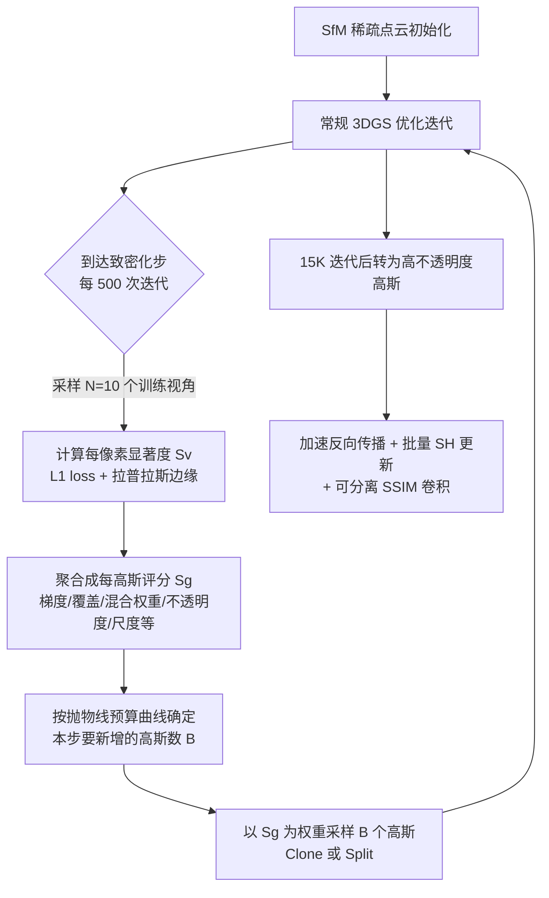

## 一句话总结

通过"预算受限、纯增量式"的评分引导致密化加上一套数值等价的反向传播与更新加速，让 3D Gaussian Splatting 能在指定的高斯数量上限内训练，得到模型体积和训练时间都缩小 4–5 倍、质量仍与原版相当甚至更优的辐射场。

## 研究背景

3D Gaussian Splatting（3DGS）用显式的高斯点云加可微光栅化，把新视角合成做到了高质量与实时渲染兼得，训练时间也还能接受。但它有几个难以驾驭的毛病：

- **资源不可控**：优化从稀疏点云开始，不断往高梯度区域添加高斯，最终数量完全由启发式阈值决定。单个无界场景可能产出数百万个高斯、占用一 GB 以上磁盘，其中很多是冗余的——某些区域高斯过密只带来微小贡献，另一些区域却欠重建、发糊。
- **不可预测**：即使输入点数相同，两个场景最终的高斯数可能相差一个数量级，训练时间也随之剧烈波动。这让 3DGS 难以用在需要固定尺寸输入的下游任务（如分类网络），也难以部署到内存受限的移动端 / AR/VR 设备。

本文的核心想法是"驯服"这个过程：给定用户指定的模型大小，用一条可预测的增长曲线加评分采样，让致密化朝着"最能提升重建质量的高斯"精准生长，并且不依赖大规模剪枝，从而始终不越过预算峰值；同时深入剖析训练管线的瓶颈，逐项替换成更快但结果等价的实现。

## 方法

整体框架是在原版 3DGS 训练流程上，替换掉致密化模块并重写若干计算内核。

**1. 可预测的模型增长（预算曲线）**
作者观察到原版 3DGS 每步新增的高斯数大致呈二次衰减。据此用一条抛物线安排每步新增量，从 SfM 初始点数出发、恰好在用户指定预算处达到峰值：

$$A(x) = \frac{B - S - 2N}{N^2}x^2 + 2x + B$$

其中 $$N$$ 是致密化步数，$$B$$ 是最终预算，$$S$$ 是初始 SfM 点数。由于优化过程仍会剔除低不透明度高斯，实际做法是按"目标累计数与当前数之差"来补足，保证最终数量精确命中预算。

**2. 评分引导的可控致密化**
把致密化频率降到原版的 1/5（每 500 次迭代一次），因为频繁按 loss 致密化会反复复制"放错位置"的高斯；给足时间后优化会先把这些高斯的不透明度压低、自然淘汰。每次致密化时：

- 先对采样视角算每像素显著度 $$S_v = \mathbf{1}_{ROI}\odot(\lambda_1 L_1 + \lambda_2 E)$$，把 L1 损失与拉普拉斯边缘结合（$$\lambda_1=\lambda_2=0.5$$），可选地用 ROI 掩码指定重点区域。
- 再把多个每高斯 / 每像素指标累加成评分 $$S_g$$，各项经中位数缩放去极值后乘以光度损失再加权求和。权重设计透露了各因素的重要性：不透明度权重最高（100，用来避开正在被淘汰的浮空高斯），位置梯度、覆盖像素到中心距离、混合权重各为 50，尺度 25（惩罚过大高斯以提升泛化），深度 5（区分前后景），像素覆盖数 0.1。
- 最后以 $$S_g$$ 为权重随机采样出本步预算数量的高斯，对其 Clone（小的）或 Split（大的）。整个过程是纯增量的，不做大规模剪枝，因此不会出现违反硬件预算的峰值。

**3. 高不透明度高斯**
普通高斯受限于固定的高斯衰减，表达力有限。训练过半（15K 迭代）后把高斯转为"高不透明度"形式：不透明度激活换成绝对值、渲染时把混合权重从上方截断到 1。这能用更少的高斯更好地拟合不透明表面，消融显示对 PSNR 尤其有帮助。

**4. 训练加速（多为数值等价替换）**
基准测试发现反向传播是最大瓶颈，其次是高斯增多后的 ADAM 更新。对应做了：
- **按 splat 并行的反向传播**：原版按像素并行、对同一高斯的梯度做原子累加，冲突严重被迫串行。改成每个线程负责一个 2D splat，线程间用 warp shuffle 交换每像素的透射率与累计颜色状态；前向时每 32 个 splat 存一次像素状态，反向时按 32 个一桶调度到一个 CUDA warp。再配合尾部遮挡跳过与更紧的裁剪。
- **加速 SH 与损失计算**：SH 系数占了每高斯 59 个属性里的 48 个，把一阶以上的 SH 波段改成每 16 次迭代才做一次 ADAM 更新；把基色与高阶 SH 分张量加载；SSIM 用可分离的两次 1D 卷积加融合内核实现。除批量 SH 更新外，这些替换都与原版结果等价。

## 实验结果

在 Tanks&Temples、MipNeRF-360、Deep Blending 三个数据集、RTX A4500 上评测。下面是"合理预算"场景下 MipNeRF-360 的对比（数字忠于原文）：

| 方法 | SSIM | PSNR | LPIPS | 训练时间 | 最终高斯数(10⁶) | 峰值高斯数(10⁶) |
|------|------|------|-------|---------|----------------|----------------|
| 3DGS | 0.815 | 27.46 | 0.215 | 43 m | 3.31 | 3.31 |
| C3DGS | 0.811 | 27.34 | 0.221 | 43 m | 2.44 | 2.94 |
| Mini-Splatting | 0.822 | 27.26 | 0.217 | 30 m | 0.50 | 4.32 |
| INGP-Big | 0.699 | 25.59 | 0.331 | 8 m | - | - |
| **本文** | 0.801 | 27.31 | 0.252 | **11 m** | **0.63** | **0.63** |

在这个预算下，本文用约 1/5 的高斯数和约 1/4 的训练时间取得与 3DGS 相当的质量（PSNR 尤其接近）。关键差异在峰值：Mini-Splatting 这类先过采样再剪枝的方法峰值与最终数量差距可达 10 倍，而本文纯增量式，峰值等于最终值，全程显存低于 10 GB。

当把预算配到与原版 3DGS 相同数量时（表下半部分），本文质量全面超过 3DGS 和 MipNeRF360，仅次于慢得多的 Zip-NeRF。消融显示：去掉评分采样 / 图像损失会明显掉质量，去掉高不透明度高斯同样掉质量；恢复原版 SH 更新频率质量几乎不变但速度掉最多 50%，换回原版反向传播速度损失更大。

## 亮点与局限

亮点：
- 把不可控的进化式致密化改成"精确命中预算"的确定性调度，让模型大小与显存可预先设定，适配边缘设备和固定尺寸输入的下游任务。
- 评分函数是可插拔、可加权的框架，能通过 ROI 掩码把质量优先分配给重点区域（如人脸），论文展示了在同等人脸 PSNR 下用远少于 3DGS 的高斯、更短时间达成，指向延迟敏感的远程呈现场景。
- 训练加速多为数值等价替换，可作为原版 3DGS 的 drop-in，且比 gsplat 1.0 快 1.5–2 倍。

局限：
- 要达到最优质量仍需要相当的样本量和"高斯在场景中来回游走"的探索过程，本质上没有摆脱这种漫长搜索。
- 预算的倍率（如室内 2×、无界室外 15×）目前是按场景手工设定，需要真实坐标或对应乘子才能自动化。
- 方法针对渲染/优化内核优化，未处理 PyTorch 本身的开销；作者把高效搜索路径、占用预测、盲区补全列为未来工作。

## 延伸思考

这篇工作最有价值的转变是把"质量"和"资源"解耦：过去 3DGS 的质量与高斯数强绑定且不可控，本文证明只要致密化"生长到对的地方"，用固定预算也能追平甚至超过无约束训练。评分函数里各项权重（不透明度 100、尺度 25）其实编码了一套关于"什么样的高斯值得复制"的先验，这套先验能否学习化、能否随场景自适应是自然的延伸。另外它与现有的码本 / 熵编码压缩方法正交，叠加后有望进一步压小体积；而 ROI 引导致密化的思路，也为交互式、注视点驱动的流式重建提供了一个可落地的接口。
