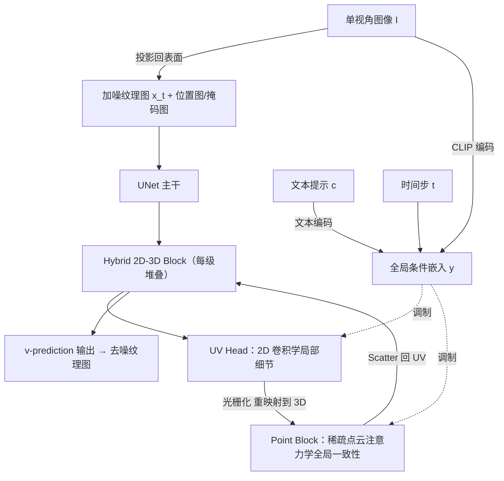

## 一句话总结

TEXGen 是首个直接在 UV 纹理空间学习、以前馈方式一步到位生成高分辨率（如 $$1024\times1024$$）网格纹理的大规模扩散模型，通过 2D-3D 混合网络架构兼顾局部细节与全局三维一致性。

## 研究背景

高质量纹理贴图是 3D 资产真实感渲染的关键，但直接在纹理空间学习的研究很少，尤其缺乏大规模数据上的训练。

现有方法主要有两类局限：

- **专用类别生成模型**：受限于可扩展性与数据规模，只能为特定类别物体生成纹理。
- **基于 2D 扩散先验的测试时优化方法**：借助预训练 2D 扩散模型，通过分数蒸馏（SDS）或多视角伪图合成来上色。这类方法虽然泛化性好，但存在逐物体优化耗时、依赖 2D 先验的固有缺陷（如 Janus 多面问题、不自然的颜色）、以及三维一致性差等问题。

此外，Point-UV Diffusion、Paint3D 等尝试用扩散模型学习纹理分布的工作，都未能在通用物体数据集上实现端到端训练或前馈推理，存在误差累积和扩展性瓶颈。作者受大模型成功经验（可扩展架构 + 大规模数据）启发，探索通过扩大模型规模与数据来构建通用、高质量的网格纹理大模型。

## 方法

### 整体框架

TEXGen 选择 **UV 纹理贴图**作为生成表示：它紧凑、可保留高分辨率细节，且能直接用真值纹理监督（而非仅靠渲染损失），天然契合扩散训练。但 UV 展开会割裂全局三维一致性——UV 图上相邻的岛屿在 3D 表面上未必相连，反之亦然。为此作者提出在 2D UV 空间与 3D 点云之间交替计算的混合网络。

训练流程基于扩散去噪：在每个去噪步，网络输入加噪纹理图 $$x_t$$、位置图 $$x_{pos}$$、掩码图 $$x_{mask}$$、单视角图像 $$I$$、文本提示 $$c$$ 和时间步 $$t$$，预测去噪方向。图像以两种方式注入：一是将像素投影回表面得到部分纹理图 $$x_I$$ 作为输入；二是用 CLIP 图像/文本编码器提取全局嵌入，与时间步嵌入结合成全局条件嵌入 $$y$$ 来调制特征。

### 关键设计 1：Hybrid 2D-3D Block

这是核心模块，由一个 UV Head 块和若干 3D 点云块组成。输入 UV 特征先经 2D 卷积块提取局部高分辨率细节——2D 卷积比 3D 卷积或点云 KNN 更高效，且在岛屿内部按表面邻域而非体积邻域聚合特征。随后通过光栅化把 UV 特征重映射回 3D 点云特征，在 3D 空间建立跨岛屿的全局邻域关系与三维一致性。这种设计用稀疏 3D 特征替代稠密体素或稠密点特征，兼顾计算可控与三维连续性，因而可扩展。

### 关键设计 2：3D 空间的序列化注意力与位置编码

点云块中：先用 grid-pooling 对稠密点特征稀疏化得到 $$f_{sp}$$；再借鉴 Serialized Attention，用空间填充曲线（z-order、Hilbert 曲线）对点分组做高效的分块注意力。位置编码上，作者发现直接用坐标不如条件位置编码，遂将 xCPE 改进为 **sCPE**：先用线性层降维、再做稀疏卷积、最后线性层升维，以在大维度（如 $$d=2048$$）下保持效率。条件调制借鉴 DiT，用 MLP 从 $$y$$ 学缩放/平移向量：$$f_{mod}=(1+\gamma)\cdot f_{in}+\beta$$，并用门控缩放融合跳连特征：$$f_{fuse}=\alpha\cdot f_{out}+f_{skip}$$。

### 关键设计 3：扩散训练目标

采用 Stable Diffusion 的噪声调度并施加 zero-terminal SNR，使 $$t=1000$$ 时 $$\bar\alpha_t=0$$，消除训练与推理起点的差异。加噪为 $$x_t=\sqrt{\bar\alpha_t}x_0+\sqrt{1-\bar\alpha_t}\epsilon$$。训练用 v-prediction：$$v_t=\sqrt{\bar\alpha_t}\epsilon-\sqrt{1-\bar\alpha_t}x_0$$，扩散损失 $$L_{diff}=\lambda_t\lVert v_t-x_{out}\rVert_2^2$$。同时对预测 $$\hat x_0$$ 的多视角渲染施加 LPIPS 损失 $$L_{render}=\frac{1}{N}\sum LPIPS(\hat I_i,I_i)$$。总损失 $$L=\lambda_1 L_{diff}+\lambda_2 L_{render}$$，取 $$\lambda_1=1,\lambda_2=0.5$$。训练时以 $$p=0.2$$ 随机丢弃文本/图像嵌入以支持分类器自由引导（CFG）。

### 关键设计 4：训练后的免调优应用

模型虽以单视角图像 + 文本训练，推理时可泛化到多种任务：**文生纹理**（用 Depth-ControlNet 从文本生成单视角图再上色）、**纹理修补**（把部分纹理图与掩码作为输入，图像嵌入置零）、**稀疏视角补全**（投影融合多张视角图，随机选一张提取图像嵌入）。推理用 DDIM 采样 30 步。

## 实验结果

数据源为 Objaverse（80 万+ 网格），清洗后得到 120,400 对数据，其中 120,000 训练、400 评估。模型约 7 亿参数。在 400 个测试物体的多视角渲染上计算 FID 与 KID，并在单张 A100 上测速：

| 方法 | FID(↓) | KID(×10⁻⁴)(↓) | 时间(↓) |
| --- | --- | --- | --- |
| TEXTure | 48.31 | 48.00 | 80s |
| Text2Tex | 49.85 | 47.38 | 344s |
| Paint3D | 43.55 | 25.73 | 95s |
| **Ours** | **34.53** | **11.94** | **10s** |

TEXGen 在质量指标上显著领先，且推理速度快一个数量级（10 秒内、无需测试时优化）。文本条件生成上，用户研究（423 份反馈）中偏好率达 69.3%（Paint3D 16.5%、TEXTure/Text2Tex 各 7.1%），MLLM Score 也最高（74.2）。消融显示：完整混合块（A）FID 69.74、KID 17.89，优于仅 UV 块（B，72.58/25.52）和仅点块（C，94.22/159.94）——去掉点块损失三维一致性、去掉 UV 块则缺乏高频细节。CFG 权重实验表明 $$\omega\approx2\text{--}3$$ 最优（异于图像扩散常用的 7.5）。

## 亮点与局限

**亮点**

- 首个能对通用物体、端到端、前馈生成高分辨率纹理贴图的扩散模型，无需额外阶段或测试时优化。
- 2D-3D 混合块设计巧妙：UV 卷积保细节 + 稀疏点云注意力保全局一致性，兼顾质量与可扩展性。
- 直接在纹理空间用真值监督，避免了仅依赖渲染损失，也规避了 2D 先验方法常见的 Janus 问题。
- 一次训练即支持文生纹理、纹理修补、稀疏视角补全等多种零样本应用。

**局限**

- 依赖 Objaverse 清洗后的数据规模（约 12 万对），相比语言/图像领域仍偏小，泛化上限受数据制约。
- 文生纹理需借助外部 Depth-ControlNet 生成初始视角图，并非完全端到端的文本到纹理。
- 作者指出模型尚可进一步用模型压缩或一致性蒸馏等加速，说明当前 30 步 DDIM 仍有优化空间。
- 生成 albedo 纹理为主，未涉及完整 PBR 材质（金属度/粗糙度等）。

## 延伸思考

- 直接在 UV 空间做扩散的思路，能否推广到 PBR 多通道材质、法线/位移贴图的联合生成？UV 割裂带来的跨岛屿一致性问题在多通道下会更突出。
- 混合 2D-3D 块本质是在"参数化 2D 效率"与"3D 几何忠实性"之间做权衡，这一范式或可迁移到点云补全、表面场预测等其它表面信号学习任务。
- 前馈纹理大模型 + 快速几何重建（如 LRM 系）串联，有望构成端到端的"图像/文本 → 带纹理 3D 资产"生产管线，值得关注两阶段误差如何耦合。
- CFG 最优权重远低于图像扩散（2 vs 7.5），暗示纹理域的条件-质量权衡特性不同，背后是否与 UV 空间的空间统计特性有关，值得深究。
