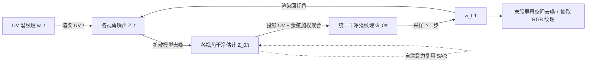

## 一句话总结

给定文本提示为任意 3D 物体生成纹理时，作者提出"同步多视角扩散"：让围绕物体的多个视角在每一步去噪中通过纹理空间的重叠区域共享潜变量，从而在扩散早期就对表面内容达成共识，消除传统"投影—修复"方法的接缝、鬼影与碎片化伪影。

## 研究背景

- 领域现状：借助预训练的文生图(T2I)扩散模型，已有方法(如 TEXTure、Text2Tex)普遍采用"投影—修复"(project-and-inpaint)范式：先用深度条件的 T2I 模型生成一个视角，投影到物体表面，再旋转相机、在新视角下对缺失区域做修复(inpaint)，逐视角迭代铺满整个物体。
- 核心痛点：每个视角是被**独立、异步**地扩散出来的，视角之间缺乏足够的一致性约束。由于渲染出的几何(深度图)只能弱约束表面的颜色、图案与结构，序列化修复过程中内容会发生漂移并累积误差，最终在物体上留下明显接缝、鬼影和过度碎片化。
- 本文 idea：把异步扩散改成**同步扩散**。让所有视角在每一步去噪时互相共享去噪内容，在去噪早期就对整体结构与色彩分布达成"共识"，并且**所有视角地位平等**，没有哪个视角凌驾于其他视角之上，从而根除不一致伪影。

## 方法

整体框架：把多视角纹理生成拆解为逐步去噪的过程。围绕物体布置 $$N$$ 个相机(默认 10 个)，用同一张 UV 潜纹理渲染出 3D 一致的各视角初始噪声；每一步先由扩散模型对各视角预测干净估计 $$Z_{0\vert t}$$，再把这些视角投影回 UV 纹理空间融合成一张统一的干净潜纹理，然后基于它采样下一步、并渲染回各视角。UV 映射充当所有视角之间预先建立的连接桥梁，用来对齐并再分发同步后的结果。

**关键设计一：纹理域内的多视角扩散(MVD)。** 选择在 UV 纹理空间而非成对的屏幕空间做同步。把各视角的干净估计 $$Z_{0\vert t}$$ 投影为部分纹理 $$W_{0\vert t}=\mathrm{UV}(Z_{0\vert t})$$，然后按余弦相似度加权聚合成统一纹理：
$$\hat{w}_{0\vert t}=\frac{\sum_{i=1}^{N} w^{(v_i)}_{0\vert t}\odot \mathrm{UV}(\theta^{(v_i)})^{\alpha}}{\sum_{i=1}^{N}\mathrm{UV}(\theta^{(v_i)})^{\alpha}+\gamma}$$
其中权重 $$\theta^{(v_i)}(p)=\frac{\vec{v}_i(p)\cdot \vec{n}_m(p)}{\lVert\vec{v}_i(p)\rVert\lVert\vec{n}_m(p)\rVert}$$ 是视线方向与表面法线的余弦相似度——正对表面的视角更可信。指数 $$\alpha$$ 沿去噪过程**线性递增**：早期用低 $$\alpha$$ 让各视角贡献近似均等、稳定达成共识；后期用高 $$\alpha$$ 避免朴素混合把高频细节抹平。得到 $$\hat{w}_{0\vert t}$$ 后按扩散采样公式算出 $$w_{t-1}$$，再渲染回各视角 $$Z_{t-1}=\mathrm{UV}^{-1}(w_{t-1})$$。

**关键设计二：Voronoi 填充解决投影稀疏性。** 屏幕到纹理的投影用可微渲染器的反传实现，只有屏幕可见的 texel 能拿到非零梯度，导致投影到 UV 的有效 texel 是离散的点而非连续块，聚合时信息交换会被稀疏性破坏。作者用基于 Voronoi 图的填充把潜 texel 扩散填满 UV 空洞，再用三角形可见性掩码 $$M(v_i)$$ 裁掉超出该视角可见范围的部分，得到成片有效的部分纹理供聚合。

**关键设计三：自注意力复用(SAR)。** 当多个视角被拼接进同一张图去噪时会自发形成协调外观。作者在批量自注意力中做拼接，让每个视角关注多个相关视角以强化一致性。为避免视角过多时 Softmax 导致细节退化，分阶段设计两套注意力方案：
$$\mathrm{Attention}(v_i)=\begin{cases}\beta\cdot \mathrm{SA}(v_i,v_{\{i-1,i,M(i)\}})+(1-\beta)\cdot \mathrm{SA}(v_i,v_{ref}) & t> t_{ref}\\ \mathrm{SA}(v_i,v_{\{i-1,i,M(i)\}}) & \text{otherwise}\end{cases}$$
早期($$t>t_{ref}$$)同时关注自身/邻居/镜像视角(利于左右对称物体的左右协调)以及一个参考视角 $$v_{ref}$$(默认正面)做全局协调；后期关闭参考视角注意力，以免参考视角看不到的内容被破坏。当视角间重叠很小甚至没有时，SAR 能弥补 MVD 达成共识。

**关键设计四：末段在屏幕空间收尾抽取纹理。** 不把潜纹理一路去噪到底：一是投影得到的潜纹理存在拉伸/旋转，直接解码会与解码器训练分布错配；二是强制 MVD 会在高频细节形成的最后几步降低锐度。因此最后阶段改在屏幕空间去噪(保持 SAR 开启)，再对完全去噪的各视角解码、投影、按余弦加权聚合抽取最终 RGB 纹理(此阶段设 $$\alpha=6$$ 并关闭 Voronoi 填充以保锐度)。

## 实验结果

在 FID(相对 SD+ControlNet 分布的图像质量)、CLIP score(与提示的匹配度)、3D 一致性得分(所有视角对的 CLIP 图像嵌入平均相似度)三项指标，以及基于 10 组网格—文本对的用户偏好研究上与六种方法对比。本文方法在三项客观指标上均为最优，用户研究中在自然色彩、更少伪影、更好一致性上大幅领先(用户偏好为"最优选择"的百分比)：

| 方法 | FID ↓ | CLIP Score ↑ | Consist. ↑ | 更少伪影 % ↑ | 3D 一致性 % ↑ |
|---|---|---|---|---|---|
| LatentPaint | 107.92 | 24.30 | 68.48 | 0.21 | 1.49 |
| Meshy | 82.24 | 26.09 | 68.92 | 6.91 | 6.94 |
| Text2Tex | 71.20 | 25.67 | 68.00 | 9.22 | 16.15 |
| TEXTure | 74.36 | 26.33 | 68.37 | 11.52 | 8.26 |
| Paint3D | 72.01 | 24.91 | 68.20 | 8.46 | 12.84 |
| TexFusion (模拟) | 62.82 | 26.15 | 68.43 | 20.84 | 17.19 |
| **本文** | **50.26** | **27.06** | **68.97** | **42.84** | **37.12** |

消融显示：去掉 MVD 模块(仅对 3D 一致初始噪声逐视角独立去噪)会出现严重鬼影，证明 MVD 对表面细节的对齐与定位不可或缺；去掉 SAR 时在早期难以达成共识，龙雕像两侧、房屋屋顶等会从不同方向出现不同颜色，说明 SAR 在视角重叠不足时能补足一致性。方法在单张物体上约需 60–150 秒，基于 Stable Diffusion v1-5 与 ControlNet v1-1 实现，UV 由 XAtlas 自动展开。

## 亮点与局限

亮点：准确定位了已有方法的病根——**异步扩散与视角间信息共享不足**，并给出"同步 + 平权融合"这一简洁而有效的解法；在 UV 纹理域(而非成对屏幕空间)做同步，天然对齐所有视角；无需高质量 UV 布局、也不依赖 3D 训练数据，是真正的 zero-shot，泛化性强；线性递增的融合指数 $$\alpha$$、Voronoi 填充、分阶段自注意力复用等工程细节针对性强；末段回到屏幕空间收尾，规避了潜纹理解码错配与高频锐度损失。

局限：生成纹理会**烘焙进光照效果**(如高光)，直接在新光照下渲染可能不正确；预训练模型偏好常见视角(如正面)，难以生成合理的底部视角(如把本应出现在正面的散热格栅画到车底);在深度不连续边界(自遮挡、前景/背景交界)不保证完美边界，可能导致 RGB 纹理抽取时的颜色渗漏。

## 延伸思考

这项工作最值得借鉴的是"把一致性约束前移到扩散早期"的思路：与其在末端修补接缝，不如让所有视角在结构与色彩尚未定型时就达成共识——这与图像编辑、多视角生成中的诸多"联合去噪/潜变量共享"方案同源，核心都是选一个规范空间(这里是 UV 纹理)作为跨视角对齐的锚点。相比 TexFusion 的自回归式逐视角推进，本文的真正同步(非自回归)才让自注意力复用得以自然接入，提示"同步范式"本身可能是解锁更多一致性技巧的前提。

顺着局限看，"光照烘焙"是纹理生成走向可重光照资产的关键障碍——若能把生成目标解耦为反照率/材质通道(对接 PBR 管线)，并对深度不连续边界引入感知损失或掩码化的可靠区域抽取，方法有望从"好看的贴图"进一步升级为"可用于渲染管线的材质"。此外底部/罕见视角的先验缺失是继承自 2D 预训练模型的通病，或许需要几何感知的方向性条件或 3D 先验才能根治。
