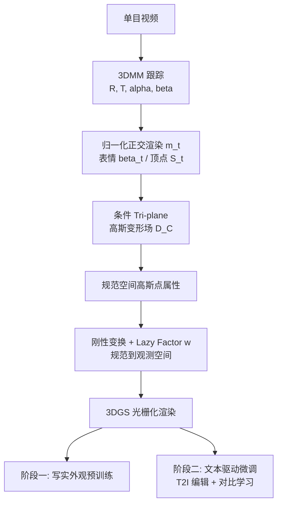

## 一句话总结

TextToon 用一段单目视频加一句自然语言指令，快速训练出可被任意身份实时驱动（约 25 FPS）的卡通化头像，核心是把条件 Tri-plane 引入 3D 高斯变形场，并用图像编辑与 patch 级对比学习实现高质量风格化。

## 研究背景

生成高质量卡通头像视频在社交媒体、影视、游戏角色制作中应用广泛。已有方法存在几类痛点：

- 基于 StyleGAN 的方法（如 VToonify、StyleGANEX）需要预先收集特定风格图片、标注数据，且再动画（re-animation）与可控性受限。
- 基于多视角建模的方法（如 AvatarStudio）依赖多相机采集，难以部署到真实消费级场景，且多以静态形式呈现，控制能力有限。
- 扩散式 Text-to-Image（T2I）编辑器存在帧间不一致问题，直接用像素监督会导致模糊、过度平滑的渲染结果。

作者提出理想的卡通化头像系统应满足三条原则：文本驱动风格化（无需专家知识与预采集数据）、对驱动信号的泛化性（可被任意身份的头部运动与表情控制）、快速适配与实时动画（几分钟内适配风格，之后在消费级设备上实时驱动）。

## 方法

整体流程分为三大块：数据获取（3DMM 跟踪）、预训练+微调（共享结构、目标不同）、条件 Tri-plane 高斯变形场。给定单目肖像视频，先逐帧做 3DMM 估计，得到归一化正交渲染图 $$m_t$$、表情参数 $$\beta_t$$ 与去除姿态和身份的顶点几何 $$S_t$$；再用条件 Tri-plane 高斯变形场在规范空间（canonical space）编辑外观并控制表情；训练分为写实外观预训练与文本驱动外观微调两阶段。

关键设计一：条件 Tri-plane 高斯变形场。3DMM 是线性模型，表情表达能力有限，直接线性变形难以覆盖卡通脸的非线性运动。方法以 $$m_t, \beta_t, S_t$$ 为条件输入，生成三平面特征 $$F_{XYZ} = \{F_{XY}, F_{XZ}, F_{YZ}\}$$，再解码出每个高斯点的属性偏移：

$$\{xyz, q, s, sh, \gamma\} = D_C(m_t, \beta_t, S_t)$$

其中粗几何顶点作为先验高斯点，Tri-plane 学到的位移在其上做精细化，从而分离"粗表示"与"细拓扑"。

关键设计二：非刚性运动解耦与 Lazy Factor。头部与肩部同属一个结构无法独立建模，但肩部只做低幅度、低频率的"懒惰"运动。方法用长方体点云初始化肩部，并引入可学习懒惰因子 $$w \in \mathbb{R}^{N \times 4}$$ 调节肩部运动：

$$xyz \cdot R \cdot w + T \to xyz'$$

约束上让头部 $$w_1 \to I_q$$、肩部 $$w_2 \to (R^{-1})_q$$，使头部刚性运动、肩部懒惰运动，在头肩间形成软边界，避免分割错误。

关键设计三：patch 级对比学习微调。为绕开 T2I 不一致带来的模糊，微调阶段不做像素监督，而是随机取 $$224 \times 224$$ 的 patch，用 CLIP 编码到语言特征空间，以编辑图 patch 为正样本、预定义负面提示为负样本做对比学习：

$$L_{CON} = -\sum_{P \in I} \log \frac{\exp(\pi(P'_j) \cdot \pi(P_j))}{\exp(\pi(P'_j) \cdot \pi(P_j)) + \exp(\pi(P_j) \cdot \pi(neg))}$$

微调目标函数为 $$L_{LPIPS} + \lambda_1 \cdot L_{CON} + \lambda_2 \cdot \|w \cdot w_c^T - I_q\|^2$$，强化牙齿、头发等高频特征，缓解过度平滑。

工程上，3DMM 用 Gauss-Newton 在 CPU 上解析求解，达到 25~30 FPS，把 GPU 释放给后端；写实预训练约 40k 次迭代，文本微调仅需 200~500 次迭代（约五分钟）。得益于 3DGS 的高推理速度，整体管线约 25 FPS，生成推理约 48 FPS。

## 实验结果

在 PointAvatar、StyleAvatar、InstantAvatar 等公开数据集的 8 段单目视频，加上自录与 YouTube 视频上评测，分辨率 $$512 \times 512$$。与 VToonify、StyleGANEX、FRESCO 对比，量化指标与用户研究（32 名 MTurk 参与者，5 分制）如下：

| 方法 | BRISQUE↓ | CLIP-D↑ | STD↓ | FPS↑(无跟踪) | IP↑ | TP↑ | MS↑ | VQ↑ |
|------|----------|---------|------|--------------|-----|-----|-----|-----|
| VToonify | 0.62 | 0.17 | 0.171 | 14 | 3.1 | 4.5 | 4.2 | 3.9 |
| StyleGANEX | 0.54 | 0.10 | 0.195 | 8.4 | 4.3 | 2.9 | 3.5 | 3.2 |
| FRESCO | 0.58 | 0.21 | 0.227 | 0.5 | 2.9 | 3.5 | 3.0 | 3.8 |
| TextToon | 0.49 | 0.25 | 0.130 | 48 | 3.8 | 4.3 | 4.7 | 4.1 |

TextToon 在图像质量（BRISQUE）、文本一致性（CLIP-D）、视频稳定性（STD）与推理速度（FPS）上取得最佳，用户研究里运动同步（MS）与文本呈现（TP）表现突出，整体在质量与实时性上优于基线。

## 亮点与局限

亮点：
- 作者称是首个从单目视频做文本驱动头像编辑的方法，结合 3DGS 与 T2I 实现动态头像的高质量编辑。
- 条件 Tri-plane 高斯变形场用规范嵌入处理卡通脸的非线性运动，显著提升动画准确度。
- 实时系统推理超 48 FPS、管线约 25 FPS，风格微调只需几分钟，可在移动端（Apple M1）跑到 15-18 FPS。

局限：
- 3DMM 跟踪是效率瓶颈（管线速度受其制约）。
- 依赖 T2I 编辑器质量，其固有的不一致虽被对比学习缓解，但仍是风格上限来源。
- 属人物专属（person-specific）神经渲染，每段视频需单独预训练，泛化到全新身份仍需微调流程。

## 延伸思考

- 用 CLIP 特征空间的对比学习替代像素监督，来对冲扩散编辑的帧间抖动，是一个可迁移到其他"生成结果不稳定但需时序一致"任务的思路。
- Lazy Factor 把头肩运动做软解耦，避免了对分割模型精度的强依赖，这种"用可学习权重表达运动幅度差异"的做法值得在全身/半身 avatar 上尝试。
- 若能把 3DMM 跟踪替换为更快或可端到端学习的姿态估计，管线有望进一步逼近生成推理的 48 FPS 上限。
