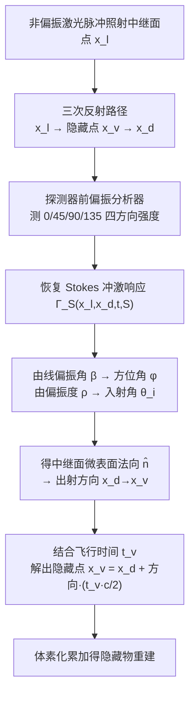

## 一句话总结

给传统的时间门控非视距（NLOS）成像系统加上一个偏振分析器，捕获三次反射光的偏振态，用中继面（relay surface）反射引入的偏振方向性去消解重建中的方向歧义，从而把过去无论如何都看不见的"缺失锥（missing cone）"里的隐藏表面重建出来——哪怕在中继面上只扫一个点。

## 研究背景

时间门控 NLOS 成像的基本思路是：激光脉冲照到一面可见的中继墙上，光散射进入拐角后的隐藏场景，再经隐藏物反射回中继墙，探测器以皮秒级时间分辨率测量这条"三次反射"路径的飞行时间，反演出隐藏物的几何。

问题在于，仅靠飞行时间会带来根本性的方向歧义：对一个给定的飞行时间，所有可能反射出这束光的候选点都落在一个椭球面（共焦设置下是球面）上，无法确定光究竟来自哪个方向。现有方法只能靠对输入数据或输出重建做滤波、特征提取来缓解。由此产生了 NLOS 领域长期存在的**缺失锥问题**：隐藏表面相对于中继面处在特定位置与朝向时（典型如与中继面垂直的平面），其高空间频率信号在傅里叶域趋于零、被低频淹没，落入"零重建空间"，无论采多少点都无法以足够分辨率恢复。

作者的核心洞见是：**偏振编码了光的方向性**。中继面（导体、微表面结构）在最后一次反射时，会因菲涅耳反射系数在入射面平行与垂直分量上的差异而对光产生偏振，这个偏振态里藏着光线离开中继面的方向。于是他们把偏振纳入时间门控 NLOS 的成像模型，并设计一套反演方法，用偏振携带的方向信息去修剪候选方向，进而重建缺失锥中的表面。

## 方法

### 整体框架

方法把经典 NLOS 的强度冲激响应扩展为携带偏振态的 **Stokes 冲激响应函数**（前向模型），再针对隐藏物是"去偏振材质"和"偏振材质"两种情形分别推导闭式反演，把捕获到的偏振态映射回中继面上一次反射的微表面法向，从而定出光线方向、解出隐藏点位置。唯一的硬件要求是在探测器前放一个偏振分析器。

### 关键设计 1：偏振 NLOS 前向模型

经典冲激响应 $$\Gamma(x_l, x_d, t)$$ 只记录光强。作者把它扩展为包含偏振态的 Stokes 冲激响应：

$$\Gamma_S(x_l, x_d, t, \mathbf{S}) = \int_V \alpha(\tilde{x})\, f(x_v)\, \mathbf{M}(\tilde{x})\, \mathbf{S}_l\, \delta(t - t_v)\, dx_v$$

其中 $$\mathbf{S}$$ 是到达探测器光的 Stokes 矢量偏振态，$$\mathbf{S}_l$$ 是激光源偏振态，$$\mathbf{M}(\tilde{x})$$ 是三次反射路径 $$\tilde{x}$$ 上的 Mueller 矩阵。该 Mueller 矩阵由每次反射点的 Mueller 矩阵与对齐入射面所需的坐标系旋转复合而成：

$$\mathbf{M}(\tilde{x}) = \mathbf{C}_{d,x_d}\,\mathbf{M}_{x_d}\,\mathbf{C}_{x_d,x_v}\,\mathbf{M}_{x_v}\,\mathbf{C}_{x_v,x_l}\,\mathbf{M}_{x_l}\,\mathbf{C}_{x_l,l}$$

偏振态取决于三个因素：材质偏振属性、光到达表面的入/出射方向、入射面朝向。

### 关键设计 2：去偏振隐藏物的闭式反演

直接反演上式是病态的，因为涉及 $$x_l$$、$$x_v$$、$$x_d$$ 三处未知的偏振事件。关键简化来自：**若隐藏物是去偏振材质**，其 Mueller 矩阵只有 $$(1,1)$$ 元非零，会"抹掉"此前所有偏振信息，于是三次反射的 Mueller 矩阵简化为只剩中继面最后一次反射的贡献：

$$\mathbf{M}(\tilde{x}) = \mathbf{C}_{d,x_d}\,\mathbf{M}_{x_d}\,\mathbf{M}_{x_v}$$

用微表面模型描述中继面的偏振反射（菲涅耳），单点假设下捕获到的 Stokes 矢量为：

$$\Gamma_S(x_l, x_d, t, \mathbf{S}) = \frac{\alpha(\tilde{x}) f(x_v)}{2}\begin{bmatrix} \rho_\parallel + \rho_\perp \\ (\rho_\perp - \rho_\parallel)\cos(2\varphi) \\ (\rho_\perp - \rho_\parallel)\sin(2\varphi) \\ 0 \end{bmatrix}$$

这个式子把可测量与几何量直接挂钩：**线偏振角** $$\beta = \frac{1}{2}\tan^{-1}(S_2/S_1)$$ 只依赖方位角 $$\varphi$$；**偏振度** $$\rho = \sqrt{S_1^2 + S_2^2}/S_0$$ 只依赖中继面反射的入射角 $$\theta_i$$（通过 $$\rho_\perp, \rho_\parallel$$）。于是反演变成用偏振态约束反投影：

$$f(x_v) \propto \int_\Omega\!\int_L \Gamma_S(x_l,x_d,-t_v,S_0)\,\delta\!\big(\beta - \beta(S_d)\big)\,\delta\!\big(\rho - \rho(S_d)\big)\,dx_l\,dx_d$$

该反演无需预知也不去估计隐藏物法向，只利用反射光偏振态本身。

### 关键设计 3：从偏振态直接恢复方向（四选二）

作者把偏振态映射到球坐标，直接算出引起反射的中继面微表面法向 $$\hat{n} = (\sin\theta_i\cos\varphi,\ \sin\theta_i\sin\varphi,\ \cos\theta_i)$$。由线偏振角得到方位角有两解 $$\varphi \in \{\beta,\ \beta+\pi\}$$；由偏振度围绕**伪布儒斯特角**查表得到入射角两解 $$\{\theta_{i1}, \theta_{i2}\}$$。四个组合中，含 $$\theta_{i2}$$ 的两解因方向落在中继面之后而被丢弃。随后对入射向量关于 $$\hat{n}$$ 做镜面反射得出射方向，结合飞行时间在共焦设置下解出隐藏点 $$x_v = x_d + \overrightarrow{x_d x_v}\cdot \frac{t_v c}{2}$$。

### 关键设计 4：偏振隐藏物的适配

对金属等偏振材质（传统方法因高镜面反射难以成像），作者利用共焦设置下光路可逆的三条性质：光只做线偏振、第一次与第三次中继面反射入射角相同、共焦下隐藏物不改变偏振。据此 Mueller 矩阵化为 $$\mathbf{M}(\tilde{x}) = \mathbf{C}(-\varphi)\,\mathbf{M}(\theta_{x_d})^2$$，捕获 Stokes 矢量中的反射系数变为平方项 $$\rho_\parallel^2, \rho_\perp^2$$，其余反演流程不变，只需按 $$\mathbf{M}(\theta_{x_d})^2$$ 的偏振度重建 $$\rho \to \{\theta_{i1},\theta_{i2}\}$$ 的查找表。

## 实验结果

主仿真实验基于 Mitsuba 3 上带偏振的瞬态路径追踪，把本方法与三种主流方法（LCT、f-k migration、phasor fields）对比重建 Bunny 与 Lucy。为公平比较，三种旧方法在中继面上扫 $$128\times128$$ 个共焦点，而本方法仅用 $$32\times32$$ 点（外加每点四次偏振捕获）。

| 方法 | 中继面扫描点数 | 缺失锥内特征（Bunny 耳、Lucy 翼与底座） | 玻璃度较高中继面下质量 |
|---|---|---|---|
| LCT | $$128\times128$$ | 无法重建 | 明显退化 |
| f-k migration | $$128\times128$$ | 无法重建 | 明显退化 |
| phasor fields | $$128\times128$$ | 无法重建 | 明显退化 |
| **本方法** | $$32\times32$$（少 16 倍） | **清晰重建** | **质量稳定** |

结论：本方法在采样点少 16 倍的情况下仍能恢复出旧方法完全丢失的缺失锥特征，且质量不下降。其它实验进一步支持这一点：把单个平面从 $$0°$$ 旋到 $$90°$$（完全落入缺失锥），旧方法随旋转逐渐失败，本方法始终稳定，$$90°$$ 时更是唯一能正确重建者；在中继面与目标玻璃度变化（粗糙度 $$\alpha=0.9$$ 漫反射到 $$\alpha=0.5$$ 光泽）下本方法质量稳定而旧方法显著退化；实拍原型（637 nm 皮秒激光 + PF32 SPAD 阵列 + 分析器，铝制中继面）**只扫中继面上一个点**，就重建出 $$0°$$ 与 $$90°$$ 朝向、去偏振（石膏板）与偏振（铝）两类隐藏平面，还在单点测量下同时定位了三个不同深度的平面。

## 亮点与局限

**亮点**

- 抓住"偏振编码方向性"这一物理本质，正面解决了 NLOS 领域长期悬而未决的缺失锥问题，重建出以往完全不可见的表面。
- 反演是闭式的：把捕获偏振态直接映射为中继面微表面法向与光线方向，无需重建整个体积再事后筛选，也无需预知隐藏物法向。
- 采样效率极高，仿真中少 16 倍扫描点仍不掉质量，实拍甚至单点即可重建——这对采集速度是巨大优势。
- 对去偏振与偏振（金属）两类隐藏物、以及有光泽的中继面都稳健，而传统方法要求中继面漫反射且遇光泽即退化。

**局限**

- 每个时间 bin 假设只对应单个隐藏点，当多点飞行时间相近时偏振态会"碰撞"，恢复方向退化为按强度加权的平均方向。
- 当隐藏物或中继面只反射部分偏振光时，方法会低估入射角，重建随偏振分量占比下降（95% 到 70%）而逐渐扭曲、侧移。
- 依赖单次散射微表面分布建模，无法完全刻画复杂真实材质的偏振效应；模型也局限于三次反射路径。

## 延伸思考

这篇工作最漂亮的地方是把一个被视为"信息瓶颈"的物理现象翻转成"信息来源"：偏振在很多成像流程里是被当作噪声或干扰滤掉的，而这里恰恰是中继面的偏振效应提供了飞行时间给不出的那一维方向信息，直接击穿了缺失锥。这提示我们，NLOS 乃至更广的计算成像里，测量维度的"缺口"未必要靠更密的采样或更强的先验去补，换一种物理量（偏振、光谱、相干性）常常能天然补上。

顺着作者指出的方向，把方法搬到短波红外/近红外波段很有想象力——那里表面在保持漫散射的同时更好地保留偏振，还自带人眼安全的优势，可能是偏振 NLOS 真正走向实用的落点。另一条线是"非碰撞偏振态"实验揭示的：按偏振态分离入射光路，等于给重建额外加了一个角度维度，若配合椭偏测量与分析-合成（analysis-by-synthesis）优化、发射并扫描更多偏振态，或许能在极少采样下逼近完整重建。而单点即可成像这一点，对需要极快采集或极简硬件的场景（如运动目标、便携设备）尤其诱人。

