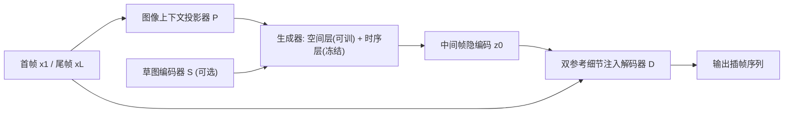

## 一句话总结

把在真实视频上学到的图生视频扩散先验迁移到卡通域，用"卡通矫正学习 + 双参考细节注入解码器 + 草图控制"三件套，实现能处理大幅非线性运动和遮挡消失的**生成式**卡通插帧，而不再依赖传统的线性对应假设。

## 研究背景

卡通动画靠逐帧手绘，制作成本高。为降低成本，人们希望用插帧算法自动补出中间帧。但卡通和真实视频有两点根本差异：一是帧"稀疏"——手绘成本高导致相邻关键帧之间运动幅度大；二是纹理稀薄——存在大量无纹理的纯色区域。

传统卡通插帧方法（如 AnimeInterp、EISAI）沿用同一思路：先在两帧之间建立对应关系（如光流），再做线性插值与融合。这类方法隐含假设运动是线性的、且不存在遮挡消失等复杂现象。面对卡通里常见的夸张非线性大运动，线性插值只能得到"漂移"式的错误结果（例如走路的人被插成滑行），遇到遮挡消失（dis-occlusion）时更会出现手臂"溶解"等崩坏。

作者提出应转向**生成式卡通插帧**：让模型主动合成复杂运动的中间帧，而不是纯靠两端已有信息去插。近来图像条件的视频扩散模型（如 DynamiCrafter、SEINE）证明大规模数据训练出的模型能从图像合成合理视频，这启发作者复用其中的运动先验。但直接套用有三个障碍：其一，模型主要在真实视频上训练，存在域差，会误合成非卡通内容；其二，视频扩散在高度压缩的隐空间里生成，细节丢失严重，而卡通的高对比区域、精细轮廓、缺少运动模糊会让这种退化格外明显；其三，生成过程随机、缺乏控制。

## 方法

ToonCrafter 以开源的 DynamiCrafter 插帧模型为底座，保留其结构并引入三项关键改进来分别解决上述三个障碍。整体流程：给定首帧 $$x_1$$ 与尾帧 $$x_L$$，生成器合成中间帧的隐编码 $$z_0$$，再由带细节注入的解码器把隐编码还原到像素空间（以 $$x_1, x_L$$ 作细节引导），草图控制则为可选项。

**关键设计一：卡通矫正学习（Toon Rectification Learning）。** 直接在小规模卡通数据上微调整个去噪网络，会因数据规模悬殊（27 万卡通片段 vs. 底座的 WebVid-10M 千万级）导致灾难性遗忘，破坏运动先验。作者把 DCinterp 拆成三块——图像上下文投影器、空间层、时序层，并观察到：时序层负责帧间运动动态，空间层负责外观分布，投影器负责理解输入帧上下文。由于卡通与真实的高层运动概念其实一致（否则人也认不出动作），**外观才是域适配的主导因素**。因此策略是：**冻结时序层**以保住真实世界运动先验，只微调图像上下文投影器与空间层来做外观矫正。数据方面收集了 500+ 小时原始卡通视频，经切镜、去静态镜头、去文字、美学打分、BLIP-2 描述与 CLIP 对齐过滤后得到 27.1 万高质量片段（27 万训练 / 1 千评测）。

**关键设计二：双参考 3D 解码器（细节注入与传播）。** 压缩隐空间会丢失细节，在卡通上表现为闪烁与结构失真。作者不只依赖解码器凭空恢复，而是从编码器 $$E$$ 中抽取输入帧 $$x_1, x_L$$ 在各残差块的内部特征 $$F_i^K$$ 注入解码过程，提出混合注意力-残差学习（HAR）机制。浅层用跨帧注意力注入细节：

$$G_{out}^j = \mathrm{Softmax}\!\left(\frac{QK^\top}{\sqrt{d}}\right)V + G_{in}^j, \quad j \in 1\ldots L$$

其中 $$Q=G_{in}^j W_Q$$，$$K=[F_i^1; F_i^L]W_K$$，$$V=[F_i^1; F_i^L]W_V$$，只在前两个浅层（$$s=\{1,2\}$$）实现以控制注意力开销。由于 $$x_1$$ 与还原的 $$\hat{x}_1$$ 像素级对齐，在深层（$$d=\{3,4,5\}$$）改用残差相加：

$$G_{out}^1 = \mathrm{ZeroConv}_{1\times 1}(F_i^1) + G_{in}^1$$

并加入伪 3D 卷积（P3D）促进信息在时间维传播、提升时序连贯。训练时冻结编码器 $$E$$，只优化解码器 $$D$$，损失为 $$L = L_1 + \lambda_p L_p + \lambda_d L_d$$（MAE、LPIPS 感知损失、判别器损失）。

**关键设计三：草图可控生成。** 生成本身带随机性，工业生产需要可控。作者提出帧独立（frame-independent）草图编码器 $$S$$，基于 ControlNet 式适配器把视频扩散模型转成草图条件模型：$$F_{inject}^i = S(s_i, z_i, t)$$。对于没有草图的帧，输入空白图 $$s_\varnothing$$ 而非直接省略——这样梯度能同时约束有无草图的帧，避免只学到单帧空间控制却破坏时序一致。训练时冻结去噪网络只优化 $$S$$，草图来自 Anime2Sketch，并以二分选择模式（80% 概率，递归深度 1~4）模拟用户等间隔提供草图的真实习惯，其余 20% 随机选取以增强泛化。

## 实验结果

在自建 1K 卡通评测集（512×320，16 帧）上与代表性方法对比，所有基线均在同数据集上微调以公平比较：

| 指标 | AnimeInterp | EISAI | FILM | SEINE | Ours |
|---|---|---|---|---|---|
| FVD ↓ | 196.66 | 146.65 | 189.88 | 98.96 | **43.92** |
| KVD ↓ | 8.44 | 5.55 | 8.01 | 2.93 | **1.52** |
| LPIPS ↓ | 0.1890 | 0.1729 | 0.1702 | 0.2519 | 0.1733 |
| CLIPimg ↑ | 0.8866 | 0.9083 | 0.9006 | 0.8531 | **0.9221** |
| CLIPtxt ↑ | 0.3069 | 0.3097 | 0.3083 | 0.2962 | **0.3129** |
| CPBD ↑ | 0.5974 | 0.6413 | 0.6317 | 0.6630 | **0.6723** |

除 LPIPS 外几乎全面领先；作者指出 LPIPS 是需要像素级对齐的全参考指标，在生成场景下不太合适——歧义运动可能有多个正确答案，真值中间帧未必唯一。24 人用户研究中，运动质量、时序连贯、帧保真三项的偏好率分别为 68.98% / 49.07% / 51.39%，均远超其他方法。

消融也印证了设计动机：矫正学习上，冻结时序层只调投影器+空间层（IV）取得最优 FVD 52.73 / CLIPimg 0.9096，优于不微调（86.62 / 0.8637）与全量微调（70.73 / 0.8978），而单纯前向跳过时序层（III）则因分布错配崩到 FVD 291.45。解码器上，完整版重建 PSNR 33.83 / LPIPS 0.0204，去掉 P3D 降至 32.51 / 0.0326，再去掉 HAR 降至 29.49 / 0.0426。

## 亮点与局限

亮点在于提出"生成式卡通插帧"这一新范式，跳出线性对应假设，首次系统性地把真实视频运动先验迁移到卡通域，且能优雅处理大非线性运动与遮挡消失。三项设计各有巧思：矫正学习用"冻时序、调外观"的洞察低成本完成域适配并避免遗忘；双参考解码器直接从输入帧搬运细节而非凭空恢复，有效对抗压缩退化；帧独立草图编码器用空白图输入的小技巧保住了稀疏控制下的时序一致。

局限方面，方法依赖成对的首尾关键帧作为输入，生成分辨率受底座限制（512×320）；生成式框架的随机性在无草图时仍难以完全控制；对训练数据分布外的极端风格或超大运动，效果仍可能受限。论文主要展示 ~2 秒的短片段插帧。

## 延伸思考

这项工作的核心方法论是"分层归因 + 定向微调"：先厘清底座网络里哪一层负责运动、哪一层负责外观，再据此决定冻结与训练的边界，从而用极小数据完成域迁移又不损伤大模型先验。这种思路对任何"把大规模通用生成模型迁移到小众垂直域"的问题都有借鉴意义——关键不在于堆数据，而在于识别域差到底落在表征的哪个部分。

另一个值得延伸的点是双参考解码器：它承认隐空间生成必然丢细节，转而用"注入已知端点信息"来补偿，本质上是把生成与检索/重建解耦。随着视频基础模型走向更高压缩率，如何在解码阶段以低成本注入参考信息、在压缩效率与细节保真间取得平衡，会是通用视频生成的共性课题。
