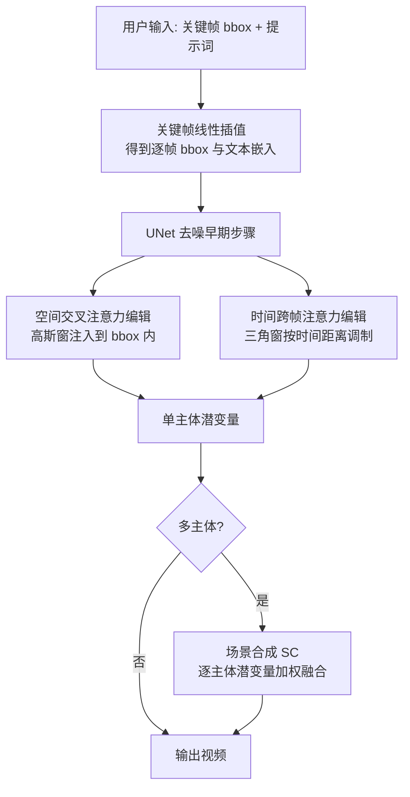

## 一句话总结

TrailBlazer 在预训练文生视频模型 ZeroScope 之上，仅用用户提供的边界框（bbox）及关键帧提示词，通过在去噪早期编辑空间交叉注意力与时间跨帧注意力，实现对视频中单个或多个主体轨迹、尺寸和外观的高层控制，全程无需训练、微调、推理期优化或已有视频作为引导。

## 研究背景

文生视频（T2V）在给定文本描述生成视频方面进步显著，但文本提示无法对物体的空间布局与运动轨迹给出精确控制，而这种控制正是叙事所必需的。现有可控方法通常依赖低层逐帧引导信号（边缘图、深度图、骨架，配合 ControlNet），能取得不错的可控性，但获取这些信号代价高昂：捕捉动物或昂贵物体的目标运动很困难，逐帧手绘运动又非常繁琐，对非专业用户不友好。

作者据此提出一个面向普通用户的高层接口：用户只需在若干关键帧处给出主体的近似 bbox 及相应提示词，系统在关键帧间做插值即可得到平滑的运动与尺寸变化。方法的核心洞见来自两点观察：其一，物体位置在去噪扩散过程的早期就已确立；其二，空间与时间注意力图具有清晰的空间语义解释。因此只需在去噪早期编辑注意力，即可把激活集中到目标位置，而不破坏预训练模型已学到的文本—图像关联。

## 方法

整体框架建立在预训练的 ZeroScope（ModelScope 的微调版本）之上。用户指定一组关键帧，每个关键帧包含 bbox 区域 $$R_f$$ 与提示词 $$P_f$$，系统对 bbox 与提示词文本嵌入做线性插值，从而平滑控制运动与内容。所有注意力编辑仅在反向去噪的早期步骤进行：空间编辑用于时间步 $$t \in \{T, ..., T-N_S\}$$，时间编辑用于 $$t \in \{T, ..., T-N_M\}$$。

**关键设计一：空间交叉注意力引导。** 交叉注意力图定义为 $$A_s = \mathrm{Softmax}(Q_s K_s^{T}/\sqrt{d})$$。对某个提示词或拖尾（trailing）索引 $$i \in I \cup T$$ 的注意力图，用一个 bbox 内的高斯窗 $$g(x,y)$$ 做注入，并对框外注意力做衰减。编辑规则为 $$A_s^{(i)}(x,y) := A_s^{(i)}(x,y) \odot W_s(x,y) + S_s(x,y)$$，其中框内注入项 $$S_s(x,y) = c_s\, g(x,y)$$、框外由 $$W_s$$（框内 $$c_w \le 1$$、框外为 1）衰减。这使目标词与拖尾图在用户指定 bbox 内获得更强激活。拖尾注意力图指没有对应提示词的那些交叉注意力图（CLIP 下最大长度 $$N_P = 77$$），其数量 $$\vert T\vert $$ 越大控制力越强，但重建失败风险也越高。

**关键设计二：时间跨帧注意力引导。** 时间注意力图 $$A_m = \mathrm{Softmax}(Q_m K_m^{T}/\sqrt{d})$$ 刻画不同帧之间相关性。作者观察到：时间上相近的帧在前景区域相关性高，相距远的帧在背景区域相关性高。据此按归一化时间距离 $$d = \frac{\vert i-j\vert }{N_F}$$ 设计三角窗注入：$$S_m(x,y) = (1-d)\,g(x,y) - d\,g(x,y)$$（框内），即 $$d \approx 0$$ 时增强框内激活，$$d \approx 1$$ 时抑制框内激活以逼近"反相关"效应。编辑规则同样为 $$A_m^{(i,j)}(x,y) := A_m^{(i,j)}(x,y) \odot W_m(x,y) + S_m(x,y)$$。

**关键设计三：关键帧与提示词插值。** bbox 在关键帧间线性插值，如 $$B_f = (1-a)\,B_b + a\,B_e,\ a = \frac{f}{N_F}$$；同一主体在不同关键帧可绑定不同提示词，插值后产生"变形"（morphing）效果（如猫渐变为狗）。用户至少指定首尾两个关键帧，即可控制位置、尺寸乃至行为身份。

**关键设计四：场景合成（Scene Compositing）。** 多主体时单套 $$c_s, c_w$$ 参数会相互干扰。作者对每个主体单独生成潜变量 $$z_t^{(r)}$$，再在去噪过程中按 bbox 区域融合到整体潜变量：$$z_t(x,y) := \frac{1}{R}\sum_{r=0}^{N_R} w\, z_t(x,y) + (1-w)\, z_t^{(r)}(x,y)$$，其中 $$w = 1 - (N_C - (T-t))/N_C$$。去噪初期优先主体潜变量，随 $$t$$ 减小权重 $$w$$ 增大转向整体潜变量，到 $$t = T-N_C$$ 时 $$w=1$$ 停止使用主体潜变量。

## 实验结果

作者在 AnimalKingdom 数据集随机选取 400 段视频，采用 Peekaboo 的提示词集，与 T2V-Zero、Peekaboo 在无额外条件引导下公平比较，报告 FID、FVD、IS、KID、mIoU、CLIPSim 等指标；mIoU 用 OWL-ViT-large 开放词表检测器获取合成主体 bbox。下表为静态 bbox 实验主结果（24 帧序列）：

| 方法 | FID(↓) | FVD(↓) | IS(↑) | KID(↓) | mIoU(↑) | CLIPSim(↑) |
|------|--------|--------|-------|--------|---------|------------|
| T2V-Zero | 198.45 | 2897.57 | 2.48 ± 0.31 | 4.39% | - | 31.54 |
| Peekaboo | 159.55 | 1521.27 | 2.27 ± 0.49 | 2.75% | 0.23 | 31.31 |
| TrailBlazer | 182.28 | 1220.98 | 2.91 ± 0.54 | 3.51% | 0.26 | **30.93** |

在动态 bbox 实验中，TrailBlazer 的 mIoU 达 0.37，明显高于 Peekaboo 的 0.25，且 FID（148.18）优于两个基线，体现了其在动态尺寸 bbox 下生成透视效果的能力。作者也坦言客观分数并未给出清晰的方法排序，但强调其核心目标是运动控制：TrailBlazer 在 mIoU 上显著领先，主观上主体朝向合理、运动自然。

## 亮点与局限

**亮点：**
- 高层接口友好，普通用户只需画几个 bbox 与写提示词，避免逐帧绘制低层控制信号。
- 完全免训练、免微调、免推理期优化，核心算法不到 200 行代码，额外计算开销可忽略。
- 支持位置、尺寸、提示词轨迹控制，并涌现出透视、朝向随运动方向自然改变、物体与环境交互（倒影、水花、阴影）等效果。

**局限：**
- 依赖底层 ZeroScope，会继承其伪影（如多出的肢体）。
- 多主体（尤其超过两个）合成仍具挑战，需要场景合成机制额外处理。
- 拖尾图数量 $$\vert T\vert $$ 需要手动调节，过大有重建失败风险；bbox 与提示词冲突时结果可能变差。
- 客观指标未能一致压过基线，优势主要体现在可控性（mIoU）与主观运动质量。

## 延伸思考

TrailBlazer 揭示了扩散视频模型内部注意力图具有明确的时空语义，"位置在去噪早期确立"这一观察为免训练可控生成提供了通用杠杆。它把 T2I 领域的空间交叉注意力编辑思路（Directed Diffusion、BoxDiff 等）推广到时间维度，用三角窗调制跨帧注意力来解释并利用前景/背景相关性差异，这种"读懂再编辑"的范式值得迁移到更多时序生成任务。随着底层模型从 UNet 转向 DiT 全注意力架构（如后续 DiTraj、FreeTraj 等工作），如何在新架构上复现类似的免训练轨迹控制、以及如何摆脱对拖尾图数量等超参的手工调节，都是自然的延伸方向。
