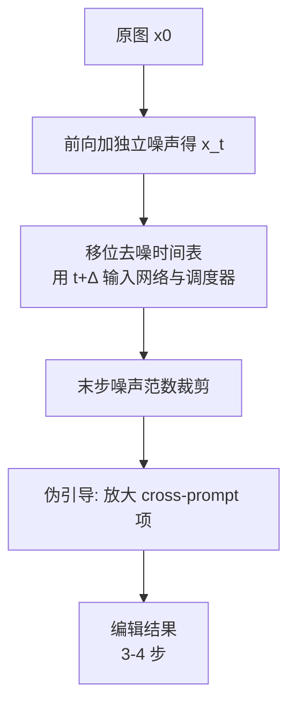

## 一句话总结

TurboEdit 通过对"编辑友好型" DDPM 噪声反演过程做两处技术上简单的修正——移位去噪时间表消除伪影、伪引导（pseudo-guidance）增强编辑强度——首次让基于文本的真实图像编辑能在少至 3 步扩散上完成（0.321 秒），质量媲美甚至超过多步方法。

## 研究背景

大规模文生图扩散模型催生了大量文本驱动的图像编辑框架，用户只需用自然语言就能修改真实图像。但这些方法几乎都依赖扩散反向过程的多步特性：在几十上百步的场景里，任何偏离训练分布的扰动都可以被后续步骤逐渐修正，或被最终步骤拉回先验分布，从而消除中途产生的伪影。

近期的模型蒸馏方法（如 SDXL-Turbo）把采样压缩到 1–8 步，若能作为编辑骨干将大幅加速编辑流程。然而步数不足时，现有编辑方法要么产生明显伪影，要么编辑几乎不起作用。

本文聚焦一类流行的编辑框架——"编辑友好型"（edit-friendly）DDPM 噪声反演。其做法是：对原图按前向扩散公式逐步加入**相互独立采样**的噪声得到各步噪声图，再反推出能在 DDPM 反向过程中重建原图的逐步噪声修正项；编辑时只需替换描述文本、复用这些预计算噪声即可。作者将该方法应用到少步模型时的失败归为两类：**视觉伪影**与**编辑强度不足**，并逐一分析根因给出解法。

## 方法

整体框架建立在 SDXL-Turbo 之上。回顾 DDPM 去噪方程：

$$
x_{t-1} = \mu_t(x_t, c) + \sigma_t z_t, \quad t = T, \dots, 1
$$

编辑友好反演对原图按前向公式加入独立噪声：

$$
x_t = \sqrt{\bar\alpha_t}\, x_0 + \sqrt{1 - \bar\alpha_t}\, \tilde\epsilon_t
$$

再反推逐步修正项 $$\sigma_t z_t = x_{t-1} - \mu_t(x_t, c)$$，编辑时用新提示 $$\hat c$$ 去噪并复用这些修正：$$\hat x_{t-1} = \mu_t(\hat x_t, \hat c) + x_{t-1} - \mu_t(x_t, c)$$。

TurboEdit 在此基础上做两处修正，构成两条主线。

### 关键设计一：移位去噪时间表消除伪影

作者统计反演修正项 $$x_{t-1} - \mu_t(x_t)$$ 的逐像素标准差，发现它在整个过程中都**高于**标准 DDPM 噪声表，且偏差近似恒定——反演噪声的行为像是来自"向过去移动约 200 步"的更嘈杂时间点。这一噪声统计量与条件时间步之间的错配造成训练-测试失配，进而产生伪影。少步模型没有足够步数来纠正这种偏移，伪影因此显现。

修正方法是重新对齐时间表：在反演与生成时都向网络和调度器注入一个更大的时间步 $$t + \Delta$$：

$$
\sigma_t \cdot z_t = x_{t-1} - \mu_{t+\Delta}(x_t, c)
$$

$$
\hat x_{t-1} = \mu_{t+\Delta}(\hat x_t, \hat c) + \left(x_{t-1} - \mu_{t+\Delta}(x_t, c)\right)
$$

即让图像"仿佛"处在与其噪声尺度匹配的时间点被清理。实践中固定移位 $$\Delta = 200$$ 步即可良好对齐。此外对最后一步的修正项做**范数裁剪**：与多步方法中末步修正很小可忽略不同，少步下末步修正很大且仍承载原图大量细节，因此不丢弃而是裁剪其范数以避免引入新伪影。

### 关键设计二：伪引导增强编辑强度

将编辑友好推理式改写为 $$\hat x_{t-1} = x_{t-1} + \left(\mu_t(\hat x_t, \hat c) - \mu_t(x_t, c)\right)$$，可见第二项与 Delta Denoising Score (DDS) 的修正项结构相同，能抵消去噪网络中与提示无关的分量。进一步加减一个交叉项，可分解出两个方向：

$$
\hat x_{t-1} = x_{t-1} + \underbrace{\mu_t(\hat x_t, \hat c) - \mu_t(\hat x_t, c)}_{\text{cross-prompt}} + \underbrace{\mu_t(\hat x_t, c) - \mu_t(x_t, c)}_{\text{cross-trajectory}}
$$

cross-prompt 项代表从旧提示走向新提示的方向，cross-trajectory 项代表从旧轨迹走向新轨迹的方向。实验表明放大 cross-trajectory 项会带来伪影与过饱和，而放大 cross-prompt 项能加强编辑效果。因此仿照 CFG 只沿 cross-prompt 方向外推：

$$
\hat x_{t-1} = x_{t-1} + \mu_t(\hat x_t, c) - \mu_t(x_t, c) + w \cdot \left(\mu_t(\hat x_t, \hat c) - \mu_t(\hat x_t, c)\right)
$$

其中 $$w$$ 是伪引导尺度。作者证明在下述条件下该方案等价于在反演与推理中重新引入 CFG：

$$
\mu_t(\hat x_t, c) - \mu_t(x_t, c) \approx \mu_t(\hat x_t, \phi) - \mu_t(x_t, \phi)
$$

其中 $$\phi$$ 为空提示。对 SDXL-Turbo 该条件通常成立（两边余弦相似度均值 0.93），因此伪引导等效于重引入 CFG 但只需 3 次网络评估而非 4 次。

### 关键设计三：跳过多步反演

由于 $$x_{t-1}$$ 与 $$\mu_t(x_t, c)$$ 都只依赖 $$x_0$$ 的闭式投影、不依赖多步去噪，它们可在推理时与反向去噪同批计算，从而省去预计算多步噪声图，把编辑步数再减半。作者还在附录中证明编辑友好反演与 DDS 在恰当的时间步和学习率选择下**函数等价**。实现上基于 SDXL-Turbo，默认 $$w = 1.5$$、4 步去噪（起始 $$t = 599$$，$$\Delta = 200$$），末步修正范数裁剪上限 15.5，单张 NVIDIA A5000 运行。

## 实验结果

在真实图像编辑基准上，用 CLIP-T、CLIP-I、CLIP-Dir 与 LPIPS 四项指标对比多步与少步基线（EF 表示编辑友好反演，时间含反演与生成，均在单张 A5000 上测）：

| 方法 | CLIP-T ↑ | CLIP-I ↑ | CLIP-Dir ↑ | LPIPS ↓ | 时间 ↓ |
|------|----------|----------|------------|---------|--------|
| EF (100 步) | 0.276 | 0.760 | 0.173 | 0.102 | 29.4s |
| Plug & Play | 0.281 | 0.746 | 0.197 | 0.116 | 202s |
| Null-text + P2P | 0.263 | 0.779 | 0.194 | 0.091 | 150s |
| ReNoise (1.0) | 0.275 | 0.727 | 0.187 | 0.123 | 2.30s |
| **Ours (4 步)** | **0.291** | 0.745 | **0.216** | 0.118 | 0.412s |
| **Ours (3 步)** | **0.291** | 0.748 | 0.211 | 0.118 | 0.321s |
| EF (4 步) | 0.269 | 0.756 | 0.120 | 0.105 | 0.576s |
| SDEdit (0.75) | 0.301 | 0.671 | 0.193 | 0.191 | 0.065s |

TurboEdit 在两项提示对齐指标（CLIP-T、CLIP-Dir）上领先所有不严重偏离原图的方法，图像保持能力与众多多步方法相当，同时速度快 ×5–×500。25 名用户共 202 次两选一偏好实验中，本方法明显优于其他少步方法，与多步方法有竞争力（仅 Plug & Play 偏好更高，但慢 ×500）。消融显示：去掉时间移位会因伪影损害图像相似度（CLIP-Dir 0.216→0.183），去掉伪引导会显著削弱提示对齐（CLIP-Dir→0.181），显式重归一化噪声会过度平滑（LPIPS 升至 0.155）。

## 亮点与局限

亮点：把多步编辑加速到亚秒级（3 步 0.321 秒），实现交互式编辑体验；两处修正在技术上简单却切中根因；通过重写推理公式揭示了编辑友好反演与 DDS、CFG 之间的深层联系，为"如何把多步工具迁移到少步域"提供了普适洞见。

局限：继承了文本编辑的通病——难以通过提示改变几何/姿态（如让人交叉手臂）、难以引入新物体（给马加帽子）；存在属性泄漏（把车变红可能连带改变背景色）；在真实图像与绘画风格互转时也可能失效。

## 延伸思考

本文最有价值的部分或许不是具体的两个修正，而是它揭示的方法论：少步模型失效的根因常常是"分布/统计错配"，而多步模型靠冗余步数把这类错配掩盖了。移位时间表本质上是对齐噪声尺度与条件时间步，这提示未来可以更原则化地重新设计少步域的噪声表。此外，编辑友好反演、DDS、CFG 三者的等价性说明这些看似不同的编辑范式共享同一底层结构（沿提示差方向外推、抵消无关分量），把它们统一起来有望催生更通用的编辑框架。作者也指出改进几何编辑与物体插入仍是开放问题。
