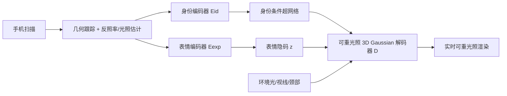

## 一句话总结

URAvatar 从一次普通手机扫描出发，借助在数百人多视角多光照数据上训练得到的「通用可重光照先验」，重建出可实时驱动、可在任意环境全局光照下实时重光照的照片级头部虚拟形象。

## 研究背景

要在虚拟环境中营造真实的临场感，虚拟形象必须与所处环境的光照一致；若形象被均匀打光或与场景光照不符，就会破坏沉浸感。然而人头是极难精确重光照的对象：光在皮肤中次表面散射、在眼睛和牙齿上反射、在发丝间被捕获，加之人群在脸型、肤质、瞳色、发型、配饰上的巨大差异，使得高保真可重光照形象传统上依赖昂贵的多光照采集穹顶和专业人员，采集过程耗时不便。

近来的工作试图把输入压缩到单张图像或单目视频，但与影棚级采集形象之间仍有明显的保真度差距。本文目标是仅凭一次手机扫描，就达到接近影棚级的可重光照质量。关键难点在于：单一环境下的手机扫描信息不足以推断头部在一般环境下的外观表现，因此需要一个能跨身份泛化的通用先验来补足光传输的先验知识。

## 方法

整体框架分为三部分：(a) 用大规模多视角、多光照的人脸表演语料训练一个跨身份解码器 $$D$$，生成体积化的可重光照虚拟形象；(b) 给定未见身份的单次手机扫描，重建头姿、几何与反照率纹理，并对预训练先验模型做个性化微调；(c) 最终模型对重光照、视线、颈部旋转提供解耦控制。

### 可学习辐射传输的外观表示

几何与外观基于 Relightable Gaussian Codec Avatars。每个 3D Gaussian 记为 $$g_k=\{t_k,q_k,s_k,o_k,c_k\}$$。外观不走参数化 BRDF 的逆渲染路线，而是直接学习辐射传输函数，把渲染方程的积分拆成入射光 $$L(\boldsymbol{\omega})$$ 与内在辐射传输 $$T$$ 的乘积，并进一步分解为漫反射与镜面反射：

$$c(p,\boldsymbol{\omega}_o)=\int_{S^2} L(\boldsymbol{\omega})\cdot\big(T_{\text{diffuse}}(p,\boldsymbol{\omega})+T_{\text{specular}}(p,\boldsymbol{\omega},\boldsymbol{\omega}_o)\big)\,d\boldsymbol{\omega}$$

漫反射项用球谐系数表达，$$c^{\text{diffuse}}_k=\boldsymbol{\rho}_k\odot\sum_{i=1}^{(n+1)^2}L_i\odot d^i_k$$，其中 $$\boldsymbol{\rho}_k$$ 为基础反照率、$$d^i_k$$ 为可学习传输函数的球谐系数；镜面反射用球面高斯建模，并带一个可学习的视相关可见性项 $$v_k(\boldsymbol{\omega}^o_k)\in(0,1)$$ 以刻画菲涅尔反射与遮挡。这样能在无需昂贵光线追踪的前提下，用全局光传输实时重光照。

### 身份条件超网络与解耦驱动

身份编码器 $$E_{id}$$ 以 $$1024^2$$ UV 空间的平均反照率纹理 $$T_{\text{mean}}$$ 与平均几何图 $$G_{\text{mean}}$$ 为输入，产出注入到解码器各层的「解绑」偏置图以及与表情无关的不透明度与反照率。表情用变分自编码器建模跨身份共享的隐分布，仅以几何差 $$\Delta G_{\text{exp}}=G_{\text{exp}}-G_{\text{mean}}$$ 为输入以规避影棚与手机纹理的域偏移，得到通用表情隐码 $$z\in\mathbb{R}^{256}$$。驱动上采取「显式 + 隐式」平衡：眼球视线与颈部旋转用线性混合蒙皮显式建模（可靠可跟踪），而复杂表情（含舌头运动）以自监督隐码学习。

### 通用可重光照显式眼睛模型与高质量几何引导

针对手机扫描中眼部观测不足、微调后易丢失眼神高光的问题，提出无需条件输入的统一镜面可见性解码器 $$D_{ev}$$，鼓励网络学到易泛化到未见身份的眼部反射模型。此外，先用改进的 Pixel Codec Avatar（PiCA，扩展到头颈肩）为每个身份逆渲染得到高质量模板几何来监督几何解码器输出，防止训练早期 3D Gaussian 陷入局部极小。

### 从手机扫描个性化

预训练损失为 $$L=L_{rec}+L_{reg}+\lambda_{kl}L_{kl}$$。微调分两步：先冻结编解码器，把采集环境光参数化为 $$N=512$$ 个均匀分布在球面上的远距点光源，只优化其强度以最小化人脸区域 L1 误差 $$L_{\text{fit-light}}=\lVert I_f-\hat I_f\rVert_1$$；再冻结光照、微调全部编解码器，微调损失额外加入 alpha 抠图损失与 VGG 损失以保留手机采集细节：$$L_{\text{finetune}}=L_{rec}+L_{reg}+\lambda_{kl}L_{kl}+L_{\text{alpha}}+L_{\text{vgg}}$$。

## 实验结果

在 LED 屏幕穹顶（直径 4.7 m）采集的多环境真值数据上，与当前手机扫描可重光照重建 SOTA 方法 FLARE 对比环境重光照（人脸区域，选一个环境作输入、在其他环境重光照，未使用真值光照）：

| 方法 | MAE ↓ | MSE ↓ | SSIM ↑ | LPIPS ↓ |
|------|-------|-------|--------|---------|
| FLARE | 0.0327 | 0.0068 | 0.8849 | 0.1722 |
| Ours  | 0.0136 | 0.0025 | 0.9524 | 0.0605 |

各项指标大幅领先。消融显示：用反照率作身份特征相比简单颜色变换的平均纹理能显著减少「烘焙」伪影；统一眼部镜面可见性解码器能在真值视线不准时仍保住眼神高光；高分辨率跟踪几何相比粗几何在新身份上更佳。训练用 64 张 A100、批量 128、40 万次迭代约 5 天；个性化阶段用 8 张 A100，约 1.3 万次迭代，含预处理约 3 小时。

## 亮点与局限

亮点：首次实现从单次手机扫描重建带全局光传输、可实时重光照的头部形象；用可学习辐射传输替代参数化 BRDF 逆渲染，避免昂贵光追同时不受 BRDF 表达力限制；显式眼球/颈部 + 隐式表情的解耦驱动兼顾控制性与可扩展性；并搭建了基于 LED 屏幕的连续光照真值评测系统。

局限：依赖影棚语料学到的通用先验，训练分布未覆盖的情况泛化欠佳（如训练者都穿灰 T 恤，衣物重光照不如头部准确）；光照估计的误差会带来「烘焙」伪影，高频光照估计仍困难，主要影响眼部重光照质量；个性化仍需多步预处理与测试时微调，尚非即时。

## 延伸思考

- 光照估计误差是主要瓶颈之一，引入更强的环境光照先验（illumination prior）有望缓解高频光照与眼部重光照问题。
- 与 URHand 的即时手部个性化思路呼应，如何把当前需数小时的头部个性化推向「即时且保留完整重光照能力」是有价值的方向。
- 可学习辐射传输 + 3D Gaussian 的组合在真实感与实时性上表现突出，值得思考它能否推广到全身、服饰乃至更一般物体的可重光照建模。
