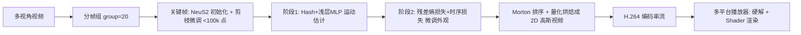

## 一句话总结

V^3 把动态 3D 高斯序列重新组织成"2D 高斯视频"，让每个高斯属性成为视频像素的一个通道，从而直接复用硬件视频编解码器（H.264）进行压缩与流式传输，实现了首个能在手机上流畅串流并渲染高质量体积视频的方案。

## 研究背景

在移动互联网时代，人们随时随地观看 2D 视频已成常态，但要在手机上流式播放、渲染高保真的体积视频（Volumetric Video / 自由视点视频 FVV）仍然困难重重：既要保持画质，又要把计算复杂度压到移动端可承受，还要在有限存储与带宽下支持串流。

已有路线各有短板：

- 传统网格重建加纹理映射虽可在移动端串流，但在遮挡、无纹理、头发等区域精度受限。
- NeRF 类方法可获得照片级效果，但难以支撑长序列与串流，逐帧串流的辐射场计算开销过大，移动端不实用。
- 动态 3DGS 渲染质量与速度俱佳，但逐帧存储开销大、难以处理长序列，且现有属性压缩方案的计算与存储成本仍不足以支撑动态高斯的实时串流。

因此，如何生成紧凑、可被硬件编解码器与着色器直接消费的动态高斯资产，是尚未解决的问题。

## 方法

### 整体框架

V^3 的核心思想是把动态 3DGS 序列表达为一组紧凑的 2D 视频。每个高斯属性（旋转、缩放、位置、不透明度、颜色、球谐）的每个维度对应一路 2D 视频，某一帧图像中同一像素位置的值就是同一个高斯点在该时刻的对应属性值。设各属性维度总数为 $$N = d(R_t) + d(S_t) + d(x_t) + d(o_t) + d(c_t) + d(SH_t)$$，则表示为视频集合 $$\{V_i\}_{i=0}^{N}$$。

渲染时给定帧索引 $$t$$，先从各视频取出编码图像 $$\{I_t^i\}_{i=0}^{N}$$，再同步遍历像素坐标恢复每个高斯：

$$x_t, R_t, S_t, o_t, c_t, SH_t = \varphi(\{I_t^i[u, v]\}_{i=0}^{N})$$

由于点云无序，无需按特定顺序、也无需记录 2D→3D 映射表，直接按像素读取顺序重建高斯即可，这大幅提升了解码速度。渲染沿用 3DGS 的投影与 alpha 混合：

$$\Sigma = R S S^T R^T, \quad \Sigma' = J W \Sigma W^T J^T$$

$$C = \sum_{i \in N} c_i \alpha'_i \prod_{j=1}^{i-1} (1 - \alpha'_j)$$

### 关键设计 1：分帧组的两阶段训练（运动-外观解耦）

逐帧从头训练会带来巨大存储且忽略帧间连续性。V^3 把序列切成帧组（组大小设为 20）以应对拓扑变化与无限长序列。每组第一帧作为关键帧：用 NeuS2 生成的三角网格采样得到初始点云，训练静态 3DGS，并按不透明度排序迭代剪枝（每次剪掉最低 30%）加微调，把点数控制在 10 万以内以压缩存储。

组内其余帧采用顺序两阶段训练。第一阶段用多分辨率哈希网格加浅层 MLP 快速估计每个高斯的位置变化：

$$h(x) = \{h_1(x), h_2(x), \ldots, h_L(x)\}$$

$$\Delta x = MLP(h(x_{t-1})), \quad x_t = x_{t-1} + \Delta x$$

此阶段沿用 3DGS 损失 $$L = (1 - \lambda) L_{photometric} + \lambda L_{D\text{-}SSIM}$$（$$\lambda = 0.2$$）。保持高斯数量在帧间恒定，能让同一表面的高斯在不同帧映射到相同的编码像素位置，避免因增删点导致的映射不连续与抖动。

### 关键设计 2：时序正则化（残差熵损失 + 时序损失）

因为要用视频编解码器压缩帧间残差，作者在微调阶段引入两项正则。残差熵损失让属性残差分布更集中、更利于熵编码。观察发现旋转、缩放、不透明度、球谐等属性的帧间残差近似高斯分布，故为其假设可学习的 $$\mu, \sigma$$。量化残差为：

$$\Delta y_t = y_t - y_{t-1}$$

$$\hat{\Delta y_t} = (\Delta y_t - y_t^{min}) / (y_t^{max} - y_t^{min}) \ast q_i + U(-\tfrac{1}{2}, \tfrac{1}{2})$$

用两个 CDF 之差近似概率质量函数，进而以比特消耗求和得到熵损失：

$$P(\hat{\Delta y_t}) = P_{cdf}(\hat{\Delta y_t} + \tfrac{1}{2}) - P_{cdf}(\hat{\Delta y_t} - \tfrac{1}{2})$$

$$L_{entropy} = \frac{1}{N} \sum_{y_t \in \{R_t, S_t, o_t, c_t, SH_t\}} -\log_2 [P(\hat{\Delta y_t})]$$

时序损失进一步约束相邻帧属性差异，减小残差：

$$L_{temp} = \frac{1}{W \times H} \sum_{y_i} \| y_t - y_{t-1} \|_1$$

微调阶段总损失为：

$$L = (1 - \lambda) L_{photometric} + \lambda L_{D\text{-}SSIM} + \lambda_e L_{entropy} + \lambda_t L_{temp}$$

### 关键设计 3：烘焙成编解码友好的 2D 格式

位置对精度敏感，用 uint16 量化（拆成高低两个 uint8，高位无损压缩），其余属性用 uint8。采用自适应分辨率，取边长为 8 的倍数的最小正方形以贴合编解码器并减少空网格。压缩上采用阈值化 QP 策略：QP < 22 时所有属性同 QP；QP > 22 时 RGB、Scale、Rotation 固定为 22，其余属性可继续增大 QP 以进一步压缩。最后用 Morton 排序把空间上邻近（属性相近）的点映射到 2D 图像的邻近位置，增强空间一致性，更利于视频编码。

### 播放器

播放端用 FFmpeg 以 H.264 编码得到多路 2D 高斯视频上传服务器；解码时拉取视频流并用 OpenCV 做硬件解码。桌面/笔记本用多线程（一线程取流解码，一线程反量化并重建点云渲染）。移动端用 Swift 实现，借助统一内存架构免去内存拷贝，用 Metal 的 Compute Shader 把图像转回点云、用 Metal Shader 实现 alpha 混合，无需 CUDA 即可跨设备渲染，支持自由视角、时间轴拖拽、播放/暂停。

## 实验结果

在 ReRF 与 Actors-HQ 数据集上与 VideoRF、3DGStream、HumanRF、NeuS2 对比，使用单张 RTX 3090 训练。V^3 在画质与存储上均领先，训练时间仅次于 3DGStream，且每帧存储小于 600KB。

| 数据集 | 方法 | PSNR↑ | SSIM↑ | 训练时间(分)↓ | 大小(MB)↓ |
|--------|------|-------|-------|--------------|-----------|
| ReRF | HumanRF | 28.82 | 0.900 | 1.83 | 2.800 |
| ReRF | NeuS2 | 28.48 | 0.977 | 1.62 | 29.07 |
| ReRF | VideoRF | 32.01 | 0.976 | >20 | 0.658 |
| ReRF | 3DGStream | 27.26 | 0.960 | 0.12 | 7.644 |
| ReRF | **Ours** | **32.97** | **0.983** | 0.82 | **0.532** |
| Actors-HQ | HumanRF | 30.14 | 0.966 | 1.74 | 8.225 |
| Actors-HQ | NeuS2 | 30.65 | 0.940 | 1.53 | 29.09 |
| Actors-HQ | VideoRF | 29.22 | 0.883 | >20 | 0.554 |
| Actors-HQ | 3DGStream | 27.34 | 0.856 | 0.19 | 7.629 |
| Actors-HQ | **Ours** | **32.28** | **0.946** | 0.89 | **0.513** |

多平台运行时（1920×1080）：桌面 435 FPS、平板 96 FPS、手机 27 FPS，下载/解码/渲染三线程异步执行。训练侧每帧平均约 56.1s，烘焙每帧仅约 0.5s。消融显示哈希运动估计、微调、帧组切分、时序损失与残差熵损失各自缺失都会导致几何错误、细节丢失或编码不友好而在同存储下掉质；帧组大小实验表明 20 帧在画质、每帧存储与训练时间间取得较好平衡。

## 亮点与局限

亮点：
- 把动态高斯"视频化"是一个优雅且实用的抽象，天然复用成熟的硬件视频编解码器，绕开了自定义压缩与映射表的复杂度，解码极快。
- 运动-外观解耦让帧间高斯一一对应，配合残差熵损失与时序损失，显著提升时序一致性与压缩率，做到亚 600KB/帧的高质量。
- 真正落地到移动端，用 Metal Shader 实现跨设备渲染，是首个在手机上流式播放动态高斯的工作，工程完整度高。

局限（含推断，原文未逐一展开）：
- 关键帧依赖 NeuS2 生成初始网格，关键帧重建平均约 192.6s，仍是训练时间的主要瓶颈；整体训练成本对长序列量产仍偏高。
- 方法主要面向人体中心（human-centric）多视角采集场景，对大规模场景或稀疏视角的适用性未充分验证。
- 帧组内固定高斯数量的假设在拓扑剧烈变化时靠分组缓解，但组边界处的连续性与切换开销值得进一步关注。

## 延伸思考

- "把某种非结构化表示烘焙成 2D 图像/视频以复用图像视频编解码器"是一条通用思路（此前 VideoRF、Compact-SOG 亦有探索），V^3 的贡献在于用点云无序性去掉映射表并叠加时序压缩。后续可思考能否把这一思路推广到更一般的 4D 高斯或语义/材质通道。
- QP 阈值策略与属性差异化量化说明不同高斯属性对压缩的敏感度差异很大，这提示未来可做更细粒度、可学习的率失真分配，而非手工阈值。
- 训练时间瓶颈集中在关键帧与逐帧微调上，若能引入更强的运动先验或跨组共享外观基底，或可进一步压缩生成成本，使体积视频真正达到"像拍 2D 视频一样"的量产效率。
