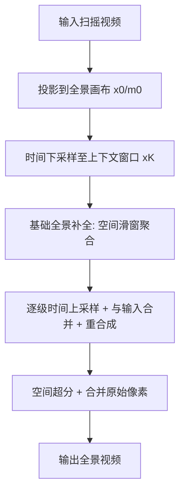

## 一句话总结

给定一段随手拍摄的"扫摇"（panning）视频，本文借助生成式视频模型，把它补全成一段与原视频等长、覆盖整片扫摇范围的**动态全景视频**，让画面外的运动（如划桨、行人）也能被合理地生成出来。

## 研究背景

对静态场景来说，把扫摇视频的帧拼成一张全景照片是成熟问题。但一旦场景里有运动的人、车、水流，单张静态全景就无法刻画"当下正在发生的动态"。已有的"全景视频纹理"（Panoramic Video Textures）只能处理树摇、水流这类**纹理性周期运动**，并且只是把已有观测整合起来，无法生成新的观测，因而处理不了穿过画面的行人等瞬态物体。

本文把问题重新定义为**时空外扩（space-time outpainting）**：把输入帧配准到一个统一的全景视频体（video volume）中，其余时空区域标为未知，再补全整个体积。挑战在于：

- 未知像素在时空上通常**远多于**已知像素，且不能假设未知区域是静止的；
- 需要一个强大、真实的视频先验——这恰好是近期生成式视频模型提供的能力；
- 但现成的视频生成模型有**有限的时空上下文窗口**，无法直接补全任意长、任意宽的全景视频。

## 方法

整体思路：先把输入视频用估计的相机参数投影到一个等距柱状（equirectangular）全景画布上，得到已知像素 $$x_0$$ 与有效像素掩码 $$m_0$$；然后用生成式视频模型在未知区域做时空补全。为绕开上下文窗口限制，方法在**时间维度用由粗到细（coarse-to-fine）**、在**空间维度用尊重掩码的聚合**两条主线来组织。作者同时在两类模型上验证：像素扩散模型 Lumiere（基础模型 80 帧 128×128）和 token 模型 Phenaki（11 帧 160×96）。

**关键设计 1：空间聚合补全。** 输入全景通常比模型原生宽高比更宽，于是用多个**重叠的空间窗口**覆盖全景宽度，把各窗口预测的分布做平均后再采样。对扩散模型，这就是在高斯预测（均值 $$\mu$$ 与协方差 $$\Sigma$$）上做 MultiDiffusion 式平均后用 DDPM 采样；对 token 模型，则是在词表上的离散概率分布上平均后再抽样。

**关键设计 2：时间由粗到细。** 先把输入时间下采样到恰好塞进模型上下文窗口的最粗尺度 $$x_K$$（下采样前用 box 模糊做时间预滤波防混叠），补全一个基础全景视频。随后对每一级 $$k \in [K-1, 0]$$，把上一级补全结果 $$y_{k+1}$$ 做 2 倍时间上采样得到 $$\hat{y}^{up}_k$$，与当前级输入 $$x_k$$ 合并成 $$\hat{y}^{merge}_k$$，再让模型以此为上下文、只重合成输入掩码外的内容得到 $$y_k$$。相比直接用时间 MultiDiffusion，这样能让模型在一个窗口内先"看到"整段场景，避免长视频中出现漂移、无法把早期出现的人物外观传播到后期。

**关键设计 3：掩码微调与推理期微调。** 原始 mask-conditioned 模型是在**静态掩码**上训练的，直接用会在全景动态掩码边界产生接缝、色偏和大块伪影，因此作者用合成全景掩码遮挡的自然视频对 Lumiere 做了微调。对 Phenaki，其编码器/解码器会带来保真损失，故在推理时用有效像素 $$x \odot m$$ 的 patch **微调解码器 $$dec$$**，以更好保留输入细节。token 重合成写作：

$$
\hat{z}^k_{merge} = enc(\hat{y}^k_{merge}), \qquad z^k = xf(\hat{z}^k_{merge} \odot m^k_z)
$$

其中 $$m^k_z$$ 是 token 级掩码，$$enc$$ 为编码器、$$xf$$ 为 token transformer，最终 $$y_k = dec(z^k)$$，并用半窗重叠的滑动时间窗拼接全序列。此外由于 Phenaki 训练时用因果掩码（无法用后帧补前帧），最粗层 $$x_K$$ 需要正向、反向各跑一遍再合并。

## 实验结果

评测分两种设置：真实随手扫摇拍摄，以及从 360 度视频裁出移动裁剪窗生成的"合成"扫摇视频（后者有真值全景可直接对比）。指标包括 PSNR、LPIPS、单视频 FID（VFID）与光流端点误差 EPE，其中像素级指标进一步分静态/动态区域评估。所有 "Ours" 结果均生成 4 个样本人工选优。

合成扫摇视频（补全区域）主实验：

| 方法 | PSNR↑ sta | PSNR↑ dyn | LPIPS↓ | VFID↓ | EPE↓ sta | EPE↓ dyn |
|---|---|---|---|---|---|---|
| Interpolate | 29.4 | 19.1 | 0.10 | 0.09 | 0.04 | 1.92 |
| ProPainter | 24.7 | 19.6 | 0.19 | 0.21 | 0.12 | 1.70 |
| E2FGVI | 18.2 | 16.6 | 0.36 | 0.47 | 0.63 | 2.03 |
| MAGVIT* | 12.9 | 12.4 | 0.41 | 0.57 | 1.17 | 1.92 |
| naive Phenaki | 18.3 | 16.4 | 0.23 | 0.26 | 0.41 | 1.94 |
| Ours (Phenaki) | 23.2 | 18.4 | 0.20 | 0.19 | 0.07 | 1.67 |
| naive Lumiere | 18.5 | 18.3 | 0.24 | 0.18 | 0.41 | 1.94 |
| Ours (Lumiere) | 28.5 | 20.8 | 0.09 | 0.05 | 0.05 | 1.25 |

（MAGVIT* 仅在帧子集上评估。）扩散版本 Ours (Lumiere) 在除静态 PSNR/EPE 外的所有指标上最好；线性插值因能完美复现静止部分而在静态分项占优，但在动态 EPE 上表现很差（1.92，而两种本文方法分别为 1.67 与 1.25）。流方法 ProPainter 在静止相机场景（scuba、Bangkok）表现意外地好，但主观质量更低，尤其在相机移动场景失效。

## 亮点与局限

**亮点**
- 首个能从**一般性扫摇视频**（含运动的人和物体）构建动态全景视频的系统。
- 同一套算法可适配扩散模型与 token 模型两类骨干，并对二者的优劣做了分析。
- 提出用合成全景掩码微调 + 时间由粗到细，系统性地缓解上下文窗口与静态掩码训练带来的伪影与漂移。
- 贡献了一份从 360 度视频裁出合成扫摇运动的全景视频数据集作为基准。

**局限**
- **上下文窗口有限**：需时间由粗到细补全，但过度时间粗化会模糊快速运动或丢小物体；实验最多 5 级（Phenaki）/2 级（Lumiere）粗化，视频长度上限约 172/160 帧。
- **合成质量**：两种模型都不能稳定生成照片级真实感，近景人脸尤其明显；Lumiere 超分模块若加掩码条件微调可能改善高频，但需昂贵重训，本文未做。
- 计算开销大：Lumiere 基础分辨率推理在 TPU v5p-4 上约 300 分钟，超分约 48 分钟，一次性掩码微调约 30 小时。
- 尚未扩展到**潜空间扩散（LDM）**类模型，需在编码器与扩散模型中分别处理掩码，留作未来工作。

## 延伸思考

- 该方法把"全景视频"变成一个**时空补全 / 生成先验**问题，思路上与新视角合成、视频修复、世界模型相通——本质都是"用生成先验在观测稀疏处给出合理续写"。随着更强、上下文更长的视频模型出现，coarse-to-fine 这类工程性拆解或许可以简化甚至去掉。
- 由粗到细能抑制长序列漂移的观察值得注意：先在一个窗口里"看到全局"再逐步细化，本质是给长程一致性提供了锚点，这一策略对长视频生成的其它任务同样有借鉴意义。
- 评测中把静态/动态区域拆开、并用网格光流的 EPE 衡量运动一致性，是对全景视频这类"多数像素为生成"任务较务实的度量方式；但"生成合理"与"复现真值"的目标张力仍在，如何评价生成内容的可信度是开放问题。
