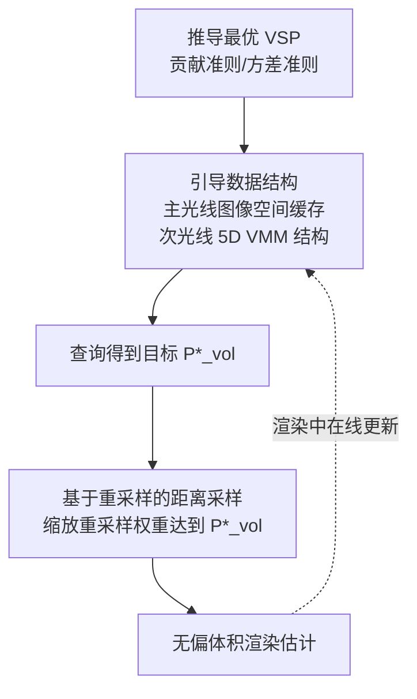

## 一句话总结

本文提出把"是否在体积内发生散射"这一决策（体散射概率 VSP）从距离采样的副产品中解放出来，直接对其进行数据驱动的引导，并给出一个基于重采样、既能增大也能减小 VSP 的无偏距离采样算法，在多种复杂体积光照场景中显著降低方差。

## 研究背景

在离线渲染中，穿过云、雾、烟等非均匀参与介质的路径追踪需要模拟大量散射事件，容易带来高计算成本或高频噪声。重要性采样是主要的缓解手段，但以往工作几乎只关注两类决策：方向采样（散射后往哪走）与距离采样（沿射线在哪散射）。

一个被长期忽视的决策是体散射概率（Volume Scattering Probability，VSP），即路径在体积内部发生散射（而非穿过体积落到后方表面）的概率。传统基于透射率的距离采样（如 delta tracking）只按局部介质属性隐式地决定 VSP：

$$
P_{\text{vol}} = \int_{t_0}^{t_s} \sigma_t(x_t)\,T_r(x, x_t)\, dt = 1 - T_r(x_0, x_s),
$$

其中透射率 $$T_r(x_1, x_2) = \exp\!\big(-\!\int_{x_1}^{x_2}\sigma_t(x)\,dx\big)$$。这种设定完全忽略了场景的实际照明。文中两个例子说明其代价：一层被强光照亮、位于暗背景前的薄雾，$$P_{\text{vol}}$$ 很小导致体积贡献欠采样；反之一层稀薄暗淡、背后是背光玻璃的厚介质，$$P_{\text{vol}}$$ 过大又让很少路径能穿到表面。二者都因 VSP 设置不当而产生高方差。

与本文最接近的 Villemin et al. [2018] 只能手动设定并只能"增大" VSP，且在非均匀介质中未必能达到目标值。本文目标是做一个自动、轻量、稳健、能双向调节 VSP 的引导框架。

## 方法

整体框架由两部分组成：一是从最优采样理论推导"应该用多少 VSP"，二是一个能精确达到任意目标 VSP 的无偏距离采样算法；二者通过一个缓存光传输信息的路径引导数据结构结合起来。

### 关键设计一：两种最优 VSP 判据

在零方差理论下，体积与表面样本应正比于各自贡献（一阶矩），得到贡献准则：

$$
P^{1\text{st}}_{\text{vol}} = \frac{L_v(x,\omega)}{L_v(x,\omega) + L_s(x,\omega)} = \frac{L_v(x,\omega)}{L(x,\omega)}.
$$

实际中零方差假设几乎不成立，于是推导对非零方差估计器最优的方差准则，用二阶矩 $$M_{\text{vol}}, M_{\text{surf}}$$ 表达：

$$
P^{2\text{nd}}_{\text{vol}} = \frac{\sqrt{M_{\text{vol}}}}{\sqrt{M_{\text{vol}}} + \sqrt{M_{\text{surf}}}}.
$$

关键的是，两种判据都只需沿射线积分后的量（贡献或矩），不需要知道内散射 $$L_{is}$$ 沿射线的逐点分布，因而便于缓存与查询。

### 关键设计二：把 delta tracking 重新解释为重采样

借鉴 Wrenninge 与 Villemin [2020] 的洞见，delta tracking 可看作重采样过程：先用 ratio tracking 走一遍生成候选点并顺带得到透射率估计 $$\langle T_r(x_0, x_s)\rangle_{\text{ratio}}$$，再按重采样权重从候选中抽取一个。体积候选与表面候选的原始权重为

$$
w^{\Delta}(x_i) = P_{\text{real}}(x_i)\prod_{j=1}^{i-1} P_{\text{null}}(x_j), \qquad w^{\Delta}(x_n) = \prod_{j=1}^{n-1} P_{\text{null}}(x_j) = \langle T_r(x_0,x_s)\rangle_{\text{ratio}}.
$$

此时得到的采样分布与 VSP 与原始 delta tracking 完全一致。这一改写使得"修改权重即可改变 VSP"成为可能。

### 关键设计三：缩放权重以精确达到任意 VSP

对全部体积候选乘以 $$c_{\text{vol}}$$、对唯一的表面候选乘以 $$c_{\text{surf}}$$：

$$
c_{\text{vol}} = \frac{P^{\star}_{\text{vol}}}{1 - \langle T_r(x_0,x_s)\rangle_{\text{ratio}}}, \qquad c_{\text{surf}} = \frac{1 - P^{\star}_{\text{vol}}}{\langle T_r(x_0,x_s)\rangle_{\text{ratio}}}.
$$

缩放后的权重 $$w^{\star}$$ 仍是合法概率分布，可证明其把采样到体积事件的概率从 $$1 - T_r$$ 精确改为目标 $$P^{\star}_{\text{vol}}$$，且体积内部分布仍近似正比于透射率与消光系数的乘积。与仅能增大 VSP 的先前方法不同，本方法同时支持增大与减小。

工程上还配套了几项处理：零体积候选补偿（在必要时抬高 majorant $$\mu$$ 并相应放大 $$P^{\star}_{\text{vol}}$$，保证能达到目标）、防御性重采样（用 MIS 在缩放权重与原始权重间插值，$$\alpha=0.75$$ 效果稳定，避免坏估计导致比 delta tracking 更差）、以及用蓄水池采样把候选存储降到常数内存。

### 关键设计四：VSP 引导框架

为在全场景查询 $$P^{\star}_{\text{vol}}$$，主光线用图像空间辅助缓存存储 $$L_v, L_s, M_{\text{vol}}, M_{\text{surf}}$$ 等量并在渲染进程中去噪；次光线扩展 Ruppert et al. [2020] 的 5 维视差感知 von Mises-Fisher 混合模型，为每个 lobe 额外存一个浮点辅助量 $$a^{\star}_k$$，从而按方向查询：

$$
P^{\star}_{\text{vol}}(x,\omega) = \sum_{k=1}^{K} a^{\star}_k\, a_k(\omega \mid \Theta(x)).
$$

该框架可与已有方向路径引导（OpenPGL）以极小开销结合。

## 实验结果

方法集成进 PBRT-v4 的 CPU 后端并结合 OpenPGL。误差用 relMSE（0.1 百分位剔除离群，数值统一乘以 10 便于阅读），等时对比（前四个场景 5 分钟，后两个 2 分钟），所有 VSPG 变体都叠加了方向路径引导。下表为等时 relMSE（越小越好，括号内为文中给出的相对无引导基线的加速倍数）：

| 场景 | 无引导 | 方向引导 | VSPG(NDS) | VSPG(NDS+) | VSPG(重采样,贡献) | VSPG(重采样,方差) |
|------|-------|---------|-----------|------------|------------------|------------------|
| Kitchen | 0.56 | 0.29 (1.96×) | 0.23 (2.42×) | 0.20 (2.75×) | 0.23 (2.50×) | 0.24 (2.33×) |
| Landscape | 0.95 | 0.79 (1.20×) | 0.32 (2.98×) | 0.27 (3.47×) | 0.27 (3.45×) | 0.27 (3.46×) |
| Underwater | 3.73 | 0.87 (4.29×) | 0.99 (3.78×) | 0.98 (3.82×) | 0.67 (5.57×) | 0.73 (5.08×) |
| Lantern | 0.38 | 0.45 (0.83×) | 0.39 (0.97×) | 0.38 (0.98×) | 0.24 (1.57×) | 0.24 (1.54×) |
| Earth | 0.07 | 0.09 (0.72×) | 0.08 (0.86×) | 0.06 (1.13×) | 0.10 (0.65×) | 0.11 (0.59×) |

主要观察：在薄非均匀介质、环境光主导的场景（Jungle/Kitchen/Landscape），VSPG 通过增大 VSP 明显降噪；在 Underwater 与 Lantern 这类需要"减小 VSP"让路径穿到表面的场景，只有能双向调节的重采样版本 VSPG(Resampling) 带来提升，而基于 Villemin 的 NDS/NDS+ 因无法减小 VSP 反而可能不及方向引导基线。Earth 场景中重采样版本因平均路径长度大增（如 NDS 2.16 对 Resampling 5.41）导致等时采样数下降、误差反升；启用早期 Russian roulette 可让各方法路径长度和误差趋于一致。

## 亮点与局限

亮点：把 VSP 提升为可独立控制的一等决策，并给出理论最优判据（贡献/方差两种）；基于 delta tracking 的重采样重述，得到既无偏、又能精确达到任意目标 VSP、且能双向调节的距离采样算法；数据驱动、无需逐场景手调超参，能与现有方向引导低开销结合。

局限：重采样会因透射率估计与重采样位置的相关性而轻微"压平"体积内样本分布（加大 majorant 可缓解但增加成本）；在暗背景后的高反照率密介质中 VSPG 倾向把路径困在体内，导致路径变长、等时采样数下降，需要引导式 Russian roulette 配合；论文显式禁用了 RR 以避免其成为主要方差源，说明与终止策略的协同仍是开放问题。

## 延伸思考

本文的核心启发是：路径构造中的每一个随机决策（方向、距离、是否散射、是否终止、是否分裂）都值得被单独按最优采样理论审视，而不是任由某个采样过程"顺带"决定。VSP 的双向可控性与方差准则的引入，天然指向与引导式 Russian roulette / 分裂的联合优化——把"在哪散射、是否继续走"统一在同一套基于矩的最优框架下，或许能进一步压低体积渲染方差。将该数据驱动的 VSP 缓存迁移到 GPU 实时体渲染或可微渲染管线，也是值得探索的方向。
