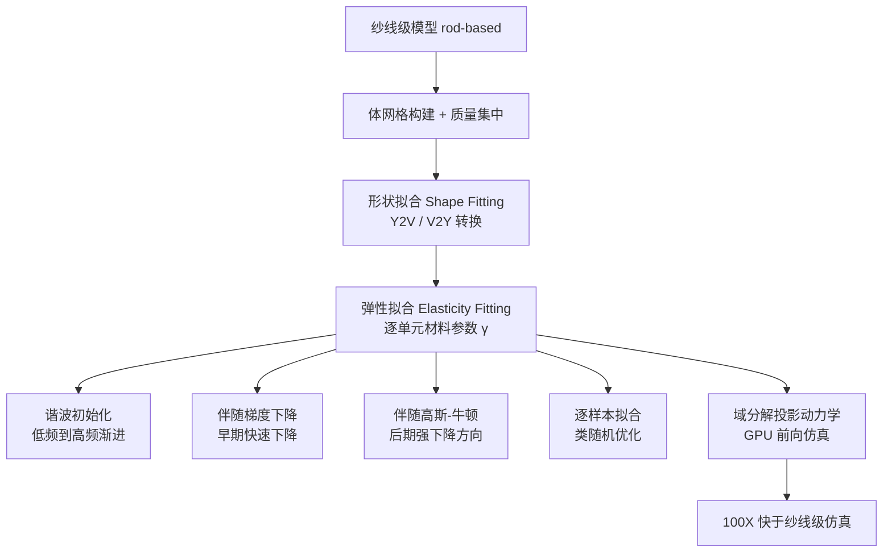

## 一句话总结

针对复杂、非重复针织图案的毛衫仿真，提出"体积均质化"（volumetric homogenization）：把纱线级动力学不是均质化到降维的壳面，而是均质化到一个包裹纱线的体网格上，用简单的可保体积超弹性材料 + 逐单元空间变化的材料参数来复刻纱线级仿真效果，速度比纱线级仿真快约两个数量级。

## 研究背景

针织物（毛衣、围巾、开衫）由粗纱线互锁编织而成，宏观上呈现"非橡胶"的力学响应，需要纱线级仿真（YLS）才能刻画。但 YLS 自由度巨大、计算昂贵。

已有的均质化方法 HYLC（Homogenized Yarn-Level Cloth）把纱线材料回归成一个作用在中面三角网格上的非线性超弹性薄壳模型。它有三个核心痛点：

- 假设宏观材料**均匀**，只适合简单周期图案。真实毛衣的前片图案往往复杂且非重复，空间差异大，单一材料难以刻画。
- 代表性体积单元（RVE）尺寸难以确定。
- 依赖高度非线性材料来捕捉微观非光滑运动，导致能量奇异、Hessian 非正定等数值不稳定问题，被迫使用极小时间步，反而拖慢效率。

作者提出一个完全不同的视角：不追求材料模型的复杂度，而是聚焦材料参数的**空间异质性**（heterogeneity），同时保持本构关系简单。类比曲线拟合——用多段低次多项式往往优于单条高次多项式。

## 方法

### 整体框架

输入是一个基于杆（rod）的纱线级模型，输出是一个带逐单元材料参数的体网格，可以在运行时高速仿真并驱动底层纱线变形。

管线分四大模块：网格构建（Sec.4）、形状拟合（Sec.5）、弹性拟合（Sec.6）、域分解 PD 前向求解器（Sec.7）。值得注意的是，体网格的自由度 $$n_V$$ 通常约为纱线自由度 $$n_Y$$ 的一半——并没有像 HYLC 那样把自由度降低几个数量级。方法的效率来自更稳定的能量形式和高并行的 GPU 求解器，而非降维。

### 关键设计 1：简单的可保体积超弹性材料

每个单元 $$e$$ 只有两个材料参数 $$\gamma^s_e$$（惩罚应变强度）和 $$\gamma^v_e$$（保体积强度），弹性能定义为：

$$E_e = \gamma^s_e V_e \lVert \mathbf{F}_e - \mathbf{R}(\mathbf{F}_e) \rVert^2_F + \gamma^v_e V_e \lVert \mathbf{F}_e - \mathbf{V}(\mathbf{F}_e) \rVert^2_F$$

其中 $$\mathbf{R}$$ 是最近的旋转（SO(3)，保长度），$$\mathbf{V}$$ 是最近的保体积变换（SL(3)，$$\vert \mathbf{V}\vert =1$$）：

$$\mathbf{R} = \arg\min_{\mathbf{A}\in SO(3)} \lVert \mathbf{F}-\mathbf{A}\rVert^2_F, \quad \mathbf{V} = \arg\min_{\mathbf{A}\in SL(3)} \lVert \mathbf{F}-\mathbf{A}\rVert^2_F$$

核心洞察：给纱线赋予一个"虚拟体积"，通过空间变化的保体积惩罚就能自然刻画弯曲、扭转等效应，从而**避免了高度非线性材料**。这个约束型二次能量形式既好实现，又对 GPU 投影动力学友好。作者强调：材料的空间变化比材料本身的复杂度更重要。

### 关键设计 2：伴随高斯-牛顿的高维逆向优化

弹性拟合是要在所有 YLS 姿态上找到最优材料向量 $$\boldsymbol{\gamma}$$（维度 $$2n_E$$，极高），使体网格仿真结果经 V2Y 转换后逼近 YLS：

$$\arg\min_{\boldsymbol{\gamma}} \sum_{i=1}^{n_F} \epsilon_i(\boldsymbol{\gamma}), \quad \text{s.t. } \boldsymbol{\gamma}\geq 0$$

这是一个巨大的时空优化问题。一阶梯度法（即使用伴随法或自动微分）在此类问题上根本无法收敛，容易困在局部极小。作者借助 Zehnder 等人的伴随高斯-牛顿法：通过引入额外的伴随状态向量，把原本稠密的高斯-牛顿系统转化为一个更大但稀疏的线性系统求解，从而绕过对 $$\partial \mathbf{x}^V_i / \partial \boldsymbol{\gamma}$$ 的显式计算。梯度通过伴随解得到：

$$\frac{\partial \epsilon_i}{\partial \boldsymbol{\gamma}} = -\boldsymbol{\lambda}^\top \frac{\partial \mathbf{g}}{\partial \boldsymbol{\gamma}}, \quad \left(\frac{\partial \mathbf{g}}{\partial \mathbf{x}^V_i}\right)\boldsymbol{\lambda} = \left(\frac{\partial \epsilon_i}{\partial \mathbf{x}^V_i}\right)^\top$$

实践中，两阶段策略：先做 10–15 次梯度下降快速起步，再做 20–30 次高斯-牛顿。作者观察到 20–30 次高斯-牛顿比 1000+ 次梯度下降更有效。

### 关键设计 3：谐波初始化 + 逐样本拟合

高维材料向量对初值极其敏感。**谐波初始化**用网格拉普拉斯算子的前 $$r$$ 个特征向量构造谐波基 $$\mathbf{H}$$，把材料向量投影到低维广义坐标：

$$\boldsymbol{\gamma} = \text{diag}(\mathbf{H},\mathbf{H})\,\mathbf{q}$$

从 $$r=1$$（全局常数材料）开始，渐进增加到 $$r=10$$、$$r=30$$，最后再拟合全空间 $$\boldsymbol{\gamma}$$——从低频到高频逐步建立材料复杂度，避免陷入局部最优。

**逐样本拟合**：把跨所有 $$n_F$$ 帧的损失改为逐帧顺序优化，用凸平均更新材料向量，类似深度学习中的随机优化。由于多数 YLS 姿态冗余，实际只需少量采样姿态、单趟遍历即可得到高质量结果。

### 关键设计 4：域分解投影动力学（前向仿真）

前向仿真用投影动力学（PD）：局部步对每个单元求最近旋转 $$\mathbf{R}$$（极分解）和最近保体积变换 $$\mathbf{V}$$（对奇异值做 $$\sigma_1\sigma_2\sigma_3=1$$ 的约束优化）；全局步是线性求解 $$\mathbf{K}\mathbf{x}=\mathbf{b}$$。

全局步是瓶颈。作者引入组件模态综合（CMS）做**域分解**：把网格分成若干域，每个域的自由度分为内部与边界自由度，用边界模态 $$\boldsymbol{\Psi}$$ 和内部特征向量 $$\boldsymbol{\Phi}$$ 构造子空间预条件子。其新颖的子空间结构消除了域界面上重复的边界自由度，使约化全局矩阵保持块稀疏，且各域的预计算可并行。约化解之后再用 GPU 上的聚合 Jacobi（A-Jacobi）全空间迭代保证精度。这个快速稳定的求解器既服务前向仿真，也是弹性拟合可行的前提（每次更新 $$\boldsymbol{\gamma}$$ 都要重新求平衡态）。

## 实验结果

硬件为 Intel i7-12700 + NVIDIA RTX 3090。与 HYLC 的三组对比实验（时间步、仿真耗时与加速比）：

| 实验 | 网格自由度 | HYLC 自由度 | 时间步 $$\Delta t$$ | 单步仿真 | 相对 HYLC 加速 | 拟合总时长 |
|------|-----------|------------|--------------------|---------|--------------|-----------|
| 1×1 rib | 38K | 9K | 1/150 s | 85 ms | ∼180× | 0.5 小时 |
| stockinette | 42K | 12K | 1/150 s | 92 ms | ∼350× | 3.1 小时 |
| draping（球面） | 42K | — | 1/150 s | 103 ms | — | 1.2 小时 |

关键观察：本方法虽用约 80K 单元的四面体网格（远多于 HYLC 约 10K 三角形），但约束型材料模型允许用大得多的时间步（$$\Delta t=1/150$$ s），而 HYLC 因材料非线性必须降到 $$\Delta t=1/500$$ s 甚至更小并自适应细分网格。整体快约两个数量级。在混合图案（stockinette + 1×1 rib）实验中，77K 自由度网格单步 121 ms，比纱线级快约 80×。收敛性对比中，一阶方法优化 rib 图案可能需要一周以上，而高斯-牛顿约三小时完成。

最大场景 Yangge dance（Fig.1）：纱线级 3.0M 自由度，均质化网格 389K 单元，单步平均 604 ms，比纱线级快约 100×。方法还在打结、扭转（900°/1920°）、绒球穿过针织孔隙的双向耦合碰撞等复杂场景验证有效，并展示了对未见变形（draping、落地）的泛化能力。

## 亮点与局限

亮点：
- 视角新颖——反其道而行，用"升维到体积 + 空间异质"换取"材料简单 + 数值稳定 + 高并行"，最终净收益为正。
- 简单的可保体积二次能量隐式处理弯曲扭转，避免了 HYLC 的强非线性与小时间步困境。
- 逐单元独立材料参数极大提升表达力，可处理**非重复、非周期**图案（如 flame ribbing），这是经典均质化难以胜任的。
- 一整套让高维逆问题可解的工程：伴随高斯-牛顿 + 谐波初始化 + 逐样本拟合 + 域分解 PD。
- 能量约束（网格上）与碰撞约束（纱线级）分离处理，使均质化模型仍能像纱线级模型一样交互。

局限：
- 对快速运动场景，形状拟合估计的惯性与集中质量可能偏离参考。
- 纱线级布料高度阻尼（纱线间摩擦接触快速耗散能量），难以用常见宏观阻尼模型（如 Rayleigh 阻尼）校准。
- 数据驱动特性使得同一针织物在不同 YLS 输入下可能产生不同结果。
- 体网格自由度并未真正大幅降低（约为纱线级一半），效率完全依赖稳定能量与 GPU 求解器。
- 在扭转等场景中，形状误差逐帧累积会导致与 YLS 的织物-织物碰撞不同，最终形态不完全对齐。

## 延伸思考

- 论文最后自陈的开放问题很关键：材料非线性、视觉真实度、计算效率三者如何权衡。本文选择"极简材料 + 极高空间分辨率"这一极端；若在每个单元学习更复杂的应变-应力模型（如 HYLC 的样条本构），表达力更强但又会回到强非线性与高计算量，是否存在更优的中间点值得探索。
- "升维反而更快"的思路具有普适启发性：当降维带来的本构非线性代价过大时，保留更多自由度但简化每个自由度的本构，配合高并行求解器，可能是更划算的工程折中。这一范式或可迁移到其他微观结构复杂的材料（如编织复合材料、多孔结构）仿真。
- 逆向材料优化中"一阶方法根本不收敛、必须二阶"的经验，对可微仿真社区是有价值的提醒：面对高维时空逆问题，投入伴随高斯-牛顿这类拟二阶方法的收益可能远超堆迭代次数。
- 阻尼校准的困难指向一个更本质的问题：纱线间摩擦耗散是高度局部、非线性的，如何在均质化框架里表达耗散（而不仅是弹性），是让此类方法真正匹配 YLS 动态行为的下一步。
