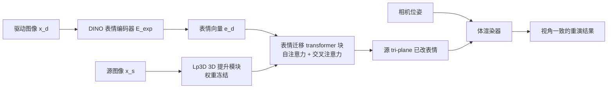

## 一句话总结

VOODOO XP 是一个实时、3D 感知的单张肖像头部重演系统：它把驱动视频的表情特征直接注入源人像 3D 提升模块的 transformer 块中，配合多阶段自监督训练实现身份与表情的解耦，从而生成高表现力、视角一致的面部重演，并落地为首个端到端双向 VR 远程临场系统。

## 研究背景

VR/AR 有望取代传统 2D 视频会议，实现沉浸式的 3D 面对面交流。但要在头显里驱动一个逼真的个人化 3D 化身，现有方案都有明显门槛：

- 高端神经渲染（如 Codec Avatar）依赖复杂的多视角相机阵列或手持扫描，加上数小时到数天的逐人优化，难以日常部署。
- 单目视频建模方案虽更易用，但仍需几分钟的多表情、多姿态录制，普通用户很难覆盖完整的表情范围。
- 2D 单张重演方法能即时生成表情，但在新视角下身份和表情会严重漂移，不满足 VR 需要的视角一致性。
- 已有的 3D 感知单张重演方法（如 VOODOO 3D、Portrait4D 系列）虽能做到视角一致，但受限于线性 3DMM 或用对话音视频数据训练的表情编码器，难以还原复杂、细粒度、非对称的表情（如挤脸、吐舌、单侧挑眉）。

作者的目标是：只用一张不受约束的源肖像，就能实时、视角一致地重演出极富表现力的表情，并把它整合进真正可用的 VR 远程临场系统。

## 方法

### 整体框架

系统建立在 tri-plane NeRF 表示之上。核心流程：用一个从 DINO 初始化的视觉 transformer 从驱动图像 $$x_d$$ 中提取表情向量 $$e_d$$，再用它去直接修改源图像 3D 提升模块（Lp3D）低层分支中间特征，从而改变源 tri-plane 的表情，最后用体渲染器从任意视角渲染重演结果。

### 关键设计 1：直接向 3D 提升模块注入表情

不同于依赖 3DMM 表情系数或人脸关键点、音频等辅助信号的方法，VOODOO XP 直接用驱动图像的 RGB 来估计表情。Lp3D 的低层分支提取头部几何等全局特征，因此在该分支的每个 transformer 块 $$B^{low}_i$$ 输出上叠加一个表情 transformer 块 $$B^{exp}_i$$：

$$F_i = B^{low}_i(F_{i-1}) + B^{exp}_i(F_{i-1}, e_d)$$

其中 $$B^{exp}_i$$ 先对 $$F_{i-1}$$ 做自注意力，再与表情向量 $$e_d$$ 做交叉注意力。这种直接注入图像级表情信号的做法，使得挤脸、非对称表情、吐舌等复杂表情成为可能，但同时带来身份泄漏（驱动者的发型、头型、肤色泄漏进重演结果）的难题，需靠多阶段训练解决。

### 关键设计 2：中和损失（Neutralizing Loss）

为消除身份泄漏，作者提出一个中和器 $$\mathcal{N}(x)$$，把任意表情/姿态的人脸映射到其中性化 tri-plane 表示，并约束源图像与跨身份重演结果的中和结果一致：

$$L_{neu}(x_{s1}, x_{d2}) = \lVert \mathcal{N}(x_{s1 \rightarrow d2}) - \mathcal{N}(x_{s1}) \rVert$$

关键问题是没有中性化监督数据。受 Noise2Noise 启发，作者证明可在无干净标签下用同身份的成对图像来训练中和器：

$$\mathcal{N}^* = \arg\min_{\mathcal{N}} \mathbb{E}_{x_{s1}, x_{d1}} \lVert \mathcal{N}(x_{s1}) - T_{d1} \rVert$$

其中 $$x_{s1}$$ 与 $$x_{d1}$$ 同身份且统计独立，$$T_{d1}$$ 是预训练 3D 提升模块提取的 tri-plane。当数据充足时，最优 $$\mathcal{N}^*$$ 会收敛到给定身份下所有 tri-plane 的平均值，即中性脸表示。

### 关键设计 3：三阶段训练

- 阶段一（粗粒度）：在 $$128 \times 128$$ 分辨率下自监督训练，配合驱动者 3D 提升正面化、强数据增强，以及中和损失，尽力抑制身份泄漏。总损失为 $$L_{stage1} = L_{rec}(x_{s1 \rightarrow d1}, x_{d1}) + \lambda_{neu} L_{neu}(x_{s1}, x_{d2})$$，其中 $$\lambda_{neu} = 0.01$$。
- 阶段二（细粒度）：分辨率提升到 $$256 \times 256$$，去掉正面化、增强和中和损失以释放表现力；为防止身份泄漏，用第一阶段网络合成跨身份驱动数据（真实图像作源和真值，仅驱动由一阶段模型合成），并加入眼部区域损失 $$L_{eye}$$ 改善视线准确度。
- 阶段三（全局微调）：解冻 3D 提升模块，加入投影 GAN 损失（$$\lambda_{GAN} = 0.05$$），并用停梯度算子在线合成驱动，显著提升身份保持和高频细节。

此外系统天然支持可选的少样本微调：给定源人物的额外少量图像（如 10/20/50 张），沿用阶段三策略微调，仅需数十秒即可显著提升相似度与表现力。

### VR 远程临场系统

作者搭建了首个基于单张重演的双向沉浸式 VR 系统：用户戴 Meta Quest Pro 头显，靠内置面部追踪（63 个 blendshape，含 7 个舌头，另加每只眼 2 个视线控制）在 Unity 中驱动一个通用正面化人脸模型作为驱动视频，VOODOO XP 再把它转成立体的照片级化身。系统只需传输 63 个 blendshape 值、4 个视线角度和 6DoF 头部位姿，带宽极低。建化身仅需一张照片（约 60 ms），四块 RTX 6000 ADA GPU（每只眼 2 块）可达 $$512 \times 512$$ 分辨率下 30 FPS 的立体渲染。

## 实验结果

作者构建了一个覆盖多姿态、多表情、多族裔与配饰（头巾、墨镜、眼镜）的新评测集：17 名受试者、102 段视频、超 13.7 万帧，经关键点聚类筛选出 20,400 帧。在自重演与跨重演两种设置下与 GOHA、Portrait4D、Portrait4D-v2、VOODOO 3D 等对比：

| 方法 | 自重演 FID ↓ | 自重演 LPIPS ↓ | 自重演 CSIM ↑ | 跨重演 CSIM ↑ | 跨重演 FID ↓ | 跨重演 AED ↓ | 跨重演 APD ↓ |
|------|------|------|------|------|------|------|------|
| GOHA | 32.20 | 0.18 | 0.67 | 0.63 | 40.68 | 6.87 | 0.096 |
| Portrait4D | 51.06 | 0.21 | 0.73 | 0.66 | 51.24 | 6.80 | 0.098 |
| Portrait4D-v2 | 51.23 | 0.20 | 0.77 | 0.67 | 50.14 | 6.53 | 0.099 |
| VOODOO 3D | 48.23 | 0.21 | 0.69 | 0.58 | 50.30 | 6.70 | 0.088 |
| Ours | 23.80 | 0.18 | 0.75 | 0.67 | 25.80 | 6.31 | 0.090 |

VOODOO XP 在自重演的 FID、LPIPS 上最优，跨重演的 FID、AED 也最优，整体图像质量与表情/姿态准确度领先。PSNR/SSIM 上略逊于 VOODOO 3D，但作者指出后者结果偏过度平滑、缺乏高频细节。

消融实验（跨重演）验证各组件价值：去掉中和损失后身份/表情完全无法解耦（CSIM 仅 0.29，FID 高达 98.49）；三阶段逐步提升——阶段一 CSIM 0.60 / FID 88.88，阶段二 FID 大幅降到 38.96，阶段三达到 CSIM 0.67 / FID 25.80 的最佳综合表现。此外眼部损失显著改善视线，GAN 损失有效补充高频细节。

## 亮点与局限

亮点：
- 直接用驱动 RGB 图像估计表情并注入 3D 提升模块，无需 3DMM 或音频/关键点等辅助信号，能还原挤脸、非对称表情、吐舌、眼镜后挑眉等极端复杂表情。
- 基于 Noise2Noise 思想的中和损失巧妙解决了无监督数据下的身份泄漏问题。
- 三阶段"粗到细 + 全局微调"训练兼顾表现力、身份保持与高频细节，且可选少样本微调只需数十秒。
- 首个基于单张单目重演的端到端双向 VR 远程临场系统，仅需一张照片即可建化身。

局限：
- 缺乏真实的头发建模与渲染，细发结构存在锯齿伪影（不过竞品同样如此）。
- 在极端视角和挑战性光照下可能无法正确还原身份。
- 对分布外数据（浓妆、动物等）会强行幻化出人脸特征。
- 系统仍依赖连接多 GPU 工作站的 VR 头显，便携性受限；只重建头部，不含后脑和身体。

## 延伸思考

- 中和损失本质是把"求同身份下 tri-plane 的期望"当作中性表示的代理目标，这种"用统计独立的成对样本无监督逼近隐变量均值"的思路可以迁移到其他需要属性解耦但缺乏配对标签的生成任务。
- 把表情信号直接注入冻结的 3D 提升模块，而非重新训练整个表示，是一种解耦"身份/几何先验"与"动态属性控制"的有效范式，对可控生成有借鉴意义。
- 系统只传输极低维的 blendshape + 位姿参数、在本地做神经渲染的架构，是低带宽沉浸式通信的现实路径；未来若结合 Gaussian splatting 化身与 360 度头部/身体建模，有望突破当前分辨率与覆盖范围的限制。
- 高可及性（单图建真人化身）同时意味着深度伪造滥用风险，作者承诺将模型与数据分享给伪造检测社区，这类"能力发布 + 防御协同"的做法值得关注。
